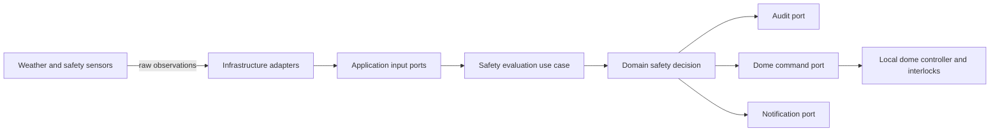

# ADR-005 – Weather Safety Interlock fail-safe

**Status:** Proposed  
**Date:** 2026-07-29  
**Release:** 2.0

## Context

Digital StarGate documenta già gli stati ambientali `SAFE`, `WARNING`, `UNSAFE` e `UNKNOWN`, ma non dispone di una decisione architetturale che separi acquisizione dei segnali, valutazione della sicurezza e comando degli attuatori. La sicurezza della cupola deve prevalere sulla continuità osservativa e non può dipendere da un singolo sensore, da un processo applicativo o dalla disponibilità della rete.

## Decision Drivers

- comportamento fail-safe in caso di dati assenti, obsoleti o incoerenti;
- separazione tra regole di sicurezza e adattatori hardware/software;
- auditabilità di ogni decisione;
- prevenzione di aperture non autorizzate e chiusura rapida in caso di rischio;
- migrazione incrementale dall'attuale procedura operativa;
- compatibilità con N.I.N.A., ASCOM, sensori meteo e controllo cupola senza esporli al Domain.

## Considered Options

1. Logica incorporata nello script N.I.N.A.
2. Safety Monitor centralizzato con porte applicative e adattatori infrastrutturali.
3. Regole distribuite tra sensori, script e controller della cupola.

## Decision

Adottare un **Weather Safety Interlock** centralizzato come capability applicativa.

Il Domain definisce esclusivamente il modello di decisione e gli invarianti degli stati ambientali. L'Application orchestra la valutazione e pubblica una decisione interna. Infrastructure implementa le porte per sensori, orologio, persistenza dell'audit, notifiche e comando cupola.

Regole obbligatorie:

- `UNKNOWN` è trattato come `UNSAFE` per apertura e prosecuzione automatica;
- nessun aggregate pubblica direttamente su Event Bus;
- il comando di chiusura è idempotente;
- la riapertura richiede una finestra stabile configurata e, dopo eventi severi, conferma manuale;
- un override manuale è temporaneo, autenticato, motivato e registrato, ma non può ignorare una pioggia confermata;
- la perdita del processo applicativo non deve rimuovere gli interlock locali del controller cupola.

## Consequences

### Positive

- regole testabili senza hardware;
- integrazioni sostituibili;
- decisioni correlate e verificabili;
- migrazione compatibile con gli interlock locali esistenti.

### Negative

- richiede contratti espliciti e gestione dello stato temporale;
- aumenta il numero di componenti e test operativi;
- non elimina la necessità di collaudo fisico periodico.

### Risks

- falsi `SAFE` dovuti a configurazione errata;
- comandi duplicati o mancati durante guasti di rete;
- divergenza tra stato applicativo e sensori fisici;
- override impropri.

## Migration

1. Catalogare sensori, attuatori e interlock realmente disponibili.
2. Definire contratti e simulatori senza cambiare il controllo operativo.
3. Implementare valutazione in modalità osservazione, senza comandi.
4. Confrontare decisioni automatiche e procedure manuali.
5. Abilitare il blocco apertura.
6. Abilitare la chiusura automatica con rollback documentato.
7. Valutare la riapertura automatica solo dopo evidenze operative sufficienti.

## Validation

- unit test della matrice degli stati e dell'isteresi;
- test architetturali delle dipendenze Domain/Application/Infrastructure;
- test di integrazione con sensori simulati e dati obsoleti;
- test di idempotenza del comando di chiusura;
- simulazione trimestrale della transizione a `UNSAFE`;
- verifica fisica di `CLOSED` e degli interlock locali.

## Traceability

- [Capitolo 26 – Monitoraggio meteo e sicurezza ambientale](../chapters/26-monitoraggio-meteo-sicurezza-ambientale.md)
- [Capitolo 25 – Chiusura dell'osservatorio](../chapters/25-chiusura-osservatorio.md)
- [Capability 002 – Weather Safety Interlock](../developer/capability-002-weather-safety-interlock.md)
- [Roadmap evolutiva](../chapters/33-roadmap-evolutiva.md)
