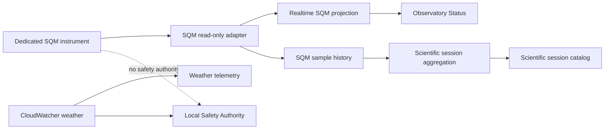

# ADR-007 – SQM Instrument Source Strategy

**Status:** Proposed  
**Date:** 2026-08-30  
**Capability:** BKL-029 — SQM Sky Quality Telemetry & Scientific History

## Context

BKL-029 requires a real instrumental sky-quality measurement in `mag/arcsec²` / mpsas, with provenance, timestamp, freshness and historical session statistics. SQM is a scientific quality metric and is explicitly not part of the observatory Safety Authority.

Runtime discovery on `EAGLE30154` established the following repository-backed facts:

- the installed CloudWatcher identifies itself as serial `2264`, firmware `5.86`;
- the active `CloudWatcher.csv` does not contain any SQM/mpsas/sky-quality field;
- `Brightness Condition` and `Brightness Value` are legacy brightness/light fields and are not valid SQM proxies;
- the ASCOM driver `ASCOM.CloudWatcher.ObservingConditions` is installed and reachable, but `SkyQuality` returned `0`, which DSG rejects as an invalid scientific sample;
- the ASCOM driver is configured to read `C:\Users\PrimaLuceLab\Documents\aag_json.dat`, which is stale since 2026-07-19 and contains no SQM field;
- the live `AAG_CWNetData.dat` is a proprietary binary output and has not been semantically decoded or approved as an SQM source;
- no dedicated SQM instrument is currently installed or verified.

Lunatico's current documentation states that firmware `5.8.9` is required only for CloudWatcher units that have already been upgraded with the sky-quality grade light sensor, and explicitly marks that firmware path as requiring a hardware upgrade. The published serial protocol states that from firmware `5.89` onward the `C!` response contains block `!8` only when the new light sensor is physically installed.

Therefore, a firmware update alone cannot be treated as a valid or safe solution for serial 2264 without hardware compatibility evidence.

## Decision Drivers

- never synthesize SQM from brightness, cloud cover or other proxies;
- preserve Safety Authority independence from scientific telemetry;
- avoid destabilizing a working CloudWatcher weather/safety pipeline;
- use read-only, lightweight EAGLE collectors;
- preserve explicit provenance and replaceability of the SQM source;
- require a real, plausible instrumental sample before enabling realtime/history integration;
- minimize coupling between scientific sky-quality telemetry and weather/safety infrastructure;
- require rollback and OAT for any maintenance change to CloudWatcher firmware/hardware.

## Considered Options

### Option 1 — Keep current CloudWatcher pipeline unchanged

Continue using firmware 5.86 and current CSV/ASCOM outputs.

**Result:** rejected for BKL-029 implementation because no valid SQM value is exposed.

### Option 2 — Upgrade the existing CloudWatcher

Verify with Lunatico whether serial 2264 can receive the sky-quality grade light-sensor hardware upgrade, then perform the vendor-approved hardware/firmware path and validate `!8`/mpsas after maintenance.

**Benefits:**

- one physical weather/sky device;
- potential reuse of existing ASCOM/CloudWatcher software;
- fewer additional field devices.

**Risks / costs:**

- current hardware compatibility is not verified;
- firmware 5.8.9 must not be installed unless the required hardware upgrade is present;
- maintenance touches a device already used by operational weather/safety monitoring;
- requires rollback, maintenance window and regression OAT for existing weather/ASCOM/SafetyMonitor behavior.

### Option 3 — Introduce a dedicated SQM instrument

Add a dedicated read-only SQM device whose only responsibility is scientific sky-quality measurement.

**Benefits:**

- strongest separation between scientific SQM and weather/safety infrastructure;
- avoids modifying the currently working CloudWatcher pipeline;
- clearer provenance and failure isolation;
- simpler `UNKNOWN/STALE` semantics when the SQM source is unavailable;
- dedicated cadence/history can evolve independently from CloudWatcher.

**Risks / costs:**

- new hardware/dependency and installation effort;
- requires a supported read-only interface/adapter;
- requires placement/calibration assessment and OAT.

## Proposed Decision

**Prefer Option 3 — a dedicated SQM source — as the target architecture for BKL-029 unless Lunatico provides explicit evidence that CloudWatcher serial 2264 is compatible with the sky-quality hardware upgrade and the maintenance path is accepted.**

Option 2 remains a valid alternative but is gated by vendor confirmation and a separate controlled maintenance decision. No firmware update is authorized by this ADR while its status is `Proposed`.

The current CloudWatcher remains authoritative only for its already verified weather evidence and existing local SafetyMonitor integration. BKL-029 must not create a dependency from SQM availability to Safety Authority behavior.

## Target Architecture



### Canonical contract

```text
sqm_mag_arcsec2
sqm_observed_at_utc
sqm_fresh_until_utc
sqm_quality        CURRENT | STALE | UNKNOWN
sqm_source
```

Historical session aggregation remains:

```text
sqm.start
sqm.end
sqm.min
sqm.max
sqm.mean
sqm.median
sqm.valid_samples
sqm.temporal_coverage
sqm.source
sqm.quality
```

## Mandatory Rules

- `weather.sqm_mag_arcsec2` remains `null` until a real instrumental source passes OAT;
- no `Brightness Value`, LDR or other CloudWatcher proxy may populate SQM;
- a new SQM adapter is read-only and cannot command observatory equipment;
- SQM cannot modify SafetyMonitor, roof interlocks or `safety.observed_state`;
- collector work on the EAGLE must remain lightweight;
- historical aggregation happens outside the device adapter where practical;
- `UNKNOWN`/`STALE` must be represented explicitly;
- source identity and timestamps must be retained with every sample or evidence bundle;
- any CloudWatcher firmware/hardware change requires a separate maintenance assessment and explicit approval.

## Migration Strategy

1. Obtain vendor confirmation for serial 2264 hardware-upgrade compatibility, without changing runtime configuration.
2. In parallel, shortlist dedicated SQM devices/interfaces capable of stable read-only operation on the EAGLE or via network.
3. Compare both paths on reliability, integration simplicity, provenance, maintenance risk and cost.
4. Accept this ADR with the selected source strategy.
5. Implement the selected adapter in shadow/read-only mode.
6. Validate plausible values, cadence, freshness, disconnect behavior and long-running stability.
7. Enable realtime projection only after G1/G2 OAT evidence.
8. Add historical session aggregation only after valid sample history exists.

## Validation Required Before Acceptance

For a CloudWatcher-upgrade selection:

- written/vendor-published compatibility evidence for serial 2264 or its hardware revision;
- confirmed required hardware kit/components;
- confirmed firmware version and upgrade procedure;
- backup/rollback procedure;
- regression plan for current weather telemetry and SafetyMonitor;
- post-upgrade observation of real SQM/mpsas or `!8` data.

For a dedicated-SQM selection:

- documented instrumental unit `mag/arcsec²` / mpsas;
- read-only interface suitable for automation;
- device identity/version provenance;
- sample timestamp/cadence or a reliable host timestamp strategy;
- disconnect/stale behavior;
- installation/placement requirements;
- evidence that operation is independent of local Safety Authority.

## Consequences

### Positive

- prevents unsafe firmware experimentation on the working CloudWatcher;
- preserves scientific integrity by rejecting proxy/zero/default values;
- creates a clean, replaceable SQM boundary;
- protects the separation of weather evidence, Safety Authority and scientific telemetry.

### Negative

- BKL-029 remains blocked until the source strategy is accepted and a physical source is available;
- a dedicated source introduces additional hardware and operational ownership;
- the CloudWatcher upgrade path cannot be selected solely from firmware/software evidence already collected.

## Risks

- purchasing a dedicated SQM without verifying automation/interface quality;
- vendor confirmation arriving after design work has started;
- poor placement causing biased sky-quality readings;
- accidental coupling of SQM availability to observatory readiness or safety;
- accepting numerically plausible but stale or synthetic values.

## Traceability

- `docs/architecture/telemetry/BKL-029-SQM-Source-Discovery-and-Architecture-Contract.md`
- `docs/architecture/telemetry/evidence/BKL-029-CloudWatcher-SQM-Evidence-2026-08-30.md`
- `docs/project/BACKLOG.md` — BKL-029
- AP-004 Enterprise Telemetry and Observability Architecture
- AP-010 Enterprise Safety Assurance Architecture
- Lunatico CloudWatcher software/firmware documentation: <https://lunaticoastro.com/cloudwatcher-software-downloads.html>
- Lunatico RS232 protocol v1.4: <https://lunaticoastro.com/aagcw/TechInfo/Rs232_Comms_v140.pdf>

## Decision Gate

This ADR remains `Proposed`. Acceptance requires an explicit source-selection decision because either CloudWatcher hardware modification or introduction of a new dedicated device is a structural external dependency beyond passive source discovery.
