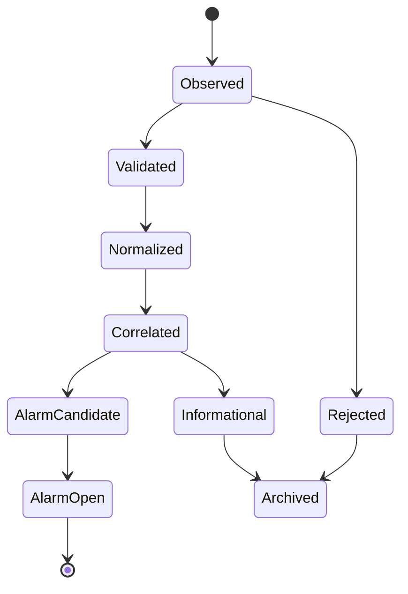
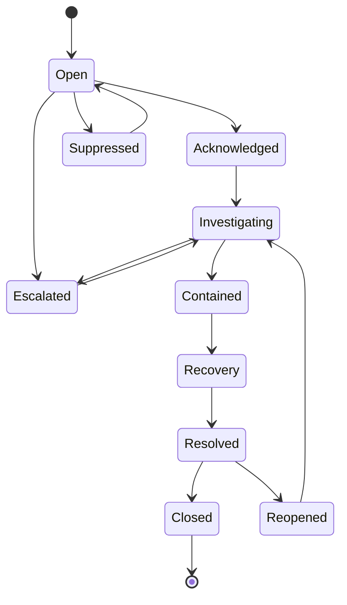
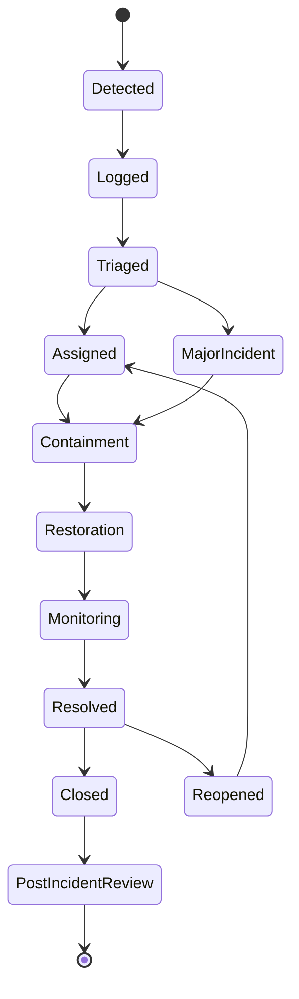

# OPSC-ALM-001 — Alarm & Incident Model

| Campo | Valore |
|---|---|
| Identificativo | OPSC-ALM-001 |
| Titolo | Alarm & Incident Model |
| Package | AP-012 |
| Stato | Draft baseline — Sprint AP-012.2 |
| Data | 30/07/2026 |
| Autorità | Digital StarGate Chief Architect |

## 1. Scopo

OPSC-ALM-001 definisce il modello canonico per eventi, allarmi e incidenti gestiti dal Digital StarGate Operations Center. Il modello specializza AP-007 per il contesto DSOC, preserva la Safety Authority locale di AP-010 e non autorizza azioni automatiche o comandi runtime.

## 2. Principi

- un event è un fatto osservato e non implica anomalia;
- un alarm è una condizione operativa che richiede valutazione;
- un incident è un degrado o un'interruzione di servizio che richiede contenimento e ripristino;
- acknowledgement non equivale a risoluzione;
- cessazione del segnale non equivale a chiusura;
- `unknown`, `stale` e `conflicting` non sono stati normali o sicuri;
- Safety Plane e interlock locali prevalgono su continuità e scheduling;
- ogni transizione deve essere correlata, auditabile e versionata;
- soppressione e correlazione non possono nascondere condizioni safety-relevant.

## 3. Alarm taxonomy

| Classe | Definizione | Esempi | Trattamento minimo |
|---|---|---|---|
| Safety | rischio per persone, cupola, montatura o asset fisici | weather unsafe, roof conflict, mount collision risk | escalation immediata, Safety Authority, safe-state verification |
| Availability | indisponibilità di servizio o componente critico | DSOC unavailable, integration unavailable | incident candidate, degraded mode, recovery runbook |
| Performance | degrado oltre baseline validata | latency, backlog, processing delay | trend, threshold review, escalation se impatto cresce |
| Security | violazione o rischio di accesso/privilegio | failed privileged login, policy bypass attempt | Security Authority, evidence preservation |
| Integrity | dati, stato o configurazioni incoerenti | conflicting telemetry, checksum mismatch | blocco azioni dipendenti, incident candidate |
| Capacity | saturazione o esaurimento risorse | queue depth, storage pressure | capacity runbook e change planning |
| Maintenance | condizione legata a manutenzione pianificata o scaduta | overdue maintenance, maintenance lock active | maintenance workflow |
| Informational | stato utile senza azione immediata | session started, backup completed | audit e reporting |

## 4. Event lifecycle



Ogni event deve includere almeno:

```text
event_id
correlation_id
source_id
source_type
observed_at
received_at
event_type
schema_version
payload_hash
state_freshness
quality_state
service_id
ci_id
safety_relevance
classification
```

## 5. Alarm lifecycle



Stati terminali sono ammessi solo dopo verifica del servizio e, quando applicabile, dello stato fisico sicuro.

## 6. Incident lifecycle



Ogni Incident Record deve includere almeno:

```text
incident_id
correlation_id
service_id
ci_ids
detected_at
acknowledged_at
severity
priority
impact
safety_relevance
incident_commander
assigned_roles
current_state
containment_actions
restoration_actions
recovery_validation
affected_sessions
linked_alarms
linked_runbooks
linked_changes
evidence_references
closure_reason
post_incident_review_reference
```

## 7. Severity model

| Severità | Criterio | Risposta |
|---|---|---|
| SEV-1 | rischio safety, perdita di controllo o impossibilità di raggiungere stato sicuro | immediate response, Major Incident, Safety Authority, emergency runbook |
| SEV-2 | servizio mission-critical indisponibile o fortemente degradato | coordinamento prioritario, owner e Incident Coordinator |
| SEV-3 | degrado con workaround controllato | gestione pianificata, monitoraggio e recovery |
| SEV-4 | difetto minore, richiesta o miglioramento | backlog ordinario |

La severità misura l'impatto. La priorità considera anche urgenza, finestra operativa, propagazione e rischio residuo.

## 8. Correlation

La correlazione deve considerare:

- stessa sorgente o stesso CI;
- stesso servizio o dipendenza comune;
- finestra temporale;
- topologia e dependency graph;
- correlation ID o session ID;
- causa probabile condivisa;
- pattern di ripetizione;
- safety relevance.

La correlazione deve essere reversibile e auditabile. Gli eventi originari non devono essere persi.

## 9. Escalation

L'escalation può essere:

- funzionale, verso owner o specialista;
- gerarchica, verso Operations Lead o Sponsor;
- safety, verso Safety Authority;
- security, verso Security Authority;
- major incident, verso Incident Commander;
- temporal, al superamento di timeout o finestre di aggiornamento.

Ogni escalation deve registrare trigger, destinatario, timestamp, canale, esito e next action.

## 10. Suppression

La suppression è ammessa solo quando:

- esiste una regola approvata e versionata;
- la condizione è nota, temporanea e tracciabile;
- non nasconde un alarm SEV-1 o safety-relevant;
- ha owner, motivazione e scadenza;
- produce evidence;
- è riesaminata alla scadenza o al change di contesto.

Sono vietate soppressioni permanenti generiche e suppression basate solo sull'assenza di operatori disponibili.

## 11. Major Incident

Un Major Incident deve prevedere:

1. Incident Commander nominato;
2. canale unico di coordinamento;
3. separazione tra restoration e root cause analysis;
4. communication cadence definita;
5. freeze dei change non essenziali;
6. evidence preservation;
7. timeline consolidata;
8. handover esplicito;
9. post-incident review obbligatoria;
10. tracciamento delle azioni correttive.

## 12. Acknowledgement

L'acknowledgement certifica soltanto che un attore ha preso in carico l'allarme. Deve registrare:

- actor e ruolo;
- timestamp;
- commento o reason code;
- eventuale delega;
- stato osservato;
- runbook avviato;
- escalation pendente.

## 13. Audit model

Ogni event, alarm e incident deve mantenere una timeline append-only con:

- actor o system principal;
- timestamp affidabile;
- previous state e new state;
- reason code;
- policy e rule version;
- payload hash;
- correlation ID;
- linked service, CI, session, command, runbook e change;
- evidence reference;
- approvazioni, override ed escalation.

## 14. Operator workflow

1. rilevare e validare il segnale;
2. verificare source, freshness e quality;
3. classificare alarm type e severity candidate;
4. acknowledgement;
5. correlare con alarm e incident esistenti;
6. aprire o aggiornare l'incident;
7. attivare il runbook;
8. contenere il rischio;
9. eseguire escalation;
10. verificare restoration e safe state;
11. raccogliere evidence;
12. chiudere solo dopo criteri soddisfatti.

## 15. Failure handling

| Failure | Comportamento |
|---|---|
| telemetry stale | stato `stale`, blocco azioni dipendenti, incident candidate |
| conflicting sources | stato `conflicting`, escalation e verifica manuale |
| notification failure | nessuna escalation implicita; fallback controllato |
| audit sink unavailable | buffer controllato o blocco secondo criticità |
| correlation engine unavailable | presentazione non correlata ma senza perdita degli eventi |
| operator unavailable | escalation secondo on-call model, mai auto-resolution |

## 16. Acceptance criteria

- tassonomia definita;
- lifecycle di event, alarm e incident definiti;
- severità SEV-1…SEV-4 coerente con AP-007;
- correlation, escalation e suppression governate;
- Major Incident e acknowledgement definiti;
- audit model e operator workflow espliciti;
- Safety Authority preservata;
- nessuna soglia numerica inventata;
- nessuna automazione runtime autorizzata dalla sola pubblicazione.

## 17. Open issues

- soglie definitive e baseline;
- routing e reperibilità;
- tool ITSM/HMI;
- retention audit;
- catalogo regole di correlation;
- ownership nominativa;
- tempi di acknowledgement ed escalation;
- integrazione con runbook execution engine.

## 18. Disposizione

OPSC-ALM-001 costituisce la baseline documentale di AP-012 Sprint AP-012.2. L'adozione runtime richiede validazione, drill, assegnazione dei ruoli e decisione ARB-012.
