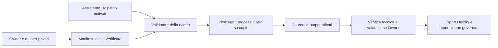

# BKL-049-EXT-PIAI — Pilota locale PixInsight con IA

| Campo | Valore |
|---|---|
| ID | BKL-049-EXT-PIAI |
| Versione | 1.2 |
| Stato | Owner-authorized pilot; architecture/release review required |
| Data | 2026-10-05 |
| Dipendenze | BKL-049 archive; importer 1.2; Owner PC/PixInsight; calibrated aligned masters |

## Scopo e baseline

Rendere ripetibile l’elaborazione assistita già effettuata su M27, sul PC dell’Owner con PixInsight installato. L’archivio BKL-049 rimane chiuso; questa estensione aggiunge un nuovo perimetro di elaborazione file, senza riaprire o alterare l’acceptance precedente. Le licenze già presenti evitano una nuova installazione nel primo test personale, ma non attestano diritti per servizio commerciale/multiutente. Versione dichiarata: PixInsight 1.9.5 build 1706; versioni e disponibilità effettive dei moduli devono essere registrate dal preflight.

## Architettura prevista

Il primo pilota usa l’assistente della sessione e una ricetta esplicita; non richiede chiamate API a pagamento. L’IA propone operazioni e parametri entro un insieme ammesso; PixInsight applica i pixel. Il journal futuro registra input/output e relazioni al momento dell’azione, così non dipende solo dalle correlazioni incomplete della History.

Un futuro worker sul PC riceverà job attraverso connessione autenticata in uscita. Il backend conserverà stato e coda; nessuna porta pubblica sul desktop. Credenziale dedicata, protocollo, provider/modello/costi e autorizzazioni cloud richiedono un pacchetto concreto successivo. La sola installazione PixInsight e l’abbonamento alla chat non rendono disponibile questa infrastruttura.

## Fasi e criteri di uscita

| Fase | Risultato richiesto | Stato iniziale |
|---|---|---|
| P1 — Preflight | Prova nativa M27 eseguita il 5 ottobre: PI 1.9.5 build 1706, quattro master invariati, 12 costruttori di processo disponibili; versioni moduli/licenze/modelli non attestati | Native test PASS; delivery/review tracked on PR |
| P2 — Esecutore locale | Coordinatore locale, copie, snapshot esecutore, ricetta lineare fissa, journal e checkpoint; prova nativa completa, pre-cancel e replay | Native tests PASS; delivery/review tracked on PR |
| P3 — Prova M27 | Input bloccati, output non lineare, verifiche finite/dimensioni/colore, confronto visivo; nessuna accettazione scientifica automatica | Planned |
| P4 — Connessione e IA | Protocollo autenticato, costi/provider/diritti definiti, job idempotenti e recupero offline | Planned |
| P5 — Portale e provenance | Comando Owner, stato, preview, revisione e collegamento esatto a sessioni e workflow | Planned |
| P6 — Acceptance | Casi errore/annullamento/offline, integrità originali, evidenza reale, review e rollback | Planned |

La disponibilità futura nel portale dipende da P4–P6. Il successo della vecchia elaborazione M27 non dimostra il funzionamento del nuovo worker.

## Regole dell’esecutore

Manifest versionato, ID univoco, input selezionati con integrità, destinazione separata, ricetta e limiti espliciti. Un job alla volta. Rifiutare input mancanti, risultati precedenti, conflitti e processi non ammessi; niente esecuzione di script forniti dal portale. Non usare i master come target modificabili. Se un modulo richiesto manca, fermare il job senza sostituirlo tacitamente. Non miscelare lavoro manuale e job automatico sulla stessa istanza.

Per cancellare, controllare il segnale prima del prossimo processo e conservare il journal. Un processo nativo lungo può terminare prima dell’annullamento; non è promesso un arresto immediato. Crash o risultati parziali restano evidenza privata e non passano a `COMPLETED`. Nessun upload/publicazione deriva dal completamento locale.

## Privacy, rischi e prove

Percorsi, immagini, modelli plugin e parametri restano privati. Git conserva codice, documenti e prove sintetiche/minimizzate. La catena runtime registrata e l’export storico importato hanno classificazioni distinte. Sessioni associate per dichiarazione non diventano origine pixel provata.

Rischi: desktop non disponibile, occupazione RAM/disco, moduli mancanti, incompatibilità PJSR, gradienti/dati inadatti alla ricetta e qualità variabile. Le operazioni originali su M27 non sono una ricetta universale LRGB. L’Owner valuta il risultato prima di qualsiasi pubblicazione; il pilota conserva la versione pubblicata attuale.

Acceptance P1/P2: prove di rifiuto per identità/input incoerenti e destinazione conflittuale; un preflight nativo reale deve lasciare input e progetto invariati. Acceptance P3: job reale separato e output verificato. Test sintetici non sostituiscono PixInsight, licenze o giudizio scientifico.

## Riferimenti e revisione

[Handover](../../project/HANDOVER_2026-10-05-BKL049-PIXINSIGHT-AI.md), [baseline](../../project/CURRENT_TECHNICAL_BASELINE_2026-10-05.md), [closure archivio](../../project/BKL-049-CLOSURE-2026-10-02.md), [importer 1.2](BKL-049-Portal-Importer-1.2.md).

Versione 1.0: piano autorizzato il 5 ottobre, nessuna fase dichiarata accettata prima di esecuzione/review. Rollback: interrompere nuovi job, conservare ricevute e output parziali, ritirare il codice aggiuntivo; originali e gallery non richiedono modifica.

## P1 — prova nativa 2026-10-05

La [ricevuta minimizzata](../../project/evidence/BKL-049-PIAI-P1-2026-10-05.json) registra il primo controllo reale. Il primo tentativo ha rifiutato correttamente il contenitore XISF multi-image: master più maschera di ritaglio. La selezione esplicita dell’indice immagine e delle dimensioni attese ha consentito il secondo test. Quattro master monocromatici Float32 4634×2808, 12 costruttori richiesti disponibili, integrità dei file confermata dopo il run, zero master modificati, zero processi applicati e zero richieste provider. Parametri, percorsi e digest privati non sono pubblicati.

Libreria `tools/pixinsight/local_pilot/preflight.jsh`; 13 test sintetici di rifiuto/selezione passati localmente. I test CI usano stub e non sostituiscono il test nativo. Le versioni dei moduli non sono esposte da ProcessInstance e restano sconosciute; disponibilità dei costruttori non prova licenza o caricamento dei modelli RC. Il risultato P1 non produce una nuova foto né modifica la gallery. Versione 1.1: prova nativa P1; consegnata con PR #479, merge `76d6186489c78aceb32f34a6b96afbe8f88457a7`, 17 controlli exact-head e 16 workflow post-merge SUCCESS, review sequenziali senza finding finali.

## P2 — esecutore e prove native 2026-10-05

Implementati `worker.py` e `executor.jsh`, con [procedura operativa nel repository](https://github.com/maininimassimo-bit/digital-stargate-manual/tree/main/tools/pixinsight/local_pilot). La ricetta `LRGB_LINEAR_PREP_V1` applica quattro ABE alle copie R/G/B/L e compone RGB: cinque processi, cinque checkpoint XISF Float32 lineari. La luminanza è preparata ma non ancora integrata. Non è una foto finale né una ricetta universale. Calibrazione colore, astrometria RGB, riduzione rumore, dettaglio, stretch e confronto visivo restano P3.

La [ricevuta minimizzata P2](../../project/evidence/BKL-049-PIAI-P2-2026-10-05.json) distingue la prova reale dai test sintetici. Run nativo completato: cinque processi/checkpoint, file originali e viste di input invariati, snapshot dello script e header verificati. Pre-cancel nativo: zero processi/output. Replay nativo rifiutato: tutti i 37 file del job concluso invariati. Seconda preparazione nello stesso worker root rifiutata. Test locali: 13 preflight, 15 esecutore, 20 coordinatore; l’errore nativo simulato non è presentato come OAT fisica.

Una prenotazione locale e un handle File esclusivo Windows, verificato a runtime prima dei pixel, serializzano un root configurato. Non è un lock globale di più worker. Il lancio resta supervisionato da Script → Execute Script File. Crash o preparazione incompleta conservano la prenotazione; nessuna ripresa o scadenza automatica. Per recuperare, confermare l’arresto di PixInsight, conservare/quarantinare il root e usare un root nuovo. Non forzare lo sblocco di un job vivo.

Le sorgenti native di ogni processo restano esatte nel journal privato. `workflow.js` esporta solo le cinque istanze riuscite, con identificatori rinominati e valori letterali preservati; il lettore 1.2 le legge come dati. Le correlazioni runtime restano separate; questa prova non rende completa la History a monte e non modifica il contratto pubblico importato. Nessuna API provider, connessione remota, modifica gallery o accettazione scientifica. Versione 1.2: P2 implementato e provato nativamente; delivery, CI e review da registrare sulla PR del relativo head.

Una seconda prova nativa completa conferma anche la correlazione dell’immagine creata da ChannelCombination: il target registrato al completamento coincide con l’output salvato. Entrambi i run e le ricevute restano privati e immutati.

Riesame P2: un Major ARB ha rilevato che il comando cancel tentava di leggere il file tenuto con handle esclusivo. Corretto con identità immutabile del job separata e marker completo pubblicato atomicamente, vincolato al token e verificato dal runtime. Prova Windows con handle reale e prova nativa PixInsight: lettura del lease negata, comando cancel riuscito durante il primo processo; arresto prima del checkpoint successivo, un processo registrato, zero output e originali invariati. Il processo in corso può terminare prima dell’annullamento. Il riesame finale richiede CI e ARB/RQ sul nuovo head.
