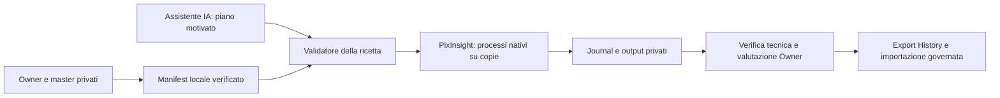

# BKL-049-EXT-PIAI — Pilota locale PixInsight con IA

| Campo | Valore |
|---|---|
| ID | BKL-049-EXT-PIAI |
| Versione | 1.0 |
| Stato | Owner-authorized pilot; architecture/release review required |
| Data | 2026-10-05 |
| Dipendenze | BKL-049 archive; importer 1.2; Owner PC/PixInsight; calibrated aligned masters |

## Scopo e baseline

Rendere ripetibile l’elaborazione assistita già effettuata su M27, sul PC dell’Owner con PixInsight installato. L’archivio BKL-049 rimane chiuso; questa estensione aggiunge un nuovo perimetro di elaborazione file, senza riaprire o alterare l’acceptance precedente. Le licenze già presenti evitano una nuova installazione nel primo test personale, ma non attestano diritti per servizio commerciale/multiutente. Versione dichiarata: PixInsight 1.9.5 build 1706; versioni e disponibilità effettive dei moduli devono essere registrate dal preflight.

## Architettura prevista

Il primo pilota usa l’assistente della sessione e una ricetta esplicita; non richiede chiamate API a pagamento. L’IA propone operazioni e parametri entro un insieme ammesso; PixInsight applica i pixel. Il journal futuro registra input/output e relazioni al momento dell’azione, così non dipende solo dalle correlazioni incomplete della History.

Un futuro worker sul PC riceverà job attraverso connessione autenticata in uscita. Il backend conserverà stato e coda; nessuna porta pubblica sul desktop. Credenziale dedicata, protocollo, provider/modello/costi e autorizzazioni cloud richiedono un pacchetto concreto successivo. La sola installazione PixInsight e l’abbonamento alla chat non rendono disponibile questa infrastruttura.

## Fasi e criteri di uscita

| Fase | Risultato richiesto | Stato iniziale |
|---|---|---|
| P1 — Preflight | Versione PI, moduli disponibili, master presenti e invariati; manifest privato e nessuna elaborazione implicita | In Progress |
| P2 — Esecutore locale | Un job, copie, ricetta ammessa, journal, cancellazione tra processi, errore esplicito, export separato | Planned |
| P3 — Prova M27 | Input bloccati, output non lineare, verifiche finite/dimensioni/colore, confronto visivo; nessuna accettazione scientifica automatica | Planned |
| P4 — Connessione e IA | Protocollo autenticato, costi/provider/diritti definiti, job idempotenti e recupero offline | Planned |
| P5 — Portale e provenance | Comando Owner, stato, preview, revisione e collegamento esatto a sessioni e workflow | Planned |
| P6 — Acceptance | Casi errore/annullamento/offline, integrità originali, evidenza reale, review e rollback | Planned |

La disponibilità futura nel portale dipende da P4–P6. Il successo della vecchia elaborazione M27 non dimostra il funzionamento del nuovo worker.

## Regole dell’esecutore

Manifest versionato, ID univoco, input selezionati con integrità, destinazione separata, ricetta e limiti espliciti. Un job alla volta. Rifiutare input mancanti, risultati precedenti, conflitti e processi non ammessi; niente esecuzione di script forniti dal portale. Non usare i master come target modificabili. Se un modulo richiesto manca, fermare il job senza sostituirlo tacitamente. Non miscelare lavoro manuale e job automatico sulla stessa istanza.

Per cancellare, controllare il segnale prima del prossimo processo e conservare il journal. Un processo nativo lungo può terminare prima dell’annullamento; non è promesso un arresto immediato. Crash o risultati parziali restano evidenza privata e non passano a `COMPLETED`. Nessun upload/publicazione deriva dal completamento locale.

## Privacy, rischi e prove

Percorsi, immagini, modelli plugin e parametri restano privati. Git conserva codice, documenti e prove sintetiche/minimizzate. La catena runtime registrata e l’export storico importato hanno classificazioni distinte. Sessioni associate per dichiarazione non diventano origine pixel provata.

Rischi: desktop non disponibile, occupazione RAM/disco, moduli mancanti, incompatibilità PJSR, gradienti/dati inadatti alla ricetta e qualità variabile. Le operazioni originali su M27 non sono una ricetta universale LRGB. L’Owner valuta il risultato prima di qualsiasi pubblicazione; il pilota conserva la versione pubblicata attuale.

Acceptance P1/P2: prove di rifiuto per identità/input incoerenti e destinazione conflittuale; un preflight nativo reale deve lasciare input e progetto invariati. Acceptance P3: job reale separato e output verificato. Test sintetici non sostituiscono PixInsight, licenze o giudizio scientifico.

## Riferimenti e revisione

[Handover](../../project/HANDOVER_2026-10-05-BKL049-PIXINSIGHT-AI.md), [baseline](../../project/CURRENT_TECHNICAL_BASELINE_2026-10-05.md), [closure archivio](../../project/BKL-049-CLOSURE-2026-10-02.md), [importer 1.2](BKL-049-Portal-Importer-1.2.md).

Versione 1.0: piano autorizzato il 5 ottobre, nessuna fase dichiarata accettata prima di esecuzione/review. Rollback: interrompere nuovi job, conservare ricevute e output parziali, ritirare il codice aggiuntivo; originali e gallery non richiedono modifica.
