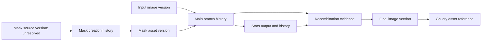

# BKL-049 F0 — Archive linkage feasibility experiment

Date: 2026-09-30. Status: RESEARCH / PARTIAL / F0 OPEN. No production contract or implementation change.

The [Owner-assisted history evidence](BKL-049-F0-Owner-Assisted-History-Evidence.md) provides a concrete multi-branch example. This experiment tests existing reconciliation boundaries with synthetic IDs, not the Owner's images. It asks what additional evidence would be needed to associate these branches with an exact gallery image. It does not select a new storage architecture or implement an exporter.

## Candidate evidence relationships

The diagram expresses required relationships, not a verified complete graph. Split the MAIN history into immutable intermediate versions in a future design: its full final history is not the input state that existed when the STARS output was produced. MASK creation time preceding use is consistent evidence, not proof of source identity. The missing mask-source relationship must stay unresolved. Original private names are not public identifiers.

## Direct reconciliation probes

Run `node experiments/bkl049-f0/asset-binding-probes.mjs`. The [script](https://github.com/maininimassimo-bit/digital-stargate-manual/blob/codex/bkl-049-f0/experiments/bkl049-f0/asset-binding-probes.mjs) and [saved result](https://github.com/maininimassimo-bit/digital-stargate-manual/blob/codex/bkl-049-f0/experiments/bkl049-f0/asset-binding-probes.result.json) use Node built-ins and the existing PixInsightReconciliationService. No network, native execution, image read or catalog mutation occurs. The input is a deliberately minimal direct-call object, not a full schema-validated manifest. The experiment checks this layer, not the behavior of every upstream caller.

| Probe | Reproduced behavior | Implication for the archive candidate |
|---|---|---|
| A01 | Exact session and asset IDs yield matched, with read-only authority | Preserve the existing governed route |
| A02 | Matching display label with different asset ID remains partially matched | Do not match by filename/view name |
| A03 | A supplied integrity conflict yields conflict | Preserve conflict handling rather than relabeling success |
| A04 | Missing session yields partially matched even when assets match | Image binding does not replace observation-context reconciliation |
| A05 | Changing a catalog digest under the same ID still yields matched | This layer alone does not compare expected image bytes; a verified immutable/versioned asset invariant must come from the authoritative boundary |
| A06 | Duplicate asset IDs resolve to the last supplied record; order can change matched/conflict | Establish uniqueness upstream or fail closed before archive association; no assumption that arbitrary input arrays are authoritative |

A05/A06 are boundary observations, not assertions that the current production catalog violates its invariants. The correct resolution may be enforced AP-013 invariants rather than changing AP14-W06. No authority or schema has been modified. A matched reconciliation result does not prove every workflow branch, mask source, historical parameter or script action was captured.

## Minimum evidence for a defensible association

| Element | Needed evidence | Present in the supplied history samples? |
|---|---|---|
| Image version | Governed asset identity, immutable version and integrity record | View names only; unresolved |
| Process occurrence | Source artifact locator, preserved local order/container path, parameter representation | Text and ordering available for containers; isolated snippets have weaker completeness |
| Source integrity | Retained original artifact and byte digest, controlled access | Some attached source digests recorded locally; no comprehensive archived bundle |
| Multiple outputs | Shared occurrence linked to explicit output identities | Owner confirmation and matching time/parameters; exact version linkage unresolved |
| Mask use | Exact mask version plus application/inversion state and container index | Named references and invert commands available; pixels/version/source unresolved |
| Script provenance | Name/version and source of attribution, separate from underlying processes | Image Blend is Owner DECLARED; PixelMath text available |
| Gallery link | Exact final asset/version and reviewed reference mapping | Not yet demonstrated |
| Coverage | Explicit omissions, no promotion based on successful matching | Overall PARTIAL |

Keep nested process containers and repeated processes. Do not sum aggregate container durations together with their child durations. Preserve source ordering separately from timestamps; times alone are not a cross-image total-order proof. Do not infer the actual ML model from a sentinel/default-like serialized field without documented semantics. Preserve source parameter representation without executing JavaScript or PixelMath.

PXP 1.0's ordered steps and asset references do not by themselves encode every proposed relationship above. The prior C02/C03/C04 probes already show ordering, detail-preservation and capacity constraints. Any versioning or graph representation is a reviewed later design decision, not an F0 contract extension.

## Next proof boundary

No additional processing of the Owner's scientific image is needed for this stage. First specify the export boundary and per-image version identity using a synthetic project; then test whether reopening/exporting preserves those associations. An eventual read-only export mechanism must preserve source provenance and reject ambiguous, missing or duplicate bindings. It must not promote manual association to automatic observation.

A supported, nonexecuting parser for real JavaScript exports remains unimplemented: text may contain multiline expressions, arrays, enumerations, nested containers and mask commands. Regex inspection of supplied examples is not a safe general parser. Unknown syntax must be retained as unsupported evidence, not evaluated or guessed. The isolated XML-envelope reader cannot parse this JavaScript format.

F0 remains open on licensing where relevant, supported extraction coverage, exact version identity, full workflow completeness and end-to-end gallery association. The candidate artifact route is better evidenced, but a universal native capture module is not demonstrated. No vendor contact is needed for this synthetic experiment and none occurred.

Validation: six synthetic observations reproduced and saved result matched a fresh run; six existing reconciliation tests passed. MkDocs strict build passed (27.32 seconds), targeted privacy/diff checks passed, roadmap consistency retained BKL-043 as current/next. CI is a separate exact-head check.

Subsequent experiment: the [nonexecuting export subset reader](BKL-049-F0-Nonexecuting-Export-Reader.md) implements bounded parsing and verifies two supplied source shapes plus synthetic rejection cases. This supersedes the narrow statement that no reader has been implemented, while preserving all broader extraction, identity and completeness gaps.
