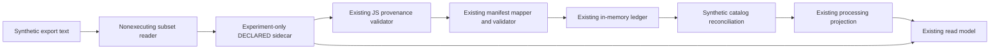

# BKL-049 F0 — Synthetic export-to-consumer experiment

Date: 2026-09-30. Status: ISOLATED RESEARCH / F0 OPEN. No live ingestion, native execution, production implementation or gallery publication of image data.

This experiment connects the [bounded nonexecuting reader](BKL-049-F0-Nonexecuting-Export-Reader.md) to existing PXP/AP14-W06 code using a fixed synthetic export. It tests whether declared, partial information can traverse the existing path without being promoted to observed execution or complete coverage. It does not convert any Owner-supplied scientific export into production evidence.

## Scope and reproduction

Run from the repository root:

```text
node experiments/bkl049-f0/synthetic-pipeline-probes.mjs
```

Node invokes the original Python research builder with an argument array, no shell and a bounded timeout. The builder reads only the committed synthetic fixture, parses it without execution and constructs an experiment-only candidate sidecar. It accepts no arbitrary input-file argument. Python and Node standard libraries suffice; no packages, SDK, PixInsight installation, credentials or network calls are required.

Sources: [synthetic fixture](https://github.com/maininimassimo-bit/digital-stargate-manual/blob/codex/bkl-049-f0/experiments/bkl049-f0/synthetic-export.fixture.txt), [builder](https://github.com/maininimassimo-bit/digital-stargate-manual/blob/codex/bkl-049-f0/experiments/bkl049-f0/build_synthetic_sidecar.py), [pipeline assertions](https://github.com/maininimassimo-bit/digital-stargate-manual/blob/codex/bkl-049-f0/experiments/bkl049-f0/synthetic-pipeline-probes.mjs), [saved result](https://github.com/maininimassimo-bit/digital-stargate-manual/blob/codex/bkl-049-f0/experiments/bkl049-f0/synthetic-pipeline-probes.result.json).

The fixture has a root container, a two-process nested container, a third process, a synthetic mask reference/inversion and opaque expression strings. It was independently authored for testing and contains no private parameters, image names, paths or vendor source. Class names are input data; no scientific operation is performed.

## Existing-code path exercised



The sidecar uses only synthetic declaration identity/time, `actionAuthority=NONE`, zero OBSERVED steps and PARTIAL coverage. Capture method PROCESS_HISTORY_EXPORT labels the invented fixture scenario, not a real export acquisition. Asset references and catalog identities are invented explicit test inputs; the parser did not infer them from PixelMath names. No full JSON Schema engine is invoked; the known distinction between declared schema constraints and handwritten JS validation remains open.

## Results

| Probe | Confirmed behavior |
|---|---|
| B01 | Candidate sidecar and manifest pass existing JS validators |
| B02 | Three occurrences of the same process type retain separate ordinals and source container paths |
| B03 | Rich read model retains lexical numeric representation, mask reference and mask-command metadata |
| B04 | Every step remains DECLARED; observed count and manifest/projected executed-process lists remain empty |
| B05 | Accepted ledger and matched synthetic identifiers leave coverage PARTIAL and acceptance/action authority disabled |
| B06 | Exact replay yields duplicate-noop; that duplicate record cannot generate a new processing projection |
| B07 | Missing declaration identity is rejected |
| B08 | Explicit mismatched sidecar binding is rejected by the read model |
| B09 | Coarse manifest omits detailed parameters and mask payload, confirming the need to retain richer evidence |

Nine assertions reproduced these properties. A matched projection and its availability event are not a complete-workflow acceptance decision. The B08 result applies to an explicitly wrong binding; the separately documented C09 missing-binding gap is not resolved by this experiment. In-memory ledger behavior is not durable cross-restart archival proof.

## Deliberate experimental choices, not accepted contracts

- Depth-first traversal supplies a deterministic fixture order, not proof of global chronological execution across real project branches.
- Original container paths and source-text digest are placed in locators. They are not resolved public URLs or immutable production archive records.
- `syntheticExportParameters` preserves reader-specific literal/enum representations inside the extensible parameter object. Syntactic acceptance does not establish an approved parameter encoding or faithful process replay.
- Notes retain local mask commands as experiment-only JSON. Parent-container mask inheritance, full graph structure and complete mask-state semantics are not mapped.
- Inputs/outputs are explicitly fabricated bindings. No image bytes, digest reconciliation, gallery resolver or acquisition/calibration lineage are proven.
- A synthetic declaration actor is used only in this fixture. A real adapter must never invent a person, declaration time or source provenance to pass validation.

No schemas, production functions, catalog authority or Safety Authority were modified. No automatic PXP OBSERVED promotion is implemented. Source artifacts, rich sidecars and public display projections remain separate concerns; the current read model is not a privacy sanitizer.

## Feasibility conclusion and next boundary

The existing route can carry a deliberately bounded DECLARED/PARTIAL candidate through to its read model while preserving the fail-closed evidence class. This is stronger than isolated function probes, but weaker than a real export-to-gallery integration. It advances G4, not G1 licensing or G3 full capture coverage; F0 and F1 entry gates remain open.

Before a real-source adapter, decide and verify source-provenance rules, immutable image/version bindings, nested/branch semantics, supported parameter representation, privacy projection, missing-binding handling and bounded-size behavior. Any changes to scientific contracts require the established review path. Further research may use synthetic artifacts without new scientific processing; no vendor contact is required or performed here.

Validation: nine pipeline observations reproduced and matched saved output, 27 subset-reader tests and 37 existing provenance/manifest/ledger/reconciliation/read-model tests passed. MkDocs strict build passed (33.26 seconds); targeted privacy, whitespace and roadmap checks passed with BKL-043 current/next. GitHub CI is a separate exact-head gate.
