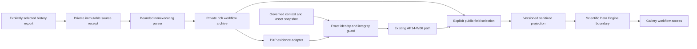

# BKL-049 F1 — Workflow Archive and Gallery Linkage Architecture

| Field | Value |
|---|---|
| Identifier | DSG-BKL049-F1-ARCH-001 |
| Version / date | 1.0 / 2026-09-30 |
| Status | Design baseline for separate ARB and Release Quality review |
| Entry evidence | [F0 acceptance](../../project/BKL-049-F0-ACCEPTANCE-2026-09-30.md), PR #445 and reconciliation PR #448 |
| Authority | Processing evidence only; catalog AP-014 and scientific identity AP-013 unchanged |
| Action / command / safety authority | NONE |

## 1. Decision

Implement a local, explicitly invoked, nonexecuting import of selected PixInsight history-export text, retaining original evidence and producing a rich private workflow archive. Deliver compatible PXP evidence through AP14-W06. Publish a separately approved minimized projection that the gallery can resolve by exact image/version binding. A partial workflow is a valid disclosed result; a guessed image association is never valid.

No PixInsight installation, PCL/PJSR runtime, background capture, source-directory scan, image processing, binary/model redistribution, new service/provider or paid dependency is required. Original repository-owned parsing code and existing Python/Node tooling are the implementation candidates. This design does not turn the F0 reader into production code without the hardening and tests below.

## 2. Current state and evidence

- The gallery currently consumes bounded fixture metadata. It has no accepted real scientific image/workflow association and must retain its fixture label until actual publication is accepted.
- PXP 1.0 represents processing evidence; AP14-W06 maps it to a coarse manifest, ledger, reconciliation and derived projection. The mapper preserves only OBSERVED process identifiers in the coarse process list; parameters, declarations and masks require the retained rich source/sidecar.
- F0 probes demonstrate that existing reconciliation does not itself validate expected image digests and duplicate identities can yield order-dependent matches. The new binding guard must reject these cases before invoking that path.
- The existing provenance read model copies arbitrary strings. It is not a privacy filter and must not be published directly from private evidence.
- Saved XISF history is supplementary evidence; unsupported project internals and compressed/external history payloads are not production importer inputs in the first increment.

Relevant code/contracts: `experiments/bkl049-f0/read_export_subset.py`, `docs/contracts/pixinsight-workflow-provenance.schema.json`, `.github/scripts/pixinsight-provenance-to-manifest.mjs`, `.github/scripts/pixinsight-provenance-read-model.mjs`, `schemas/bkl034-f2-image-archive-ingestion.schema.json`, and `docs/javascripts/bkl-034-image-gallery.js`. F0 source/version findings remain in the dossier; this design makes no additional vendor API claim.

## 3. Components and data flow

| Component | Responsibility | Forbidden responsibility |
|---|---|---|
| Source receipt | Read one explicitly named regular file with size limit; record exact bytes, digest, import version and local receipt time | Recursive discovery, follow exported paths, execute source, overwrite original |
| Bounded parser | Preserve supported syntax, lexical values, source spans, nesting and explicit instance order | Evaluate expressions, infer runtime sequence or fill unknown history |
| Private archive | Preserve source linkage, extraction result, gaps and declared context separately | Scientific catalog acceptance or public raw dump |
| PXP adapter | Construct only the supported valid PXP subset with truthful context | Fabricate historic IDs, overwrite original representations or change evidence classes |
| Binding guard | Validate an authorized immutable catalog/asset snapshot, uniqueness and exact identity/version/digests | Create catalog registrations or accept scientific products |
| Public projection builder | Emit only an explicit allowlist of approved fields and safe local references | Regex-only redaction of arbitrary private strings, expose paths or real private digests |
| Gallery consumer | Read sanitized immutable projection, display source/gap state, preserve filtering and navigation | Fetch private sources, execute workflow, mutate assets or accept provenance |

## 4. Source and retention contract

The first supported format is a UTF-8 PixInsight ProcessContainer/history JavaScript export in the documented bounded grammar implemented and tested by F0, hardened in F2. A standalone single instance is permitted; separately pasted snippets with repeated variable names must be submitted as distinct sources. Do not concatenate or silently rename variables. Supported literal scalar/array assignments, qualified enum symbols, literal string concatenation, container ordering and mask commands remain data only. Unknown syntax rejects the normalized import atomically; a retained source can still have an UNSUPPORTED extraction result.

Private receipt fields: format version, receipt ID, source byte length and SHA-256, importer version, local import time, source media/encoding, extraction outcome and stable diagnostic code. A digest identifies bytes, not authenticity; the receipt must be anchored to a separately retained governed record. Archive tampering cannot be repaired by recomputing a digest and silently replacing the trusted receipt.

Store originals outside public Git and site artifacts. New output files must use exclusive creation; retries compare immutable identity/content and are a no-op only on an exact match. Different content with the same logical receipt/workflow version is CONFLICT, never overwrite. Write a bounded staging result before atomic commit; interruption must leave no accepted half-packet. Do not silently delete source evidence. Storage selection/access/backup and any real archive-write operation require a concrete authorized destination; repository-only tests use temporary synthetic directories.

Initial resource ceilings are engineering safeguards, not scientific thresholds: source 2 MiB, 200,000 tokens, 512 instances, nested value depth 32 (from the F0 candidate). F2 must additionally bound parameter counts, container graph depth, string lengths and normalized output to the receiving PXP limits; reject excess before materializing or traversing unbounded structures. No network or subprocess is needed for parsing. Diagnostics expose codes and offsets, not offending text or paths.

XISF header inspection stays supplementary and read-only. It cannot be labelled PROCESS_HISTORY_EXPORT without an actual corresponding export. No image pixel decode, external attachment follow, XML entity/DTD processing or XOSM interpretation is in the first production source adapter. A new format requires its own versioned support/test entry.

## 5. Rich archive and evidence semantics

The private normalized archive is versioned separately from PXP; it retains source-order statements, container membership, instance identifiers, masks, source spans and exact lexical numeric/enum values. Source offsets are scoped to the source digest and encoding, not global execution identifiers. Keep string expressions as strings. The UI must describe exported order/configuration, not assert that serialization alone proves runtime execution or full chronology.

| Evidence | Treatment |
|---|---|
| Owner-selected exported configuration | DECLARED only with supplied actor/time attestation; otherwise retain as unclassified source evidence pending context |
| Start/execution comments | Retain as source text metadata; not independently measured runtime observations |
| Verified specific native saved evidence | OBSERVED only for the specific supported field under a separately tested source mapping; no blanket promotion |
| Proposed missing steps or AI suggestions | Separate SUGGESTED material; never emit in PXP executed steps |
| Unknown RC parameters/models/versions | Preserve original lexical values; explicit unresolved compatibility, no guessed migration |
| Mask/view names or PixelMath operands | Unresolved references until governed binding; no filename-based or expression-based identity inference |
| Missing history | UNAVAILABLE, no inference of no processing |
| Supported available subset | PARTIAL with limitations; initial adapter never claims COMPLETE |

PXP parameters accept arbitrary objects syntactically, but interoperability is not established for F0's tagged lexical values. F2/F3 must define a documented adapter-specific lexical encoding, version it within the private archive, and prove lossless round-trip plus PXP validator behavior before export. Do not silently convert enums/numeric precision to convenient strings/floats and call them native semantics. A consumer can display lexical values without evaluating them.

## 6. PXP/AP14-W06 compatibility

PXP 1.0, manifest 1.0 and current catalog schemas remain unchanged by this design. Source `captureMethod` is PROCESS_HISTORY_EXPORT only for actual history exports. Required host/workspace/product fields may use the existing truthful `unknown` convention where permitted; actual private identifiers are never required for public display. `sessionId`/`target` supplied as unknown do not make an association eligible for gallery publication. An import with no authoritative context stays retained and unlinked.

Create archive receipt/workflow IDs for the import as archive identities; do not present them as original PixInsight run IDs. Preserve unavailable historical times as null, with import time explicitly distinct. DECLARED steps require an accountable supplied declaration reference and time; do not create those from the machine account or import clock. Exact catalog session/target values come from the governed association, not the image filename.

Run the existing PXP validator, mapper, manifest validator, ledger and reconciliation only after validation of the new bounded input profile. Existing handwritten validators do not prove full JSON Schema conformance. F2/F3 must test every emitted field against required/type/length/enum/count/format/additional-property rules plus semantic invariants; do not market the bounded profile validator as a generic JSON Schema engine. Any inability to represent truthful evidence is an explicit unsupported result or separately reviewed contract proposal.

## 7. Exact image/version binding

Binding is a separate private receipt tied to an authorized AP-013/AP-014 snapshot. It includes stable image/asset identifier, immutable version identity (existing authoritative object reference/digest where no separate version field exists), expected byte size and digest, workflow/source identity, snapshot revision and decision evidence. Do not add catalog authority to the importer.

Before producing a resolved link:

1. Reject duplicate image IDs, ambiguous version records and conflicting source/workflow IDs before constructing lookup maps. No last-write-wins behavior.
2. Require a CATALOGED/accepted asset under the applicable existing lifecycle policy, known session/target association, and source evidence from the same explicitly selected version.
3. Compare independently measured original bytes/size/digest with the authoritative expected identity, under a separately authorized read. Hash equality does not establish that an unrelated workflow belongs to the image: require a supported native source association or explicit Owner declaration tied to both immutable identities, visibly classified as DECLARED.
4. Require exact reconciliation of all mandatory output references. Unresolved optional upstream inputs may remain PARTIAL but cannot weaken the final-output check.
5. For a gallery preview, require an explicit authoritative original-to-derivative relationship. A similar filename, object name or visual appearance is insufficient. No derivative is generated by ingestion.
6. Preserve the binding receipt and revision. Recheck current eligibility on regeneration; conflict, withdrawal or a changed version removes the resolved projection link rather than reusing it silently.

Wrong digest/version, duplicate identity, absent expected identity, conflicting receipt or missing derivative relation is UNRESOLVED/CONFLICT and blocks a verified gallery link. Missing upstream workflow detail remains a distinct PARTIAL content state. Private measured digests never need to appear in the public projection.

## 8. Public projection and gallery design

Introduce an additive versioned BKL-049 workflow projection owned by the processing-evidence boundary; do not extend or replace the closed BKL-034 schemas silently. Its eventual schema is reviewed with F2/F3 and its consumer implementation with F5. It references existing gallery image IDs plus public version and workflow references whose uniqueness is checked by the producer and consumer. Absence/conflict never falls back to a fixture.

The initial projection contains: schema/version, read-only authority constants, exact public image/version/workflow references, binding evidence class and safe citation, PARTIAL/UNAVAILABLE state, approved ordered process labels/parameters, explicit gaps and source citations. No raw source locator, filesystem path, host/user identity, private digest, unknown arbitrary note or unreviewed expression is emitted. Approving a report is not approval of every parameter string; default deny for strings, with per-field selections bound to the source digest/step/parameter. Publishing a numeric value is also subject to field classification, not automatically harmless. A change to private bytes invalidates the prior selection.

Build public values from explicit approved selections, never serialize the private object then try to remove secrets. Validate public IDs and relative route grammar; reject executable/external URLs. Render values as text, not HTML. Private full workflows remain available in the authorized private archive, even when parameters are omitted publicly. Every omission is labelled, without exposing the hidden value.

The gallery adds a read-only “Workflow” entry on a matching version. The detail view displays evidence type, exported order, process/parameter availability, source citations and gaps. PARTIAL and UNAVAILABLE are clear text states, not only colors. No replay/run/download-source command is provided. Missing binding displays an unavailable/unlinked state rather than opening another image's workflow. Filtering, direct refresh, Instant Navigation, keyboard focus, mobile layouts and light/dark contrast remain supported. Load the new projection through the Scientific Data Engine boundary; do not introduce a second catalog lookup authority in the component.

## 9. Verification matrix and delivery gates

| Phase | Required evidence before acceptance |
|---|---|
| F1 | Separate ARB then RQ on exact design head; documented baseline, privacy/identity decisions and explicit pending real-data gates |
| F2 | Bounded grammar positives, malicious syntax/unsupported calls, malformed UTF-8, limit/depth boundaries, duplicate assignments, cycles/reused children, symlink/path behavior, exclusive writes, interrupted packet and source-integrity failures |
| F3 | Lexical round-trip, exported-order preservation, mask/reference unknowns, declaration requirements, source-span integrity, missing history, RC mismatch and all emitted PXP field constraints; existing contract regression suite |
| F4 | Same-byte retry, changed-byte conflict, duplicate IDs, wrong version/digest/size, unrelated workflow, missing source trust anchor, unknown session/target, original/preview mismatch and catalog withdrawal |
| F5 | Safe rendering and malicious string/URL cases, selection invalidation, no private data in artifact, no fixture fallback, real authorized image/version-to-workflow association; browser/accessibility/refresh/Instant Navigation checks |
| F6 | Explicit artifact/version support table plus real authorized import/OAT, retained source checks and negative cases; no inference of untested process coverage |
| F7 | Runbook, rollback, separate reviews, exact-head CI, merge-SHA verification and live published content |

Synthetic tests do not substitute for real association and publication acceptance. No need to rerun scientific processing: existing explicitly selected evidence can be used read-only if the required identity/context and publication permission are available.

## 10. Alternatives and residual gates

Rejected for this increment: universal PCL observer (unsupported completeness/licensing route), direct XOSM production parsing (unsupported semantics), raw public archive dump (privacy), guessed filenames/IDs (wrong association), coarse manifest-only storage (lossy), automatic schema migration (unproven RC equivalence), new background services (unnecessary scope).

Before real end-to-end closure, obtain a concrete governed asset/version record, authorized retained-source destination and a specific public projection/preview classification if not already present. These are operational inputs, not reasons to invent records or silently relax acceptance. The repository currently has only gallery fixtures; no real binding is pre-approved. Present the concrete minimized candidate to the Owner when needed. Technical design and synthetic hardening can proceed independently.

Rollback disables the additive import/projection/consumer path and restores existing gallery behavior while preserving private originals and receipts. Revert through a reviewed PR, regenerate planning/projections and verify Pages. No image mutation, migration or restoration is involved.

## Revision history

- 1.0 — Initial detailed artifact-archive design following accepted F0; reviewed implementation and real association remain required.
