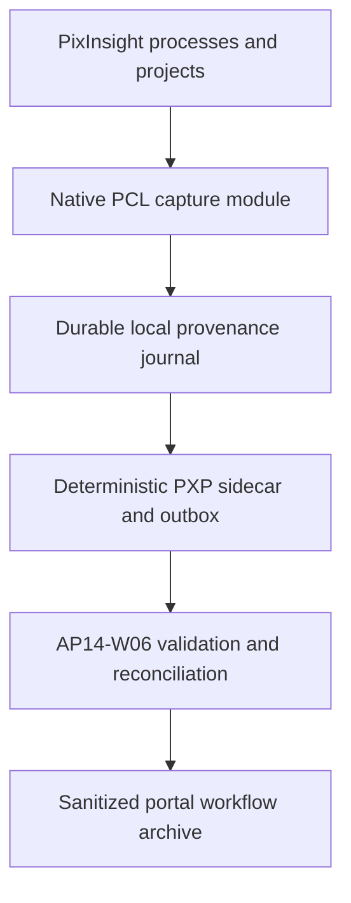

# BKL-049 — PixInsight Native Workflow Capture Module Plan

| Field | Value |
|---|---|
| Identifier | DSG-BKL-049-PLAN-001 |
| Status | **PLANNED — IMPLEMENTATION NOT STARTED** |
| Version | 1.0 |
| Date | 2026-09-14 |
| Target release | Release 2.x — scheduling to be governed |
| Predecessor | BKL-045 — CLOSED / ACCEPTED |
| Related decision | ADR-008 — native successor planning amendment |
| Current runtime impact | None |
| Action authority | `NONE` |

## 1. Purpose

Plan a native PixInsight PCL module and its governed Digital StarGate delivery path so that a complete, ordered and reproducible processing workflow can be captured automatically, correlated with sessions and scientific assets, archived as provenance evidence and presented in the portal.

“Complete” means **100% of the process types and relationships declared in the accepted support matrix**, using evidence actually exposed by supported PixInsight/PCL interfaces. Opaque or unsupported activity remains explicit as `PARTIAL` or `UNAVAILABLE`; it is never reconstructed as `OBSERVED`.

## 2. Scope

### In scope

- automatic run start/end and ordered-step capture;
- process identifier, implementation/module version and supported parameter serialization;
- input/output view relationships, scientific-asset references, masks and other exposed dependencies;
- PixInsight version/build, platform, loaded-module inventory and bounded workspace context;
- project save/reopen continuity, multi-image workflows and workflow/run correlation;
- operator annotations retained as `DECLARED`, separate from automatic `OBSERVED` evidence;
- crash-resilient append-only local journal, deterministic digest and idempotent export;
- compatibility with the existing PXP sidecar contract or a separately versioned backward-compatible successor;
- delivery to the existing AP14-W06 validation, ledger and exact-match reconciliation boundary;
- sanitized portal archive with workflow list, step-by-step detail, completeness, limitations, citations and links to session/target/assets;
- installation, upgrade, rollback, diagnostics and version-compatibility procedures.

### Out of scope

- direct creation or acceptance of AP-013 assets or AP-014 sessions;
- mutation of scientific images as a side effect of provenance capture;
- automatic execution or acceptance of PixInsight processing steps;
- promotion of `SUGGESTED` recommendations to executed provenance;
- fuzzy session/asset correlation;
- public disclosure of hostnames, usernames, local paths, secrets or raw image data;
- observatory device commands, remediation, go/no-go decisions or Safety Authority.

## 3. Architectural drivers

1. BKL-045 F3-B produced real, deterministic PixInsight evidence but reported `completeness=UNAVAILABLE` and zero automatically observed steps.
2. The portal needs a useful workflow archive, not only a provenance availability flag.
3. Existing PXP, AP14-W06, AP-013 and AP-014 boundaries must be reused rather than bypassed.
4. Capture must not destabilize or block normal PixInsight processing.
5. Native PCL integration introduces SDK, ABI, licensing, signing, packaging and version-support obligations that must be proven before rollout.

## 4. Current state

The accepted BKL-045 hybrid solution provides:

- the governed PJSR probe/export boundary;
- `OBSERVED`, `DECLARED` and `SUGGESTED` semantics;
- versioned PXP sidecars and fail-closed validation;
- deterministic sidecar-to-manifest mapping;
- AP14-W06 ledger and exact-match reconciliation;
- sanitized read-only consumer projections.

It does not demonstrate automatic extraction of the ordered PixInsight processing history. The current portal therefore cannot display a complete real workflow.

## 5. Target state

### PixInsight native boundary

The native module owns observation and local evidence capture only. Its planned components are:

- **Capture Controller** — lifecycle, enable/disable state and workflow/run correlation;
- **PCL Event/History Adapters** — supported process, project and workspace observation;
- **Parameter Serializer** — typed, bounded and redacted parameter representation;
- **Lineage Resolver** — input/output/mask/reference relationships and stable local locators;
- **Evidence Journal** — append-only checkpoints, recovery and duplicate protection;
- **PXP Projector** — canonical ordering, digest and contract-version projection;
- **Local Outbox** — atomic handoff without direct catalog mutation;
- **Diagnostics Surface** — health, compatibility, dropped/unsupported evidence and export state.

### Repository and portal boundary

Existing repository services continue to own schema validation, quarantine, idempotency, session/asset exact matching, read-model generation and publication. The portal remains a read-only consumer. Raw or sensitive local evidence is retained only in governed evidence storage; the public projection exposes sanitized metadata and citations.

## 6. Evidence semantics

| Situation | Required classification |
|---|---|
| Value emitted by a supported native API and retained with source locator | `OBSERVED` |
| Operator-entered note or manually declared operation | `DECLARED` |
| Advisor/AI recommendation not executed | `SUGGESTED`, outside executed workflow |
| Unsupported third-party or opaque action | explicit `PARTIAL` limitation |
| Missing/corrupt history or journal gap | `UNAVAILABLE` or `PARTIAL`; never inferred |

A module-installed state does not by itself prove complete capture. Completeness is evaluated per run against the accepted support matrix and journal diagnostics.

## 7. Delivery increments

| Increment | Outcome | Exit gate |
|---|---|---|
| F0 — SDK, licensing and feasibility | Verify PCL access, licensing/distribution, hooks, ABI/version matrix and technical limits on the current Windows/PixInsight baseline | Written feasibility evidence; no production code |
| F1 — Detailed architecture and ADR | Final component design, threat model, data contract delta, support matrix, resource budget, migration and rollback | ADR-008 amendment accepted through review |
| F2 — Native skeleton and packaging | Buildable module shell, reproducible toolchain, signed/versioned package layout, diagnostics and no-op installation/rollback | CI artifacts and isolated PixInsight smoke evidence |
| F3 — Automatic capture core | Ordered supported-process capture, typed parameters, lineage, masks/references and project continuity | Deterministic positive/negative fixtures plus real OAT |
| F4 — Journal, export and ingestion | Crash recovery, local outbox, PXP projection, validation, idempotency and AP14-W06 reconciliation | End-to-end exact-match evidence with failure injection |
| F5 — Portal workflow archive | Sanitized catalog/read model, workflow list and step-by-step detail linked to sessions/assets/targets | Desktop/mobile/accessibility/privacy acceptance |
| F6 — Compatibility and operational OAT | Built-in processes, scripts, supported third-party modules, multi-image/project reopen, restart/recovery and performance observation | Accepted support matrix with explicit exclusions |
| F7 — Rollout and closure | Installer, upgrade/rollback, runbook, monitoring, release notes and closure evidence | ARB, Release Quality, merge and post-merge verification |

No increment becomes current merely because it is listed here. Promotion and implementation follow the governed roadmap sequence and repository workflow.

## 8. Persistence and archival model

| Layer | Stored content | Authority |
|---|---|---|
| PixInsight local journal | detailed native capture, checkpoints and delivery state | processing evidence source |
| Governed sidecar/evidence store | versioned PXP payload, digest, source locators and validation result | immutable provenance evidence |
| AP14-W06 ledger | idempotency and reconciliation outcome | synchronization boundary |
| AP-013/AP-014 | scientific asset/session identity, checksum, lifecycle and accepted links | catalog authorities |
| Portal projection | sanitized workflow summary and step-by-step read model | derived, read-only projection |

Bulk FITS/XISF data and PixInsight Project files remain in external scientific storage. Git/repository storage retains bounded metadata, manifests, hashes, evidence and lineage references.

## 9. Failure, recovery and rollback

- capture failure must not block or alter PixInsight processing;
- evidence publication fails closed: incomplete evidence cannot claim `COMPLETE`;
- journal writes use atomic checkpoints and recover without duplicating steps;
- invalid sidecars are rejected or quarantined before reconciliation;
- unresolved session/asset identities remain unlinked;
- delivery retries are idempotent and bounded;
- disabling or uninstalling the module restores the existing BKL-045 exporter path;
- contract rollback preserves already accepted evidence and never rewrites historical facts.

## 10. Security, privacy and operations

- least-data collection and explicit redaction of paths, host/user identity and secrets;
- no inbound listener and no credential embedded in the module;
- authenticated delivery, when designed, must use a separately governed local agent or bounded credential mechanism;
- configurable retention for local journals and quarantine;
- structured logs, module health, queue depth, export failures, unsupported-event counts and correlation identifiers;
- no heavy compute or new workload on the observatory EAGLE;
- support runbook for install, compatibility failure, journal recovery, outbox replay and rollback.

## 11. Dependencies and sequencing

| Dependency | State | Use |
|---|---|---|
| BKL-045 | Accepted | semantics, PXP contract and retained limitation |
| BKL-044 | Accepted | evidence/Citation/Provenance preservation |
| AP-013 | Accepted baseline | scientific asset authority |
| AP-014/AP14-W06 | Accepted baseline | session reconciliation and synchronization |
| BKL-046 | Accepted with limitations | existing portal consumer boundary |
| PixInsight PCL SDK/license | To verify in F0 | native build and redistribution |
| Supported PixInsight version matrix | To define in F0/F1 | compatibility and release support |

BKL-048 is already reserved by PR #186 for Anomaly & Trend Center multi-session planning. BKL-049 does not change BKL-031 as the current governed package and does not alter the existing program sequence until separately promoted.

## 12. Risks and trade-offs

| Risk | Planned treatment |
|---|---|
| PCL does not expose every arbitrary execution event | define an evidence-backed support matrix and explicit completeness gaps |
| PixInsight ABI/API changes | version-gated adapters, compatibility checks and rollback |
| Third-party processes are opaque | support only proven interfaces; preserve process identity and limitation |
| Module overhead affects processing | measure latency, memory, I/O and journal growth before setting release budgets |
| Sensitive local metadata leaks | redact before sidecar/public projection; privacy negative tests |
| Journal loss or duplication | atomic checkpoints, sequence numbers, digest and idempotent replay |
| Direct portal coupling creates a second authority | retain local outbox plus AP14-W06 as the only ingestion path |
| Native maintenance cost exceeds value | F0/F1 evidence gate before full implementation |

## 13. Acceptance criteria

BKL-049 can be closed only when:

1. a reproducible native module build and installer exist for every supported PixInsight version;
2. 100% of the accepted support matrix is captured automatically with ordered steps and typed parameters;
3. inputs, outputs, masks and exposed references survive project save/reopen and module restart;
4. repeat export of unchanged evidence yields the same canonical digest;
5. crash, corrupted journal, duplicate delivery, invalid sidecar and unresolved identity tests fail closed;
6. AP14-W06 reconciles only exact session and asset identifiers and remains idempotent;
7. the portal displays complete and partial workflows step by step with citations and limitations;
8. public projections contain no forbidden host, user, path, secret or raw-image data;
9. module failure neither mutates images nor blocks normal PixInsight processing;
10. unsupported actions are explicit and never promoted to `OBSERVED`;
11. installation, upgrade, disable, uninstall, recovery and rollback are exercised on a real PixInsight runtime;
12. exact-head CI, real OAT, Architecture Review Board, Release Quality, merge and post-merge evidence are complete.

## 14. Validation plan

Planned validation includes:

- unit and contract tests for serialization, ordering, digest and redaction;
- compatibility fixtures per supported process family and PixInsight version;
- real PixInsight OAT on the current baseline (1.9.4 build 1695) before expanding the version matrix;
- built-in process, script and supported third-party module scenarios;
- masks/references, multiple images, project save/reopen and restart scenarios;
- crash/failure injection for journal and outbox;
- AP14-W06 idempotency and exact-reconciliation tests;
- privacy and portal accessibility tests;
- measured CPU, memory, I/O, latency and journal growth;
- signed artifact provenance and rollback verification.

Planned evidence is not execution evidence. No validation in this section is claimed as run.

## 15. Traceability

| Requirement | Source | Planned realization |
|---|---|---|
| Automatic detailed workflow capture | BKL-045 retained limitation | F2–F4 native module |
| Truthful completeness | ADR-008, PXP contract | support matrix and fail-closed states |
| Asset/session authority preservation | AP-013/AP-014 | exact-match AP14-W06 handoff |
| Portal archive | BKL-045/BKL-046 consumer boundary | F5 sanitized read model |
| Privacy | BKL-045 consumer rules | redaction and negative tests |
| No execution authority | BKL-045/BKL-046 | `actionAuthority=NONE` |
| Safe rollback | ADR-008 | disable/uninstall to hybrid exporter |

## 16. Open issues for F0/F1

- exact PCL APIs available for process execution, project history and workspace events;
- SDK access and redistribution terms;
- module signing and trusted installation procedure;
- supported Windows/PixInsight version range;
- representation limits for scripts and third-party modules;
- local journal format, retention and secure delivery mechanism;
- whether PXP 1.0 is sufficient or requires a backward-compatible version increment;
- quantitative resource and performance budgets based on measurement.

## 17. Documentation and release impact

Future implementation must update the PCL developer/build guide, installation and rollback runbook, PXP contract documentation, AP14-W06 integration guide, portal workflow user guide, release notes, MkDocs navigation, validation matrix and BKL-049 closure record.

This planning package updates only backlog, canonical roadmap, ADR-008 traceability and navigation. It does not change generated projections manually; the governed roadmap synchronization workflow owns those projections.
