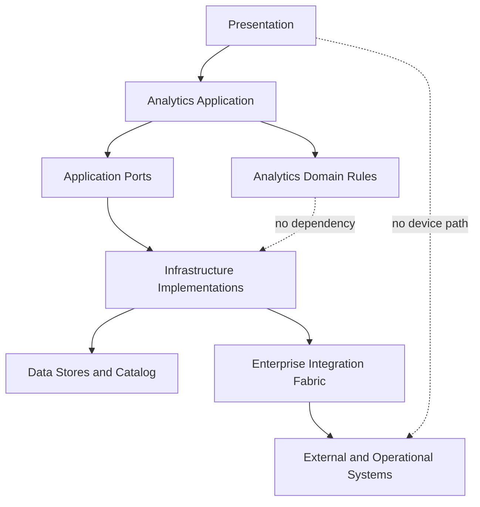

# ANA-REF-001 — Enterprise Analytics Reference Architecture

| Campo | Valore |
|---|---|
| Identificativo | ANA-REF-001 |
| Package | AP-011 |
| Stato | Proposed for review |
| Data | 30/07/2026 |

## Purpose

Definire i building block logici riutilizzabili della Digital StarGate Analytics Platform senza vincolare il programma a uno specifico prodotto.

## Architecture building blocks

1. Source adapters and governed file intake
2. Ingestion orchestration
3. Raw immutable landing
4. Validation and quarantine
5. Curated data products
6. Semantic and KPI layer
7. Serving APIs and dashboards
8. Scientific analytics workspace
9. Advisory model runtime
10. Catalog, lineage, audit and observability

## Dependency rules

- Presentation consuma semantic views o serving APIs.
- Application orchestra pipeline e use case analytics.
- Domain analytics contiene regole, metriche e policy prive di dipendenze infrastrutturali.
- Infrastructure implementa storage, compute, scheduler, catalog e connector.
- Nessun componente analytics accede direttamente a dispositivi.
- Nessun output analytics autorizza automaticamente un comando.

## Deployment views

Sono ammessi deployment locale, ibrido o centralizzato, purché:

- la perdita WAN non comprometta la safety locale;
- i dati siano classificati e cifrati quando richiesto;
- backup, restore, capacity e patching siano governati;
- i workload siano isolati dai controller operativi;
- le dipendenze runtime siano osservabili.

## Data lifecycle

`received -> raw -> validated -> curated -> published -> deprecated -> retained/retired`

Ogni transizione registra actor/process, timestamp, contract version, quality result e lineage.

## Non-functional requirements

- idempotent ingestion dove applicabile;
- deterministic transformation per output riproducibili;
- bounded retry e quarantine;
- explicit freshness;
- schema compatibility;
- horizontal scale only when measurements justify it;
- storage growth and cost telemetry;
- access audit and data classification.

## Safety boundary

DSAP è advisory e read-only verso operations. Alert analytics non sono interlock. Predictive results non sostituiscono condizioni real-time, PLC, controller locali o decisioni operatore governate.

## Validation

Richiede contract tests, data quality tests, lineage verification, replay/rebuild, access review, recovery test, performance baseline e architecture review.