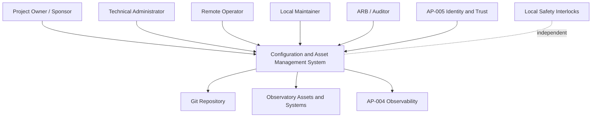
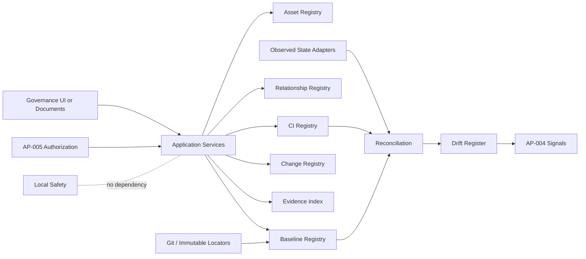
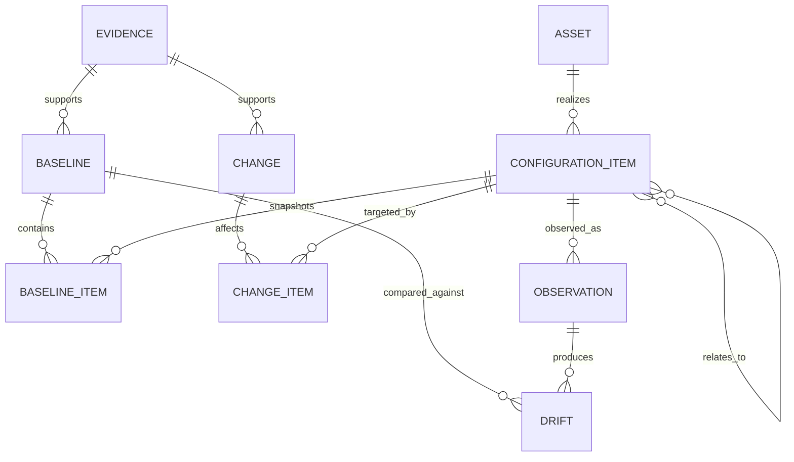
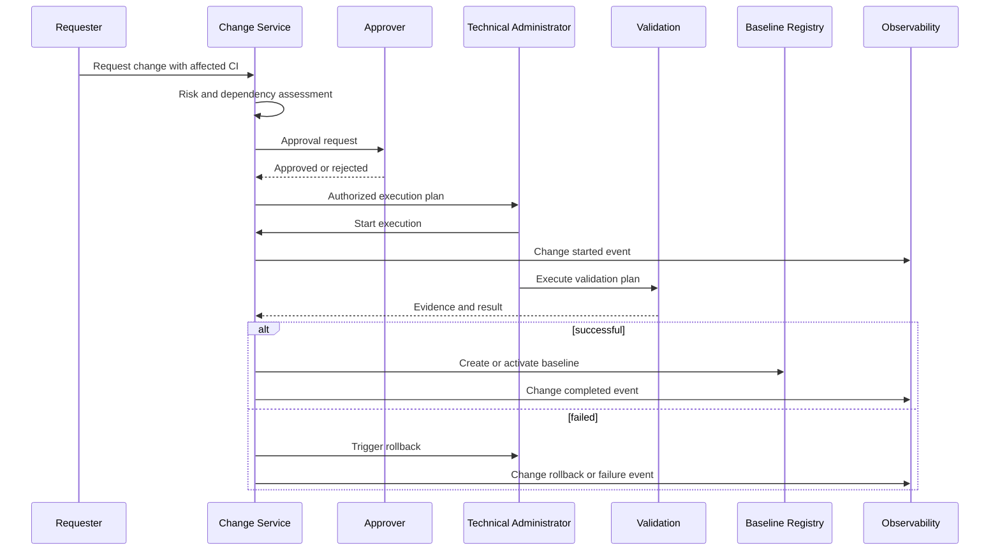
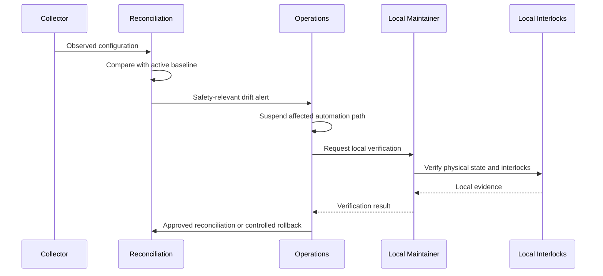

# Enterprise Configuration and Asset Management Reference Architecture

| Campo | Valore |
|---|---|
| Documento | Enterprise Configuration and Asset Management Reference Architecture |
| Package | AP-006 |
| Repository | `maininimassimo-bit/digital-stargate-manual` |
| Branch | `main` |
| Data | 30/07/2026 |
| Stato | Proposed reference architecture |

## 1. Obiettivo

Questa reference architecture definisce componenti logici, flussi, responsabilità e boundary per Configuration and Asset Management in Digital StarGate.

Non prescrive un prodotto CMDB, non certifica l'inventario fisico e non consente aggiornamenti automatici di dispositivi safety-relevant.

## 2. Principi

1. Asset, CI e baseline sono concetti distinti.
2. Desired state e observed state devono essere riconciliabili.
3. Ogni CI ha owner, lifecycle, classificazione ed evidence.
4. Ogni change è attribuibile, testato e reversibile.
5. Il repository conserva artefatti versionabili; secret e dati sensibili restano protetti.
6. La CMDB non è autorità safety.
7. La perdita del control plane non deve impedire recovery locale o safe state.
8. Le relazioni sono verificate, non inferite come fatti.

## 3. Componenti logici

| Componente | Responsabilità | Non responsabilità |
|---|---|---|
| Asset Register | proprietà, costo, ubicazione, lifecycle | configurazione tecnica completa |
| CI Register | identità tecnica, versioni, stato, owner | secret e credenziali |
| Relationship Graph | dipendenze e connessioni verificate | prova automatica di connessione fisica |
| Baseline Registry | snapshot approvati e immutabili | controllo runtime |
| Change Register | richiesta, rischio, approvazione, esito | bypass degli interlock |
| Evidence Store | locator di test, export, audit e rollback | sostituzione della validazione |
| Reconciliation Service | confronto desired/observed | auto-remediation safety-critical |
| Reporting Layer | KPI, scadenze, obsolescenza, drift | autorità operativa |
| Integration Ports | AP-002, AP-003, AP-004, AP-005, release governance | dipendenze vendor nel Domain |

## 4. Vista C4 — Context



## 5. Vista C4 — Container logico



## 6. Porte applicative

### 6.1 Asset ports

- `RegisterAsset`
- `UpdateAssetLifecycle`
- `AssignAssetOwner`
- `RecordMaintenance`
- `RetireAsset`

### 6.2 CI ports

- `RegisterConfigurationItem`
- `AttachConfigurationEvidence`
- `UpdateObservedState`
- `LinkConfigurationItems`
- `VerifyRelationship`

### 6.3 Baseline ports

- `ProposeBaseline`
- `ValidateBaseline`
- `ApproveBaseline`
- `ActivateBaseline`
- `RestoreBaseline`

### 6.4 Change ports

- `RequestChange`
- `AssessChangeRisk`
- `AuthorizeChange`
- `RecordChangeExecution`
- `CloseOrRollbackChange`

### 6.5 Drift ports

- `CompareDesiredAndObserved`
- `ClassifyDrift`
- `AcknowledgeDrift`
- `ReconcileDrift`
- `EscalateSafetyRelevantDrift`

Le implementazioni vendor-specific devono restare dietro adapter infrastrutturali.

## 7. Modello dati logico



## 8. Stato e lifecycle

### Asset

```text
ACQUIRED -> REGISTERED -> IN_TEST -> COMMISSIONED -> OPERATIONAL
-> MAINTENANCE -> RESERVED -> DECOMMISSIONING -> RETIRED -> DISPOSED
```

### CI

```text
PROPOSED -> REGISTERED -> VERIFIED -> BASELINED -> ACTIVE
-> CHANGING -> SUSPENDED -> SUPERSEDED -> RETIRED
```

### Baseline

```text
DRAFT -> VALIDATED -> APPROVED -> ACTIVE -> SUPERSEDED -> ARCHIVED
```

### Change

```text
REQUESTED -> ASSESSED -> APPROVED -> SCHEDULED -> EXECUTING
-> VALIDATING -> COMPLETED | ROLLED_BACK | FAILED | CANCELLED
```

## 9. Trust boundaries

1. Governance and approval zone.
2. Repository and document zone.
3. Configuration registry zone.
4. Observed-state collection zone.
5. Remote administration zone.
6. Device and controller zone.
7. Local safety zone.
8. Evidence and audit zone.

La Local Safety Zone non dipende da CMDB, repository, collector, dashboard o accesso remoto.

## 10. Sequenza — change normale



## 11. Sequenza — drift safety-relevant



Il flusso non modifica automaticamente CI safety-relevant.

## 12. Failure modes e comportamento degradato

| Failure mode | Comportamento richiesto |
|---|---|
| CMDB indisponibile | nessun change non emergenziale; safety locale invariata |
| Repository indisponibile | usare baseline locale verificata; vietare promozioni |
| Observed state assente | stato `unknown`; non assumere conformità |
| Telemetry stale | evidenziare staleness; richiedere verifica alternativa |
| Collector compromesso | isolare source, preservare evidence, aprire incident |
| Relazioni incomplete | impact analysis marcata incompleta |
| Backup non verificato | change bloccato salvo emergenza governata |
| Rollback fallito | arrestare change, passare a recovery e verifica locale |
| Power loss | affidarsi a interlock e procedure locali; riconciliare al ripristino |
| Partial closure | seguire emergency runbook e verifica fisica, non CMDB |

## 13. Commissioning checklist

- asset e CI ID assegnati;
- owner e custodian approvati;
- seriale e versione verificati quando applicabile;
- foto, manuale o export con locator protetto;
- alimentazione, rete e dipendenze registrate;
- backup configuration completato;
- compatibility e functional test completati;
- failure mode applicabili verificati;
- runbook operativo e di rollback disponibili;
- telemetry e audit event verificati;
- security review completata;
- safety review completata per CI rilevanti;
- baseline approvata.

## 14. Decommissioning checklist

- autorizzazione e data di efficacia;
- dipendenze e sostituto verificati;
- backup o archival secondo retention;
- revoca account, token, certificati e accessi;
- rimozione da monitoring e runbook;
- sanificazione dati e configurazioni;
- aggiornamento relazioni e baseline;
- disposal o riserva documentati;
- evidence di chiusura.

## 15. Backup e recovery

Ogni CI configurabile deve dichiarare:

- metodo di export o backup;
- frequenza e trigger;
- classificazione;
- storage e accesso;
- integrità e test di restore;
- dipendenze di recovery;
- ordine di ripristino;
- last known good baseline;
- rollback runbook.

La presenza di un file di backup non prova la sua ripristinabilità.

## 16. Integrazioni

### AP-002

Classificazione, retention, lineage ed evidence lifecycle.

### AP-003

Porte applicative, adapter, use case e separazione dal Domain. Nessuna configurazione autorizza bypass safety.

### AP-004

Signal, health, drift events, audit, correlation e operations evidence.

### AP-005

Identità, least privilege, privileged session, secret reference e command authorization.

### Release governance

Ogni release deve dichiarare baseline incluse, migration, rollback, compatibility e open issue.

## 17. Decision records candidati

Richiedono decisione separata:

- sistema autorevole per asset e CI;
- formato machine-readable del registro;
- authority per baseline approval;
- classificazione e frequenza dei reconciliation job;
- policy di auto-remediation;
- retention di export e evidence;
- modello di identificazione di software, licenze e firmware;
- gestione dei seriali e dati sensibili;
- integrazione con release e incident management.

## 18. Evidence minima per readiness

- inventario campionato e verificato;
- baseline pilota con locator immutabile;
- change normale completato con evidence;
- change fallito con rollback riuscito;
- drift rilevato e riconciliato;
- backup e restore testati;
- commissioning e decommissioning dimostrati;
- failure test per connettività, power loss e stale telemetry;
- access review e audit trail;
- review ARB con condizioni chiuse.

## 19. Open issues

- completezza inventario;
- ownership nominativa;
- metodi di collection;
- copertura e qualità delle relazioni;
- definizione del tool;
- soglie e frequenze drift;
- evidenza delle configurazioni dei dispositivi;
- localizzazione ricambi;
- support status e obsolescenza;
- test di restore e rollback.

## 20. Stato

La reference architecture è **Proposed** nell'ambito di AP-006. Non costituisce implementazione, certificazione o autorizzazione a modificare dispositivi.