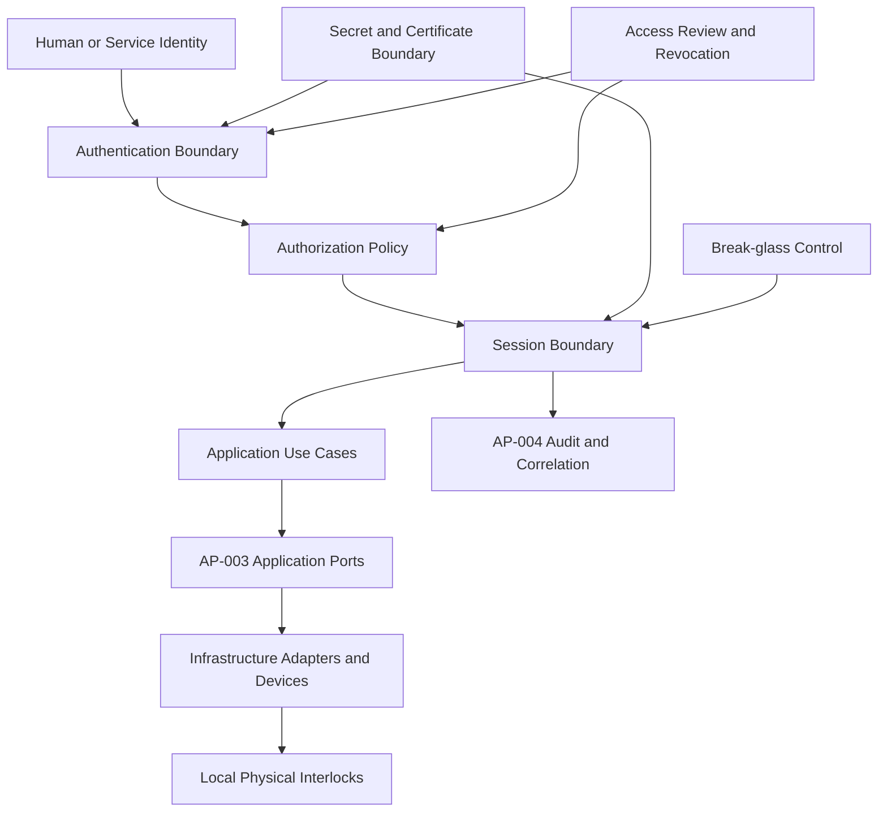

# Enterprise Identity and Trust Reference Architecture

| Campo | Valore |
|---|---|
| Documento | Enterprise Identity and Trust Reference Architecture |
| Package | AP-005 |
| Repository | `maininimassimo-bit/digital-stargate-manual` |
| Branch | `main` |
| Data | 30/07/2026 |
| Stato | Proposed for independent ARB review |

## 1. Purpose

Questa reference architecture traduce AP-005 in componenti, trust boundary, contratti, flussi e controlli verificabili. Non certifica provider IAM, MFA, VPN, endpoint, PKI, account, privilegi o operatività continua.

## 2. Logical components

| Componente | Responsabilità | Non responsabilità |
|---|---|---|
| Identity Registry | inventario di human, service e device identity | custodire secret in chiaro |
| Authentication Boundary | verificare l'identità secondo assurance deliberata | autorizzare implicitamente operazioni |
| Authorization Policy | valutare ruolo, risorsa, operazione e contesto | bypassare interlock locali |
| Session Boundary | creare, limitare, revocare e correlare sessioni | dedurre stato fisico |
| Privileged Access Boundary | separare administration, operate e override | fornire accesso diretto non governato ai dispositivi |
| Secret and Certificate Store Candidate | proteggere, ruotare e revocare secret | pubblicare valori in repository o log |
| Break-glass Control | accesso emergency limitato e auditato | sostituire il percorso ordinario |
| Access Review | riesaminare owner, ruolo, scope e necessità | approvare automaticamente privilegi |
| Audit and Evidence | conservare eventi attribuibili e protetti | provare l'esito meccanico senza conferma locale |
| Local Safety Layer | interlock, E-stop, finecorsa e logiche locali | dipendere da IAM, VPN o cloud |

## 3. Trust flow



Non esiste un flusso implicito Identity → Device. Ogni operazione fisica attraversa Application e i boundary AP-003.

## 4. Identity classes

### Human identity

- nominale;
- sponsor e owner;
- ruolo e livello di abilitazione;
- lifecycle e review;
- fattori di autenticazione;
- accessi e privilegi attribuibili.

### Service identity

- owner tecnico;
- purpose singolo o chiaramente limitato;
- non-interactive dove possibile;
- scope minimo;
- credential rotation e revocation;
- telemetry e audit senza secret.

### Device identity

- associata a inventory e asset owner;
- autenticazione solo se supportata e verificata;
- certificato/chiave con lifecycle;
- nessuna equivalenza automatica tra device trusted e comando autorizzato.

## 5. Authorization decision

```text
Subject + Role + Resource + Action + Channel + Session Assurance
+ System State + Approval Context + Expiry + Reason
= Permit / Deny / Step-up / Require Approval
```

Il modello è candidato. Policy e attributi devono essere versionati e testati prima dell'implementazione.

## 6. Privilege separation

| Privilegio | Uso | Controllo minimo |
|---|---|---|
| Read | consultazione | accesso nominale e logging |
| Operate | use case standard | ruolo operativo e sessione valida |
| Configure | modifica parametri | change record e rollback |
| Administer | account, rete, sistemi | account separato, audit rafforzato |
| Override | eccezione limitata | motivazione, scadenza e alert |
| Emergency | recovery break-glass | custodia, uso temporaneo, rotation e review |

## 7. Command authorization contract candidate

```text
policy_id
schema_version
role
use_case_or_command
resource
channel
location_context
required_assurance
required_approval
valid_from_utc
valid_until_utc
reason_required
runbook_reference
audit_event_type
rollback_or_escalation
```

La policy autorizza un use case applicativo, non il bypass di un controller o interlock.

## 8. Session contract candidate

```text
session_id
identity_id
role
endpoint_id
channel
started_at_utc
last_activity_at_utc
expires_at_utc
assurance_level
privilege_scope
correlation_id
reason
revocation_status
termination_reason
```

I timeout, la re-authentication e il recording sono da deliberare dopo inventory e risk assessment.

## 9. Secret metadata contract candidate

```text
secret_id
secret_type
owner
consumer_scope
classification
storage_locator
issued_at_utc
expires_at_utc
rotation_policy
revocation_status
last_rotated_at_utc
evidence_locator
```

Il contratto contiene metadata e locator, mai il valore del secret.

## 10. Break-glass flow

```text
Emergency detected
  -> ordinary access unavailable or insufficient
  -> authorized request and reason
  -> controlled credential/session release
  -> minimum-scope action
  -> audit and notification
  -> session termination
  -> credential revocation/rotation
  -> post-event review
```

Il break-glass non disabilita protezioni locali.

## 11. Remote session boundaries

1. Endpoint zone: postazione valutata o esplicitamente accettata.
2. Remote access zone: VPN o boundary equivalente verificato.
3. Authentication zone: verifica identità e fattori.
4. Authorization zone: policy e privilege evaluation.
5. Session zone: durata, scope, revoca e correlation.
6. Application zone: use case approvati.
7. Administration zone: configurazione separata.
8. Device zone: adapter e controller.
9. Local safety zone: autorità fisica indipendente.

## 12. Failure and recovery matrix

| Failure | Required response |
|---|---|
| VPN unavailable | nessun accesso remoto; safety e procedure locali indipendenti |
| Authentication unavailable | deny-by-default; emergency path solo se deliberato |
| Authorization service unavailable | nessuna concessione implicita; sessioni secondo policy di degraded mode |
| Account compromise | suspend/revoke, terminate session, rotate credential, preserve evidence |
| Certificate expiry | failure esplicito e recovery autorizzato |
| Endpoint compromise | deny o limitazione secondo policy; incident handling |
| Audit unavailable | operazioni privilegiate limitate secondo policy; gap evidence esplicito |
| Clock unreliable | token, expiry e correlation non considerati affidabili |
| Session loss | reconciliation applicativa e rilettura stato locale |
| Break-glass compromise | revoca immediata, rotation e incident review |

## 13. Access review model

Ogni review deve verificare:

- identità ancora necessaria;
- sponsor e owner attivi;
- ruolo coerente;
- privilege scope minimo;
- ultimo utilizzo;
- credenziali e certificati validi;
- account dormienti o condivisi;
- eccezioni e waiver;
- evidence di revoca o conferma.

## 14. Security evidence chain

```text
Identity -> Authentication -> Authorization Decision -> Session
-> Application Command/Change -> Adapter Result -> Physical Confirmation when applicable
-> Audit Event -> Review -> Incident/Release Decision
```

Ogni passaggio è distinto. La presenza di un login o comando non dimostra l'esito fisico.

## 15. Pilot acceptance

Un pilot non safety-critical deve dimostrare almeno:

- provisioning e revocation;
- account amministrativo separato;
- authentication e authorization distinte;
- deny di un'operazione non autorizzata;
- timeout e session termination;
- correlation completa;
- audit di login, grant, command e revocation;
- secret non presente in repository/log;
- recovery da perdita VPN;
- nessun accesso diretto ai dispositivi;
- evidence locator immutabile.

## 16. Open issues

- inventory reale di utenti, account, service identity e certificati;
- metodo VPN e autenticazione effettivi;
- MFA e device trust;
- provider e deployment;
- timeout, re-authentication e recording;
- command authorization matrix concreta;
- secret store e rotation;
- break-glass custody e approvazioni;
- access review frequency;
- owner e RACI;
- release target e quality gate;
- validation evidence.

## 17. Traceability

- [AP-005 — Identity, Access and Remote Operations Security Architecture](packages/AP-005-Identity-Access-and-Remote-Operations-Security-Architecture.md)
- [AP-003 — Observatory Automation Architecture](packages/AP-003-Observatory-Automation-Architecture.md)
- [AP-004 — Enterprise Telemetry and Observability Architecture](packages/AP-004-Enterprise-Telemetry-and-Observability-Architecture.md)
- [Sicurezza informatica e accessi remoti](../chapters/24-sicurezza-informatica-accessi-remoti.md)
- [Infrastruttura di rete e accesso remoto](../chapters/05-infrastruttura-rete.md)
- [Ruoli, formazione e handover](../chapters/42-ruoli-formazione-handover.md)
- [Architecture Traceability Register](traceability-register.md)
