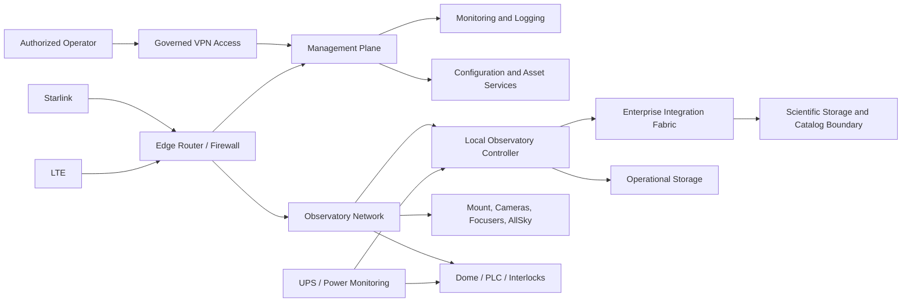
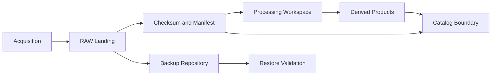

# INF-REF-001 — Enterprise Infrastructure Reference Architecture

| Campo | Valore |
|---|---|
| Identificativo | INF-REF-001 |
| Package | AP-009 |
| Stato | Proposed for independent ARB review |
| Data | 30/07/2026 |

## 1. Purpose

Questa reference architecture descrive la topologia logica target dell'infrastruttura Digital StarGate. È technology-neutral e non sostituisce gli schemi as-built.

## 2. Logical topology

## 3. Zones and trust boundaries

| Zona | Contenuto | Regola |
|---|---|---|
| WAN | provider Starlink/LTE | non trusted |
| Edge | routing, firewall, VPN | policy enforcement |
| Management | amministrazione e monitoring | accesso nominativo e auditato |
| Observatory | controller e dispositivi | nessun accesso Internet implicito |
| Safety-local | PLC, interlock, sensori critici | autorità locale, indipendente da cloud |
| Data | operational/scientific storage | accesso per ruolo e checksum |

La segmentazione fisica o VLAN è una scelta implementativa da validare; il confine logico è obbligatorio.

## 4. Connectivity model

- WAN primaria e secondaria sono provider intercambiabili.
- Il failover deve usare health check end-to-end e uno stato esplicito.
- Il failback non deve interrompere azioni di protezione.
- VPN è il percorso ordinario per amministrazione remota.
- DNS e NTP sono dipendenze registrate e monitorate.
- Perdita di entrambi i WAN produce isolamento controllato, non perdita dell'autorità locale.

## 5. Compute model

Il Local Observatory Controller ospita orchestrazione e adapter locali ma non sostituisce PLC e interlock. Servizi aggiuntivi devono dichiarare CPU, memoria, storage, porte, account, dipendenze, restart policy, patching, backup e rollback.

## 6. Storage model

Binary asset e metadati sono separati. Ogni asset scientifico deve essere riferibile tramite identificatore stabile, checksum e provenance. La tecnologia definitiva è demandata ad AP-013.

## 7. Power and environmental model

- power path e carichi critici devono essere inventariati;
- UPS state e autonomia devono essere osservabili;
- shutdown controllato deve evitare corruzione dati;
- PLC/interlock devono mantenere la possibilità di protezione;
- temperatura e condizioni ambientali del compute/storage sono monitorate.

## 8. Platform services

Servizi candidati:

- time synchronization;
- monitoring e alerting;
- centralized logging;
- configuration inventory;
- certificate e secret references;
- notification gateway;
- backup scheduler;
- health aggregation.

L'adozione di un prodotto non altera i contratti architetturali.

## 9. Degraded modes

| Evento | Modalità attesa |
|---|---|
| perdita WAN primaria | failover verso WAN secondaria |
| perdita di entrambe le WAN | controllo locale e protezione; accesso remoto indisponibile |
| perdita monitoring centrale | operatività locale con telemetry buffer; stato enterprise `unknown` |
| storage scientifico non disponibile | acquisizione limitata dalla capacità locale; nessuna perdita silenziosa |
| compute degradation | stop controllato delle funzioni non essenziali |
| perdita alimentazione | UPS, chiusura/protezione e shutdown secondo hazard controls |

## 10. Operational controls

- change record e rollback per modifiche infrastrutturali;
- maintenance window per attività intrusive;
- configuration drift detection;
- backup age e restore success come SLI;
- capacity review periodica;
- spare e obsolescence register;
- runbook collegato a ogni alert critico.

## 11. Validation checklist

- [ ] inventario as-built verificato;
- [ ] diagramma rete e trust boundary verificati;
- [ ] failover e failback WAN testati;
- [ ] perdita WAN totale testata;
- [ ] UPS e shutdown/recovery testati;
- [ ] restore con checksum eseguito;
- [ ] clock synchronization verificata;
- [ ] alert collegati a owner e runbook;
- [ ] capacity baseline misurata;
- [ ] recovery drill documentato.

## 12. Known gaps

Questa reference architecture non prova la configurazione reale, l'effettiva autonomia UPS, il failover WAN, la capacità disponibile o la recuperabilità dei backup. Tali elementi richiedono evidence nel repository.