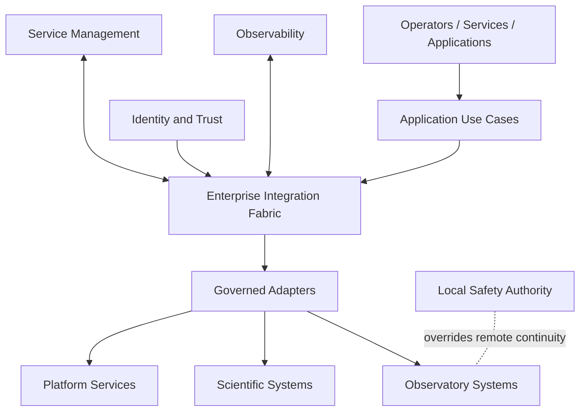
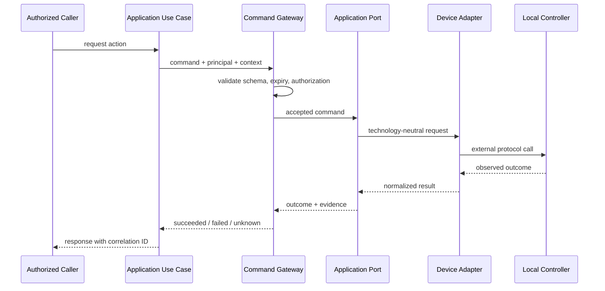
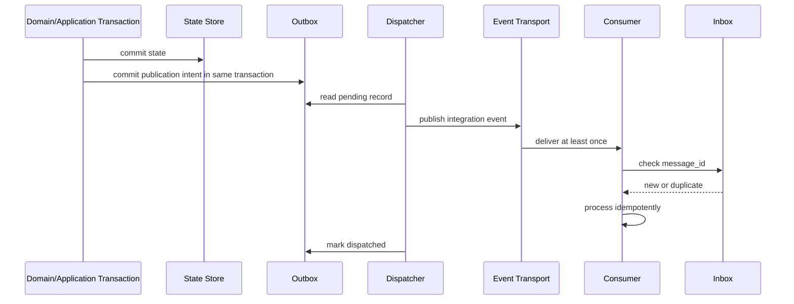
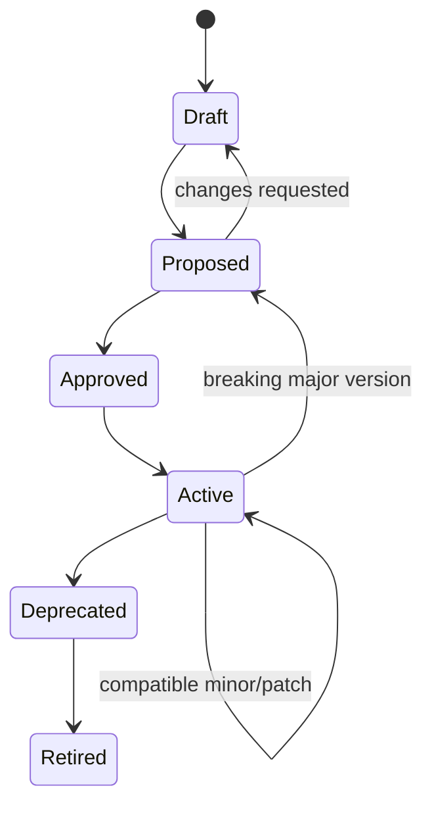
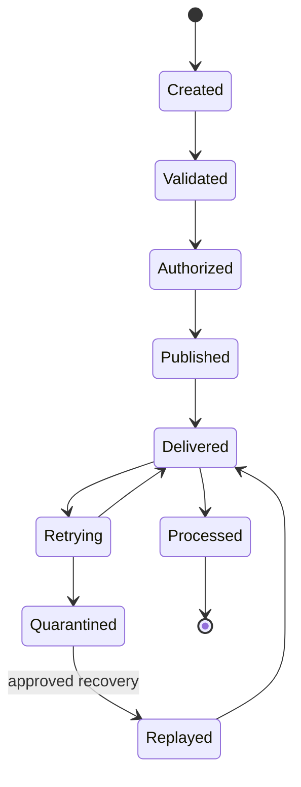

# Enterprise Integration Reference Architecture

| Campo | Valore |
|---|---|
| Documento | Enterprise Integration Reference Architecture |
| Identificativo | INT-REF-001 |
| Package | AP-008 |
| Repository | `maininimassimo-bit/digital-stargate-manual` |
| Branch | `main` |
| Data | 30/07/2026 |
| Stato | Approved with Conditions — technology-neutral reference; runtime unverified |

## Current disposition\n\nThis reference architecture is accepted as the AP-008 design baseline with conditions. It does not certify a live transport or runtime adapter. The current SessionCompleted transport proposal is documented separately and remains not operationally authorized.\n\n## 1. Scopo

Questa reference architecture traduce AP-008 in boundary, componenti logici, flussi, contratti e gate riutilizzabili. È technology-neutral e non certifica alcuna integrazione runtime.

## 2. Vista di contesto



## 3. Container logici

| Container | Responsabilità | Non responsabilità |
|---|---|---|
| Contract Registry | schema, owner, versioni, compatibility e lifecycle | autorizzare comandi runtime |
| API Boundary | request/reply, policy, validation e rate control | logica di dominio |
| Event Boundary | publication, subscription, routing e replay controllato | trasformare eventi in comandi impliciti |
| Command Gateway | authorization, expiry, anti-replay e outcome tracking | sostituire interlock locali |
| Integration Orchestrator | processi lunghi e compensazioni motivate | coordinare ogni chiamata semplice |
| Adapter Runtime | traduzione protocollo/modello esterno | possedere il Domain |
| Outbox Dispatcher | pubblicazione affidabile da outbox | creare fatti di dominio |
| Inbox/Deduplication | duplicate detection e idempotency | promettere exactly-once fisico |
| Dead-Letter Quarantine | isolamento e recovery governato | cancellare errori senza evidence |
| Reconciliation Service | confronto tra fonti e gestione divergenze | scegliere arbitrariamente una fonte |
| Integration Telemetry | trace, metriche, health e freshness | dichiarare stato safe |

## 4. Flusso command



`accepted` non significa `succeeded`. Se l'outcome non è verificabile, lo stato è `unknown` e si applica il runbook.

## 5. Flusso event con outbox



## 6. State machine del contratto



## 7. State machine del messaggio



Per eventi che non richiedono authorization, `Validated` conduce direttamente a `Published`.

## 8. Boundary per sistemi esterni

| Sistema | Adapter candidate | Direzione iniziale | Vincoli |
|---|---|---|---|
| N.I.N.A. | `ADP-NINA-001` | telemetry/session metadata first | nessun controllo safety implicito |
| PHD2 | `ADP-PHD2-001` | guide telemetry and events | freshness e disconnect espliciti |
| CPWI | `ADP-CPWI-001` | mount state read-first | comandi solo dopo threat/safety review |
| Dome/PLC | `ADP-DOME-001` | state and alarms first | interlock locale autorevole |
| Weather | `ADP-WX-001` | observations/events | dato stale non è safe |
| AllSky | `ADP-ALLSKY-001` | images/health metadata | binary by reference |
| PixInsight | `ADP-PIX-001` | processing manifest import | manual steps e versioni preservati |
| Storage | `ADP-STORAGE-001` | manifest/checksum/reconciliation | URI e retention da AP-009/AP-013 |
| GitHub | `ADP-GH-001` | documentation/config evidence | token least privilege |

## 9. Contract envelope

```yaml
contract_id: DSG.Observation.Event.SessionCompleted
contract_version: 1.0.0
message_id: 21882a7e-0000-4000-8000-000000000001
occurred_at: 2026-07-30T20:00:00+02:00
published_at: 2026-07-30T20:00:02+02:00
correlation_id: 21882a7e-0000-4000-8000-000000000010
causation_id: null
producer: nina-adapter
subject: observation-session/OBS-2026-0001
schema_uri: dsg://contracts/observation/session-completed/1.0.0
classification: internal
freshness: current
trace_context: {}
payload:
  session_id: OBS-2026-0001
  result: completed
```

## 10. Error model

Errori canonici:

| Categoria | Esempi | Trattamento |
|---|---|---|
| Validation | schema o campo non valido | reject, nessun retry |
| Authentication | identità assente/non valida | reject e security log |
| Authorization | azione non permessa | reject e audit |
| Conflict | idempotency o versione | return conflict/reconcile |
| Transient | timeout, dipendenza temporanea | bounded retry |
| Permanent | capability non supportata | fail, nessun retry |
| Safety blocked | interlock o policy locale | reject/abort, escalation secondo impatto |
| Unknown outcome | connessione persa dopo invio | non ripetere ciecamente; verify/reconcile |

## 11. Compatibility rules

Compatibili per default:

- aggiunta di campo opzionale;
- nuovo enum solo se consumer ignora valori sconosciuti;
- nuovo evento distinto;
- chiarimento documentale senza cambio semantico.

Breaking:

- rimozione o rinomina di campo;
- cambio tipo o unità;
- campo opzionale reso obbligatorio;
- cambio semantico o authorization behavior;
- diversa garanzia di ordering o delivery.

## 12. Integration SLI candidate

- successful request ratio;
- p50/p95/p99 latency;
- event publication delay;
- oldest queued message age;
- dead-letter rate;
- duplicate rate;
- adapter availability;
- stale-state ratio;
- reconciliation divergence count;
- command outcome unknown rate.

Valori SLO numerici richiedono baseline misurata e owner.

## 13. Failure scenarios obbligatori

1. adapter non raggiungibile;
2. risposta persa dopo esecuzione comando;
3. evento duplicato;
4. messaggi fuori ordine;
5. schema incompatibile;
6. credenziale scaduta;
7. coda piena o storage indisponibile;
8. dead-letter non processata;
9. clock skew e timestamp inattendibile;
10. stato esterno stale;
11. perdita connettività Starlink/LTE;
12. riavvio durante sincronizzazione;
13. conflitto catalogo/storage;
14. interlock locale che rifiuta il comando.

## 14. Readiness gate

```yaml
integration_readiness_id: IRR-YYYY-NNNN
integration_id: DSG-INT-XXX
contract_owner: string
adapter_owner: string
contracts_approved: []
compatibility_tested: boolean
security_reviewed: boolean
safety_relevance: non_safety|safety_relevant|unknown
failure_tests: []
runbooks_verified: []
telemetry_verified: boolean
rollback_or_disable_verified: boolean
reconciliation_verified: boolean
decision: READY|READY_WITH_CONDITIONS|NOT_READY
conditions: []
evidence: []
```

## 15. Pilot reference

Il primo pilot deve essere non safety-critical:

```text
N.I.N.A. session metadata
  -> N.I.N.A. Adapter
  -> SessionCompleted integration event
  -> consumer inbox/idempotency
  -> warehouse or portal projection
  -> integration telemetry
  -> reconciliation report
```

Exit criteria:

- schema versionato e owner assegnato;
- duplicate e replay testati;
- failure mapping verificato;
- freshness visibile;
- no secret nei log;
- runbook e ORR completati;
- rollback/disable path provato.

## 16. Package gates successivi

| Package | Dipendenza da INT-REF-001 |
|---|---|
| AP-009 | deployment, broker/gateway, network zones, capacity e backup |
| AP-010 | command safety class, hazard controls e evidence |
| AP-011 | analytics ingestion contracts e data-quality events |
| AP-012 | BFF, live protocol, freshness e command governance |
| AP-013 | binary transfer, manifest, checksum e storage events |
| AP-014 | search/query, PixInsight sync e reconciliation |
| AP-015 | knowledge ingestion, citation e conflict reconciliation |

## 17. Acceptance criteria

- container e boundary logici definiti;
- flussi command ed event distinti;
- outbox/inbox e dead-letter rappresentati;
- adapter candidate e vincoli documentati;
- compatibility, error e readiness model definiti;
- pilot non safety-critical identificato;
- nessuna dipendenza da un prodotto specifico.

## 18. Validazioni non eseguite

- rendering Mermaid mediante renderer;
- parsing automatico YAML;
- contract/schema test;
- test con N.I.N.A., PHD2, CPWI, PixInsight o dispositivi;
- threat model e penetration test;
- failure injection, replay e reconciliation;
- build MkDocs strict.