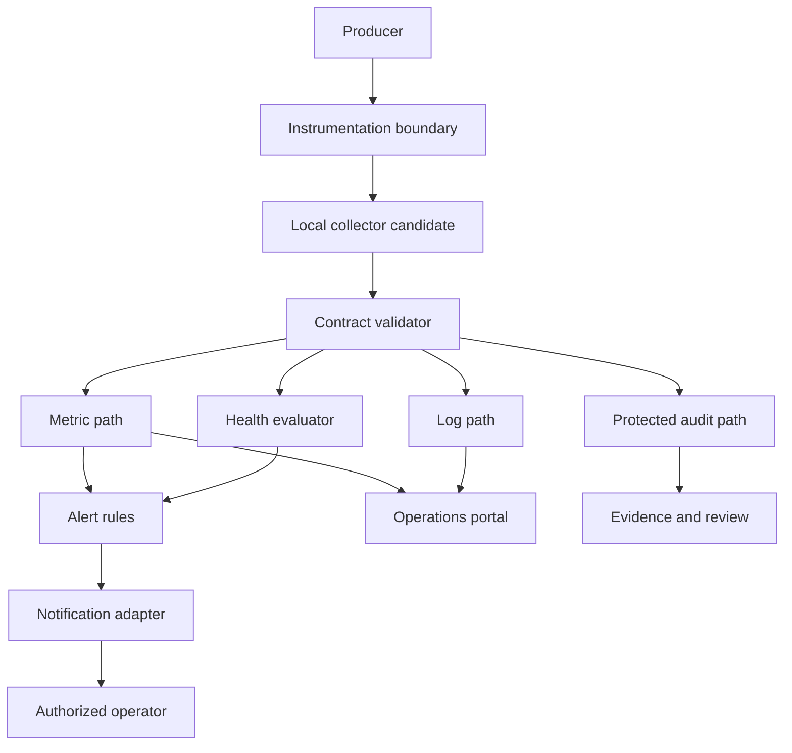

# Enterprise Observability Reference Architecture

| Campo | Valore |
|---|---|
| Documento | Enterprise Observability Reference Architecture |
| Package | AP-004 |
| Repository | `maininimassimo-bit/digital-stargate-manual` |
| Branch | `main` |
| Data | 30/07/2026 |
| Stato | Proposed for independent ARB review |

## 1. Purpose

Questa reference architecture traduce AP-004 in boundary, componenti, contratti e flussi verificabili. Non certifica prodotti, protocolli, deployment, soglie, retention o operatività continua.

## 2. Logical components

| Componente | Responsabilità | Non responsabilità |
|---|---|---|
| Instrumentation Boundary | produrre signal conformi al contratto | dipendere da backend vendor nel Domain |
| Local Collector Candidate | ricevere, validare, bufferizzare e inoltrare | dichiarare safety o stato fisico |
| Contract Validator | verificare schema, versione e campi obbligatori | correggere semanticamente dati errati |
| Metric Store Candidate | conservare serie aggregate | essere audit authority |
| Log Store Candidate | ricerca diagnostica | sostituire audit protetto |
| Audit Store Candidate | conservare evidence append-only | comandare dispositivi |
| Health Evaluator | valutare liveness, readiness, dependency e freshness | dichiarare `SAFE` o `CLOSED` |
| Alert Evaluator | creare alert da regole deliberate | eseguire implicitamente remediation fisica |
| Notification Adapter | consegnare notifiche e registrare l'esito | considerare consegna una risoluzione |
| Operations Portal | visualizzare e correlare | controllare hardware direttamente |

## 3. Data flow



## 4. Correlation chain

```text
Operator or Scheduler
  -> Command
  -> Application decision
  -> Adapter request
  -> Adapter response
  -> Local physical confirmation when applicable
  -> Audit event
  -> Metric/log projection
  -> Alert or operational review
```

La catena deve usare identificatori di correlazione e causazione. La presenza di un evento nella catena non prova automaticamente il successo del passaggio successivo.

## 5. Health tree

```text
Platform health
  Application health
  Adapter health
  Data pipeline health
  Collection health
  Storage health
  Notification health
  Local device status observation
```

Gli elementi non devono essere appiattiti in un unico booleano. Lo stato dei dispositivi è un'osservazione; gli interlock locali restano autoritativi.

## 6. Contract boundaries

### Metric record

```text
metric_name
schema_version
occurred_at_utc
source_component
value
unit
labels
quality
correlation_id
```

### Structured event

```text
event_name
schema_version
occurred_at_utc
observed_at_utc
source_component
severity
correlation_id
causation_id
result
properties
classification
```

### Health report

```text
component
check_name
status
checked_at_utc
fresh_until_utc
dependencies
reason
correlation_id
```

### Audit event

```text
audit_event_id
event_type
actor
role
action
reason
occurred_at_utc
source
correlation_id
causation_id
declared_result
confirmation_reference
classification
integrity_reference
evidence_locator
```

Gli schema sono modelli candidati e devono essere versionati e allineati ad AP-002 prima dell'implementazione.

## 7. Trust boundaries

1. Producer zone: applicazioni e adapter autorizzati.
2. Collection zone: ingestion, validation, buffering e rate control.
3. Storage zone: metric, log e audit separati secondo classificazione.
4. Operations zone: query, dashboard, alert e runbook.
5. Governance zone: evidence, retention, access review e release decision.
6. Local safety zone: controller, finecorsa, E-stop e interlock indipendenti.

Nessun flusso dalla Operations zone alla Local safety zone è implicito. Ogni comando deve attraversare i boundary applicativi di AP-003.

## 8. Degraded modes

### Collector unavailable

- il producer continua entro un budget di buffering validato;
- la perdita o il drop sono misurati esplicitamente;
- gli audit critici seguono una policy più restrittiva;
- nessun segnale mancante viene interpretato come stato normale.

### Remote connectivity unavailable

- raccolta locale quando disponibile e verificata;
- operazioni remote degradate;
- safety locale invariata;
- reconciliation dopo il ripristino.

### Clock unreliable

- i signal sono marcati con qualità temporale degradata;
- ordering e latency non sono considerati affidabili;
- gli eventi safety-relevant richiedono review.

### Storage pressure

- rate control e retention secondo priorità deliberate;
- audit e fault critici protetti;
- drop e sampling registrati;
- nessuna cancellazione silenziosa.

### Notification unavailable

- alert resta aperto;
- consegna fallita è auditata;
- fallback ed escalation sono eseguiti solo se configurati e testati.

## 9. Alert severity candidate model

| Severity | Significato candidato | Azione minima |
|---|---|---|
| Critical | rischio immediato o perdita di controllo/visibilità critica | escalation secondo runbook validato |
| High | servizio o capability degradata con impatto operativo rilevante | acknowledgement e mitigazione |
| Medium | anomalia che richiede analisi | presa in carico pianificata |
| Low | informazione diagnostica o trend | osservazione/review |

Le soglie e i tempi non sono definiti finché non vengono misurati e deliberati.

## 10. Evidence chain

Ogni test o decisione deve collegare:

```text
Requirement -> Contract -> Instrumentation -> Test -> Result -> Artifact -> Commit/Build -> Review -> Release decision
```

AP-004 deve supportare le validation matrix di ARB-004 e ARB-005 senza sostituirle.

## 11. Pilot acceptance

Un pilot end-to-end deve almeno dimostrare:

- schema validation;
- correlation completa;
- rilevazione signal assente/stale;
- buffering e recovery;
- drop/backpressure osservabili;
- accesso segregato;
- alert open/acknowledge/resolve;
- collegamento al runbook;
- evidence locator immutabile;
- nessun impatto su Domain, device control o interlock locali.

## 12. Open issues

- inventory dei producer e signal esistenti;
- stack, protocolli e deployment;
- autenticazione dei producer;
- capacità di buffering locale;
- cardinalità e volumi;
- schema e integrità degli audit;
- SLI, SLO e soglie;
- retention e disposal;
- routing e fallback delle notifiche;
- disponibilità continua e backup;
- owner e RACI;
- release target e quality gate.

## 13. Traceability

- [AP-004 — Enterprise Telemetry and Observability Architecture](packages/AP-004-Enterprise-Telemetry-and-Observability-Architecture.md)
- [AP-002 — Enterprise Data Governance](packages/AP-002-Enterprise-Data-Governance.md)
- [AP-003 — Observatory Automation Architecture](packages/AP-003-Observatory-Automation-Architecture.md)
- [ARB-004 — Independent Review of AP-002](assessments/ARB-004-AP-002-Independent-Architecture-Review.md)
- [ARB-005 — Independent Review of AP-003](assessments/ARB-005-AP-003-Independent-Architecture-Review.md)
- [Architecture Traceability Register](traceability-register.md)
