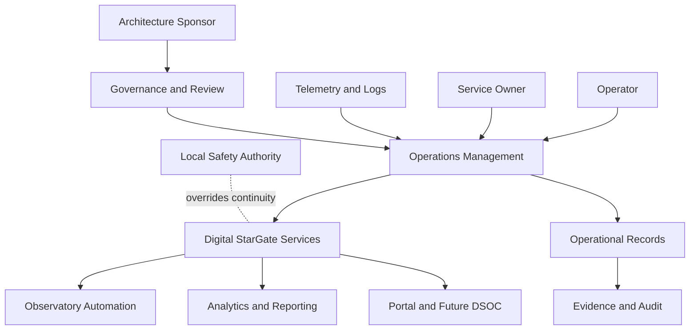
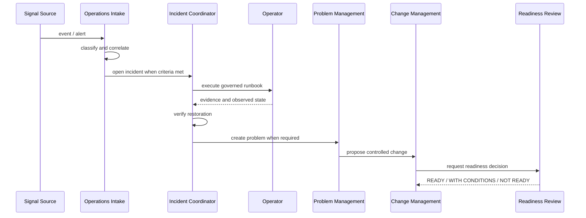
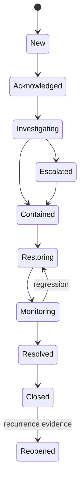
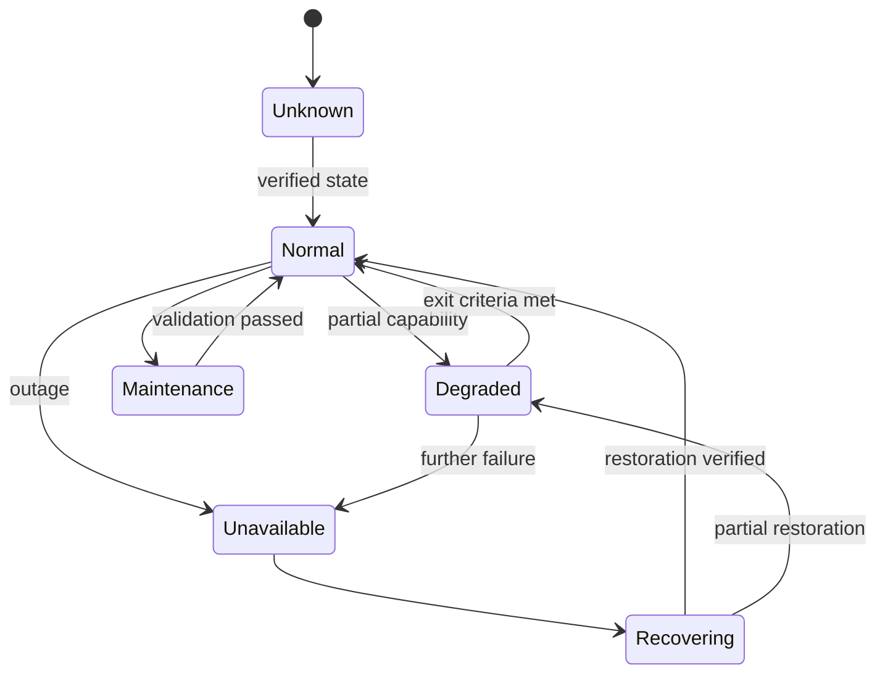
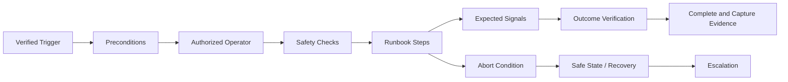

# Enterprise Operations and Service Management Reference Architecture

| Campo | Valore |
|---|---|
| Documento | Enterprise Operations and Service Management Reference Architecture |
| Identificativo | OPS-REF-001 |
| Package | AP-007 |
| Repository | `maininimassimo-bit/digital-stargate-manual` |
| Branch | `main` |
| Data | 30/07/2026 |
| Stato | Proposed for independent ARB review |

## 1. Scopo

Questa reference architecture traduce AP-007 in boundary, flussi e registri operativi riutilizzabili. Non seleziona un prodotto ITSM e non certifica l'operatività continua.

## 2. Vista di contesto



## 3. Container logici

| Container logico | Responsabilità | Non responsabilità |
|---|---|---|
| Service Registry | servizi, owner, criticality, dipendenze e modalità | CMDB fisica completa |
| Operations Intake | eventi, alert, richieste e triage | safety decision automatica |
| Incident Management | contenimento, restoration, timeline ed escalation | root cause non verificata |
| Problem Management | cause, known error, workaround e remediation | change non approvato |
| Change Coordination | impatto service-level, finestra e readiness | gestione CI, governata da AP-006 |
| Runbook Registry | procedure versionate e test evidence | esecuzione privilegiata implicita |
| Readiness Registry | gate e decisioni READY/CONDITIONAL/NOT READY | certificazione safety |
| Operational Evidence | audit, KPI, timeline e review | sorgente primaria dei RAW scientifici |

## 4. Flusso operativo end-to-end



## 5. State machine dell'incidente



La chiusura richiede verifica del servizio; il semplice cessare di un alert non basta.

## 6. State machine del servizio



`Unknown` è uno stato operativo esplicito e non può essere interpretato come `Normal` o `Safe`.

## 7. Contratti minimi

### Incident Record

```yaml
incident_id: INC-YYYY-NNNN
service_id: DSG-SVC-XXX
severity: SEV-1|SEV-2|SEV-3|SEV-4
status: new|acknowledged|investigating|contained|restoring|monitoring|resolved|closed
safety_relevance: true|false|unknown
detected_at: timestamp
acknowledged_at: timestamp|null
restored_at: timestamp|null
correlation_id: string
owner: string
observed_state: string
containment: string
runbook_id: string|null
evidence: []
related_problem: string|null
related_change: string|null
```

### Problem Record

```yaml
problem_id: PRB-YYYY-NNNN
related_incidents: []
status: open|investigating|known-error|resolved|closed
root_cause_status: verified|hypothesis|unknown
root_cause: string|null
workaround: string|null
risk: string
proposed_changes: []
evidence: []
```

### Operational Readiness Record

```yaml
readiness_id: ORR-YYYY-NNNN
service_id: DSG-SVC-XXX
release_or_change: string
owner: string
decision: READY|READY_WITH_CONDITIONS|NOT_READY
conditions: []
runbooks_verified: []
monitoring_verified: boolean
backup_verified: boolean
rollback_verified: boolean
security_review: string
safety_review: string
residual_risks: []
evidence: []
```

## 8. Matrice di escalation

| Condizione | Escalation minima |
|---|---|
| SEV-1 o safe state non verificabile | Operator → Incident Coordinator → Safety Authority → Sponsor |
| SEV-2 mission-critical | Operator → Service Owner → Technical Owner |
| security event | Operator → Security Authority → Service Owner |
| failed emergency change | Change Approver → Incident Coordinator → Safety/Security secondo impatto |
| repeated incident | Incident Coordinator → Problem Owner → Architecture review se sistemico |

Nomi e contatti concreti restano `DA VALIDARE` fino a nomina formale.

## 9. Runbook execution boundary



Lo script può assistere un runbook, ma non ne sostituisce ownership, authorization, abort criteria o verifica fisica quando richiesta.

## 10. Readiness gate per package futuri

| Package | Gate operativo richiesto da AP-007 |
|---|---|
| AP-008 | ownership dei contratti, retry, failure handling e support model |
| AP-009 | recovery, backup, capacity, failover e maintenance model |
| AP-010 | emergency response, safety evidence ed exercise |
| AP-011 | KPI ownership, data issue process e support model |
| AP-012 | incident console, freshness, escalation e command governance |
| AP-013/AP-014 | storage operations, reconciliation e data-loss response |
| AP-015 | index freshness, conflict handling e knowledge reconciliation |

## 11. Pilot raccomandato

Primo pilot su un servizio non safety-critical, ad esempio la pubblicazione del portale o la pipeline di reportistica:

1. creare Service Record;
2. assegnare owner;
3. definire SLI osservabili;
4. simulare incidente;
5. eseguire runbook;
6. aprire eventuale Problem Record;
7. applicare change controllato;
8. completare readiness review;
9. produrre evidence annex.

Solo dopo il pilot il modello può essere esteso ai servizi mission-critical.

## 12. Acceptance criteria

- boundary e container logici definiti;
- state machine incident e service definite;
- contratti minimi pubblicati;
- escalation e runbook boundary espliciti;
- readiness gate collegati ai package futuri;
- safety locale indipendente;
- nessuna dipendenza da un prodotto ITSM specifico.

## 13. Validazioni non eseguite

- simulazione operativa;
- parsing automatico YAML;
- test Mermaid mediante renderer;
- integrazione con telemetry reale;
- test di escalation, recovery o degraded mode;
- build MkDocs strict.