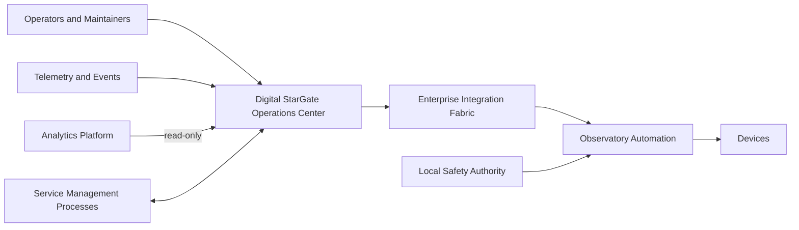
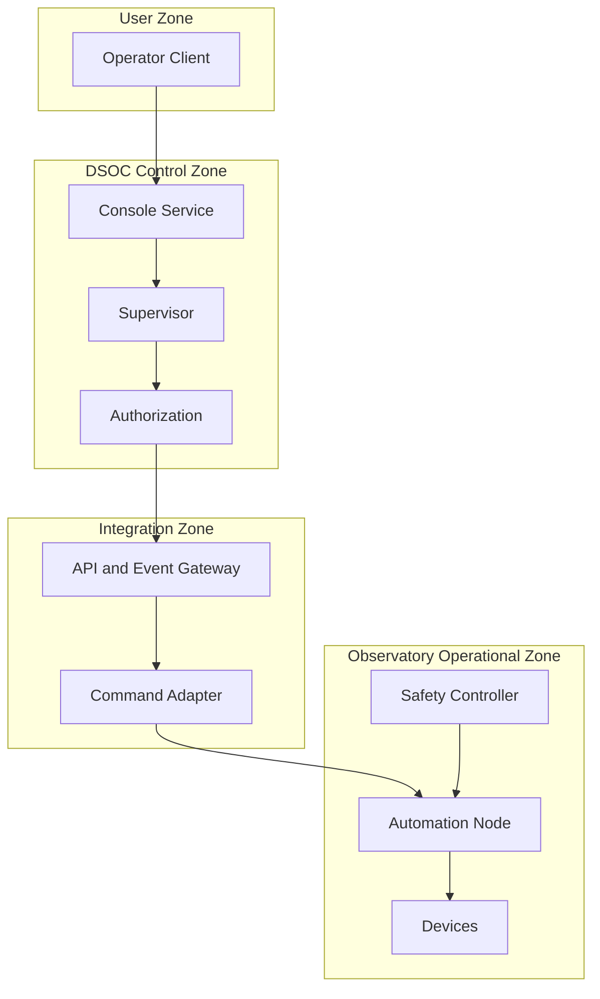

# OPSC-REF-001 — Enterprise Operations Center Reference Architecture

| Campo | Valore |
|---|---|
| Identificativo | OPSC-REF-001 |
| Titolo | Enterprise Operations Center Reference Architecture |
| Package | AP-012 |
| Stato | Draft baseline — Sprint AP-012.1 |
| Data | 30/07/2026 |
| Autorità | Digital StarGate Chief Architect |

## 1. Obiettivo

OPSC-REF-001 definisce la reference architecture del Digital StarGate Operations Center (DSOC), con particolare attenzione alla separazione tra supervisione, coordinamento operativo, autorizzazione dei comandi, integrazione, safety ed evidence.

La reference architecture non prescrive un prodotto specifico e non abilita automaticamente alcun comando verso l'osservatorio.

## 2. Architectural context

## 3. Layer model

### 3.1 Experience layer

- Operator Console;
- Maintenance Console;
- Incident Coordination View;
- Session View;
- Audit and Evidence View.

### 3.2 Coordination layer

- Operations Supervisor;
- Session Manager;
- Workflow Engine;
- Alarm Coordinator;
- Incident Coordinator;
- Maintenance Coordinator;
- Handover Manager.

### 3.3 Control governance layer

- Command Authorization Service;
- Policy Decision Point;
- Approval Service;
- Privileged Session Controller;
- Break-glass Controller;
- Command Registry.

### 3.4 Integration layer

- API Gateway;
- Event Gateway;
- Command Adapter;
- Telemetry Adapter;
- Notification Adapter;
- ITSM/CMDB Adapter.

### 3.5 Safety layer

- local interlock;
- weather safety logic;
- roof and mount safety logic;
- safe-state controller;
- emergency stop and manual override.

### 3.6 Evidence layer

- audit event collector;
- correlation service;
- immutable evidence reference;
- operational telemetry;
- reporting and analytics feed.

## 4. Component responsibilities

| Componente | Responsabilità primaria | Non responsabilità |
|---|---|---|
| Operator Console | presenta stato e raccoglie intenti | non decide safety |
| Operations Supervisor | coordina workflow e stato operativo | non comanda device direttamente |
| Session Manager | governa lifecycle sessione | non forza readiness |
| Alarm Coordinator | aggrega, classifica e presenta alert | non chiude incident automaticamente |
| Incident Coordinator | timeline, ruoli, escalation e restoration | non sostituisce AP-007 |
| Maintenance Coordinator | lock, finestra, attività e return-to-service | non modifica baseline senza AP-006 |
| Command Authorization Service | verifica policy e rilascia autorizzazione scoped | non esegue il comando |
| Integration Fabric | trasporta API, eventi e comandi | non decide autorizzazione o safety |
| Safety Plane | permit, deny, stop e safe state | non dipende dal DSOC per restare efficace |
| Audit Service | registra evidence e correlation | non interpreta evidence come certificazione |

## 5. Trust boundaries

Ogni attraversamento richiede autenticazione del sistema, integrità del messaggio, correlation ID, policy version e audit.

## 6. Canonical interaction patterns

### 6.1 Read-only observation

1. telemetry prodotta dal dominio operativo;
2. adapter valida source, schema e timestamp;
3. DSOC espone stato e freshness;
4. operator vede `current`, `stale` o `unknown`;
5. nessun canale di ritorno è implicito.

### 6.2 Authorized command

1. operator formula una command request;
2. DSOC valida contesto e stato;
3. Command Authorization applica policy e approvazioni;
4. Integration Fabric esegue dispatch con idempotency key;
5. Automation verifica Safety Plane;
6. risultato ed evidence ritornano al DSOC.

### 6.3 Safety denial

1. comando autorizzato dal DSOC arriva all'automazione;
2. Safety Plane nega o interrompe;
3. l'esito `blocked_by_safety` è definitivo per quella richiesta;
4. il DSOC non effettua retry automatico non autorizzato;
5. operator e incident workflow ricevono evidence.

### 6.4 Loss of telemetry

1. freshness supera la soglia;
2. stato diventa `stale` o `unknown`;
3. le operazioni dipendenti sono bloccate;
4. viene avviato il runbook appropriato;
5. il sistema resta fail-safe.

## 7. Data and contract model

Entità minime:

- `OperationalState`;
- `SessionContext`;
- `AlarmRecord`;
- `IncidentReference`;
- `MaintenanceLock`;
- `CommandRequest`;
- `CommandAuthorization`;
- `CommandExecutionResult`;
- `ApprovalRecord`;
- `AuditEvent`;
- `HandoverRecord`.

Ogni contratto deve dichiarare schema version, producer, consumer, compatibility policy, classification, retention e owner.

## 8. State freshness model

| Stato | Significato | Uso per comando |
|---|---|---|
| `current` | dato entro soglia validata | consentito se altre policy soddisfatte |
| `stale` | dato oltre soglia | bloccato salvo procedura specifica |
| `unknown` | assente o non verificabile | bloccato |
| `conflicting` | sorgenti incoerenti | bloccato e incident candidate |

Le soglie numeriche sono `DA VALIDARE` mediante baseline e test.

## 9. Availability and failure model

La perdita di un componente DSOC non deve compromettere la capacità locale di:

- mantenere o raggiungere lo stato sicuro;
- usare interlock fisici;
- eseguire emergency stop;
- impedire comandi non autorizzati.

Il DSOC deve gestire:

- console unavailable;
- authorization unavailable;
- integration unavailable;
- telemetry delayed;
- duplicate response;
- partial workflow failure;
- clock drift;
- audit sink unavailable;
- notification failure.

## 10. Security architecture

- mutual authentication tra servizi;
- strong authentication per operatori;
- RBAC/ABAC combinati per comandi;
- step-up authentication per classi elevate;
- token scoped a command, target e scadenza;
- encryption in transit e at rest secondo classificazione;
- privileged access workstation o sessione controllata;
- deny by default;
- segregazione tra ambienti e ruoli;
- tamper-evident audit.

## 11. Observability architecture

Ogni componente espone:

- health tecnico;
- readiness operativo;
- dependency state;
- latency ed error rate;
- queue depth e oldest item age;
- clock status;
- audit delivery status;
- configuration version.

Gli health endpoint non sostituiscono la verifica dello stato fisico dell'osservatorio.

## 12. Deployment options

### Option A — Centralized DSOC

Console e servizi centrali su un nodo controllato. Semplice, ma richiede attenzione al single point of failure.

### Option B — Split control and presentation

Presentation remota, authorization e integration vicine al dominio operativo. È il modello preferito per ridurre dipendenze WAN.

### Option C — Redundant coordination

Servizi coordinativi ridondati con leader election e command deduplication. Ammessa solo dopo test di split-brain e recovery.

La scelta definitiva appartiene alla fase di solution design e deve rispettare AP-009.

## 13. Recommended baseline

La baseline raccomandata è:

- presentation remota;
- authorization e integration in zona operativa controllata;
- Safety Plane locale e indipendente;
- audit replicato con buffering locale;
- analytics solo read-only;
- workflow inizialmente guidati, non autonomi;
- command enablement progressivo C0/C1 prima di C2–C4.

## 14. Validation scenarios

1. visualizzazione read-only senza command route;
2. comando autorizzato e completato;
3. comando negato per ruolo;
4. comando scaduto;
5. comando bloccato da Safety Plane;
6. duplicate command con idempotency;
7. telemetry stale;
8. console disconnected durante esecuzione;
9. audit sink temporaneamente indisponibile;
10. break-glass con post-review;
11. recovery del coordination service;
12. handover tra operatori.

## 15. Architecture guard rails

- nessun direct device access;
- nessuna authorization implicita da possesso della console;
- nessun retry infinito;
- nessun comando da dashboard analytics;
- nessuna interpretazione di `unknown` come safe;
- nessun bypass safety tramite ruolo amministrativo;
- nessuna chiusura incidente basata solo sulla cessazione dell'alert;
- nessuna dichiarazione di HA o recovery senza test.

## 16. Disposizione

OPSC-REF-001 costituisce la baseline di riferimento di AP-012 Sprint AP-012.1. Le scelte tecnologiche, le soglie e i deployment target restano aperti. L'adozione runtime richiede OPSC-CMD-001, gli artefatti AP-012.2, validazione e decisione ARB-012.