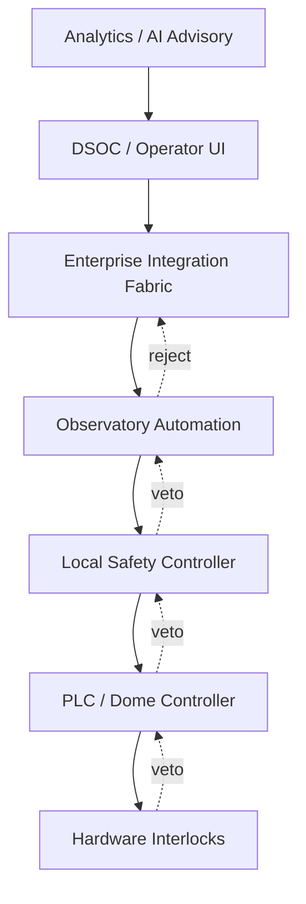
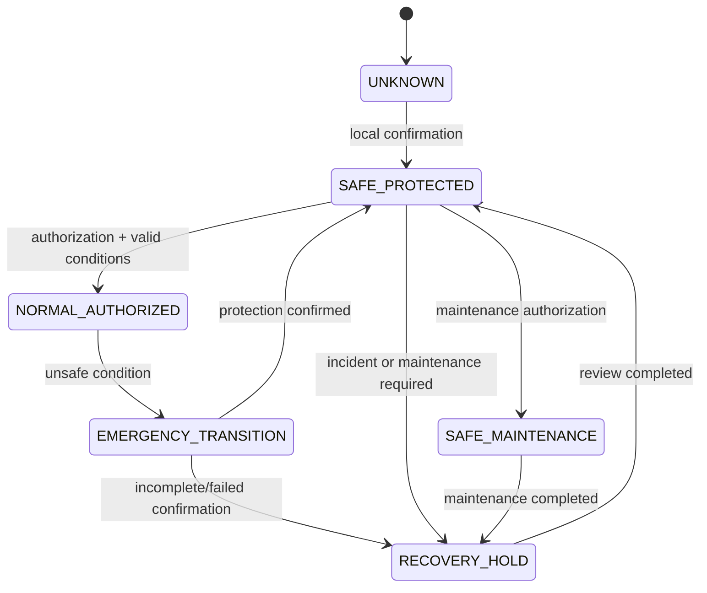

# SAF-REF-001 — Enterprise Safety Reference Architecture

| Campo | Valore |
|---|---|
| Identificativo | SAF-REF-001 |
| Package | AP-010 |
| Stato | Proposed for independent ARB review |
| Data | 30/07/2026 |

## 1. Purpose

Questa reference architecture definisce il modello logico di safety, le autorità e i flussi di veto/protezione. Non costituisce certificazione di impianto.

## 2. Authority chain

Le frecce continue rappresentano richieste; i veto risalgono la catena e non possono essere ignorati dai livelli superiori.

## 3. Safety decision model

Una richiesta safety-relevant attraversa:

1. authentication e authorization;
2. verifica freshness e completezza dati;
3. valutazione precondizioni;
4. applicazione degli inhibitor locali;
5. esecuzione controllata;
6. conferma tramite sensori appropriati;
7. pubblicazione dell'outcome;
8. ingresso in recovery hold in caso di anomalia.

## 4. State machine

## 5. Safety channels

| Canale | Ruolo | Requisito |
|---|---|---|
| sensing | rileva condizioni | health e freshness |
| decision | applica regole e veto | deterministico e versionato |
| actuation | esegue movimento/protezione | timeout e feedback |
| confirmation | verifica outcome | sorgente adeguata e indipendente dove possibile |
| audit | registra richiesta/decisione/outcome | correlazione e integrità |
| notification | informa operatori | non sostituisce il controllo locale |

## 6. Failure handling

- sensor failure: stato `unknown`, nuove azioni rischiose inibite;
- conflicting sensors: escalation e policy conservativa;
- communication loss: protezione locale, stato remoto `unknown`;
- actuator timeout: stop/abort e recovery hold;
- duplicate command: idempotenza e outcome precedente verificabile;
- power loss: sequenza governata da hazard controls;
- controller restart: nessuna ripartenza automatica di azioni rischiose;
- audit failure: operazione critica inibita quando l'audit è requisito di controllo.

## 7. Safety case structure

Il safety case incrementale deve collegare:

- claim;
- argument;
- hazard;
- control;
- verification evidence;
- validation evidence;
- assumptions;
- limitations;
- owner e approvatore.

## 8. Operational integration

AP-007 gestisce incident, escalation, runbook e readiness. AP-008 trasporta contratti e outcome. AP-009 garantisce fault domain e local autonomy. AP-010 mantiene la precedenza safety e richiede evidence per ogni collegamento.

## 9. Minimum validation scenarios

- unsafe weather during open state;
- stale or missing weather data;
- WAN loss and total remote isolation;
- application controller crash;
- duplicate or expired command;
- incomplete close confirmation;
- mount/dome positional conflict;
- power degradation;
- manual override expiry;
- restart after emergency.

## 10. Constraints

- nessun cloud dependency nel percorso minimo di protezione;
- nessuna UI o AI è autorità safety;
- nessun successo è dedotto dalla sola accettazione del comando;
- nessun ritorno automatico a normal operation dopo un'emergenza;
- nessuna soglia è considerata approvata senza fonte e owner.

## 11. Evidence status

Tutti gli scenari di validazione sono attualmente **non eseguiti** nel contesto di questo package. Il documento definisce il target e i criteri, non prova il comportamento reale.