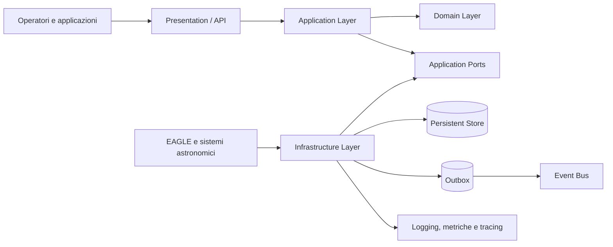

# Digital StarGate Enterprise Reference Architecture

**Identificatore:** DSG-SW-201  
**Titolo breve:** Enterprise Vision and Principles  
**Stato:** Draft  
**Versione:** 0.1  
**Release di riferimento:** 2.0

## 1. Executive Summary

Digital StarGate evolve da manuale tecnico e piattaforma di pubblicazione dell'osservatorio remoto a piattaforma software governata, capace di acquisire, conservare, elaborare e distribuire informazioni operative e scientifiche in modo affidabile.

La Release 1.5 ha introdotto la Developer Foundation, i contratti canonici e il primo vertical slice `ObservationSession`. La Release 2.0 consolida questa base definendo l'architettura enterprise e introducendo progressivamente persistenza durevole, Domain Events, integrazione asincrona, osservabilità e controlli operativi.

La presente Enterprise Reference Architecture stabilisce i principi e i vincoli entro i quali devono essere progettate le capability della piattaforma. Non prescrive l'implementazione completa di tutte le componenti future, ma definisce una baseline comune, verificabile e tracciabile.

## 2. Mission della piattaforma

La missione di Digital StarGate è fornire un sistema coerente per:

- governare le sessioni osservative e il loro ciclo di vita;
- rappresentare lo stato operativo dell'osservatorio;
- integrare dati provenienti da EAGLE, automazione, meteo e software astronomico;
- preservare la storia tecnica e scientifica delle osservazioni;
- applicare controlli di qualità prima della pubblicazione o dell'analisi;
- rendere disponibili dati, eventi e indicatori tramite contratti versionati;
- supportare evoluzioni progressive senza compromettere sicurezza e continuità operativa.

## 3. Contesto e driver

L'architettura deve rispondere ai seguenti driver:

1. **Operatività remota.** L'osservatorio può funzionare senza presenza locale e deve reagire in modo prevedibile a condizioni non sicure.
2. **Tracciabilità.** Stato, decisioni, eventi e trasformazioni dei dati devono poter essere ricostruiti.
3. **Affidabilità dei dati.** I dati tecnici e scientifici devono essere validati, versionati e conservati con responsabilità chiare.
4. **Evoluzione incrementale.** Nuove capability devono essere introdotte mediante vertical slice controllati.
5. **Separazione delle responsabilità.** Il dominio non deve dipendere da database, framework web o sistemi esterni.
6. **Interoperabilità.** Contratti API ed Event devono restare espliciti e compatibili.
7. **Operabilità.** Ogni componente rilevante deve esporre segnali sufficienti per diagnosi, monitoraggio e recovery.
8. **Sicurezza.** Le funzioni di comando e automazione devono rispettare autorizzazione, principio del minimo privilegio e fail-safe.

## 4. Obiettivi architetturali

### 4.1 Obiettivi della Release 2.0

- definire i confini dei principali domini della piattaforma;
- formalizzare il modello a layer e le regole di dipendenza;
- sostituire la persistenza InMemory della Capability 001 con una persistenza durevole;
- introdurre Domain Events senza accoppiare il dominio al trasporto;
- predisporre una strategia Outbox per la pubblicazione affidabile;
- mantenere i contratti canonici come confine pubblico della piattaforma;
- integrare health check, logging strutturato e metriche tecniche;
- mantenere ogni modifica tracciabile tramite ADR, roadmap e release notes.

### 4.2 Obiettivi non inclusi nella baseline

La baseline non implica automaticamente:

- adozione immediata di microservizi;
- orchestrazione Kubernetes;
- Event Sourcing completo;
- controllo diretto di N.I.N.A., ASCOM o PHD2;
- funzioni AI autonome con autorità operativa;
- alta disponibilità geografica.

Questi elementi possono essere valutati solo quando esiste un driver misurabile e una decisione architetturale approvata.

## 5. Principi architetturali

### AP-01 — GitHub come sorgente ufficiale

Codice, contratti, documentazione, configurazioni versionabili e decisioni architetturali hanno nel repository GitHub la propria sorgente ufficiale. Gli artefatti generati devono essere riproducibili a partire da contenuti versionati.

### AP-02 — Domain first

Le regole che descrivono sessioni, osservatorio, sicurezza operativa e qualità dei dati appartengono al Domain Layer. Il dominio non dipende da EF Core, API, code di messaggi o SDK esterni.

### AP-03 — Dipendenze dirette verso l'interno

Le dipendenze di compilazione puntano verso i layer più stabili. Presentation e Infrastructure possono dipendere da Application e Domain; Domain non dipende da Infrastructure o Presentation.

### AP-04 — Contratti espliciti e versionati

Command, Query, DTO, API ed Event pubblici sono definiti nei contratti canonici. Le modifiche incompatibili richiedono una nuova versione o una strategia di migrazione documentata.

### AP-05 — Persistenza sostituibile

Il modello di dominio non incorpora dettagli del database. Le interfacce di persistenza sono definite nei confini applicativi appropriati e implementate dall'Infrastructure Layer.

### AP-06 — Eventi affidabili ma non impliciti

Un Domain Event rappresenta un fatto avvenuto nel dominio. La pubblicazione esterna avviene solo dopo il commit della transazione e attraverso un meccanismo affidabile, preferibilmente Outbox.

### AP-07 — Sicurezza e safety by design

Le decisioni relative alla sicurezza fisica dell'osservatorio prevalgono sulla continuità di una sequenza scientifica. In condizioni incerte il sistema deve convergere verso uno stato sicuro.

### AP-08 — Osservabilità come requisito funzionale

Logging, metriche, correlation identifier e health check non sono aggiunte opzionali. Devono essere progettati insieme alla capability e consentire di distinguere errore applicativo, errore infrastrutturale e condizione operativa.

### AP-09 — Evoluzione mediante vertical slice

Ogni incremento deve attraversare i layer necessari e produrre valore verificabile. Sono da evitare grandi infrastrutture speculative prive di una capability utilizzatrice.

### AP-10 — Automazione con controllo umano

Le funzioni automatiche devono essere verificabili, interrompibili e dotate di audit. Le azioni irreversibili o ad alto impatto richiedono controlli espliciti e, quando opportuno, approvazione umana.

### AP-11 — Configurazione esterna e segreti separati

La configurazione varia per ambiente e non deve essere incorporata nel codice. I segreti non devono essere archiviati in chiaro nel repository.

### AP-12 — Documentazione come parte del prodotto

Una capability non è completa se architettura, contratti, runbook, test e release notes non riflettono il comportamento implementato.

## 6. Quality Attributes

| Attributo | Obiettivo | Evidenza attesa |
| --- | --- | --- |
| Affidabilità | Evitare perdita o duplicazione non controllata degli eventi | transazioni, Outbox, idempotenza, test di recovery |
| Manutenibilità | Isolare dominio e infrastruttura | test architetturali, dependency rules, DI esplicita |
| Tracciabilità | Ricostruire una sessione e le sue decisioni | correlation ID, audit, eventi, stato persistito |
| Sicurezza | Limitare accessi e comandi | autenticazione, autorizzazione, secrets management |
| Safety | Portare l'osservatorio in stato sicuro | regole fail-safe, interlock, procedure di emergenza |
| Interoperabilità | Integrare componenti eterogenei | OpenAPI, JSON Schema, contratti versionati |
| Operabilità | Diagnosticare rapidamente i guasti | health check, metriche, log strutturati, runbook |
| Portabilità | Evitare dipendenze non necessarie dall'ambiente | containerizzazione selettiva, configurazione esterna |
| Testabilità | Verificare regole senza infrastruttura reale | unit test del dominio, test applicativi e di integrazione |

## 7. Modello concettuale della piattaforma

Il diagramma rappresenta la direzione logica delle dipendenze e dei flussi. Il Domain Layer conserva le regole principali; l'Infrastructure Layer implementa persistenza, integrazioni ed emissione dei segnali operativi.

## 8. Confini iniziali

La Release 2.0 riconosce come candidati iniziali i seguenti confini funzionali:

- **Observation Management:** piano, sessione, target e risultati osservativi;
- **Observatory Operations:** stato dell'osservatorio e risorse disponibili;
- **Safety and Weather:** condizioni ambientali, valutazione safe/unsafe e interlock;
- **Automation:** coordinamento delle procedure operative e dei comandi;
- **Analytics and Quality:** validazione, indicatori e prodotti derivati;
- **Platform Governance:** configurazione, identità tecnica, audit e contratti.

La classificazione è una baseline di analisi. La conferma come Bounded Context e l'eventuale separazione fisica richiedono ulteriori evidenze e ADR dedicate.

## 9. Vincoli

- La Capability 001 `ObservationSession` rimane il primo vertical slice di riferimento.
- I contratti pubblici della Release 1.5 non devono essere modificati in modo incompatibile senza versionamento.
- La persistenza deve supportare migrazioni ripetibili e ambienti separati.
- La pubblicazione degli Event non deve avvenire prima del commit dei dati correlati.
- Le integrazioni con componenti astronomici devono essere protette da adapter e timeout espliciti.
- La documentazione MkDocs deve restare compilabile in modalità strict.

## 10. Tracciabilità

| Elemento | Collegamento |
| --- | --- |
| Baseline precedente | Release 1.5 – Developer Edition |
| Capability di riferimento | Capability 001 – Observation Session |
| Modello dei layer | `solution-layers.md` |
| Confini di dominio | `bounded-contexts.md` |
| Composition Root e DI | `dependency-injection.md` |
| Decisione sui layer | ADR-005 |
| Decisione sulla persistenza | ADR-006 |
| Decisione sugli eventi | ADR-007 |
| Pianificazione | Capitolo 33 – Roadmap evolutiva |

## 11. Questioni aperte

- scelta definitiva del motore relazionale per gli ambienti operativi;
- granularità effettiva dei Bounded Context;
- tecnologia dell'Event Bus e requisiti di delivery;
- confine tra telemetria tecnica e dati scientifici;
- modello di identità per operatori, agent e servizi;
- requisiti di retention, backup e disaster recovery del database applicativo.

Le questioni aperte non bloccano la definizione della baseline, ma devono essere risolte prima delle relative implementazioni.