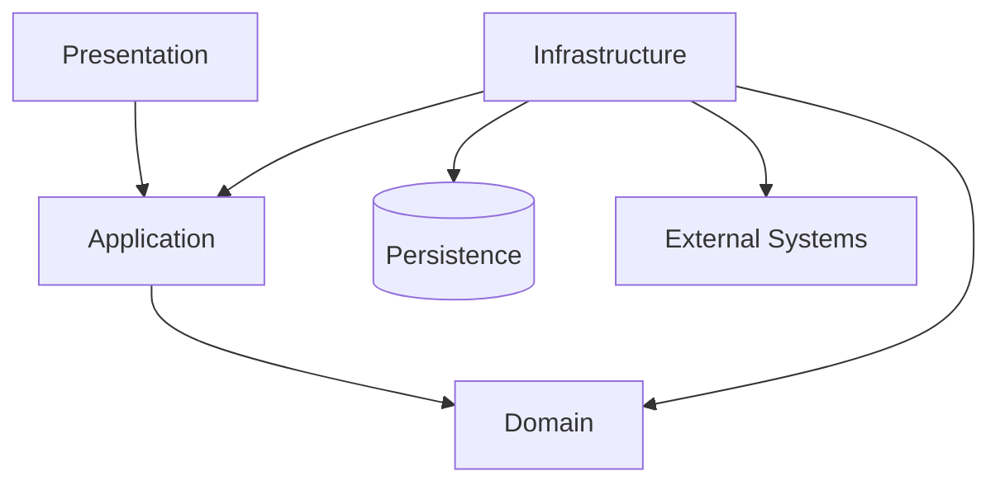
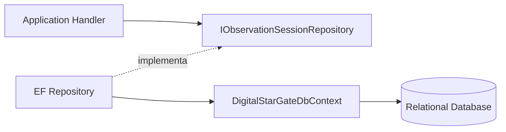
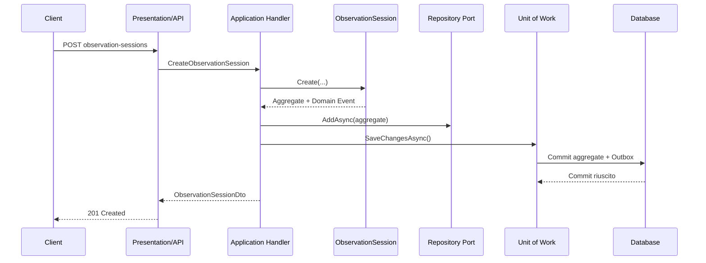
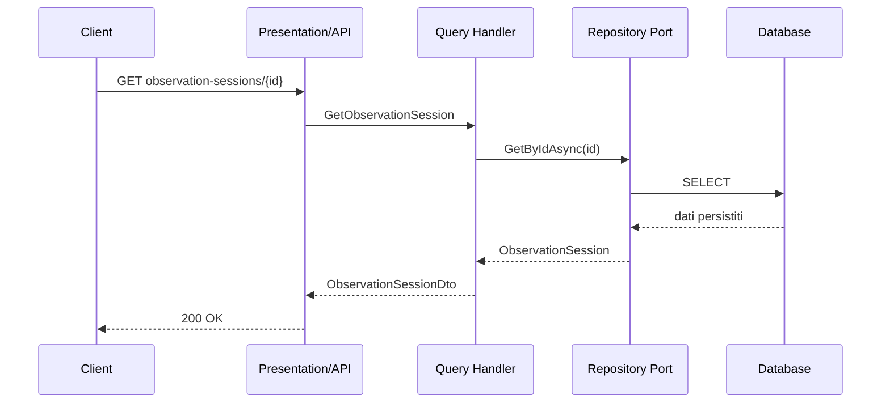

# Solution Layers

**Identificatore:** DSG-SW-202  
**Stato:** Draft  
**Versione:** 0.1  
**Release di riferimento:** 2.0

## 1. Scopo

Questo documento definisce la struttura logica della soluzione Digital StarGate, le responsabilità dei layer, le dipendenze consentite e i criteri di separazione tra dominio, casi d'uso e infrastruttura.

La baseline applica i principi di Clean Architecture in modo pragmatico. L'obiettivo non è moltiplicare i progetti software, ma proteggere il modello di dominio e rendere sostituibili database, trasporti, framework web e integrazioni esterne.

## 2. Modello dei layer



Le frecce rappresentano dipendenze di compilazione o implementazione, non necessariamente il flusso runtime. Il codice più esterno può dipendere dai layer interni; il Domain Layer non dipende dai dettagli infrastrutturali.

## 3. Regola fondamentale delle dipendenze

La dipendenza deve puntare verso il codice più stabile e più vicino alle regole del dominio.

```text
Presentation  ───────► Application ───────► Domain
Infrastructure ─────► Application ───────► Domain
Infrastructure ───────────────────────────► Domain
```

Sono vietate le seguenti dipendenze:

```text
Domain         ─X─► Application
Domain         ─X─► Infrastructure
Domain         ─X─► Presentation
Application    ─X─► Presentation
Application    ─X─► implementazioni concrete di Persistence
```

## 4. Presentation Layer

### 4.1 Responsabilità

Il Presentation Layer espone le capability della piattaforma agli attori esterni attraverso API, interfacce utente, CLI o altri adapter di ingresso.

Contiene:

- endpoint HTTP e routing;
- mapping tra protocollo e Command/Query;
- autenticazione e applicazione delle policy di autorizzazione;
- gestione delle risposte HTTP e dei codici di stato;
- validazioni esclusivamente sintattiche o di protocollo;
- gestione del `CorrelationId` in ingresso e in uscita;
- configurazione dell'host e Composition Root.

### 4.2 Non deve contenere

- regole di dominio;
- query SQL o accesso diretto al database;
- logica di persistenza;
- orchestrazioni complesse dei casi d'uso;
- dipendenze dirette dagli SDK dei sistemi astronomici, salvo adapter di protocollo isolati.

### 4.3 Esempio Capability 001

```text
POST /api/v1/observation-sessions
    -> CreateObservationSession
    -> CreateObservationSessionHandler
```

L'endpoint riceve la richiesta, costruisce il Command e delega l'esecuzione all'Application Layer.

## 5. Application Layer

### 5.1 Responsabilità

L'Application Layer implementa i casi d'uso e coordina il lavoro del dominio e delle porte infrastrutturali.

Contiene:

- Command e Query interni o riferimenti ai contratti canonici;
- handler dei casi d'uso;
- orchestrazione delle transazioni applicative;
- validazione applicativa;
- autorizzazioni dipendenti dal caso d'uso;
- interfacce verso repository, unit of work, clock, identity, event publisher e servizi esterni;
- mapping tra oggetti di dominio e DTO;
- gestione dell'idempotenza quando richiesta dal caso d'uso.

### 5.2 Non deve contenere

- implementazioni EF Core;
- SQL o dettagli del motore relazionale;
- chiamate dirette a code, broker o SDK esterni;
- regole invarianti che appartengono agli Aggregati;
- riferimenti all'host HTTP.

### 5.3 Application Ports

Le interfacce richieste dai casi d'uso sono definite nel confine interno appropriato. Esempi:

```csharp
public interface IObservationSessionRepository
{
    Task AddAsync(ObservationSession session, CancellationToken cancellationToken);
    Task<ObservationSession?> GetByIdAsync(
        ObservationSessionId id,
        CancellationToken cancellationToken);
}

public interface IUnitOfWork
{
    Task<int> SaveChangesAsync(CancellationToken cancellationToken);
}
```

Le implementazioni concrete appartengono all'Infrastructure Layer.

## 6. Domain Layer

### 6.1 Responsabilità

Il Domain Layer rappresenta il linguaggio e le regole fondamentali della piattaforma.

Contiene:

- Entity;
- Aggregate Root;
- Value Object;
- Domain Service quando una regola non appartiene naturalmente a una singola Entity;
- Domain Event;
- invarianti e transizioni di stato;
- eccezioni di dominio;
- tipi e policy indipendenti dall'infrastruttura.

### 6.2 Regole

Il Domain Layer deve:

- essere testabile senza database, rete o host web;
- evitare attributi e dipendenze specifici di EF Core quando non indispensabili;
- utilizzare tipi di dominio al posto di primitive prive di significato;
- impedire la creazione di stati non validi;
- registrare Domain Events come fatti del dominio, senza pubblicarli direttamente.

### 6.3 Non deve contenere

- `DbContext`, migrazioni o configurazioni SQL;
- controller, endpoint o tipi HTTP;
- implementazioni di logging;
- client N.I.N.A., ASCOM, PHD2 o altri SDK;
- dipendenze da broker o librerie di messaging;
- logica di serializzazione dei contratti pubblici.

## 7. Infrastructure Layer

### 7.1 Responsabilità

L'Infrastructure Layer implementa le porte richieste da Application e integra la piattaforma con risorse esterne.

Contiene:

- repository concreti;
- `DbContext`, mapping ORM e migrazioni;
- implementazione della Unit of Work;
- Outbox e dispatcher degli Integration Event;
- adapter verso sistemi astronomici e servizi remoti;
- implementazioni di clock, file system, email o storage;
- logging sink, telemetry exporter e health check infrastrutturali;
- registrazione dei servizi infrastrutturali nella Dependency Injection.

### 7.2 Regole

- l'Infrastructure Layer può dipendere da Application e Domain;
- deve rispettare i contratti delle porte interne;
- non deve duplicare invarianti del dominio;
- deve applicare timeout, retry e circuit breaker solo dove appropriato;
- deve tradurre errori tecnici in risultati o eccezioni comprensibili all'Application Layer;
- non deve esporre direttamente Entity persistenti come contratti API.

## 8. Persistence come responsabilità infrastrutturale

La persistenza non costituisce un layer di business autonomo. È una responsabilità dell'Infrastructure Layer con artefatti dedicati:

- modello relazionale;
- configurazioni delle Entity;
- migrazioni;
- repository;
- transazioni;
- Outbox;
- procedure di backup e restore.

Il database è un dettaglio esterno rispetto al Domain Layer.



## 9. Contracts

`DigitalStarGate.Contracts` rappresenta il confine pubblico e versionato della piattaforma. Può contenere:

- request e response DTO;
- Command/Query canonici destinati all'interoperabilità;
- Integration Event;
- error contract;
- schema e metadati di correlazione.

I Contracts non devono contenere:

- Entity o Aggregate Root;
- interfacce di repository;
- implementazioni applicative;
- dipendenze dall'ORM;
- dettagli di sicurezza o configurazione specifici dell'host.

La compatibilità dei Contracts è governata separatamente dalla struttura interna della soluzione.

## 10. Flusso di scrittura

Il flusso previsto per la creazione di una `ObservationSession` nella Release 2.0 è:



La pubblicazione esterna dell'evento avviene successivamente al commit attraverso il dispatcher Outbox.

## 11. Flusso di lettura



Per query analitiche future potrà essere adottato un read model dedicato, senza obbligare la Release 2.0 a introdurre CQRS fisico completo.

## 12. Matrice delle responsabilità

| Concern | Presentation | Application | Domain | Infrastructure |
| --- | --- | --- | --- | --- |
| Routing HTTP | Sì | No | No | No |
| Autenticazione host | Sì | No | No | Supporto |
| Orchestrazione use case | No | Sì | No | No |
| Invarianti | No | Supporto | Sì | No |
| Repository interface | No | Sì | No, salvo motivazione | No |
| Repository implementation | No | No | No | Sì |
| EF Core / SQL | No | No | No | Sì |
| Domain Event | No | Coordina | Definisce | Persiste/pubblica |
| Integration Event | Espone | Mappa | No | Pubblica |
| Logging tecnico | Host | Coordina contesto | No | Implementa sink |
| DTO pubblici | Usa | Mappa | No | No |
| Adapter sistemi esterni | No | Usa porta | No | Sì |

## 13. Struttura logica raccomandata

```text
src/
├── DigitalStarGate.Contracts/
├── DigitalStarGate.Domain/
├── DigitalStarGate.Application/
├── DigitalStarGate.Infrastructure/
└── DigitalStarGate.Api/

tests/
├── DigitalStarGate.Domain.Tests/
├── DigitalStarGate.Application.Tests/
├── DigitalStarGate.Infrastructure.Tests/
└── DigitalStarGate.Architecture.Tests/
```

La struttura è una baseline. La separazione in assembly distinti è raccomandata quando aiuta a rendere verificabili le regole di dipendenza.

## 14. Regole verificabili

I quality gate della soluzione devono includere, progressivamente:

1. `Domain` non referenzia `Application`, `Infrastructure` o `Api`.
2. `Application` non referenzia `Infrastructure` o `Api`.
3. `Contracts` non referenzia progetti interni di implementazione.
4. gli endpoint non accedono direttamente al `DbContext`.
5. i repository concreti non sono utilizzati direttamente dagli handler.
6. gli Integration Event non includono Entity di dominio.
7. le migrazioni appartengono al progetto infrastrutturale designato.
8. ogni dipendenza esterna è incapsulata da un adapter o client dedicato.

Tali regole possono essere implementate con test architetturali e controlli CI.

## 15. Transizione dalla Release 1.5

La Capability 001 della Release 1.5 utilizza persistenza e pubblicazione Event InMemory. Il flusso attuale è:

```text
API
  -> CreateObservationSessionHandler
  -> ObservationSession
  -> IObservationSessionRepository
  -> IPlatformEventPublisher
  -> SessionCreated
```

La Release 2.0 mantiene il caso d'uso e i contratti, ma modifica le implementazioni esterne:

```text
API
  -> CreateObservationSessionHandler
  -> ObservationSession
  -> IObservationSessionRepository
  -> IUnitOfWork
  -> Database + Outbox
  -> Outbox Dispatcher
  -> Event Bus
```

L'obiettivo è evitare modifiche incompatibili agli endpoint già documentati:

```text
POST /api/v1/observation-sessions
GET  /api/v1/observation-sessions/{id}
GET  /health
```

## 16. Decisioni differite

Non sono definite in questo documento:

- la scelta definitiva del motore database;
- la libreria di messaging;
- l'adozione di MediatR o framework equivalenti;
- la separazione in processi o microservizi;
- la topologia di deployment;
- il read model analitico.

Queste decisioni richiedono ADR specifiche e devono essere motivate da requisiti misurabili.

## 17. Tracciabilità

| Elemento | Riferimento |
| --- | --- |
| Visione e principi | `overview.md` |
| Confini di dominio | `bounded-contexts.md` |
| Dependency Injection | `dependency-injection.md` |
| Decisione architetturale | ADR-005 – Layered Clean Architecture |
| Persistenza | ADR-006 – Persistence Strategy |
| Eventi | ADR-007 – Domain Event Strategy |
| Vertical slice | Capability 001 – Observation Session |
| Roadmap | Capitolo 33 – Roadmap evolutiva |

## 18. Criteri di accettazione

Il documento è considerato applicato quando:

- i progetti software rispettano le dipendenze definite;
- la Capability 001 può utilizzare una persistenza durevole senza modificare il Domain Layer per introdurre dettagli ORM;
- il commit dei dati e dell'Outbox avviene nella stessa transazione;
- gli endpoint non contengono regole di dominio o accesso diretto ai dati;
- i quality gate architetturali sono eseguibili in CI;
- la documentazione, gli ADR e la roadmap risultano coerenti con il modello dei layer.