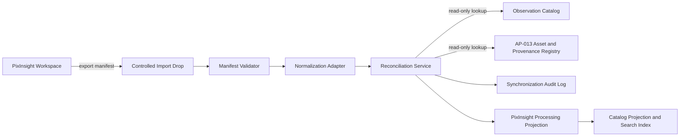
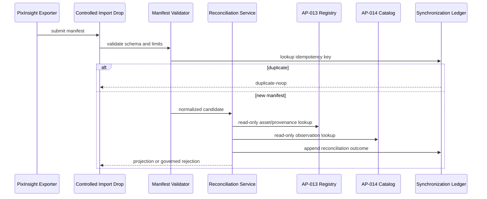

# AP14-W06 — PixInsight Synchronization Adapter

| Campo | Valore |
|---|---|
| Work Package | AP14-W06 |
| Architecture Package | AP-014 — Scientific Observation Catalog and Search |
| Titolo | PixInsight Synchronization Adapter |
| Stato | In development — solution baseline |
| Target release | RC3 |
| Autorità | Digital StarGate Chief Architect |
| Fonte autorevole | AP-014, AP-013 e relativi ADR |

## 1. Scopo

AP14-W06 definisce il boundary governato fra PixInsight e il Scientific Observation Catalog. L'adapter importa manifest e metadata di processing come dati candidati, li valida, li riconcilia con gli identificatori e le fonti autorevoli di Digital StarGate e produce una proiezione auditabile senza concedere a PixInsight autorità su catalogo, asset, checksum, provenance o stato di acceptance.

## 2. Vincoli architetturali

- PixInsight è una fonte di integrazione, non un sistema autorevole.
- L'adapter non scrive direttamente nel Scientific Asset Registry di AP-013.
- Nessun import può promuovere automaticamente sessioni, processing run o prodotti a `accepted`.
- Checksum, storage locator e provenance autorevole restano sotto AP-013.
- Ogni sincronizzazione deve essere idempotente, deterministica, auditabile e riconciliabile.
- Valori assenti o non validati restano `unknown` o `unresolved`; non vengono inferiti.
- L'adapter non possiede credenziali privilegiate per dispositivi, GitHub o sistemi operativi dell'osservatorio.
- Il boundary non introduce alcuna autorità di controllo runtime su cupola, montatura, camere o altri dispositivi.

## 3. Contesto di soluzione



## 4. Componenti e responsabilità

| Componente | Responsabilità | Non responsabilità |
|---|---|---|
| `PixInsightManifestExporter` | esportare un manifest dichiarativo dal workspace PixInsight | pubblicare direttamente nel catalogo |
| `ControlledImportDrop` | ricevere pacchetti manifest in un'area controllata | eseguire script PixInsight |
| `ManifestValidator` | validare schema, versione, campi obbligatori e limiti | correggere o inventare metadata |
| `NormalizationAdapter` | convertire metadata XISF/FITS e riferimenti PixInsight nel contratto canonico | modificare asset o provenance AP-013 |
| `ReconciliationService` | correlare sessioni, acquisizioni, input/output e processing run con identificatori stabili | creare acceptance automatica |
| `SynchronizationLedger` | registrare idempotency key, digest, esito, timestamp e motivazioni | sostituire audit e registri autorevoli |
| `ProcessingProjectionWriter` | produrre una proiezione derivata per AP-014 | scrivere nei registri AP-013 |

## 5. Contratto del manifest

Il manifest è un documento dichiarativo versionato. Il formato fisico iniziale è JSON UTF-8; il contratto logico resta indipendente dal prodotto.

```json
{
  "schemaVersion": "1.0",
  "manifestId": "PXM-20260805T210000Z-001",
  "exportedAt": "2026-08-05T21:00:00Z",
  "source": {
    "product": "PixInsight",
    "productVersion": "unknown",
    "hostId": "unknown",
    "workspaceId": "unknown"
  },
  "observationContext": {
    "sessionId": "unknown",
    "target": "unknown",
    "projectId": "unknown",
    "campaignId": "unknown"
  },
  "processingRun": {
    "externalRunId": "unknown",
    "startedAt": null,
    "completedAt": null,
    "processes": [],
    "inputs": [],
    "outputs": [],
    "parameters": {}
  }
}
```

### 5.1 Campi governati

| Campo | Regola |
|---|---|
| `schemaVersion` | obbligatorio e supportato dall'adapter |
| `manifestId` | obbligatorio, stabile e univoco nel dominio di export |
| `exportedAt` | timestamp UTC dichiarato dalla fonte |
| `source.product` | deve identificare PixInsight senza attribuirgli autorità |
| `observationContext.sessionId` | candidato alla reconciliation; può essere `unknown` |
| `processingRun.inputs` | riferimenti dichiarati, non prova di integrità |
| `processingRun.outputs` | prodotti candidati, non automaticamente accettati |
| `parameters` | valori esportabili e non segreti; struttura versionata |

## 6. Identità e idempotenza

L'idempotency key è calcolata sui dati canonici normalizzati:

```text
idempotencyKey = SHA-256(schemaVersion + manifestId + canonicalPayloadDigest)
```

Regole:

1. stesso `idempotencyKey` e stesso payload: esito `duplicate-noop`;
2. stesso `manifestId` ma payload diverso: esito `conflict`, nessuna sovrascrittura;
3. nuovo manifest riconciliabile: nuova proiezione versionata;
4. nuovo manifest non riconciliabile: quarantena logica con stato `unresolved`;
5. retry dopo errore transitorio: riusa la stessa idempotency key.

## 7. Reconciliation

La reconciliation procede senza modificare le fonti autorevoli:

1. validazione dello schema;
2. normalizzazione di timestamp, identificatori e vocabolari;
3. ricerca esatta per identificatore stabile;
4. verifica read-only di asset e processing provenance in AP-013;
5. confronto dei riferimenti input/output;
6. classificazione dell'esito;
7. produzione della proiezione e dell'audit record.

### 7.1 Stati di reconciliation

| Stato | Significato |
|---|---|
| `matched` | tutti i riferimenti obbligatori sono correlati |
| `partially-matched` | correlazione valida ma incompleta |
| `unresolved` | mancano identificatori sufficienti |
| `conflict` | il manifest contraddice una fonte autorevole |
| `rejected` | schema o contenuto non ammesso |
| `duplicate-noop` | manifest già elaborato senza differenze |

Un record `conflict`, `unresolved` o `rejected` non entra nell'indice come prodotto accettato; può essere esposto solo come stato operativo o di qualità.

## 8. Audit record

Ogni tentativo produce un record immutabile contenente almeno:

- synchronization ID;
- manifest ID e schema version;
- digest del payload canonico;
- idempotency key;
- timestamp di ricezione e completamento;
- versione dell'adapter;
- esito di validazione e reconciliation;
- identificatori correlati;
- error code governato e messaggio non sensibile;
- conteggio input/output;
- fonte del pacchetto;
- eventuale record precedente superseded.

I log non devono contenere credenziali, token, path sensibili non necessari o contenuti binari degli asset.

## 9. Sequenza principale



## 10. Failure handling

| Failure | Comportamento |
|---|---|
| schema non supportato | reject, audit, nessuna proiezione |
| payload incompleto | unresolved o reject secondo il campo |
| riferimento asset assente | partially-matched o unresolved |
| conflitto checksum/provenance | conflict, AP-013 prevale |
| manifest duplicato | duplicate-noop |
| errore transitorio di lettura | retry limitato con stessa idempotency key |
| errore persistente | dead-letter logica e intervento operativo |
| payload oltre i limiti | reject prima della normalizzazione |

## 11. Sicurezza

- import pull-based o file-drop controllato; nessuna esecuzione remota di script ricevuti;
- allow-list delle versioni schema;
- validazione rigorosa di dimensione, encoding e tipi;
- nessun secret nel manifest;
- separazione fra area di ricezione, validazione e proiezione;
- audit degli operatori o processi che avviano l'import;
- least privilege e accesso read-only ai registri AP-013/AP-014;
- protezione da path traversal e riferimenti esterni non ammessi.

## 12. Osservabilità

Metriche minime:

- manifest ricevuti, accettati, duplicati, unresolved, conflict e rejected;
- durata di validazione e reconciliation;
- percentuale di match completo;
- retry e dead-letter;
- versione schema e adapter;
- lag fra `exportedAt` e sincronizzazione.

Eventi minimi:

- `PixInsightManifestReceived`;
- `PixInsightManifestValidated`;
- `PixInsightManifestRejected`;
- `PixInsightReconciliationCompleted`;
- `PixInsightProjectionUpdated`.

Gli eventi sono informativi e non attribuiscono autorità di acceptance.

## 13. Vertical slice di implementazione

| Slice | Contenuto | Acceptance |
|---|---|---|
| W06-S1 | schema manifest, validator e canonical digest | payload validi/invalidi verificabili e deterministici |
| W06-S2 | idempotency ledger e duplicate handling | retry e duplicati non creano nuove proiezioni |
| W06-S3 | reconciliation read-only con AP-013/AP-014 | match, partial, unresolved e conflict testati |
| W06-S4 | processing projection e audit events | proiezione ricostruibile e audit completo |
| W06-S5 | operational hardening | limiti, metriche, dead-letter e runbook |

## 14. Acceptance criteria AP14-W06

AP14-W06 può essere dichiarato completato quando:

- il manifest contract è versionato;
- la validazione rifiuta input non conformi senza effetti collaterali;
- l'idempotenza è dimostrata da test automatici;
- la reconciliation usa esclusivamente lookup read-only;
- conflitti con AP-013 sono registrati senza sovrascrittura;
- ogni tentativo produce audit evidence;
- nessun import può modificare acceptance, checksum o provenance autorevole;
- metriche e failure path sono verificati;
- la documentazione operativa e i test sono disponibili per AP14-W07.

## 15. Decisioni aperte

- formato definitivo dell'exporter PixInsight e modalità di packaging;
- localizzazione fisica del controlled import drop;
- retention del synchronization ledger;
- vocabolario governato dei processi PixInsight;
- limiti dimensionali e frequenza operativa;
- integrazione futura con i contratti runtime di AP-013.

Queste decisioni richiedono evidenza tecnica e, ove introducano variazioni architetturali, un ADR dedicato. Nessun valore operativo viene assunto in questo work package.

## 16. Traceability

| Elemento | Riferimento |
|---|---|
| Architecture Package | `docs/architecture/packages/AP-014-Scientific-Observation-Catalog-and-Search.md` |
| Evidence manifest | `.github/roadmap/evidence/AP-014.evidence.json` |
| Catalog projection | `.github/scripts/generate-scientific-catalog.mjs` |
| Search contract | `docs/javascripts/dsg-search-service.js` |
| Enterprise integration | `docs/javascripts/dsg-search-center.js` |
| Next package | AP14-W07 — Validation and Operational Acceptance |
