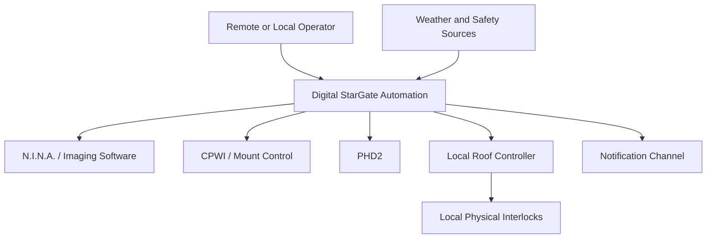
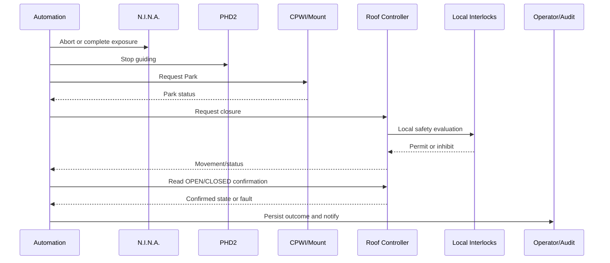

# Observatory Automation Reference Architecture

| Campo | Valore |
|---|---|
| Documento | Observatory Automation Reference Architecture |
| Package | AP-003 |
| Repository | `maininimassimo-bit/digital-stargate-manual` |
| Branch | `main` |
| Data | 30/07/2026 |
| Stato | Proposed for independent ARB review |

## 1. Purpose

Questa reference architecture traduce AP-003 in boundary, componenti, responsabilità e sequenze verificabili. Non certifica hardware, protocolli o runtime.

## 2. Architectural layers

### Domain

Contiene stati, invarianti e decisioni dell'automazione osservativa. Non dipende da N.I.N.A., CPWI, PHD2, ASCOM/Alpaca, rete, database o controller fisici.

### Application

Contiene use case, porte, orchestrazione, policy di retry/idempotenza e coordinamento delle conferme.

### Infrastructure

Contiene adapter verso software, driver, controller, rete, audit persistence e notification provider.

### Local safety layer

Comprende interlock, finecorsa, E-stop e logiche locali realmente presenti e verificate. È indipendente dalla disponibilità di Domain, Application, rete remota e cloud.

## 3. Bounded responsibilities

| Area | Responsabilità | Non responsabilità |
|---|---|---|
| Observation Session | lifecycle della sessione e coordinamento delle attività | controllo fisico diretto dei dispositivi |
| Weather Safety | normalizzazione e decisione `SAFE/WARNING/UNSAFE/UNKNOWN` | bypass degli interlock locali |
| Automation Orchestration | sequenze, prerequisiti, Command e compensazioni | dichiarazione dello stato fisico senza conferma |
| Device Adapters | traduzione verso API/driver verificati | regole di dominio |
| Operations | runbook, escalation, manual override e incident record | modifica implicita delle policy safety |

## 4. Ports and adapters

| Porta applicativa | Adapter candidato | Stato |
|---|---|---|
| `IObservationSequencePort` | N.I.N.A. | protocollo e capacità da verificare |
| `IMountControlPort` | CPWI / ASCOM | protocollo e capacità da verificare |
| `IGuideControlPort` | PHD2 | protocollo e capacità da verificare |
| `IRoofCommandPort` | controller copertura locale | controller e protocollo da verificare |
| `IRoofStatePort` | sensori `OPEN` / `CLOSED` | wiring e semantica da verificare |
| `IWeatherSafetyDecisionPort` | Weather Safety Interlock | ADR-005 Proposed |
| `ILocalInterlockStatusPort` | controller/interlock locale | inventario da verificare |
| `IOperationAuditPort` | audit store | implementazione da definire |
| `IOperatorNotificationPort` | canale operativo | canale e priorità da definire |

## 5. Context view

## 6. Closure sequence

Ogni risposta software deve essere distinta dalla conferma fisica. Se Park o stato della copertura non sono verificabili, la sequenza entra in fault ed esegue escalation secondo runbook.

## 7. State ownership

| Stato | Fonte autorevole |
|---|---|
| stato logico della sessione | application/session model |
| stato della guida | adapter PHD2 verificato |
| stato Park della montatura | adapter mount più verifica prevista dal runbook |
| stato fisico `OPEN/CLOSED` | sensori/controller locale verificati |
| decisione meteo applicativa | Weather Safety Interlock |
| autorizzazione/protezione fisica | interlock locali |
| stato di connettività | infrastructure health, mai safety authority |

## 8. Degraded modes

### Connectivity degraded

- nessuna nuova apertura automatica;
- operazioni remote sospese;
- safety locale invariata;
- stato applicativo marcato degraded;
- recovery dopo nuova lettura e riconciliazione degli stati.

### Telemetry degraded

- dato stale o mancante produce `UNKNOWN`;
- nessun falso `SAFE`;
- escalation operativa;
- nessuna deduzione automatica dello stato fisico.

### Device adapter degraded

- Command fallito o non confermato;
- retry limitato e idempotente solo se approvato dal runbook;
- compensazione e manual intervention quando lo stato è incerto.

### Local controller degraded

- struttura non dichiarata sicura;
- stop dell'orchestrazione automatica;
- intervento locale e fault record.

## 9. Commissioning matrix

| Area | Verifica minima |
|---|---|
| Sensori | coerenza `OPEN`, `CLOSED`, eventuale `SAFE`; rilevazione combinazioni impossibili |
| Montatura | Park confermato e inviluppo meccanico validato |
| Copertura | apertura, chiusura, arresto, chiusura parziale e finecorsa |
| Meteo | assenza dati, stale data, incoerenza, transizioni oscillanti |
| E-stop | autorità locale e impossibilità di forzatura applicativa |
| Manual override | identità, motivazione, scadenza e audit |
| Rete | perdita VPN/connettività durante stato stabile e durante transizione |
| Processo | arresto N.I.N.A./CPWI/PHD2/EAGLE e riconciliazione al restart |
| Alimentazione | comportamento documentato dei controller e stato al ripristino |
| Audit | correlazione completa Command-decision-confirmation-fault |

## 10. Recovery principles

1. Non dedurre mai lo stato corrente dall'ultimo Command inviato.
2. Rileggere le fonti locali autoritative.
3. Se lo stato resta incerto, mantenere `UNKNOWN/FAULT`.
4. Non riprendere automaticamente una sessione dopo evento safety-relevant.
5. Richiedere conferma manuale quando previsto da ADR-005 o runbook.
6. Conservare eventi, log e motivazione del recovery.

## 11. Open issues

- inventario effettivo dei controller, sensori e interlock;
- protocolli supportati e modalità di autenticazione;
- posizione Park validata;
- timeout e retry;
- comportamento in blackout;
- capacità locale in assenza di EAGLE;
- canali di notifica;
- frequenza dei test e owner delle esercitazioni;
- schema machine-readable degli stati e degli audit event;
- allineamento finale con AP-002 dopo ARB-004.

## 12. Traceability

- [AP-003 — Observatory Automation Architecture](packages/AP-003-Observatory-Automation-Architecture.md)
- [ADR-005 — Weather Safety Interlock](ADR-005-Weather-Safety-Interlock.md)
- [Capability 002 — Weather Safety Interlock](../developer/capability-002-weather-safety-interlock.md)
- [Chiusura controllata dell'osservatorio](../chapters/25-chiusura-osservatorio.md)
- [Emergenze e recovery](../chapters/18-emergenze-recovery.md)
