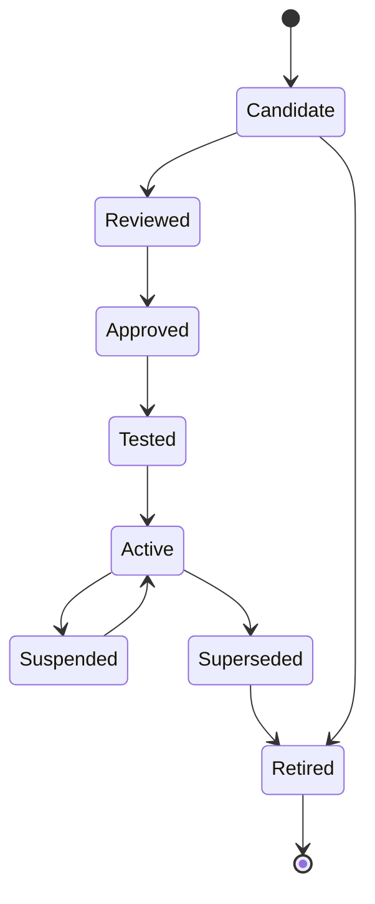

# OPSC-RUN-001 — Operational Runbook Standard

| Campo | Valore |
|---|---|
| Identificativo | OPSC-RUN-001 |
| Titolo | Operational Runbook Standard |
| Package | AP-012 |
| Stato | Draft baseline — Sprint AP-012.2 |
| Data | 30/07/2026 |
| Autorità | Digital StarGate Chief Architect |

## 1. Scopo

OPSC-RUN-001 definisce il metamodel, le regole di authoring, esecuzione, validazione, versioning e audit dei runbook operativi utilizzati dal DSOC. Il documento specializza la governance runbook di AP-007 senza sostituire la Safety Authority locale.

## 2. Principi

- un runbook è una procedura governata, non una prova di efficacia runtime;
- ogni passo deve essere osservabile, verificabile e reversibile quando possibile;
- safety checkpoint e stop condition prevalgono sulla continuità;
- un operatore deve poter comprendere stato, precondizioni, rischi e next action;
- nessun secret deve essere contenuto nel runbook;
- automazioni e comandi seguono OPSC-CMD-001;
- un runbook non testato resta `candidate`;
- ogni esecuzione produce evidence correlata.

## 3. Runbook metamodel

```text
runbook_id
title
purpose
scope
service_id
ci_scope
trigger
owner
approver
required_roles
command_classes
safety_relevance
preconditions
entry_criteria
safety_checkpoints
manual_confirmations
steps
expected_signals
timeouts
abort_conditions
rollback
recovery
escalation
communications
evidence_requirements
dependencies
linked_incidents
linked_changes
version
status
valid_from
valid_until
last_reviewed_at
last_tested_at
supersedes
```

## 4. Runbook classes

| Classe | Uso |
|---|---|
| Normal Operations | avvio, chiusura, handover e operazioni standard |
| Alarm Response | gestione di alarm specifici |
| Incident Response | contenimento e ripristino |
| Major Incident | coordinamento SEV-1/SEV-2 |
| Degraded Mode | operatività con capability ridotte |
| Recovery | ripristino dopo failure |
| Maintenance | attività pianificate o correttive |
| Emergency | protezione immediata e safe state |
| Validation | test, drill e readiness review |

## 5. Preconditions

Le precondizioni devono essere esplicite e verificabili. Possono includere:

- identità e ruolo;
- sessione privilegiata attiva;
- stato operativo e freshness;
- stato safety;
- change o maintenance window;
- availability delle dipendenze;
- versione di configurazione;
- backup o restore point;
- strumenti e canali disponibili;
- assenza di lock incompatibili.

Una precondizione non verificabile produce stop o escalation, non assunzione positiva.

## 6. Safety checkpoints

Ogni runbook safety-relevant deve includere checkpoint prima di:

- dispatch di comandi C2–C4;
- apertura o chiusura della cupola;
- movimento della montatura;
- uscita da safe state;
- rimozione di maintenance lock;
- ritorno in servizio;
- override o break-glass.

Ogni checkpoint deve registrare stato, fonte, freshness, attore, esito e evidence.

## 7. Manual confirmation

La conferma manuale è obbligatoria quando:

- il passo è irreversibile o ad alto impatto;
- lo stato osservato è ambiguo;
- la procedura cambia da normal a degraded/emergency;
- è richiesto il four-eyes principle;
- è necessario attestare una verifica fisica o indipendente.

La conferma deve essere esplicita, nominativa e non derivata da timeout.

## 8. Step model

Ogni step deve contenere:

```text
step_id
intent
required_role
inputs
preconditions
action
expected_result
expected_signals
timeout
retry_policy
abort_condition
rollback_step
evidence_to_capture
next_step_on_success
next_step_on_failure
```

## 9. Rollback

Il rollback deve:

- essere definito prima dell'esecuzione quando tecnicamente possibile;
- indicare il restore point o stato precedente;
- dichiarare limitazioni e irreversibilità;
- includere criteri di attivazione;
- usare comandi autorizzati e auditati;
- verificare il servizio e lo stato safety dopo il completamento.

## 10. Timeout

Ogni azione con attesa deve avere:

- timeout dichiarato;
- comportamento alla scadenza;
- numero massimo di retry;
- escalation;
- gestione di outcome incerto;
- requisito di riconciliazione.

L'assenza di risposta non equivale a successo.

## 11. Recovery

La recovery deve distinguere:

1. contenimento;
2. diagnosi;
3. ripristino tecnico;
4. verifica del servizio;
5. verifica safety;
6. monitoraggio post-ripristino;
7. handover;
8. chiusura con evidence.

## 12. Evidence collection

Evidence minima:

- execution ID e correlation ID;
- runbook ID e versione;
- attori e ruoli;
- start/end timestamp;
- precondition results;
- safety decisions;
- command e approval references;
- output e log pertinenti;
- screenshot o misure solo se governati;
- rollback o recovery outcome;
- incident/change/session links;
- final validation e residual risk.

## 13. Versioning

Il versioning segue Semantic Versioning documentale:

- MAJOR: modifica incompatibile del workflow o dell'autorità;
- MINOR: nuovi step o nuove capability compatibili;
- PATCH: chiarimenti non sostanziali.

Ogni versione deve dichiarare owner, approver, change reason, data, superseded version e compatibilità.

## 14. Lifecycle



Stati ammessi: `candidate`, `reviewed`, `approved`, `tested`, `active`, `suspended`, `superseded`, `retired`.

## 15. Execution workflow

1. identificare trigger e contesto;
2. selezionare versione active;
3. autenticare operatori e ruoli;
4. verificare preconditions;
5. acquisire approval richieste;
6. eseguire safety checkpoint;
7. eseguire step con timeout e evidence;
8. gestire failure, rollback o recovery;
9. verificare stato finale;
10. chiudere l'execution record;
11. aprire incident/problem/change se necessario.

## 16. Segregation of duties

- l'autore non approva da solo runbook C3/C4;
- il maintainer non certifica da solo il return-to-service;
- l'operator non bypassa un safety checkpoint;
- l'auditor non esegue comandi;
- chi modifica una policy non valida da solo la stessa modifica;
- emergency authority richiede post-review.

## 17. Testing and validation

Livelli minimi:

- document review;
- tabletop exercise;
- simulated execution;
- controlled technical test;
- recovery drill;
- emergency drill quando applicabile;
- periodic revalidation.

Il campo `last_tested_at` deve riferirsi a evidence verificabile.

## 18. Failure handling

| Failure | Comportamento |
|---|---|
| precondition false | stop e reason code |
| telemetry stale | stop o degraded runbook |
| timeout | escalation e reconciliation |
| approval unavailable | nessuna approvazione implicita |
| audit unavailable | buffer controllato o blocco secondo criticità |
| rollback failed | incident e recovery authority |
| safety deny | stop definitivo per quella richiesta |

## 19. Acceptance criteria

- metamodel completo;
- preconditions e safety checkpoint espliciti;
- manual confirmation governata;
- rollback, timeout e recovery definiti;
- evidence collection obbligatoria;
- versioning e lifecycle definiti;
- segregation of duties preservata;
- nessun secret nel runbook;
- nessuna efficacia runtime dichiarata senza test.

## 20. Open issues

- repository o motore runbook;
- schema machine-readable;
- firma e immutabilità;
- retention evidence;
- scheduling di revalidation;
- ownership nominativa;
- threshold e timeout definitivi;
- integrazione con ITSM e DSOC.

## 21. Disposizione

OPSC-RUN-001 costituisce la baseline documentale di AP-012 Sprint AP-012.2. I runbook esistenti dovranno essere mappati e classificati prima dell'attivazione operativa.
