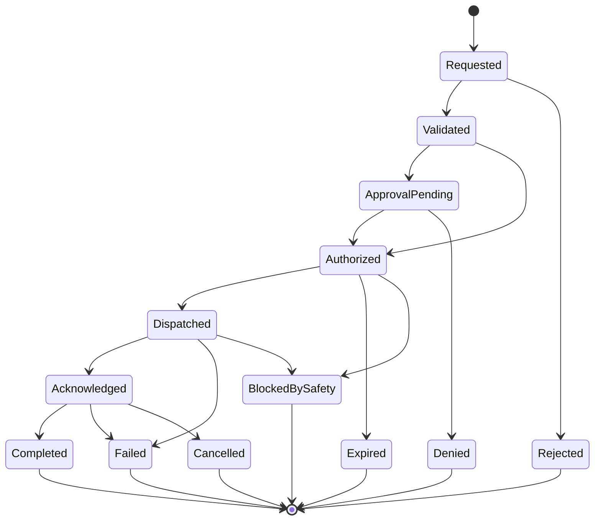

# OPSC-CMD-001 — Command Authorization Model

| Campo | Valore |
|---|---|
| Identificativo | OPSC-CMD-001 |
| Titolo | Command Authorization Model |
| Package | AP-012 |
| Stato | Draft baseline — Sprint AP-012.1 |
| Data | 30/07/2026 |
| Autorità | Digital StarGate Chief Architect |

## 1. Scopo

OPSC-CMD-001 definisce il modello di autorizzazione per i comandi originati o coordinati dal Digital StarGate Operations Center. Il modello governa richiesta, validazione, approvazione, autorizzazione, dispatch, esecuzione, risultato e audit.

L'autorizzazione DSOC non sostituisce il consenso della Safety Authority locale. Un comando può essere autorizzato dal punto di vista operativo e comunque essere negato o interrotto dal Safety Plane.

## 2. Decisione

Ogni comando è **deny by default** e richiede una decisione esplicita basata su:

- identità dell'attore;
- ruolo e delega;
- target;
- tipo di comando;
- scopo dichiarato;
- stato operativo osservato;
- freshness e qualità dello stato;
- classe di rischio;
- maintenance lock e change context;
- approvazioni richieste;
- finestra temporale;
- policy version;
- decisione del Safety Plane al momento dell'esecuzione.

## 3. Principi

- autenticazione non equivale ad autorizzazione;
- il ruolo amministrativo non implica autorità safety;
- l'autorizzazione è scoped e time-bound;
- ogni richiesta è correlata a sessione, incident, change, maintenance o motivo operativo;
- lo stato `stale`, `unknown` o `conflicting` blocca i comandi dipendenti;
- i retry devono essere idempotenti e limitati;
- ogni override richiede motivazione ed evidence;
- le policy sono versionate e testabili;
- analytics e AI non possono essere principal autorizzativi;
- l'assenza di risposta non equivale ad approvazione.

## 4. Ruoli canonici

| Ruolo | Responsabilità | Limiti |
|---|---|---|
| Operator | richiede ed esegue operazioni consentite | non approva automaticamente le proprie C3/C4 |
| Senior Operator | approva operazioni elevate entro delega | non sostituisce Safety Authority |
| Maintainer | opera su asset in maintenance window | non rimuove lock senza workflow |
| Incident Coordinator | coordina restoration | non acquisisce privilegi tecnici impliciti |
| Change Approver | autorizza change context | non esegue safety bypass |
| Safety Authority | permit, deny, stop e safe state | indipendente dal DSOC |
| Security Authority | governa privileged access e break-glass | non decide stato fisico sicuro |
| Auditor | legge evidence | nessuna capacità di comando |
| Automation Service | esegue workflow pre-autorizzati | scope limitato, niente delega aperta |

Una persona può ricoprire più ruoli solo se i conflitti sono dichiarati e la policy lo consente.

## 5. Classi di comando

### C0 — Informativo

Query, refresh, export e acquisizione di stato. Richiede autenticazione e audit.

### C1 — Operativo reversibile

Azioni a impatto limitato e facilmente reversibili. Richiede ruolo autorizzato, stato valido, conferma e timeout.

### C2 — Operativo significativo

Azioni con impatto su sessione, configurazione temporanea o disponibilità. Richiede pre-check, approvazione esplicita e recovery path.

### C3 — Safety-relevant

Azioni che possono influire sullo stato fisico o sulla protezione dell'osservatorio. Richiede dual control, step-up authentication e permit del Safety Plane.

### C4 — Emergency / break-glass

Azioni eccezionali per contenimento o recovery. Richiede autorità nominata, motivazione, registrazione rafforzata e post-review obbligatoria.

## 6. Command request schema

```text
command_id
correlation_id
command_type
command_class
target_id
requested_by
requested_role
delegation_reference
requested_at
purpose
parameters
session_id
incident_id
change_id
maintenance_id
expected_pre_state
observed_pre_state
state_freshness
policy_version
approval_requirements
authorization_expires_at
idempotency_key
```

## 7. Authorization decision schema

```text
decision_id
command_id
decision
reason_codes
decided_at
decided_by
policy_version
matched_rules
required_controls
approval_records
scope
authorization_token_reference
valid_from
valid_until
safety_evaluation_required
evidence_reference
```

Decisioni ammesse:

- `ALLOW`
- `ALLOW_WITH_CONTROLS`
- `DENY`
- `REQUIRE_APPROVAL`
- `REQUIRE_FRESH_STATE`
- `BLOCKED_BY_LOCK`
- `BLOCKED_BY_SAFETY`
- `EXPIRED`

## 8. Lifecycle



Ogni transizione deve produrre timestamp, actor/system, reason e correlation.

## 9. Policy evaluation order

1. schema e signature validi;
2. principal autenticato;
3. account e sessione validi;
4. ruolo/delega adeguati;
5. target esistente e classificato;
6. command class determinata;
7. maintenance lock e change context verificati;
8. stato e freshness sufficienti;
9. separation-of-duties verificata;
10. approvazioni complete;
11. finestra temporale valida;
12. token scoped emesso;
13. safety evaluation richiesta in dispatch;
14. audit sink disponibile o fallback controllato.

Il primo controllo fallito produce deny o una richiesta esplicita di rimedio. Non sono ammesse approvazioni implicite.

## 10. Approval matrix baseline

| Classe | Requester | Approver | Step-up | Safety permit | Post-review |
|---|---|---|---|---|---|
| C0 | user autenticato | non richiesto | no | no | no |
| C1 | Operator | policy automatica o Operator autorizzato | candidato | quando applicabile | no |
| C2 | Operator/Maintainer | Senior Operator o Change Approver | sì | quando applicabile | candidato |
| C3 | Operator/Maintainer | approvatore distinto | sì | obbligatorio | sì |
| C4 | autorità nominata | dual acknowledgement quando possibile | sì | obbligatorio salvo emergency stop locale | obbligatorio |

La matrice definitiva command-by-command resta `DA VALIDARE`.

## 11. Separation of duties

Per C3 e C4, salvo emergency locale:

- requester e approver devono essere distinti;
- chi modifica la policy non approva la stessa modifica;
- chi esegue manutenzione non certifica da solo il return-to-service;
- auditor non possiede privilegi di dispatch;
- analytics service non può essere approver.

Le eccezioni devono essere nominate, motivate, limitate nel tempo e sottoposte a review.

## 12. Delegation

Una delega deve includere:

- delegante e delegato;
- ruolo delegato;
- command scope;
- target scope;
- validità;
- motivo;
- approvatore;
- revocation status.

Sono vietate deleghe permanenti generiche per C3/C4.

## 13. Authorization token

Il token o riferimento equivalente deve essere:

- firmato;
- non riutilizzabile oltre lo scope;
- legato a `command_id`, `target_id` e `idempotency_key`;
- limitato nel tempo;
- revocabile;
- non contenente secret in chiaro;
- validato dal Command Adapter prima del dispatch.

## 14. Idempotency e retry

- ogni comando mutativo usa una idempotency key;
- duplicati con stesso payload restituiscono il risultato noto;
- stesso key con payload differente è rifiutato;
- retry limitati e con backoff;
- nessun retry automatico dopo `BLOCKED_BY_SAFETY`;
- outcome incerto produce stato `UNKNOWN_EXECUTION_RESULT` e attiva recovery, non ripetizione cieca.

## 15. Freshness e precondition control

Ogni comando dichiara le precondizioni richieste. Il sistema confronta:

- expected state;
- observed state;
- state timestamp;
- source quality;
- configuration version;
- maintenance lock;
- safety status.

Se il confronto fallisce, la richiesta è bloccata o deve essere ricreata con nuova evidence.

## 16. Break-glass

Il break-glass è consentito solo per contenimento, emergency o recovery autorizzata. Richiede:

- identità nominativa;
- step-up authentication;
- reason code e testo libero;
- scope minimo;
- durata breve;
- notifica immediata;
- registrazione completa;
- revoca automatica;
- post-review entro finestra definita;
- eventuale incident o security case.

Il break-glass non può disabilitare gli interlock fisici tramite il DSOC.

## 17. Safety interaction

La sequenza obbligatoria per C3/C4 è:

1. autorizzazione operativa DSOC;
2. dispatch governato;
3. valutazione Safety Plane sullo stato corrente;
4. permit, deny o stop;
5. esecuzione solo in caso di permit;
6. evidence del risultato.

Il Safety Plane può revocare il permit durante l'esecuzione. Il DSOC deve rappresentare chiaramente `blocked_by_safety` e non consentire override remoto implicito.

## 18. Audit requirements

Per ogni richiesta sono obbligatori:

- principal e ruolo;
- delega;
- policy version;
- input canonicale;
- pre-state e freshness;
- decisione e reason codes;
- approval records;
- token reference;
- dispatch timestamp;
- safety outcome;
- execution result;
- retries;
- final state;
- linked incident/change/session;
- evidence integrity reference.

## 19. Failure handling

| Failure | Comportamento |
|---|---|
| identity provider unavailable | deny per nuovi comandi privilegiati; mantenere safety locale |
| policy engine unavailable | deny by default |
| approval service unavailable | nessuna approvazione implicita |
| telemetry stale | blocco dei comandi dipendenti |
| command adapter timeout | stato incerto e recovery workflow |
| audit sink unavailable | buffer locale controllato o blocco secondo classe |
| clock unsynchronized | blocco C2–C4 |
| safety response unavailable | deny/stop |

## 20. Validation scenarios

- allow C0 con audit;
- deny per ruolo insufficiente;
- deny per delega scaduta;
- require approval per C2;
- separation-of-duties per C3;
- token scaduto;
- payload modificato dopo approvazione;
- duplicate idempotent request;
- conflicting duplicate request;
- stale telemetry;
- maintenance lock;
- safety denial;
- policy engine failure;
- break-glass e post-review;
- unknown execution result.

## 21. Acceptance criteria

- classi C0–C4 definite;
- lifecycle completo definito;
- ruoli e separation-of-duties espliciti;
- deny-by-default e freshness blocking espliciti;
- Safety Plane autorevole;
- token scoped e idempotency previsti;
- break-glass governato;
- audit requirements completi;
- test scenario definiti;
- nessun comando runtime autorizzato dalla sola pubblicazione del documento.

## 22. Open issues

- catalogo definitivo dei command type;
- mapping comando/classe/ruolo;
- tecnologia policy engine;
- formato del token;
- timeout e freshness threshold;
- retention audit;
- comportamento offline;
- approvazione via mobile o canale secondario;
- revocation propagation;
- command reconciliation dopo outcome incerto.

## 23. Disposizione

OPSC-CMD-001 è la baseline documentale del Command Authorization Model per AP-012 Sprint AP-012.1. L'abilitazione dei comandi richiede implementazione, test, evidence, completamento degli artefatti AP-012.2 e decisione ARB-012.