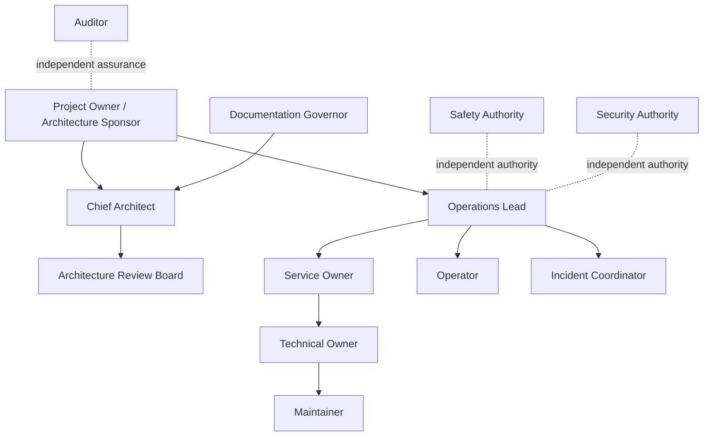

# OPSC-RACI-001 — Operations Responsibility Matrix

| Campo | Valore |
|---|---|
| Identificativo | OPSC-RACI-001 |
| Titolo | Operations Responsibility Matrix |
| Package | AP-012 |
| Stato | Draft baseline — Sprint AP-012.2 |
| Data | 30/07/2026 |
| Autorità | Digital StarGate Chief Architect |

## 1. Scopo

OPSC-RACI-001 definisce organizzazione, ruoli, catena di autorità, matrice RACI, segregation of duties, four-eyes principle ed emergency authority per il Digital StarGate Operations Center.

## 2. Principi

- ogni decisione operativa deve avere un owner identificabile;
- autorità operativa, safety, security, architecture e audit restano distinte;
- una persona può ricoprire più ruoli solo se i conflitti sono espliciti e accettati;
- i privilegi sono least-privilege, scoped e time-bound;
- il ruolo amministrativo non implica authority safety;
- AI, dashboard e automazioni non possono essere `A` in una matrice RACI;
- emergency authority è limitata, auditata e soggetta a post-review.

## 3. Organization

## 4. Ruoli

| Ruolo | Responsabilità primaria | Limiti |
|---|---|---|
| Project Owner / Architecture Sponsor | sponsorship, risk acceptance, strategic authority | non sostituisce automaticamente Safety Authority |
| Chief Architect | coerenza architetturale e governance del package | non esegue operazioni per ruolo implicito |
| Architecture Review Board | review indipendente e decisione architetturale | non certifica runtime senza evidence |
| Operations Lead | coordinamento operativo e staffing | non bypassa safety o security |
| Service Owner | outcome, criticità, support model e SLO | non approva da solo change safety-relevant |
| Technical Owner | salute tecnica e recovery | non certifica da solo return-to-service dopo propria manutenzione |
| Operator | supervisione, acknowledgement e azioni autorizzate | non approva automaticamente C3/C4 |
| Senior Operator | escalation e approvazioni entro delega | non sostituisce Safety Authority |
| Incident Coordinator | gestione incident e timeline | non acquisisce privilegi tecnici impliciti |
| Maintainer | manutenzione e diagnosi tecnica | opera entro lock e window |
| Change Approver | approvazione change | non esegue safety bypass |
| Safety Authority | permit, deny, stop e safe state | indipendente dal DSOC |
| Security Authority | privileged access e break-glass | non decide stato fisico sicuro |
| Documentation Governor | qualità, naming, navigazione e traceability | nessun privilegio operativo implicito |
| Auditor | assurance e review evidence | read-only, nessun dispatch |

## 5. Authority chain

La catena di autorità è:

1. Safety Authority per decisioni safety e safe state;
2. Project Owner / Architecture Sponsor per rischio strategico e accettazione residua;
3. Operations Lead per coordinamento operativo;
4. Service Owner per outcome e priorità di servizio;
5. Incident Coordinator durante incidenti;
6. Technical Owner per recovery tecnico;
7. Operator e Maintainer per esecuzione entro ruolo e delega.

In caso di conflitto, la decisione più restrittiva prevale. La Safety Authority può negare o interrompere qualsiasi operazione safety-relevant.

## 6. RACI matrix

Legenda: `R` Responsible, `A` Accountable, `C` Consulted, `I` Informed.

| Attività | Sponsor | Chief Architect | ARB | Ops Lead | Service Owner | Technical Owner | Operator | Incident Coord. | Maintainer | Safety Auth. | Security Auth. | Doc Gov. | Auditor |
|---|---|---|---|---|---|---|---|---|---|---|---|---|---|
| Architecture package | I | A/R | C | C | C | C | I | I | I | C | C | R | I |
| ARB review | I | C | A/R | I | I | I | I | I | I | C | C | C | I |
| Service definition | I | C | I | C | A | R | C | I | C | C | C | I | I |
| Normal operations | I | I | I | A | C | C | R | I | C | C | I | I | I |
| Alarm acknowledgement | I | I | I | A | I | C | R | C | C | C | I | I | I |
| Incident management | I | I | I | C | A | C | R | R | C | C | C | I | I |
| Major Incident | I | I | I | A | C | C | R | R | C | C | C | I | I |
| Maintenance execution | I | I | I | C | A | C | I | I | R | C | C | I | I |
| Return-to-service | I | I | I | C | A | R | C | C | R | C | C | I | I |
| Safety permit/deny | I | I | I | I | I | C | I | C | C | A/R | I | I | I |
| Privileged access | I | I | I | C | C | C | R | I | R | I | A | I | C |
| Emergency break-glass | I | I | I | A | C | C | R | C | R | C | A | I | I |
| Runbook approval | I | C | I | A | C | R | C | C | C | C | C | R | I |
| Post-incident review | I | C | I | C | A | R | C | R | C | C | C | C | I |
| Audit review | I | I | I | I | I | I | I | I | I | I | C | C | A/R |

## 7. Segregation of duties

Sono obbligatorie le seguenti separazioni:

- requester e approver distinti per C3/C4;
- maintainer e return-to-service approver distinti quando possibile;
- policy author e policy approver distinti;
- auditor separato da command execution;
- security approver separato da beneficiary del privileged access;
- Incident Coordinator distinto dal root cause owner durante Major Incident quando possibile;
- Documentation Governor non approva evidence operativa che ha prodotto da solo.

## 8. Four-eyes principle

Il four-eyes principle è richiesto per:

- comandi C3 e C4;
- rimozione di safety lock;
- return-to-service dopo interventi safety-relevant;
- change di policy di autorizzazione;
- break-glass quando il tempo lo consente;
- chiusura di SEV-1;
- modifica di suppression rules safety-relevant.

Le due persone devono essere nominate e non condividere lo stesso conflitto di interesse.

## 9. Emergency authority

L'emergency authority può essere esercitata solo per:

- protezione immediata;
- raggiungimento o mantenimento del safe state;
- contenimento di un SEV-1;
- recovery autorizzata quando i processi ordinari non sono disponibili.

Richiede:

- identità nominativa;
- motivazione;
- scope minimo;
- durata limitata;
- notifica immediata;
- registrazione completa;
- revoca automatica;
- post-review obbligatoria;
- eventuale incident o security case.

## 10. Architecture governance

- Chief Architect mantiene coerenza con AP-003…AP-012;
- ARB-012 valuta il package completo e le evidenze disponibili;
- Documentation Governor mantiene naming, navigation e traceability;
- ogni modifica sostanziale segue branch, commit atomici e Pull Request;
- nessun documento può dichiarare readiness runtime senza evidence.

## 11. Safety governance

- Safety Authority è indipendente dal DSOC;
- nessun ruolo DSOC può bypassare interlock locali;
- safety decision e operational authorization sono decisioni distinte;
- `unknown`, `stale` e `conflicting` bloccano le azioni dipendenti;
- ogni override safety-relevant richiede audit e post-review;
- la continuità non prevale sul safe state.

## 12. Delegation

Ogni delega deve includere:

- delegante e delegato;
- ruolo e scope;
- servizi e CI interessati;
- classi di comando;
- validità;
- motivo;
- approvatore;
- stato di revoca.

Sono vietate deleghe permanenti generiche per ruoli safety, security e C3/C4.

## 13. Conflict management

I conflitti devono essere:

1. dichiarati;
2. valutati;
3. mitigati con separazione, approvazione o recusal;
4. registrati;
5. riesaminati periodicamente.

## 14. Acceptance criteria

- organizzazione e ruoli definiti;
- catena di autorità esplicita;
- matrice RACI pubblicata;
- segregation of duties definita;
- four-eyes principle applicato;
- emergency authority governata;
- architecture e safety governance preservate;
- nessuna AI o automazione accountable;
- ruoli nominativi ancora aperti dichiarati.

## 15. Open issues

- nomina degli owner e dei sostituti;
- support hours e on-call model;
- approver secondari;
- deleghe operative;
- formazione e competency matrix;
- conflict register;
- riesame periodico dei privilegi;
- integrazione con identity governance.

## 16. Disposizione

OPSC-RACI-001 costituisce la baseline documentale di AP-012 Sprint AP-012.2. La matrice diventa operativa solo dopo assegnazione nominativa, formazione, access review e decisione ARB-012.
