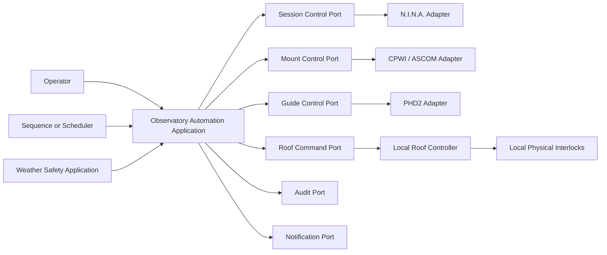

# AP-003 — Observatory Automation Architecture

| Campo | Valore |
|---|---|
| Identificativo | AP-003 |
| Titolo | Observatory Automation Architecture |
| Tipo | Architecture Package |
| Repository | `maininimassimo-bit/digital-stargate-manual` |
| Branch | `main` |
| Data | 30/07/2026 |
| Owner proposto | Digital StarGate Observatory Automation Owner |
| Autorità | Digital StarGate Infrastructure Architect |
| Baseline | `6d485f59126afc83a55d0f034d012ff0563186c2` |
| Mandato | PAA-002, ABC-001, AP-001, ARB-003, AP-002, ADR-005 |
| Dipendenza aperta | AP-002 deve completare ARB-004 prima di autorizzare contratti dati definitivi |
| Stato | Proposed for independent ARB review |

## 1. Scopo

AP-003 definisce i boundary, le responsabilità, le porte applicative, gli adattatori infrastrutturali, gli stati, i failure mode e il percorso di migrazione dell'automazione dell'osservatorio Digital StarGate.

Il package coordina sessione osservativa, montatura, guida, copertura mobile, meteo, notifiche e recovery senza incorporare SDK vendor nel Domain e senza sostituire gli interblocchi fisici locali.

AP-003 non modifica hardware, firmware, cablaggi, soglie meteo, timeout, indirizzi, protocolli, configurazioni N.I.N.A./CPWI/PHD2 o procedure operative correnti.

## 2. Baseline verificata

Sono verificati nel repository:

- procedura di chiusura controllata con Park, verifica sensori `OPEN`, `CLOSED`, `SAFE` e conferma fisica `CLOSED`;
- ADR-005 in stato `Proposed`, con `UNKNOWN` trattato come `UNSAFE` per apertura e automazione;
- Capability 002 in stato `Proposed`, con porte applicative e migrazione shadow-first;
- contratti canonici che distinguono Command ed Event;
- CAP-16 Observatory Automation e CAP-17 Local safety interlocks classificate `Partial`;
- local physical interlocks indipendenti da applicazione, rete, cloud e AI.

Non sono verificati:

- inventario completo dei sensori, attuatori e controller realmente installati;
- protocolli e capacità effettive dei dispositivi;
- soglie numeriche definitive;
- timeout di movimento e heartbeat;
- comportamento locale durante perdita di EAGLE, rete o alimentazione;
- copertura completa di emergency stop e manual override;
- test fault, failover e commissioning fisico.

## 3. Driver

1. Safety prevalente sulla continuità osservativa.
2. Separazione tra safety authority, orchestration e device control.
3. Adattatori sostituibili dietro porte applicative.
4. Decisioni e comandi auditabili e correlabili.
5. Chiusura idempotente e stato fisico verificato.
6. Degrado sicuro in presenza di dati mancanti, stale o incoerenti.
7. Migrazione incrementale con shadow mode e rollback manuale.
8. Nessuna dipendenza della safety locale dalla connettività remota.

## 4. Scope

### In scope

- bounded context e responsabilità dell'automazione;
- state machine di sessione e copertura;
- porte per meteo, montatura, guida, copertura, audit e notifiche;
- adapter boundary per N.I.N.A., CPWI, PHD2, ASCOM/Alpaca e controller locali quando verificati;
- failure mode, degraded operation e recovery;
- observability e audit;
- commissioning, rollback e runbook implications.

### Out of scope

- implementazione dei driver;
- scelta o sostituzione di hardware;
- definizione di soglie non validate;
- riapertura automatica;
- AI tool execution;
- modifica degli interblocchi locali;
- certificazione safety;
- promozione di CAP-16 o CAP-17.

## 5. Boundary architetturali

### 5.1 Safety Authority

La safety authority fisica appartiene agli interblocchi e controller locali verificati. L'applicazione può bloccare apertura, richiedere chiusura e allertare, ma non può dichiarare fisicamente sicura la struttura senza conferma locale.

### 5.2 Observatory Automation

Orchestra le operazioni, coordina prerequisiti, invia Command attraverso porte e valuta gli esiti. Non accede direttamente a SDK o driver vendor.

### 5.3 Device Control

Gli adattatori infrastrutturali traducono le porte applicative nei protocolli realmente disponibili. N.I.N.A., CPWI, PHD2, ASCOM/Alpaca e qualsiasi controller specifico restano fuori dal Domain.

### 5.4 Weather and Environmental Safety

Normalizza osservazioni e produce decisioni secondo ADR-005. Dati assenti, stale o incoerenti producono `UNKNOWN`; `UNKNOWN` non autorizza apertura o prosecuzione automatica.

### 5.5 Operations and Recovery

Gestisce runbook, incidenti, escalation, manual override, commissioning e ritorno controllato alla gestione manuale.

## 6. Component model



Il diagramma rappresenta boundary logici. Non certifica la presenza o il protocollo di ogni adapter.

## 7. Porte applicative proposte

- `IObservationSequencePort`
- `IMountControlPort`
- `IGuideControlPort`
- `IRoofCommandPort`
- `IRoofStatePort`
- `IWeatherSafetyDecisionPort`
- `ILocalInterlockStatusPort`
- `IOperationAuditPort`
- `IOperatorNotificationPort`
- `IClock`

Le porte appartengono all'Application. Implementazioni, SDK, process control, rete e persistenza appartengono a Infrastructure.

## 8. Command ed Event

### Command

- `PrepareObservatory`
- `StartObservation`
- `AbortObservation`
- `ParkMount`
- `StopGuiding`
- `RequestRoofOpen`
- `RequestRoofClosure`
- `EnterSafeMode`
- `AcknowledgeFault`

Un Command esprime intenzione e non prova l'esito fisico.

### Domain Event

- `ObservationPreparationStarted`
- `ObservationAborted`
- `SafeModeEntered`
- `RoofClosureRequested`
- `RoofClosureFailed`
- `RoofStateConfirmed`
- `MountParkConfirmed`
- `AutomationFaultDetected`

Gli eventi pubblicati verso altri bounded context sono Integration Event versionati e distinti dai Domain Event interni.

## 9. State model della copertura

```text
UNKNOWN
  | verified CLOSED
  v
CLOSED --authorized open--> OPENING --confirmed OPEN--> OPEN
  ^                           |                       |
  |                           v                       v
  +--confirmed CLOSED----- FAULT <---failed------ CLOSING
                                      ^              |
                                      +--close-------+
```

Regole:

1. `OPEN` e `CLOSED` richiedono conferma sensore coerente.
2. Stati incoerenti o assenti producono `UNKNOWN` o `FAULT`.
3. `UNKNOWN` non autorizza apertura automatica.
4. Il comando di chiusura è idempotente.
5. Il mancato raggiungimento di `CLOSED` genera fault e allarme.
6. La riapertura automatica resta fuori scope.
7. Manual override non annulla gli interblocchi locali.

## 10. Orchestrazione di chiusura

```text
Abort or complete exposure
  -> Stop guiding
  -> Request mount Park
  -> Verify Park
  -> Verify safe mechanical envelope
  -> Request roof closure
  -> Verify CLOSED true and OPEN false
  -> Persist audit and notify outcome
  -> Continue controlled equipment shutdown
```

La sequenza deriva dalla procedura operativa esistente. Timeout, retry e posizione geometrica di Park restano da validare.

## 11. Mandatory safety scenarios

| Scenario | Comportamento architetturale richiesto | Evidenza richiesta |
|---|---|---|
| Perdita connettività remota | nessuna apertura; safety locale continua indipendentemente | test di isolamento rete |
| Telemetria assente o stale | stato `UNKNOWN`; blocco apertura e richiesta di gestione sicura | test freshness |
| Perdita alimentazione | comportamento locale documentato e collaudato; nessuna assunzione applicativa | test controllato e schema elettrico |
| Controller failure | fault esplicito, nessun falso `CLOSED`, escalation locale | fault injection |
| Chiusura parziale | struttura non sicura; arresto comandi ripetuti non governati; intervento locale | test finecorsa e movimento |
| Emergency stop | arresto locale autoritativo; applicazione registra e non forza recovery | collaudo E-stop |
| Manual override | autenticato, motivato, limitato nel tempo e auditato | test autorizzazione e audit |
| Stato fisico incerto | `UNKNOWN/FAULT`, nessuna apertura, verifica locale | runbook e commissioning |
| EAGLE/processo bloccato | interlock locali invariati; recovery non presume stato dispositivi | prova di arresto processo |
| N.I.N.A./CPWI/PHD2 indisponibili | abort controllato, Park solo se verificabile, escalation se posizione incerta | integration test o simulatore |

## 12. Security e trust boundaries

- accesso remoto autenticato e autorizzato;
- segreti confinati agli adapter;
- least privilege per comandi fisici;
- audit di identità, comando, motivazione, esito e correlazione;
- nessun comando fisico proveniente direttamente da dashboard, AI o consumer dati;
- rete remota e VPN non sono parte della safety authority;
- replay e duplicazione dei Command devono essere gestiti con idempotenza e correlation.

## 13. Observability

Minimo richiesto:

- stato applicativo distinto da stato fisico confermato;
- health separato per ogni adapter;
- timestamp e freshness per osservazioni e conferme;
- metriche di richieste, esiti, fault, retry e tempi di transizione;
- log strutturati con `CorrelationId`;
- allarmi per `UNKNOWN`, mancato Park, mancato `CLOSED`, adapter non disponibile e override attivo;
- audit append-only per decisioni safety-relevant.

Le soglie degli allarmi non sono definite da AP-003.

## 14. Migration plan

### Fase 0 — Inventario verificato

- catalogare dispositivi, controller, sensori, finecorsa, E-stop, alimentazioni e protocolli;
- associare ogni elemento a path, versione e owner;
- registrare comportamento in perdita rete, processo e alimentazione.

### Fase 1 — Contratti e simulatori

- formalizzare porte applicative;
- creare simulatori per stato montatura, guida, copertura e meteo;
- testare state machine e idempotenza senza hardware.

### Fase 2 — Shadow mode

- osservare stati e produrre decisioni senza inviare comandi;
- confrontare esiti con le procedure dell'operatore;
- eliminare falsi `SAFE` e divergenze.

### Fase 3 — Blocco apertura

- autorizzare l'applicazione a negare apertura;
- mantenere apertura manuale soggetta agli interlock locali;
- predisporre rollback immediato.

### Fase 4 — Chiusura automatica controllata

- abilitare richiesta idempotente di chiusura;
- verificare Park, inviluppo e conferma fisica `CLOSED`;
- collaudare fault e rollback.

### Fase 5 — Operabilità

- esercitazioni periodiche;
- revisione incidenti;
- aggiornamento runbook e asset inventory;
- eventuali evoluzioni sottoposte a nuova ARB.

## 15. Rollback

Ogni fase deve consentire ritorno alla procedura manuale documentata. Il rollback non deve disabilitare o bypassare interlock, E-stop o protezioni locali. Qualsiasi comando automatico deve poter essere disabilitato senza perdere la capacità locale di mettere in sicurezza la struttura.

## 16. Acceptance criteria

AP-003 è accettabile quando:

1. boundary Safety / Automation / Device Control sono approvati;
2. porte e adapter non espongono SDK vendor al Domain;
3. ogni stato fisico critico richiede conferma locale;
4. `UNKNOWN` non autorizza apertura automatica;
5. chiusura e retry sono idempotenti;
6. failure mode obbligatori hanno test e runbook;
7. inventario hardware e protocolli è verificato;
8. shadow mode precede ogni comando automatico;
9. rollback manuale è collaudato;
10. ARB indipendente valuta package ed evidenze;
11. AP-002 completa ARB-004 prima della definizione finale di data contract, lineage e retention operativa;
12. CAP-16 e CAP-17 non vengono promosse senza evidenza TST/INT/OPS.

## 17. Rischi e debito

| ID | Tipo | Descrizione | Trattamento |
|---|---|---|---|
| AP3-R01 | Risk | stato applicativo diverso dallo stato fisico | conferma locale e allarme |
| AP3-R02 | Risk | perdita rete durante operazione | safety locale indipendente e idempotenza |
| AP3-R03 | Risk | falso `SAFE` da dati stale o incoerenti | `UNKNOWN` fail-safe e freshness |
| AP3-R04 | Risk | posizione montatura non verificata | nessuna chiusura automatica, escalation locale |
| AP3-R05 | Risk | chiusura parziale o finecorsa guasto | fault esplicito e intervento locale |
| AP3-R06 | Risk | override improprio | autorizzazione, scadenza e audit |
| AP3-TD01 | Technical debt | inventario hardware non certificato | Fase 0 obbligatoria |
| AP3-TD02 | Technical debt | timeout e soglie non validate | commissioning e decisione separata |
| AP3-TD03 | Technical debt | ADR-005 e Capability 002 ancora Proposed | review coordinata con AP-003 |
| AP3-TD04 | Technical debt | test hardware e fault non presenti | validation matrix e evidence annex |

## 18. Validazioni

### Eseguite

- verifica del branch `main`;
- ispezione ADR-005;
- ispezione Capability 002;
- ispezione della procedura di chiusura controllata;
- verifica dei boundary AP-001 e AP-002;
- review documentale dei failure mode obbligatori.

### Non eseguite

- `mkdocs build --strict`;
- link checker e lint;
- test applicativi o architetturali;
- test N.I.N.A., CPWI, PHD2, ASCOM/Alpaca;
- test rete, VPN o failover;
- test alimentazione;
- test controller, sensori, finecorsa, E-stop e manual override;
- fault injection;
- commissioning fisico;
- certificazione safety.

## 19. Handoff ARB

L'ARB deve verificare:

- dipendenza aperta da ARB-004;
- compatibilità con ADR-005 e Capability 002;
- correttezza dei boundary e della dependency direction;
- completezza dei failure mode;
- indipendenza della safety locale;
- assenza di assunzioni hardware non verificate;
- adeguatezza di migration, commissioning e rollback;
- traceability verso CAP-16 e CAP-17.

**Esito del package:** PROPOSED FOR INDEPENDENT ARB REVIEW.
