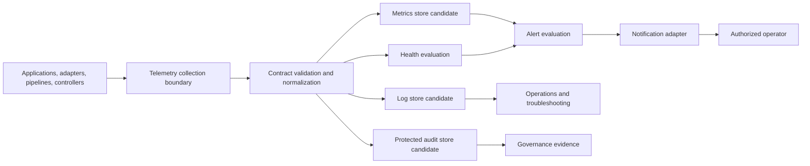

# AP-004 — Enterprise Telemetry and Observability Architecture

| Campo | Valore |
|---|---|
| Identificativo | AP-004 |
| Titolo | Enterprise Telemetry and Observability Architecture |
| Tipo | Architecture Package |
| Repository | `maininimassimo-bit/digital-stargate-manual` |
| Branch | `main` |
| Data | 30/07/2026 |
| Owner proposto | Digital StarGate Observability Owner |
| Autorità | Digital StarGate Infrastructure Architect |
| Baseline | `c6993a21a859826ab1ab4edea94c0a610caac851` |
| Mandato | PAA-002, AP-001, ARB-003, AP-002, ARB-004, AP-003, ARB-005 |
| Stato | Proposed for independent ARB review |

## 1. Scopo

AP-004 definisce il modello enterprise per telemetry, structured logging, metrics, health, audit, alerting, correlation ed evidence di Digital StarGate.

Il package rende osservabili applicazioni, adapter, pipeline dati e automazione dell'osservatorio senza attribuire a dashboard, metriche, log, Warehouse, AI o notification channel alcuna autorità safety o capacità implicita di comandare dispositivi.

AP-004 non seleziona prodotti, protocolli, broker, database, agent, porte, indirizzi, soglie, retention o canali non verificati.

## 2. Baseline verificata

La baseline repository contiene:

- CAP-08 Live Telemetry in stato `Planned`;
- CAP-16 Observatory Automation e CAP-17 Local Safety Interlocks in stato `Partial`;
- AP-002 e ARB-004, che governano schema, lineage, retention, accesso ed evidence;
- AP-003 e ARB-005, che richiedono health per adapter, freshness, metriche, `CorrelationId`, audit append-only e allarmi;
- documentazione operativa e KPI distribuita;
- nessuna evidenza verificata di una piattaforma enterprise telemetry completa e operativa.

Non sono verificati:

- stack di raccolta, transport o storage;
- protocolli e capacità dei producer;
- cardinalità, volumi e frequenze;
- SLI, SLO, soglie e routing degli alert;
- retention concreta;
- disponibilità offline e buffering locale;
- test end-to-end o continuous operations.

## 3. Driver

1. Separare stato fisico, stato applicativo, health e qualità del dato.
2. Correlare Command, decisione, evento, conferma, fault e intervento operatore.
3. Rendere misurabili failure mode e condizioni ARB.
4. Evitare pipeline parallele e formati duplicati.
5. Preservare least privilege, minimizzazione e integrità degli audit.
6. Degradare senza produrre falsi `SAFE`, `CLOSED` o `HEALTHY`.
7. Consentire evoluzione incrementale, buffering locale e rollback.

## 4. Scope

### In scope

- telemetry contracts e semantic conventions;
- metriche, log, trace/correlation, health e audit;
- collection boundary e producer adapter;
- alert lifecycle, ownership ed escalation;
- data classification, accesso, retention e lineage;
- degraded operation, buffering, reconciliation e recovery;
- migration, validation ed evidence.

### Out of scope

- scelta definitiva di vendor o prodotti;
- installazione di agent o broker;
- soglie operative non validate;
- controllo diretto di dispositivi;
- sostituzione degli interlock locali;
- certificazione safety;
- promozione automatica di CAP-08, CAP-16 o CAP-17.

## 5. Principi

1. **Observability is evidence, not authority.**
2. **No telemetry means unknown, not healthy or safe.**
3. **Physical confirmation remains local and authoritative.**
4. **One canonical semantic contract per signal.**
5. **Correlation crosses boundaries; vendor payloads do not.**
6. **Health is component-specific and dependency-aware.**
7. **Audit is append-only, access-controlled and integrity-protected.**
8. **Alerts require owner, severity, routing, acknowledgement and closure.**
9. **High-cardinality labels require explicit approval.**
10. **Retention and sampling are deliberate data-governance decisions.**

## 6. Signal model

| Signal | Scopo | Caratteristiche | Non dimostra |
|---|---|---|---|
| Metric | andamento aggregato e misurabile | nome, unità, labels governate, timestamp | causa completa o stato fisico |
| Structured Log | dettaglio diagnostico e decisionale | evento tipizzato, severity, correlation, source | integrità audit senza controlli dedicati |
| Trace/Correlation | catena causale tra componenti | `CorrelationId`, `CausationId`, boundary | esito fisico senza conferma |
| Health | capacità corrente di un componente | liveness, readiness, dependency health, freshness | safety dell'osservatorio |
| Audit Event | evidenza di comando, override e decisione | append-only, identità, motivazione, esito | correttezza meccanica non verificata |
| Alert | richiesta operativa di attenzione | severity, owner, deduplication, acknowledgement | remediation automatica autorizzata |

## 7. Architecture boundary



Il diagramma è logico. Non certifica stack, protocollo, deployment o disponibilità.

## 8. Producer and collection boundary

Ogni producer deve pubblicare attraverso un adapter o instrumentation boundary verificato. Domain e Application non dipendono da SDK di telemetry specifici.

Contratti applicativi candidati:

- `IMetricRecorder`
- `IStructuredEventLogger`
- `ICorrelationContext`
- `IHealthReporter`
- `IAuditEventWriter`
- `IAlertNotificationPort`
- `IClock`

I nomi sono proposti e devono essere allineati ai contratti canonici prima dell'implementazione.

## 9. Semantic envelope minimo

Ogni signal applicabile deve poter dichiarare:

```text
signal_name
signal_type
schema_version
occurred_at_utc
observed_at_utc
source_component
source_instance
environment
severity_or_status
correlation_id
causation_id
operation_or_event
result
quality_or_freshness
classification
evidence_locator
```

Identità, secret, payload astronomici e dati personali non devono essere inseriti indiscriminatamente nei signal.

## 10. Health model

Gli stati candidati sono:

- `HEALTHY`
- `DEGRADED`
- `UNHEALTHY`
- `UNKNOWN`
- `NOT_APPLICABLE`

Regole:

1. liveness e readiness sono distinti;
2. dependency health non viene appiattito in un singolo booleano;
3. dato stale o assente produce `UNKNOWN` o `DEGRADED` secondo contratto, mai un falso `HEALTHY`;
4. health applicativo non equivale a stato fisico o safety;
5. il restart non riconcilia automaticamente stati fisici: le fonti locali autoritative devono essere rilette;
6. i check devono avere owner, frequenza, timeout e freshness validati.

## 11. Metric governance

Ogni metrica deve dichiarare:

- nome stabile;
- scopo e owner;
- tipo e unità;
- labels consentite;
- cardinalità attesa;
- producer;
- sampling/frequenza;
- qualità e freshness;
- retention;
- consumer;
- dashboard e alert associati;
- evidence locator.

Metriche candidate, non ancora certificate:

- adapter availability;
- command requested/completed/failed;
- transition duration;
- stale observation count;
- reconciliation failure;
- roof closure request and confirmation latency;
- Warehouse build and quality-gate result;
- alert acknowledgement and resolution time.

## 12. Logging and audit

I log diagnostici e gli audit event sono separati.

Gli audit safety-relevant devono includere almeno identità, ruolo, comando o decisione, motivazione, timestamp, correlation, source, risultato dichiarato, conferma disponibile ed evidence locator.

Override, acknowledgement e variazioni di configurazione devono essere auditati. Secret e credenziali non devono essere serializzati.

Schema, retention, integrità, accesso e disposal degli audit devono seguire AP-002 e le condizioni ARB-004.

## 13. Alert lifecycle

```text
Detected -> Open -> Routed -> Acknowledged -> Mitigating -> Resolved -> Reviewed
```

Ogni regola di alert deve dichiarare:

- identificatore e owner;
- signal e condizione;
- severity;
- deduplication e suppression policy;
- routing e fallback;
- acknowledgement target;
- escalation;
- runbook;
- closure criteria;
- evidence e review periodica.

Nessun alert autorizza direttamente un comando fisico. Le eventuali automazioni devono appartenere ad Application, rispettare AP-003 e passare una decisione separata.

## 14. Safety boundary

- telemetry, dashboard e alert non sono safety authority;
- perdita collection, storage o notification non disabilita gli interlock locali;
- `UNKNOWN` non viene trasformato in `SAFE`, `CLOSED` o `HEALTHY`;
- l'ultimo valore noto non prova lo stato corrente;
- alerting remoto non sostituisce allarmi o protezioni locali quando richiesti;
- CAP-16 e CAP-17 restano `Partial` finché non esistono test e commissioning.

## 15. Security and trust

- least privilege per write, read, query, admin e export;
- autenticazione dei producer quando supportata e verificata;
- integrità e anti-tampering per audit;
- minimizzazione dei dati;
- segregazione tra operational telemetry, audit e dati pubblicabili;
- rate limiting e protezione da cardinality/volume explosion;
- access log per consultazioni sensibili;
- nessun comando da dashboard o AI.

## 16. Degraded operation

| Scenario | Comportamento richiesto |
|---|---|
| Perdita rete remota | raccolta locale o perdita esplicita; safety locale invariata |
| Collector indisponibile | producer non deve bloccarsi indefinitamente; buffering limitato e osservabile |
| Storage indisponibile | coda/buffer entro limiti validati; backpressure governata |
| Dati stale | stato `UNKNOWN/DEGRADED`; alert secondo regola validata |
| Clock drift | qualità temporale degradata; correlazione non considerata affidabile |
| Volume anomalo | sampling/rate control governato; audit critici preservati |
| Notification failure | escalation alternativa documentata; evento non considerato consegnato |
| Restart | rilettura stato autorevole e reconciliation; nessuna inferenza dall'ultimo signal |
| Power loss | comportamento locale documentato; nessuna assunzione cloud/applicativa |

## 17. Migration

### Fase 0 — Inventory

- catalogare producer, signal esistenti, log, KPI, health e notification;
- identificare duplicazioni, secret leakage, formati e owner;
- misurare volumi e dipendenze senza introdurre soglie arbitrarie.

### Fase 1 — Contracts

- definire semantic envelope, metric catalog, health contract e audit schema;
- creare validator e simulatori;
- registrare classification, lineage, accesso e retention candidate.

### Fase 2 — Local pilot

- instrumentare un flusso non safety-critical;
- validare loss, buffering, backpressure, clock e restart;
- verificare query, dashboard e alert senza comandi automatici.

### Fase 3 — Observatory shadow observability

- osservare AP-003 in shadow mode;
- correlare decisione, Command, adapter response e conferma locale;
- confrontare signal con log e procedure operatore.

### Fase 4 — Operational adoption

- attivare routing ed escalation approvati;
- collegare runbook ed evidence;
- introdurre SLI/SLO solo dopo baseline misurata.

### Fase 5 — Governance automation

- schema validation;
- cardinality e compatibility checks;
- retention enforcement;
- drift e evidence report;
- release gates.

## 18. Rollback

L'instrumentation deve poter essere disabilitata senza interrompere Domain, Application, device control o interlock locali. Il rollback non deve eliminare audit già prodotti né mascherare perdita di telemetry. Buffer, collector e notification adapter devono avere procedure di stop, drain, export e recovery documentate.

## 19. Acceptance criteria

AP-004 è accettabile quando:

1. metric, log, health, audit e alert sono separati semanticamente;
2. telemetry non possiede authority safety o control;
3. semantic envelope e versioning sono definiti;
4. health distingue liveness, readiness, dependency e freshness;
5. audit schema è allineato ad AP-002/ARB-004;
6. alert lifecycle include owner, routing, acknowledgement, escalation e runbook;
7. degraded modes e buffering sono documentati e testabili;
8. inventory e volumi sono verificati;
9. almeno un pilot end-to-end produce evidence;
10. retention, accesso e lineage sono deliberati;
11. ARB indipendente valuta package ed evidenze;
12. CAP-08 non viene promossa senza implementation e operations evidence.

## 20. Rischi e debito

| ID | Tipo | Descrizione | Trattamento |
|---|---|---|---|
| AP4-R01 | Risk | telemetry interpretata come stato fisico | boundary e naming espliciti |
| AP4-R02 | Risk | perdita signal non rilevata | freshness e completeness evidence |
| AP4-R03 | Risk | alert storm o fatigue | deduplication, severity e review |
| AP4-R04 | Risk | cardinalità o volume non governati | catalogo e budget misurati |
| AP4-R05 | Risk | audit incompleto o alterabile | schema, integrità e accesso |
| AP4-R06 | Risk | dependency dalla rete remota | buffering locale e degraded mode |
| AP4-TD01 | Debt | stack e protocolli non selezionati | decisione dopo inventory/pilot |
| AP4-TD02 | Debt | SLI/SLO e soglie non disponibili | baseline misurata prima della deliberazione |
| AP4-TD03 | Debt | retention non deliberata | remediation AP-002/ARB-004 |
| AP4-TD04 | Debt | CAP-08 ancora Planned | pilot, test e operations evidence |

## 21. Validazioni

### Eseguite

- verifica del branch `main` e della baseline corrente;
- ispezione ARB-005 e delle condizioni di observability/audit;
- confronto con AP-002/ARB-004 e AP-003;
- verifica documentale di safety boundary, migration e degraded modes.

### Non eseguite

- `mkdocs build --strict`, link check o lint;
- inventory completo di producer e signal;
- test di instrumentation, collector, storage o notification;
- test di rete, buffering, backpressure, clock drift o power loss;
- misurazione di volumi e cardinalità;
- definizione o verifica di SLI/SLO;
- test runtime, hardware o safety.

## 22. Handoff ARB

L'ARB deve verificare:

- separazione observability/control/safety;
- coerenza con AP-002/ARB-004 e AP-003/ARB-005;
- semantic model e dependency direction;
- security, integrity e accesso degli audit;
- degraded modes, migration e rollback;
- assenza di vendor assumptions trasformate in fatti;
- sufficienza dei criteri per non promuovere CAP-08 prematuramente.

**Esito del package:** PROPOSED FOR INDEPENDENT ARB REVIEW.
