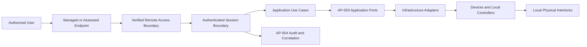

# AP-005 — Identity, Access and Remote Operations Security Architecture

| Campo | Valore |
|---|---|
| Identificativo | AP-005 |
| Titolo | Identity, Access and Remote Operations Security Architecture |
| Tipo | Architecture Package |
| Repository | `maininimassimo-bit/digital-stargate-manual` |
| Branch | `main` |
| Data | 30/07/2026 |
| Owner proposto | Digital StarGate Identity and Security Owner |
| Autorità | Digital StarGate Infrastructure Architect |
| Baseline | `d80128b6285797b59e607a3f28051d12886e217f` |
| Mandato | AP-001, ARB-003, AP-002, ARB-004, AP-003, ARB-005, AP-004, ARB-006 |
| Stato | Proposed for independent ARB review |

## 1. Scopo

AP-005 definisce il modello enterprise per identità, autenticazione, autorizzazione, sessioni remote, privilegi, secret, break-glass, access review e audit delle operazioni Digital StarGate.

Il package governa accessi umani e machine identity senza attribuire alla rete, alla VPN, alla dashboard, all'AI o all'observability alcuna autorità safety. Ogni comando fisico continua ad attraversare i boundary applicativi di AP-003 e resta soggetto agli interlock locali.

AP-005 non seleziona provider IAM, prodotto MFA, password manager, VPN, PKI, bastion, protocollo, porta, account, certificato o soglia non verificati.

## 2. Baseline verificata

Nel repository risultano documentati:

- accesso remoto previsto esclusivamente tramite VPN;
- divieto di esporre RDP direttamente su Internet;
- separazione tra account amministrativo e operativo;
- credenziali uniche e robuste e uso di password manager;
- revisione periodica e revoca degli account;
- ruoli operativi e livelli di abilitazione da osservatore ad amministratore/manutentore;
- logging di accessi VPN, Windows, router e modifiche di configurazione;
- divieto di archiviare password, chiavi private, token o configurazioni VPN non sanificate nel repository;
- AP-003/ARB-005: least privilege, command authorization matrix e audit dei comandi fisici;
- AP-004/ARB-006: audit append-only, correlation, access control ed evidence.

Non sono verificati:

- inventario completo di utenti, service account, certificati, token e chiavi;
- metodo effettivo di autenticazione VPN e ruolo server/client;
- MFA, conditional access o device trust;
- lifecycle di provisioning, rotazione, sospensione e revoca;
- autorizzazioni concrete per ogni sistema e comando;
- session recording, timeout e re-authentication;
- procedura break-glass collaudata;
- segregazione effettiva delle reti e dei privilegi;
- test di account compromise, certificate expiry o loss of access.

## 3. Driver

1. Identità nominali e attribuibili per ogni operazione rilevante.
2. Least privilege e separazione tra read, operate, override e administration.
3. Nessun accesso remoto diretto ai dispositivi fuori dai boundary approvati.
4. Credenziali e secret fuori da codice, documentazione e log.
5. Sessioni remote limitate, osservabili, revocabili e riconciliabili.
6. Break-glass eccezionale, temporaneo, motivato e auditato.
7. Revoca e recovery possibili anche in caso di compromissione.
8. Safety locale indipendente da IAM, VPN, rete e cloud.
9. Migrazione incrementale senza perdita della capacità locale di recovery.

## 4. Scope

### In scope

- human identity e machine identity;
- authentication e credential lifecycle;
- RBAC/ABAC e command authorization;
- privileged access e separation of duties;
- remote session security;
- secret, key e certificate governance;
- break-glass e emergency access;
- access review, joiner/mover/leaver e revocation;
- audit, correlation ed evidence;
- trust boundaries, degraded modes, migration e rollback.

### Out of scope

- scelta definitiva di vendor o prodotto;
- pubblicazione di credenziali, IP pubblici o configurazioni sensibili;
- modifica degli interlock locali;
- controllo diretto da dashboard, AI o telemetry;
- certificazione cyber o safety;
- promozione automatica di capability;
- implementazione o hardening runtime non verificati.

## 5. Principi

1. **Every privileged action has an attributable identity.**
2. **Authentication does not imply authorization.**
3. **Remote reachability does not imply permission to operate.**
4. **Read, operate, override and administration are separate privileges.**
5. **No shared privileged account unless explicitly governed as emergency-only.**
6. **Secrets never enter source control, telemetry or ordinary logs.**
7. **Break-glass is temporary, auditable and reviewed.**
8. **Service identities are scoped, rotated and non-interactive where possible.**
9. **Loss of IAM or VPN never disables local safety.**
10. **Physical confirmation remains local and authoritative.**

## 6. Actor model

| Attore | Scopo | Privilegi candidati | Restrizioni |
|---|---|---|---|
| Observer | consultazione dati e stato | read-only | nessun comando |
| Remote Operator | sessione osservativa standard | operate su use case approvati | nessuna amministrazione o override implicito |
| Technical Administrator | configurazione e manutenzione tecnica | administration controllata | separata dall'operatività ordinaria |
| Local Maintainer | intervento fisico autorizzato | local maintenance | identità e presenza locale verificate |
| Network Specialist | RUT955, VPN, firewall e failover | network administration | nessun comando astronomico implicito |
| Automation Service | esecuzione di use case applicativi | machine-scoped permissions | nessun login interattivo |
| Emergency Operator | recovery eccezionale | break-glass limitato | durata, motivazione, audit e review obbligatori |
| Auditor/Reviewer | verifica evidence e accessi | read su audit/evidence | nessuna modifica operativa |

I ruoli sono modelli candidati. Nominativi, assegnazioni e combinazioni effettive devono essere deliberate con RACI.

## 7. Identity lifecycle

Ogni identità deve avere:

- identificatore univoco;
- tipo human/service/device;
- owner e sponsor;
- ruolo e scope;
- data di attivazione e scadenza/review;
- fattori o credenziali associate;
- sistemi autorizzati;
- privilegi concessi;
- evidence di approvazione;
- stato active/suspended/revoked/expired;
- ultima review e prossimo riesame.

Processi minimi:

1. request;
2. approval;
3. provisioning;
4. verification;
5. periodic review;
6. modification;
7. suspension;
8. revocation;
9. evidence retention.

## 8. Authentication architecture

L'autenticazione deve essere proporzionata a rischio e privilegio.

Requisiti architetturali:

- identità nominali per utenti umani;
- separazione degli account amministrativi;
- fattori resistenti al phishing quando supportati e deliberati;
- certificati, chiavi o token protetti e revocabili;
- nessun secret hard-coded;
- sincronizzazione temporale affidabile per validità e audit;
- rate limiting e lockout governati senza creare lockout safety-critical incontrollato;
- recovery identity verificato e documentato;
- autenticazione locale di emergenza separata dalla normale operatività remota.

MFA, provider, protocollo e policy concrete restano da verificare.

## 9. Authorization model

L'autorizzazione deve valutare almeno:

```text
identity
role
resource
operation
location_or_channel
session_assurance
system_state
approval_context
expiry
reason
```

### 9.1 Privilege classes

| Classe | Esempi | Regola |
|---|---|---|
| Read | stato, report, log consentiti | nessun side effect |
| Operate | avvio/arresto use case approvati | attraverso Application e porte AP-003 |
| Configure | parametri e configurazioni | change control e rollback |
| Administer | account, rete, sistemi e policy | account separato e audit rafforzato |
| Override | eccezione operativa | temporaneo, motivato, non bypassa interlock |
| Emergency | recovery break-glass | doppia evidenza o review post-evento secondo rischio |

### 9.2 Command authorization matrix

Prima di abilitare comandi fisici deve esistere una matrice versionata che colleghi:

- ruolo;
- comando/use case;
- contesto locale/remoto;
- prerequisiti;
- approvazione richiesta;
- durata;
- re-authentication;
- audit event;
- runbook;
- rollback/escalation.

Nessun ruolo IAM può annullare un interlock fisico locale.

## 10. Remote operations boundary



Il diagramma è logico e non certifica VPN, endpoint, deployment o prodotto. Non è previsto un flusso diretto User → Device.

## 11. Session security

Ogni sessione remota privilegiata deve dichiarare:

- identità e ruolo;
- endpoint e channel;
- inizio, fine e motivo;
- assurance level;
- scope e privilegi;
- timeout idle e massimo;
- re-authentication per operazioni sensibili;
- revocation capability;
- correlation ID;
- eventuale recording o command transcript secondo classificazione;
- esito e anomaly flags.

La perdita della sessione remota non prova l'arresto delle applicazioni locali e non deve causare azioni meccaniche pericolose.

## 12. Secret, key and certificate governance

Ogni secret deve avere:

- ID e tipo;
- owner e consumer autorizzati;
- storage approvato;
- classificazione;
- data emissione e scadenza;
- rotazione;
- revoca;
- recovery;
- evidence locator senza esporre il valore.

Controlli minimi:

- nessun secret nel repository;
- nessun secret nei log o signal;
- accesso least privilege;
- backup cifrato quando necessario;
- rotazione dopo incidente o cambio ruolo;
- revoca verificabile;
- inventario di certificati con alert di scadenza;
- separazione tra secret di produzione, test e recovery.

## 13. Break-glass

Il break-glass è consentito solo per recovery documentato quando il percorso ordinario non è disponibile o sufficiente.

Requisiti:

1. identità o credenziale dedicata;
2. custodia e accesso protetti;
3. motivazione obbligatoria;
4. durata limitata;
5. scope minimo;
6. notifica ed escalation;
7. audit append-only;
8. revoca o rotazione immediata dopo uso;
9. review post-evento;
10. test periodico controllato.

Break-glass non autorizza bypass di E-stop, finecorsa o interlock locali.

## 14. Audit and evidence

Eventi minimi:

- login riuscito/fallito;
- apertura/chiusura sessione;
- grant, change, suspension e revocation;
- uso di privilegi elevati;
- comando o configurazione sensibile;
- secret access, rotation e revocation;
- break-glass request/use/closure;
- modifica di policy, firewall, VPN o account;
- access review e waiver.

Gli eventi devono usare correlation e causation, essere allineati ad AP-002 e AP-004 e distinguere autenticazione, autorizzazione, comando ed esito fisico.

## 15. Trust boundaries

1. User identity zone.
2. Endpoint zone.
3. Remote access/VPN zone.
4. Session and application zone.
5. Administration zone.
6. Secret and credential zone.
7. Audit and governance zone.
8. Local device zone.
9. Local safety zone.

Le zone possono condividere infrastruttura fisica solo se i controlli logici e operativi sono verificati. La Local safety zone resta indipendente dalle altre.

## 16. Security and privacy

- least privilege e deny-by-default;
- accesso nominale e tracciabile;
- minimizzazione degli attributi personali;
- segregazione dei log sensibili;
- protezione anti-tampering degli audit;
- access log per consultazioni privilegiate;
- hardening di endpoint e servizi amministrativi;
- nessuna esposizione diretta di RDP o console;
- scanning e review per prevenire secret leakage;
- waiver con scadenza e owner.

## 17. Mandatory failure scenarios

| Scenario | Comportamento architetturale richiesto | Evidenza richiesta |
|---|---|---|
| Perdita VPN | nessun nuovo accesso remoto; operazioni locali e safety indipendenti | test controllato |
| Compromissione account | sospensione/revoca, session termination, rotation e incident evidence | tabletop o test autorizzato |
| Certificato scaduto | failure esplicito, recovery autorizzato, nessun bypass permanente | expiry/recovery test |
| Identity provider indisponibile | degraded mode documentato; nessun accesso implicito | isolation test |
| Endpoint non affidabile | accesso negato o limitato secondo policy deliberata | device-assurance test |
| Sessione interrotta | riconciliazione applicativa; nessuna inferenza sullo stato fisico | session-loss test |
| Secret leakage | revoca, rotazione, ricerca utilizzi e incident record | response drill |
| Break-glass | uso limitato, auditato, revocato e revisionato | esercitazione controllata |
| Power loss | credenziali e controller recuperano secondo procedure; safety locale invariata | recovery test |
| Manual override | autorizzato, temporaneo e auditato; interlock invariati | authorization test |

## 18. Degraded operation

- senza VPN: nessuna operazione remota, processi locali continuano secondo architettura approvata;
- senza IAM remoto: nessuna concessione implicita di accesso; break-glass solo se deliberato;
- senza audit store: operazioni privilegiate limitate o sospese secondo policy; perdita evidence esplicita;
- senza time source affidabile: token/certificati e correlazione marcati non affidabili;
- dopo restart: rilegge identità/sessioni/stato locale; non presume autorizzazioni o stato fisico dall'ultima sessione;
- durante incident response: priorità a revoca, contenimento, conservazione evidence e sicurezza locale.

## 19. Migration plan

### Fase 0 — Inventory

- censire utenti, ruoli, account, service identity, certificati, token, chiavi e sistemi;
- identificare account condivisi, privilegi eccessivi e secret non governati;
- associare owner, scadenza, locator e rischio.

### Fase 1 — Policy and matrices

- formalizzare RACI;
- definire role catalog e command authorization matrix;
- definire identity, session, secret e audit contract;
- deliberare joiner/mover/leaver e access review.

### Fase 2 — Non-invasive controls

- eliminare secret dal repository e dai log;
- introdurre inventory e expiry reporting;
- separare account amministrativi e operativi;
- verificare logging e revocation.

### Fase 3 — Remote access pilot

- pilot su accesso read-only o ambiente non safety-critical;
- validare authentication, authorization, timeout, revocation e audit;
- testare perdita VPN e sessione.

### Fase 4 — Privileged operations

- abilitare use case operativi approvati;
- applicare step-up/re-authentication se deliberato;
- collegare runbook, alert ed evidence;
- mantenere nessun accesso diretto ai dispositivi.

### Fase 5 — Break-glass and continuous governance

- testare emergency access;
- automatizzare access review, expiry e secret rotation evidence;
- introdurre release gate e periodic exercises.

## 20. Rollback

Ogni fase deve consentire ritorno al percorso precedente senza esporre servizi, condividere credenziali o disabilitare interlock. Il rollback deve revocare privilegi e sessioni introdotti, preservare audit già prodotti e garantire accesso locale autorizzato per recovery.

## 21. Acceptance criteria

AP-005 è accettabile quando:

1. attori, identità e privilege class sono separati;
2. authentication e authorization sono distinte;
3. esiste una command authorization matrix versionata;
4. accessi remoti attraversano boundary approvati;
5. session lifecycle e revocation sono definiti;
6. secret/key/certificate lifecycle è governato;
7. break-glass è limitato, auditato e testabile;
8. audit è allineato ad AP-002/AP-004;
9. failure e degraded modes sono documentati;
10. inventory e RACI sono verificati;
11. almeno un pilot produce evidence;
12. ARB indipendente valuta package ed evidenze.

## 22. Rischi e debito

| ID | Tipo | Descrizione | Trattamento |
|---|---|---|---|
| AP5-R01 | Risk | account condivisi o non attribuibili | identità nominali e inventory |
| AP5-R02 | Risk | VPN interpretata come autorizzazione | session e authorization boundary |
| AP5-R03 | Risk | privilegi amministrativi usati per operations | account e privilege separation |
| AP5-R04 | Risk | secret leakage | scanning, storage e rotation |
| AP5-R05 | Risk | lockout durante incidente | recovery e break-glass governati |
| AP5-R06 | Risk | accesso remoto diretto ai dispositivi | Application boundary AP-003 |
| AP5-R07 | Risk | audit incompleto o alterabile | contract e integrity AP-004 |
| AP5-TD01 | Debt | metodo VPN e autenticazione non verificati | inventory e assessment |
| AP5-TD02 | Debt | MFA/device trust non deliberati | risk-based decision dopo pilot |
| AP5-TD03 | Debt | command authorization matrix assente | Fase 1 obbligatoria |
| AP5-TD04 | Debt | break-glass non testato | exercise ed evidence |
| AP5-TD05 | Debt | owner e RACI incompleti | nomina formale |

## 23. Validazioni

### Eseguite

- verifica branch `main` e baseline corrente;
- ispezione documentazione rete/VPN e sicurezza informatica;
- ispezione ruoli, livelli di abilitazione e handover;
- confronto con AP-002/ARB-004, AP-003/ARB-005 e AP-004/ARB-006;
- review documentale di trust boundary, failure mode, migration e rollback.

### Non eseguite

- `mkdocs build --strict`, link check o lint;
- inventory reale di identità, account, token, chiavi e certificati;
- test VPN, MFA, device trust o session recording;
- test di revoca, expiry, lockout o compromise;
- esercitazione break-glass;
- penetration test o vulnerability assessment;
- test runtime, hardware o safety.

## 24. Handoff ARB

L'ARB deve verificare:

- separazione identity/authentication/authorization/session;
- assenza di accesso diretto remoto ai dispositivi;
- coerenza con AP-003 e safety locale;
- allineamento audit con AP-002 e AP-004;
- sufficienza del command authorization model;
- secret e certificate governance;
- degraded modes, break-glass, migration e rollback;
- assenza di prodotti o capacità non verificati trattati come fatti.

**Esito del package:** PROPOSED FOR INDEPENDENT ARB REVIEW.
