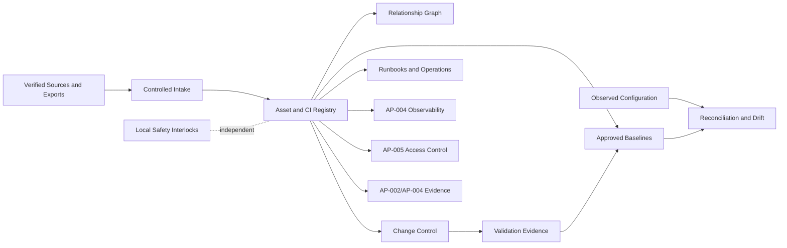

# AP-006 — Enterprise Configuration and Asset Management Architecture

| Campo | Valore |
|---|---|
| Identificativo | AP-006 |
| Titolo | Enterprise Configuration and Asset Management Architecture |
| Tipo | Architecture Package |
| Repository | `maininimassimo-bit/digital-stargate-manual` |
| Branch | `main` |
| Data | 30/07/2026 |
| Autorità | Digital StarGate Infrastructure Architect |
| Baseline | `b473e16960c405f3f63826fb086f14d7d40e1f75` |
| Dipendenze | AP-001, AP-002, AP-003, AP-004, AP-005; Capitoli 20, 22, 32, 34, 37 e 38 |
| Stato | Proposed for independent ARB review |

## 1. Scopo

AP-006 definisce il modello enterprise per identificare, governare, versionare, verificare e ritirare asset e configuration item (CI) di Digital StarGate.

Il package consolida la gestione di hardware, software, firmware, configurazioni di rete, profili applicativi, procedure, documentazione e relazioni operative. Non certifica l'inventario fisico esistente, non introduce una CMDB di prodotto e non assume che le versioni o i seriali non verificati siano corretti.

## 2. Baseline verificata

Il repository documenta già:

- il repository Git come fonte autorevole per documentazione e configurazioni versionabili;
- classificazione delle modifiche standard, normali, critiche e di emergenza;
- baseline candidate `DSG-BL-HW`, `DSG-BL-SW`, `DSG-BL-NET`, `DSG-BL-OPS` e `DSG-BL-DOC`;
- procedura di modifica con backup, branch, test, approvazione, integrazione e rollback;
- codifica asset `DSG-<CATEGORIA>-<NUMERO>`;
- scheda minima per asset e inventario iniziale;
- lifecycle asset da acquistato a dismesso;
- necessità di ricambi critici e KPI.

Non risultano verificati in modo completo:

- owner e custodian dei CI;
- seriali, date di installazione, garanzie e licenze;
- versioni correnti di firmware, driver e software;
- relazioni end-to-end tra asset, CI, servizi, procedure e safety boundary;
- baseline approvate e relativi locator immutabili;
- drift detection, audit periodico e reconciliation;
- disponibilità e ubicazione dei ricambi;
- test di rollback su tutte le classi di CI;
- processo formalizzato di commissioning e decommissioning.

## 3. Driver

1. Inventario unico, attribuibile e verificabile.
2. Separazione tra asset fisico, CI logico e baseline approvata.
3. Ogni modifica deve essere autorizzata, testata, tracciata e reversibile.
4. La configurazione dichiarata non equivale alla configurazione osservata.
5. Il drift deve essere rilevabile e riconciliabile.
6. Safety e operazioni locali devono restare disponibili durante guasti della CMDB o del repository.
7. Nessun aggiornamento remoto deve aggirare interlock locali o change control.
8. Seriali, secret, indirizzi sensibili e licenze devono essere protetti secondo classificazione.
9. Il lifecycle deve includere acquisizione, commissioning, esercizio, manutenzione, riserva e dismissione.
10. Nessun CI viene promosso a verified senza evidence locator.

## 4. Scope

### In scope

- asset register e CI register;
- hardware, software, firmware, driver, rete, profili e procedure;
- configuration baseline e release baseline;
- relazioni e dipendenze tra CI;
- change control e rollback;
- configuration drift detection e reconciliation;
- commissioning, maintenance e decommissioning;
- audit, evidence, KPI e reporting;
- ricambi, obsolescenza e continuità operativa;
- integrazione con identity, observability e release governance.

### Out of scope

- scelta di una piattaforma CMDB o ITSM;
- inventario fisico certificato;
- aggiornamento automatico di firmware o dispositivi;
- modifica di logiche safety, interlock o soglie;
- pubblicazione di secret, seriali sensibili o configurazioni non sanificate;
- certificazione di disponibilità, cybersecurity o safety;
- promozione automatica di capability.

## 5. Concetti canonici

### 5.1 Asset

Entità con valore, costo, ownership, ubicazione e lifecycle. Può essere fisica, software, licenza, servizio o ricambio.

### 5.2 Configuration Item

Elemento governato perché la sua configurazione o relazione può influire su servizio, sicurezza, operabilità, recovery o compliance.

### 5.3 Baseline

Snapshot approvato e immutabile dell'insieme di CI, versioni, relazioni e evidence applicabili a uno scope e a un momento definiti.

### 5.4 Observed configuration

Configurazione rilevata tramite ispezione, export, comando, API o telemetry. Non è autorevole finché non viene verificata e riconciliata.

### 5.5 Desired configuration

Configurazione approvata e attesa. Deve avere owner, versione, data di efficacia, evidence e rollback.

### 5.6 Drift

Differenza non autorizzata o non riconciliata tra configurazione desired e observed.

## 6. Modello CI minimo

Ogni CI deve dichiarare almeno:

```text
ci_id
ci_type
name
asset_id
owner
custodian
criticality
safety_relevance
environment
location
manufacturer
model
serial_reference
hardware_revision
firmware_version
driver_version
software_version
configuration_version
desired_state_locator
observed_state_locator
baseline_id
lifecycle_state
support_status
maintenance_class
backup_locator
rollback_locator
relationships
last_verified_at
verified_by
next_review_at
classification
status
```

I campi non verificati devono essere esplicitamente `DA VALIDARE`, mai dedotti.

## 7. Classificazione dei CI

| Classe | Esempi | Controllo minimo |
|---|---|---|
| Safety-relevant | controller cupola, finecorsa, emergency stop | doppia verifica, test controllato, rollback e presenza locale quando richiesta |
| Mission-critical | EAGLE, montatura, storage operativo, accesso remoto | backup, health evidence, recovery e change window |
| Operational | camere, fuocheggiatori, profili N.I.N.A./PHD2/CPWI | versioning, compatibility test e rollback |
| Infrastructure | router, VPN, firewall, alimentazione, NTP | change control, export sanificato e recovery |
| Information | manuale, runbook, schema, checklist | review, approvazione e link integrity |
| Spare | alimentatori, cavi, supporti, sensori di riserva | quantità, ubicazione, stato e test periodico |

## 8. Relazioni canoniche

Relazioni minime:

- `installed_on`;
- `connected_to`;
- `powered_by`;
- `controlled_by`;
- `depends_on`;
- `monitored_by`;
- `protected_by`;
- `configured_by`;
- `backed_up_by`;
- `replaced_by`;
- `documented_by`;
- `operated_through`.

Ogni relazione deve avere direzione, owner, stato e data di verifica. Nessuna relazione documentale prova da sola la connessione fisica.

## 9. Baseline model

Baseline minime:

| ID | Scope | Contenuto |
|---|---|---|
| DSG-BL-HW | hardware installato e ricambi | asset, revisioni, ubicazione, stato |
| DSG-BL-SW | software, driver e firmware | versioni, compatibility, licenze, package |
| DSG-BL-NET | rete e accesso remoto | apparati, configurazioni sanificate, dipendenze e recovery |
| DSG-BL-AUTO | automazione osservatorio | profili, sequenze, adapter, use case e boundary AP-003 |
| DSG-BL-OBS | telemetry e observability | producer, signal contract, routing e retention AP-004 |
| DSG-BL-IAM | identità e trust | account, ruoli, certificati e policy AP-005 senza secret |
| DSG-BL-OPS | procedure e runbook | avvio, chiusura, emergenza, manutenzione |
| DSG-BL-DOC | architettura e manuale | ADR, AP, review, capitoli e release note |

Una baseline è valida solo se contiene:

- scope e owner;
- lista CI e versioni;
- relazioni rilevanti;
- commit/tag o locator immutabile;
- test ed evidence;
- eccezioni e waiver;
- data di efficacia;
- criterio di rollback;
- approvazione.

## 10. Logical CMDB architecture



La CMDB è un modello logico. La sua indisponibilità non deve impedire safety locale, arresto di emergenza o recovery manuale.

## 11. Change control

Ogni change record deve includere:

- change ID e classificazione;
- requester, owner e approver;
- CI e relazioni coinvolte;
- motivazione e risultato atteso;
- rischio, safety impact e cybersecurity impact;
- prerequisiti e finestra;
- backup e rollback;
- validation plan;
- expected telemetry e audit events;
- esito, anomalie e evidence;
- baseline risultante o ripristinata.

### Change di emergenza

È ammesso per ripristino o contenimento. Deve preservare interlock e safe state, registrare le azioni appena possibile e richiedere review post-evento.

## 12. Drift management

Categorie:

1. expected drift: temporaneo e autorizzato;
2. benign drift: non critico ma da riconciliare;
3. material drift: impatta operabilità, recovery o security;
4. safety-relevant drift: richiede sospensione dell'automazione interessata e verifica locale;
5. unknown drift: origine non attribuita, trattato come incidente di configurazione.

Il drift non deve essere corretto automaticamente sui CI safety-relevant senza change approvato, precondizioni e rollback.

## 13. Lifecycle

```text
PROPOSED -> ACQUIRED -> REGISTERED -> IN_TEST -> COMMISSIONED -> OPERATIONAL
-> MAINTENANCE -> RESERVED -> DECOMMISSIONING -> RETIRED -> DISPOSED
```

Gate minimi di commissioning:

- identificazione e ownership;
- ispezione e compatibilità;
- configurazione e backup iniziale;
- test funzionali e failure mode applicabili;
- aggiornamento relazioni;
- runbook e rollback;
- security review;
- safety review quando rilevante;
- baseline approval.

## 14. Safety review obbligatoria

AP-006 richiede valutazione esplicita di:

- perdita di connettività durante un change;
- telemetry stale o assente;
- perdita di alimentazione;
- controller failure;
- chiusura parziale;
- emergency stop;
- manual override;
- verifica dello stato sicuro;
- incompatibilità firmware/driver;
- rollback incompleto;
- configurazione osservata diversa dalla baseline.

Nessuna baseline, CMDB o automazione di deployment è autorità safety. I finecorsa, gli interlock locali, l'E-stop e la conferma fisica restano indipendenti dall'applicazione.

## 15. Security e data governance

- secret e chiavi non sono memorizzati nel registro;
- seriali, licenze e configurazioni sensibili sono classificati e access-controlled;
- ogni modifica privilegiata è attribuibile secondo AP-005;
- audit e retention seguono AP-002 e AP-004;
- export e backup devono essere sanificati o protetti;
- device e service identity sono riferiti tramite locator, non tramite credenziali.

## 16. Observability

Signal candidati:

- CI discovered/updated/retired;
- baseline created/approved/activated;
- drift detected/acknowledged/resolved;
- change started/completed/rolled back;
- backup verified/failed;
- firmware or certificate expiry approaching;
- asset unavailable/maintenance due;
- relationship verification overdue.

Soglie, SLI, SLO e routing restano da deliberare e misurare secondo AP-004.

## 17. Migration

### Fase 0 — Discovery

Inventariare CI, owner, versioni, seriali, relazioni, backup e open issue senza modificare runtime.

### Fase 1 — Canonical register

Normalizzare ID, tipi, lifecycle e classificazione. Collegare Capitoli 20 e 22 senza duplicarli.

### Fase 2 — Baseline pilot

Creare una baseline pilota su uno scope non safety-critical e verificare reconciliation e rollback.

### Fase 3 — Critical CI onboarding

Integrare rete, EAGLE, automazione e CI safety-relevant con commissioning controllato.

### Fase 4 — Drift and operations

Abilitare detection, reporting e review periodica. L'auto-remediation resta esclusa salvo decisione dedicata.

### Fase 5 — Evidence and re-review

Raccogliere evidence, chiudere i gap e richiedere review mirata prima di dichiarare readiness operativa.

## 18. Rollback

Rollback minimo:

1. interrompere il change e preservare lo stato sicuro;
2. disabilitare automation o accesso coinvolto quando necessario;
3. ripristinare configurazione e package precedenti;
4. riavviare solo secondo runbook;
5. verificare connettività, stato dispositivi e interlock;
6. riconciliare observed e desired state;
7. conservare log ed evidence;
8. aggiornare incident, change e baseline register.

## 19. RACI candidato

| Attività | Owner progetto | Infrastructure Architect | Technical Administrator | Operator | Local Maintainer | ARB |
|---|---|---|---|---|---|---|
| Standard e modello CI | A | R | C | I | C | C |
| Inventario e discovery | A | C | R | C | R | I |
| Change normale | A | C | R | C | C | I |
| Change safety-relevant | A | R | C | I | R | C |
| Baseline approval | A | R | C | I | C | C |
| Audit e review | A | C | C | I | I | R |

Assegnazioni nominative e combinazioni di ruolo restano da formalizzare.

## 20. KPI candidati

- percentuale CI con owner;
- percentuale CI con versione e evidence recenti;
- percentuale asset con seriale verificato;
- drift aperti per severità;
- change success rate;
- rollback success rate;
- baseline age e review overdue;
- backup configuration verification rate;
- asset oltre manutenzione;
- ricambi critici verificati e disponibili.

## 21. Acceptance criteria

AP-006 è pronto per review quando:

1. package e reference architecture sono pubblicati;
2. asset, CI, baseline e drift sono distinti;
3. safety boundary e degraded mode sono espliciti;
4. migration, commissioning e rollback sono definiti;
5. traceability register e MkDocs sono aggiornati;
6. tutti i dati non verificati sono marcati come open issue;
7. nessun prodotto, device behavior o readiness runtime è dichiarato senza evidence.

## 22. Open issues

- owner formale Configuration and Asset Management;
- inventario CI completo;
- seriali e date installazione;
- versioni firmware, driver e software;
- support status, licenze e warranty;
- locator backup e rollback;
- relazioni fisiche e logiche verificate;
- ricambi e ubicazioni;
- CMDB implementation choice;
- drift collection method;
- baseline approval authority;
- test di commissioning, rollback e decommissioning.

## 23. Validazioni eseguite

- ispezione di AP-005 e della baseline architetturale disponibile;
- ispezione dei Capitoli 20 e 22;
- ispezione del Traceability Register;
- ispezione della navigazione MkDocs;
- verifica del repository e del branch `main` tramite connettore GitHub.

## 24. Validazioni non eseguite

- inventario fisico;
- accesso ai dispositivi;
- export runtime;
- verifica seriali o licenze;
- test firmware, driver o compatibility;
- commissioning o rollback;
- drift detection;
- `mkdocs build --strict`;
- link check;
- CI/CD e runtime validation.

## 25. Decisione richiesta

AP-006 è pubblicato come **Proposed for independent ARB review**. La review prevista è **ARB-008**. Nessuna capability o readiness operativa viene promossa da questo package.