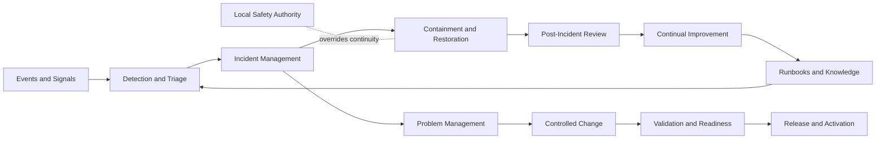

# AP-007 — Enterprise Operations and Service Management Architecture

| Campo | Valore |
|---|---|
| Identificativo | AP-007 |
| Titolo | Enterprise Operations and Service Management Architecture |
| Tipo | Architecture Package |
| Repository | `maininimassimo-bit/digital-stargate-manual` |
| Branch | `main` |
| Data | 30/07/2026 |
| Autorità | Digital StarGate Chief Architect |
| Sponsor | Project Owner / Architecture Sponsor — Massimo Mainini |
| Dipendenze | AP-001…AP-006; ADR-004; capitoli 18, 19, 25, 29, 30, 31, 34, 38, 40 e 41 |
| Stato | Proposed for independent ARB review |
| Target release | Da assegnare |

## 1. Scopo

AP-007 definisce il modello operativo enterprise di Digital StarGate: ownership dei servizi, gestione di eventi e incidenti, problem management, change e release coordination, manutenzione, runbook, readiness, KPI, escalation e modalità degradate.

Il package non certifica operatività continua, non sostituisce la safety locale, non introduce automaticamente una piattaforma ITSM e non autorizza comandi remoti o automazioni non già governate.

## 2. Baseline verificata

Il repository documenta già:

- separazione permanente tra workstation di sviluppo e nodo operativo EAGLE tramite ADR-004;
- procedure di avvio, chiusura, emergenza, recovery e manutenzione;
- troubleshooting e problem management documentali;
- reportistica, KPI e registri operativi;
- change control, configuration baseline e rollback in AP-006;
- telemetry e observability in AP-004;
- identity e privileged access in AP-005;
- automazione e safety boundary in AP-003.

Restano non formalizzati o non verificati:

- service catalog e service owner;
- matrice RACI operativa;
- severity, priority e impact model;
- SLI, SLO, escalation e reperibilità;
- contratti minimi di Incident, Problem, Change, Maintenance e Operational Readiness;
- criteri uniformi per degraded mode e service restoration;
- evidence di esercizio continuativo;
- esercitazioni di recovery, escalation e handover.

## 3. Driver

1. Rendere attribuibile ogni servizio operativo.
2. Separare evento, alert, incidente, problema e change.
3. Preservare safety locale durante guasti applicativi, di rete o organizzativi.
4. Rendere le procedure eseguibili, versionate e verificabili.
5. Definire readiness prima dell'attivazione di nuove capability.
6. Governare modalità degradate senza presentare stato ignoto come sicuro.
7. Collegare KPI, SLI, SLO, evidence e decisioni operative.
8. Coordinare AP-008…AP-015 attraverso un operating model comune.

## 4. Scope

### In scope

- service portfolio e service catalog;
- service ownership e RACI;
- event, alert e incident management;
- major incident management;
- problem management e known error;
- change e release coordination;
- manutenzione preventiva e correttiva;
- runbook e procedure operative;
- operational readiness review;
- degraded mode, continuity e restoration;
- KPI, SLI, SLO, escalation e reporting;
- post-incident review e continual improvement.

### Out of scope

- scelta di un prodotto ITSM;
- implementazione del DSOC;
- progettazione API ed event bus di AP-008;
- topologia infrastrutturale di AP-009;
- certificazione safety di AP-010;
- autorizzazione di controllo remoto;
- dichiarazione di disponibilità o SLA non supportata da evidence.

## 5. Concetti canonici

### Service

Outcome operativo fornito da capability, persone, procedure, asset e sistemi con owner, consumer, criticality e condizioni di esercizio definite.

### Event

Fatto osservato. Non implica automaticamente anomalia.

### Alert

Segnalazione che una condizione richiede valutazione operativa. Un alert non è automaticamente un incidente.

### Incident

Interruzione, degrado o comportamento non atteso di un servizio che richiede contenimento, ripristino e tracciamento.

### Problem

Causa nota o potenziale di uno o più incidenti. Può esistere anche senza incidente attivo.

### Known Error

Problema analizzato con causa o workaround documentato, ma non necessariamente risolto definitivamente.

### Degraded Mode

Stato dichiarato in cui un servizio opera con capability, affidabilità o automazione ridotte entro limiti espliciti.

### Operational Readiness

Evidenza che servizio, owner, runbook, monitoraggio, recovery, security, safety boundary e support model sono sufficienti per l'attivazione prevista.

## 6. Service model minimo

```text
service_id
name
purpose
service_owner
technical_owner
operator
consumers
criticality
safety_relevance
service_hours
dependencies
support_model
entry_criteria
exit_criteria
normal_mode
degraded_modes
safe_state_reference
sli
slo
alerts
runbooks
recovery_objective
backup_reference
change_class
maintenance_window
escalation_path
status
last_reviewed_at
```

Campi non verificati devono essere marcati `DA VALIDARE`.

## 7. Operating model



## 8. Service ownership e RACI

Ruoli minimi:

- Project Owner / Architecture Sponsor;
- Service Owner;
- Technical Owner;
- Operator;
- Incident Coordinator;
- Change Approver;
- Safety Authority;
- Security Authority;
- Documentation Governor;
- Architecture Review Board.

Una singola persona può ricoprire più ruoli, ma responsabilità e conflitti devono essere espliciti. Safety Authority e Change Approver non possono essere implicitamente sostituiti da dashboard, script o AI.

## 9. Classificazione operativa

| Livello | Descrizione | Risposta minima |
|---|---|---|
| SEV-1 | rischio safety, perdita di controllo, impossibilità di raggiungere stato sicuro | interrompere automazione interessata, attivare procedura d'emergenza, escalation immediata |
| SEV-2 | servizio mission-critical indisponibile o fortemente degradato | contenimento rapido, owner coinvolto, aggiornamenti periodici |
| SEV-3 | degrado operativo con workaround | gestione pianificata e tracciamento |
| SEV-4 | difetto minore, richiesta o miglioramento | backlog e priorità ordinaria |

La severità descrive l'impatto; la priorità considera anche urgenza, finestra osservativa e rischio di propagazione.

## 10. Incident management

Ogni Incident Record deve includere:

- incident ID;
- servizio e CI coinvolti;
- detection time, acknowledgement e restoration time;
- severity, impact e safety relevance;
- stato osservato e freshness;
- azioni di contenimento;
- decisioni e responsabili;
- workaround e recovery path;
- comunicazioni ed escalation;
- evidence e timeline;
- relazione con Problem, Change e post-incident review.

Per SEV-1 e SEV-2 è obbligatoria una timeline consolidata. Nessun incidente è chiuso solo perché l'alert è cessato: deve essere verificato il ripristino del servizio e, quando applicabile, lo stato fisico sicuro.

## 11. Major incident

Il Major Incident Coordinator:

1. stabilisce un canale unico di coordinamento;
2. separa restoration da root cause analysis;
3. protegge i log e le evidence;
4. impedisce change concorrenti non essenziali;
5. registra decisioni, assunzioni e unknown;
6. conclude con handover, review e azioni tracciate.

## 12. Problem management

Ogni Problem Record deve collegare incidenti, sintomi, ipotesi, causa verificata o non verificata, workaround, known error, rischio residuo e change proposti.

La root cause non deve essere dichiarata senza evidence. Quando non è determinabile, lo stato resta `unknown` con piano di indagine.

## 13. Change e release coordination

AP-006 governa CI, baseline e rollback. AP-007 aggiunge:

- impatto sul servizio;
- comunicazione agli operatori;
- change window;
- blackout e freeze period;
- readiness gate;
- supporto post-attivazione;
- criteri di abort e rollback;
- verifica del servizio dopo il change.

Classi: standard, normal, emergency e safety-relevant. Un emergency change richiede review post-evento.

## 14. Runbook governance

Ogni runbook deve dichiarare:

```text
runbook_id
service_id
trigger
preconditions
required_role
safety_checks
steps
expected_signals
timeout
abort_conditions
manual_override
rollback_or_recovery
evidence_to_capture
escalation
version
owner
last_tested_at
```

Un runbook non testato è documentazione candidata, non evidence operativa.

## 15. Degraded mode

Ogni servizio critico deve dichiarare almeno:

- trigger di ingresso;
- capability disponibili e indisponibili;
- durata massima o criterio di riesame;
- operator actions;
- dipendenze vietate;
- safety constraints;
- exit criteria;
- evidenze da registrare.

Principi:

- `unknown` non equivale a normale o sicuro;
- perdita telemetry non autorizza continuità automatica;
- la modalità manuale non è automaticamente meno rischiosa;
- l'operatività degradata deve essere visibile e auditabile;
- la safety locale prevale sulla continuità del servizio.

## 16. Operational Readiness Review

Gate minimi:

- owner e support model assegnati;
- service dependencies note;
- runbook di normal, degraded e recovery mode;
- monitoring e alert con owner;
- accessi e privilegi verificati;
- backup e rollback disponibili;
- failure mode e safety boundary valutati;
- change e release plan;
- evidence di test;
- rischi residui accettati;
- handover completato.

Esiti: `READY`, `READY WITH CONDITIONS`, `NOT READY`.

## 17. SLI, SLO e KPI

SLI candidati:

- service availability osservata;
- session success rate;
- mean time to acknowledge;
- mean time to restore;
- incident recurrence rate;
- failed change rate;
- rollback success rate;
- runbook test coverage;
- maintenance overdue;
- alert noise ratio;
- telemetry freshness compliance;
- degraded-mode duration.

Gli SLO devono essere deliberati dopo una baseline misurata. AP-007 non inventa SLA o soglie numeriche.

## 18. Observability e audit

Eventi operativi candidati:

- service state changed;
- incident opened/acknowledged/escalated/restored/closed;
- degraded mode entered/exited;
- runbook started/completed/aborted;
- maintenance due/started/completed;
- readiness review decided;
- change activated/rolled back;
- post-incident action overdue.

Ogni evento deve includere timestamp affidabile, service ID, correlation ID, actor, source, stato precedente e nuovo stato quando applicabile.

## 19. Security e safety

- privilegi operativi seguono AP-005;
- change e configurazioni seguono AP-006;
- signals ed evidence seguono AP-002/AP-004;
- l'automazione segue AP-003;
- AP-010 governerà la safety assurance completa;
- nessun portale, catalogo, CMDB o AI è safety authority;
- break-glass richiede audit e post-review;
- secret non devono essere inseriti in ticket, runbook o report.

## 20. Migrazione incrementale

1. Inventario dei servizi e nomina owner.
2. Definizione dei contratti minimi e della tassonomia operativa.
3. Consolidamento dei runbook esistenti.
4. Pilot su un servizio non safety-critical.
5. Pilot incident/problem/change end-to-end.
6. Operational Readiness Review.
7. Estensione ai servizi mission-critical.
8. Integrazione futura con DSOC e DSGP.

## 21. Traceability

| Driver / requisito | Decisione AP-007 | Dipendenza / evidenza |
|---|---|---|
| separazione sviluppo/produzione | EAGLE è nodo operativo, non workstation di sviluppo | ADR-004 |
| eventi e telemetry | distinguere event, alert e incident | AP-004 |
| change e rollback | coordinamento service-level su baseline AP-006 | AP-006 |
| accessi privilegiati | ruoli, audit e break-glass | AP-005 |
| automazione e safe state | safety prevale sulla continuità | AP-003; futuro AP-010 |
| DSOC | consumer del modello operativo, non fonte autorevole | futuro AP-012 |

## 22. Acceptance criteria

- service model e ownership definiti;
- incident, problem, change, runbook e readiness contract definiti;
- severity e degraded mode espliciti;
- safety boundary preservato;
- SLI candidati distinti da SLO deliberati;
- integrazione con AP-003…AP-006 coerente;
- reference architecture pubblicata;
- traceability register e MkDocs aggiornati;
- package pronto per review ARB indipendente.

## 23. Rischi e questioni aperte

- owner operativi ancora da nominare formalmente;
- assenza di baseline misurata per SLO;
- nessuna evidence continuativa di reperibilità o supporto;
- runbook non collaudati end-to-end;
- possibile sovrapposizione tra ticket, report e registri;
- tooling ITSM non selezionato;
- integrazione DSOC non ancora progettata;
- AP-010 non ancora disponibile per safety assurance completa.

## 24. Validazioni

### Eseguite

- verifica di ADR-004 e della separazione Development/Operations;
- verifica delle dipendenze AP-003…AP-006;
- verifica di AMP-002 e del traceability register;
- verifica per ispezione dei boundary safety, security, configuration e observability;
- verifica semantica Mermaid per ispezione.

### Non eseguite

- `mkdocs build --strict`;
- link checker automatico;
- test browser;
- pilot operativo;
- simulazione major incident;
- test runbook e degraded mode;
- misurazione SLI/SLO;
- review ARB indipendente.

## 25. Decisione

AP-007 propone il modello operativo enterprise di Digital StarGate ed è pronto per una review ARB indipendente. Non promuove capability a Operationally Verified e non autorizza nuove automazioni o comandi remoti.