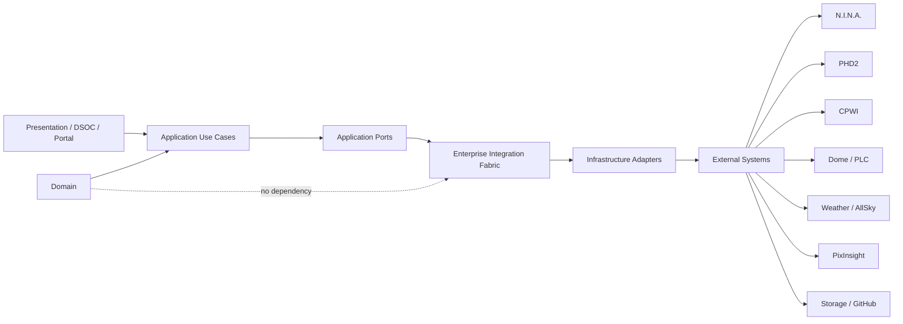

# AP-008 — Enterprise Integration Architecture

| Campo | Valore |
|---|---|
| Identificativo | AP-008 |
| Titolo | Enterprise Integration Architecture |
| Tipo | Architecture Package |
| Repository | `maininimassimo-bit/digital-stargate-manual` |
| Branch | `main` |
| Data | 30/07/2026 |
| Autorità | Digital StarGate Chief Architect |
| Sponsor | Project Owner / Architecture Sponsor — Massimo Mainini |\n| Owner / Accountable | Massimo Mainini |
| Dipendenze | AP-001…AP-007; ADR-004; OPS-REF-001; CAP-08, CAP-15…CAP-19, CAP-34…CAP-40 |
| Stato | Approved with Conditions — shadow pilot and proposed read-only transport; live NOT_READY |
| Target release | Da assegnare |

## Current disposition\n\nThe architecture package is closed at the governed document and design level with conditions. The repository shadow pilot is `READY_WITH_CONDITIONS`, and the `SessionCompleted` outbound HTTPS relay is a proposed read-only transport. No live adapter, broker, scheduler, command path or Safety Authority integration is active. Live closure requires the AP008 live-readiness gates and a new ARB decision.\n\n## 1. Scopo

AP-008 definisce il modello di integrazione enterprise di Digital StarGate mediante un **Enterprise Integration Fabric (EIF)** technology-neutral. Il package governa API, eventi, comandi, query, adapter, affidabilità, sicurezza, osservabilità, ownership e ciclo di vita dei contratti.

Il package non seleziona un broker, un API gateway o un prodotto ESB; non autorizza controllo remoto; non sostituisce gli interlock locali; non certifica integrazioni runtime non provate.

## 2. Decisione architetturale

Digital StarGate adotta l'EIF come modello di integrazione comune. Nuove integrazioni punto-punto sono vietate salvo eccezione motivata e approvata dall'Architecture Review Board.

L'EIF è un insieme governato di:

- contratti canonici;
- porte applicative e adapter infrastrutturali;
- meccanismi sincroni e asincroni;
- policy di sicurezza, resilienza e osservabilità;
- registri di ownership, versioni, compatibilità ed evidence.

## 3. Baseline verificata

Il repository contiene già:

- separazione tra Domain, Application, Infrastructure ed External Systems;
- contratti di piattaforma e capability documentate;
- telemetry e correlation requirements in AP-004;
- identity, access e remote-operation boundaries in AP-005;
- configuration baseline e asset governance in AP-006;
- service ownership, incident, runbook e readiness gates in AP-007;
- visioni per DSAP, DSOC, Scientific Image Repository, Catalog e Knowledge Layer.

Restano da deliberare o provare:

- catalogo canonico di eventi, comandi e query;
- ownership dei contratti e degli adapter;
- regole di compatibilità e deprecazione;
- protocolli live e freshness;
- command path e BFF boundary;
- retry, timeout, dead letter, inbox/outbox e reconciliation;
- credenziali e trust degli adapter;
- test di failure, duplicate delivery, ordering e recovery.

## 4. Driver

1. Eliminare dipendenze punto-punto non governate.
2. Rendere sostituibili sistemi esterni e trasporti.
3. Separare fatti, richieste di azione e letture.
4. Assicurare attribuzione, autorizzazione e audit dei comandi.
5. Rendere osservabile ogni scambio end-to-end.
6. Gestire guasti, duplicati, ritardi e stato ignoto.
7. Supportare AP-009…AP-015 senza ridefinire l'integrazione.
8. Preservare safety locale e capacità di raggiungere lo stato sicuro.

## 5. Scope

### In scope

- Enterprise Integration Fabric;
- API e contract-first governance;
- command, event e query model;
- adapter architecture;
- request/reply, publish/subscribe e document transfer;
- idempotency, retry, timeout, circuit breaker, inbox/outbox e dead letter;
- correlation, causation, freshness e provenance;
- authentication, authorization e trust boundaries;
- integration observability e operational support;
- versioning, compatibility, certification e deprecation;
- synchronization, reconciliation e conflict handling.

### Out of scope

- scelta del prodotto middleware;
- topologia fisica definitiva di AP-009;
- safety assurance e hazard certification di AP-010;
- implementazione di DSAP, DSOC o piattaforme scientifiche;
- accesso diretto UI-to-device;
- promessa di exactly-once fisico;
- autorizzazione implicita derivante dal possesso di connettività.

## 6. Principi vincolanti

- **Contract first**: schema e semantica precedono l'implementazione.
- **Loose coupling**: consumer e producer non dipendono da SDK o modelli interni altrui.
- **Adapter isolation**: ogni sistema esterno è isolato dietro una porta.
- **Event as fact**: un evento descrive un fatto già avvenuto e non ordina un'azione.
- **Command accountability**: ogni comando ha principal, authorization decision, correlation e outcome.
- **Query side-effect free**: una query non modifica lo stato.
- **Version explicitly**: ogni contratto pubblico è versionato.
- **Backward compatibility by default**: breaking change richiede nuova major version e migrazione.
- **At-least-once aware**: consumer idempotenti quando il trasporto può rideliverare.
- **Unknown is valid**: freshness scaduta o sorgente non raggiungibile produce stato `unknown`.
- **Safety over continuity**: EIF e cloud non sono autorità safety.
- **Observable by design**: metriche, log e trace sono parte del contratto operativo.

## 7. Modello canonico

Ogni envelope pubblico include almeno:

```yaml
contract_id: DSG.<domain>.<type>.<name>
contract_version: 1.0.0
message_id: uuid
occurred_at: timestamp
published_at: timestamp
correlation_id: uuid
causation_id: uuid|null
producer: string
subject: string
schema_uri: string
classification: public|internal|restricted
freshness: current|stale|unknown
trace_context: object
payload: object
```

Campi non disponibili non devono essere inventati. `unknown`, `null` e `not_applicable` hanno semantica distinta.

## 8. Famiglie di contratto

### Command Contract

Richiesta intenzionale di cambiamento. Campi aggiuntivi:

```yaml
command_id: uuid
command_name: string
requested_by: principal
requested_at: timestamp
authorization_context: object
preconditions: []
expires_at: timestamp
idempotency_key: string
safety_class: non_safety|safety_relevant
expected_outcome: string
```

Un comando accettato non equivale a comando completato. Gli outcome canonici sono `accepted`, `rejected`, `in_progress`, `succeeded`, `failed`, `expired`, `cancelled`, `unknown`.

### Integration Event

Fatto immutabile e versionato destinato a consumer esterni al bounded context. Non espone entità Domain o tipi di persistenza.

### Query Contract

Richiesta di lettura priva di effetti collaterali. La risposta dichiara source, timestamp, freshness, incompletezza ed eventuali errori parziali.

### Document e Binary Payload

Immagini, log estesi e file scientifici viaggiano per riferimento governato, checksum e manifest; non sono incorporati negli eventi salvo payload piccoli e motivati.

## 9. Architecture layers



Il Domain non dipende da broker, API gateway, filesystem, database, ASCOM, SDK o client esterni.

## 10. Adapter architecture

Ogni adapter dichiara:

```text
adapter_id
external_system
owner
supported_contracts
protocol
trust_boundary
credential_reference
configuration_items
health_model
timeouts
retry_policy
rate_limit
idempotency_behavior
ordering_behavior
failure_mapping
observability
runbooks
compatibility_matrix
certification_status
```

Gli adapter traducono protocolli e modelli esterni; non prendono decisioni safety, non bypassano authorization e non diventano sorgente autorevole per dati che non possiedono.

## 11. Pattern di comunicazione

| Pattern | Uso | Regole |
|---|---|---|
| Request/reply | query e comandi a risposta rapida | timeout obbligatorio; nessuna attesa infinita |
| Publish/subscribe | fatti e notifiche | consumer idempotenti; schema versionato |
| Store-and-forward | siti intermittenti | coda durevole, replay controllato, freshness |
| Document transfer | immagini e manifest | checksum, URI stabile, provenance |
| Reconciliation | cataloghi e storage | confronto periodico, conflitti espliciti |
| Saga/process manager | workflow distribuiti lunghi | solo quando serve compensazione e stato esplicito |

## 12. Affidabilità

- retry solo per errori classificati transient;
- exponential backoff con jitter e limite massimo;
- circuit breaker per proteggere dipendenze instabili;
- dead-letter quarantine con owner e runbook;
- idempotency key per comandi ripetibili;
- inbox per deduplicazione consumer quando necessario;
- outbox transazionale quando stato e pubblicazione devono essere atomici;
- ordering garantito solo per subject/partition dichiarati;
- replay autorizzato e auditato;
- nessuna dichiarazione di exactly-once fisico.

## 13. Sicurezza e safety

- autenticazione reciproca dove applicabile;
- autorizzazione esplicita per contratto, risorsa e azione;
- least privilege e credenziali per adapter, non condivise;
- secret fuori dai documenti e dai payload;
- firma o integrità verificabile per comandi critici;
- anti-replay, expiry e nonce per command path;
- audit immutabile di richiesta, decisione e outcome;
- nessun comando remoto può aggirare interlock locali;
- perdita EIF, rete o cloud non impedisce la safety locale;
- UI, AI, dashboard e broker non sono Safety Authority.

## 14. Osservabilità

Per ogni scambio sono richiesti, quando applicabili:

- correlation e causation ID;
- distributed trace boundary;
- latency, throughput, error rate e saturation;
- queue depth, oldest-message age e dead-letter count;
- adapter health e dependency health;
- retry, timeout, duplicate e replay metrics;
- freshness e last-successful-sync;
- log strutturati privi di secret;
- dashboard e alert collegati a runbook e owner.

## 15. Governance del ciclo di vita

Stati del contratto: `draft`, `proposed`, `approved`, `active`, `deprecated`, `retired`.

Ogni contratto possiede owner, consumer registrati, schema, esempi, compatibility policy, threat assessment, operational support, test evidence e data classification.

Una breaking change richiede:

1. nuova major version;
2. impact analysis sui consumer;
3. periodo di convivenza;
4. migration plan;
5. telemetry di adozione;
6. decisione di retirement.

## 16. Cataloghi iniziali

### Command candidate

- `DSG.Observatory.Command.StartSession`
- `DSG.Observatory.Command.AbortSession`
- `DSG.Dome.Command.RequestOpen`
- `DSG.Dome.Command.RequestClose`
- `DSG.Processing.Command.RegisterProcessingRun`

Sono candidati, non autorizzazioni operative.

### Event candidate

- `DSG.Observation.Event.SessionStarted`
- `DSG.Observation.Event.SessionCompleted`
- `DSG.Weather.Event.ConditionChanged`
- `DSG.Safety.Event.UnsafeConditionDetected`
- `DSG.Asset.Event.ConfigurationChanged`
- `DSG.Processing.Event.ProcessingRunRegistered`

### Query candidate

- `DSG.Observatory.Query.GetCurrentState`
- `DSG.Weather.Query.GetLatestConditions`
- `DSG.Observation.Query.GetSession`
- `DSG.Asset.Query.GetConfigurationBaseline`
- `DSG.Processing.Query.GetProcessingRun`

## 17. Migration strategy

1. inventariare integrazioni esistenti e owner;
2. classificare safety relevance, protocollo e criticità;
3. definire contratti canonici per un pilot non safety-critical;
4. introdurre adapter senza modificare il Domain;
5. aggiungere correlation, health e failure mapping;
6. eseguire contract, duplicate, timeout e recovery test;
7. migrare consumer progressivamente;
8. ritirare collegamenti punto-punto solo dopo evidence e rollback verificato.

Pilot raccomandato: pubblicazione di report/session metadata verso portale o warehouse, non comando cupola.

## 18. Operational readiness

Prima dell'attivazione ogni integrazione deve avere:

- contract owner e adapter owner;
- compatibility matrix;
- support model e severity mapping;
- timeout, retry e dead-letter policy;
- security review;
- runbook di failure e replay;
- SLI osservabili;
- rollback o disable path;
- test evidence;
- decisione ORR conforme ad AP-007.

## 19. Traceability

| Driver / gap | Decisione AP-008 | Evidence richiesta |
|---|---|---|
| TR-G39 live/freshness | freshness canonica e query response | test stale/unknown |
| TR-G40 command path | Application Port + authorized Command Contract | threat model e command test |
| TR-G45 reconciliation | pattern e conflict handling | reconciliation PoC |
| TR-G46 adapter credentials | credential per adapter e least privilege | security review |
| TR-G54 knowledge reconciliation | retry, replay e reconciliation | AP-015 PoC |
| AP-004 | correlation e integration telemetry | dashboard e trace |
| AP-005 | trust e authorization | access evidence |
| AP-007 | owner, runbook e readiness | ORR record |

## 20. Rischi e trade-off

- governance e cataloghi aumentano il costo iniziale;
- un fabric centralizzato male implementato può diventare single point of failure;
- eventi e consistency eventuale complicano debugging e UX;
- contratti canonici troppo generici perdono significato di dominio;
- uso prematuro di broker o microservizi aumenta complessità operativa;
- dual-running durante la migrazione richiede reconciliation;
- command path remoto amplifica rischio cyber e safety.

Mitigazione: partire con modular monolith, adapter e contratti; introdurre infrastruttura distribuita solo con driver misurabili.

## 21. Acceptance criteria

- EIF e boundary definiti senza scelta prodotto;
- command, event e query semanticamente distinti;
- contract envelope, versioning e compatibility definiti;
- adapter separati da Domain e Application use case;
- reliability e failure semantics esplicite;
- security, safety e observability integrate;
- migration incrementale e pilot non safety-critical definiti;
- roadmap, traceability e MkDocs aggiornati;
- package pronto per review indipendente.

## 22. Open issues

- naming authority e contract registry owner;
- scelta dei protocolli e del deployment in AP-009;
- policy numeriche di timeout, retention e retry;
- classification dei comandi safety-relevant;
- modello BFF per DSOC e Portal;
- schema definitivo di manifest scientifici;
- compatibilità reale delle API/telemetrie N.I.N.A., PHD2, CPWI e PixInsight;
- strategia offline-first del nodo operativo.

## 23. Validazioni richieste

- rendering Mermaid;
- parsing degli esempi YAML;
- schema/contract tests;
- compatibility tests;
- duplicate, ordering, timeout e retry tests;
- dead-letter e replay exercise;
- security threat modeling;
- command authorization tests;
- reconciliation PoC;
- `mkdocs build --strict` e link checking;
- independent ARB review.

## 24. Esito

AP-008 stabilisce una baseline architetturale proposta. Non prova l'esistenza di middleware, adapter runtime, integrazioni certificate o autorizzazioni di comando. La promozione richiede review ARB, pilot, ORR ed evidence.