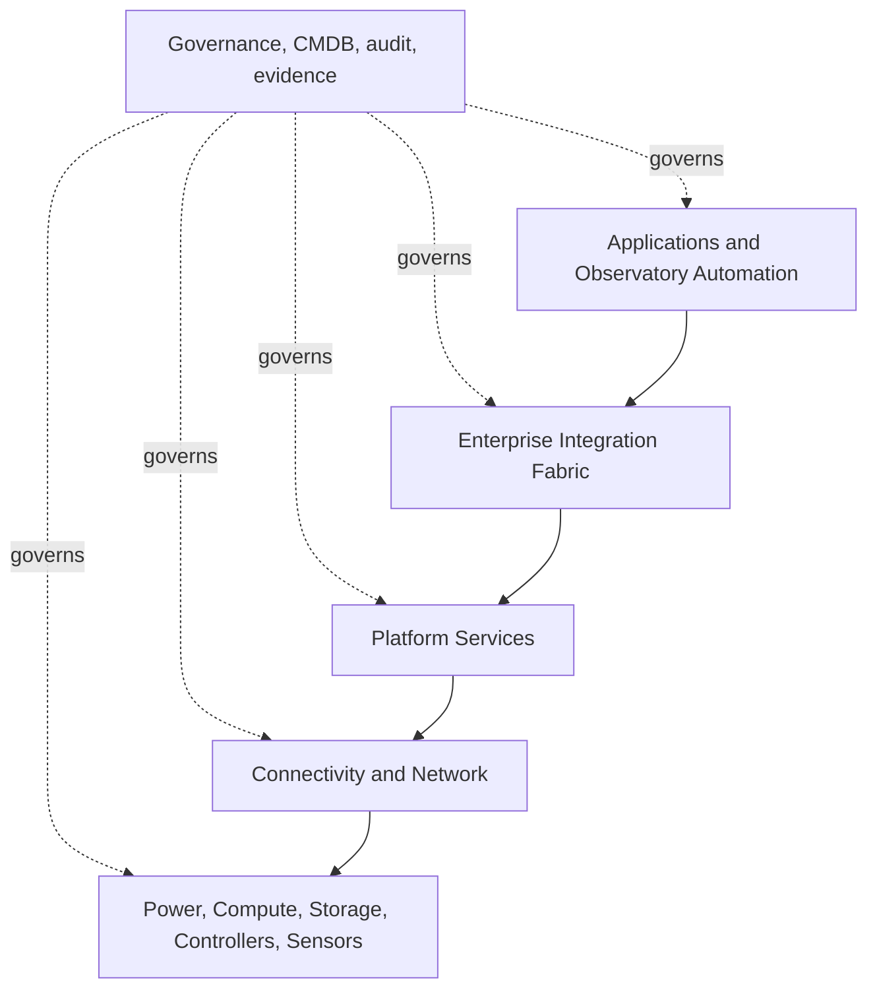

# AP-009 — Enterprise Infrastructure Architecture

| Campo | Valore |
|---|---|
| Identificativo | AP-009 |
| Titolo | Enterprise Infrastructure Architecture |
| Tipo | Architecture Package |
| Repository | `maininimassimo-bit/digital-stargate-manual` |
| Branch | `main` |
| Data | 30/07/2026 |
| Autorità | Digital StarGate Chief Architect |
| Sponsor | Project Owner / Architecture Sponsor — Massimo Mainini |
| Dipendenze | AP-003…AP-008; INF-REF-001 |
| Review | ARB-009 |
| Stato | Approved with conditions |
| Target release | Da assegnare |

## 1. Scopo

AP-009 definisce l'architettura infrastrutturale enterprise di Digital StarGate per alimentazione, connettività, compute, storage, servizi di piattaforma, continuità, monitoraggio e ciclo di vita. Il package traduce l'infrastruttura attuale dell'osservatorio in un modello governato, evolvibile e verificabile.

Non costituisce certificazione runtime, non sostituisce AP-005 per la cybersecurity, AP-007 per il service management o AP-010 per la safety assurance.

## 2. Decisione architetturale

Digital StarGate adotta un modello infrastrutturale a livelli, governato da baseline di configurazione e capability records. Le dipendenze procedono dai livelli superiori verso servizi infrastrutturali esposti mediante contratti; il Domain non dipende da prodotti, reti, storage o dispositivi.

## 3. Baseline verificata

La baseline documentale include:

- osservatorio remoto con cupola motorizzata e controller locali;
- computer di controllo EAGLE;
- connettività Starlink e LTE con VPN;
- apparati astronomici e sensori ambientali;
- capitoli dedicati a rete, alimentazione, backup, asset, collaudo e sicurezza;
- governance di configurazione in AP-006;
- operations in AP-007;
- Enterprise Integration Fabric in AP-008.

Restano da provare o deliberare:

- inventario infrastrutturale certificato e ownership completa;
- topologia as-built, segmentazione, indirizzamento e trust zones;
- RTO, RPO, retention e restore evidence;
- failover WAN misurato;
- capacity baseline e soglie;
- patching e lifecycle dei componenti;
- recovery drill e Operational Readiness Review.

## 4. Driver

1. Safety e capacità di raggiungere uno stato protetto anche durante guasti parziali.
2. Isolamento dei fault domain.
3. Sostituibilità tecnologica.
4. Accesso remoto governato e least privilege.
5. Continuità locale durante perdita WAN o cloud.
6. Integrità e recuperabilità dei dati.
7. Osservabilità end-to-end.
8. Evoluzione incrementale senza big-bang redesign.

## 5. Scope

### In scope

- alimentazione, UPS e distribuzione elettrica;
- LAN, WAN, VPN, routing, DNS, NTP e management plane;
- Starlink, LTE e failover;
- compute nodes, sistemi operativi e platform services;
- storage operativo, scientifico, backup e archivio;
- configuration baseline, hardening, patching e secrets boundary;
- monitoring, capacity, availability e recovery;
- lifecycle, obsolescenza e technology refresh.

### Out of scope

- implementazione degli adapter AP-008;
- hazard certification AP-010;
- analytics AP-011;
- DSOC AP-012;
- repository e cataloghi scientifici AP-013/AP-014.

## 6. Principi vincolanti

- **Infrastructure by contract**: i consumer dipendono da capability e contratti, non da prodotti.
- **Recovery first**: ogni servizio critico ha backup, restore owner e recovery procedure.
- **Local autonomy**: perdita WAN o cloud non disabilita le funzioni locali necessarie alla protezione.
- **Failure isolation**: power, network, compute e storage sono fault domain espliciti.
- **Observable by design**: health, metriche, log, capacità e dipendenze sono monitorabili.
- **Immutable baseline**: la configurazione approvata è versionata e confrontabile.
- **Security by default**: amministrazione remota solo tramite percorsi autorizzati.
- **Unknown is not healthy**: assenza o staleness di telemetria produce stato `unknown`.
- **No hidden dependency**: dipendenze operative e di recovery sono registrate.
- **Evidence before promotion**: nessun livello di disponibilità è dichiarato senza misure.

## 7. Modello a livelli

## 8. Capability model

Ogni capability infrastrutturale registra almeno:

- `capability_id` e owner;
- servizio fornito e consumer;
- componenti e configurazioni;
- criticità e safety relevance;
- fault domain e dipendenze;
- modalità nominale, degradata e indisponibile;
- SLI disponibili e soglie candidate;
- backup, RTO, RPO e restore owner;
- runbook, escalation ed evidence;
- stato: `candidate`, `proposed`, `approved`, `active`, `degraded`, `retired`.

## 9. Architettura di rete

- separare management, observatory devices, user access e servizi quando tecnicamente applicabile;
- vietare accesso Internet diretto ai dispositivi senza necessità documentata;
- usare VPN e identità governata per l'amministrazione remota;
- documentare routing, NAT, DNS, NTP, DHCP/static assignment e dipendenze;
- trattare Starlink e LTE come provider WAN sostituibili;
- testare failover e failback, evitando split-brain e sessioni amministrative ambigue;
- mantenere un percorso locale per le funzioni necessarie alla protezione.

## 10. Compute e platform services

I servizi di piattaforma includono, quando adottati, scheduling, configuration management, logging, monitoring, notification, certificate handling e time synchronization. Container o virtualizzazione sono consentiti solo con ownership, persistent-data model, patching, resource limits, backup e recovery definiti.

## 11. Storage e dati

| Classe | Esempi | Requisito minimo |
|---|---|---|
| Operational state | configurazioni, queue, state store | consistenza, backup e restore |
| Scientific source | RAW, calibration, manifest | checksum, provenance, retention |
| Derived scientific | calibrated/processed images | collegamento alla sorgente e workflow |
| Observability | log, metriche, trace | retention e access control |
| Governance evidence | review, test, baseline | immutabilità logica e versioning |

RPO, RTO e retention non vengono inventati: devono essere approvati dopo business impact e misure.

## 12. Affidabilità e continuità

- UPS e power events monitorati;
- shutdown controllato dove applicabile;
- failover WAN con health check indipendente dalla sola connettività di link;
- backup separato dalla sorgente;
- restore testato, non solo backup completato;
- capacità di operare in modalità degradata;
- manutenzione con rollback;
- spare e obsolescenza governati;
- recovery drill periodici con evidence.

## 13. Sicurezza

AP-009 applica AP-005 mediante segmentazione, hardening, patch management, account amministrativi nominativi, secret esterni alla documentazione, certificate lifecycle, logging delle azioni privilegiate e divieto di bypass degli interlock locali.

## 14. Osservabilità

Metriche candidate:

- power state, UPS charge e autonomia stimata;
- WAN reachability, latency, packet loss, failover state;
- CPU, memoria, temperatura, disk health e saturation;
- storage capacity, checksum failure e backup age;
- service health, restart count e dependency health;
- clock offset e NTP health;
- patch age e configuration drift.

Dashboard e alert devono indicare owner, impatto, freshness e runbook.

## 15. Migrazione

1. inventariare componenti e dipendenze as-built;
2. classificare criticità e safety relevance;
3. definire capability records e baseline;
4. introdurre monitoring senza cambiare il comportamento operativo;
5. validare backup/restore e WAN failover;
6. applicare segmentazione e hardening in incrementi reversibili;
7. eseguire recovery drill;
8. chiudere le condizioni ARB-009 con evidence verificabile.

## 16. Validation matrix

| Area | Evidenza richiesta | Stato |
|---|---|---|
| Inventory | asset, owner, versione, dipendenze | Non eseguita — ARB-009-C01 |
| Network | diagramma as-built, routing, VPN, failover test | Non eseguita — ARB-009-C02/C03 |
| Power | UPS test e shutdown/recovery | Non eseguita — ARB-009-C03 |
| Backup | restore di campione con checksum | Non eseguita — ARB-009-C03 |
| Compute | baseline, patch e resource test | Non eseguita — ARB-009-C04/C05 |
| Storage | capacity, integrity e retention | Non eseguita — ARB-009-C05 |
| Observability | metriche, alert e runbook | Non eseguita — ARB-009-C05 |
| Recovery | tabletop e drill tecnico | Non eseguita — ARB-009-C03 |

## 17. Traceability

| Driver | Decisione | Artefatto | Evidence attesa |
|---|---|---|---|
| continuità locale | Local autonomy | AP-009 / INF-REF-001 | WAN-loss test |
| recuperabilità | Recovery first | AP-009 | restore evidence |
| sicurezza | governed admin path | AP-005 / AP-009 | access review |
| osservabilità | health and capacity model | AP-004 / AP-009 | dashboard e alert |
| safety | fault isolation | AP-003 / AP-010 | hazard controls |
| review | approval with conditions | ARB-009 | C01…C05 closure evidence |

## 18. Acceptance criteria

- package e reference architecture pubblicati nel repository;
- capability model definito;
- dipendenze AP-003…AP-008 esplicite;
- roadmap, traceability e MkDocs aggiornati;
- review ARB-009 registrata;
- condizioni ARB-009-C01…C05 governate;
- nessuna dichiarazione runtime priva di evidence.

## 19. Open issues

- ARB-009-C01 — Infrastructure Inventory;
- ARB-009-C02 — As-built Network and Power Architecture;
- ARB-009-C03 — Recovery Validation;
- ARB-009-C04 — Configuration Baseline;
- ARB-009-C05 — Capacity and Continuity Model;
- ownership definitiva dei componenti;
- RTO/RPO/retention;
- ubicazione e tecnologia dello storage scientifico.

## 20. Disposizione

AP-009 è **Approved with conditions** mediante ARB-009, score 94/100. Il gate architetturale documentale è chiuso e AP-011 può utilizzare AP-009 come fondazione. Disponibilità, failover, restore e readiness operativa restano non certificati fino alla chiusura di ARB-009-C01…C05.