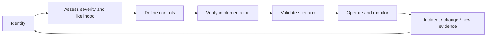

# AP-010 — Enterprise Safety Assurance Architecture

| Campo | Valore |
|---|---|
| Identificativo | AP-010 |
| Titolo | Enterprise Safety Assurance Architecture |
| Tipo | Architecture Package |
| Repository | `maininimassimo-bit/digital-stargate-manual` |
| Branch | `main` |
| Data | 30/07/2026 |
| Autorità | Digital StarGate Chief Architect |
| Sponsor | Project Owner / Architecture Sponsor — Massimo Mainini |
| Dipendenze | AP-003…AP-009; SAF-REF-001; SAF-CAT-001 |
| Review | ARB-010 |
| Stato | Approved with conditions |
| Target release | Da assegnare |

## 1. Scopo

AP-010 definisce il framework di safety assurance di Digital StarGate. Stabilisce autorità, hazard lifecycle, safe state, safety contract, evidence e validation gates affinché automazione, integrazione, infrastruttura, operations e future piattaforme non possano prevalere sulle protezioni locali.

Il package non certifica dispositivi o impianti, non sostituisce verifiche elettriche/meccaniche e non dichiara un Safety Integrity Level.

## 2. Decisione architetturale

La safety prevale su disponibilità, continuità e obiettivi scientifici. Hardware interlock, PLC/controller locale e sensori safety-relevant mantengono autorità rispetto a servizi remoti, EIF, DSOC e sistemi AI.

Incertezza, telemetria stale, perdita di comunicazione o conflitto tra sorgenti non sono condizioni sicure.

## 3. Principi vincolanti

- **Safety before availability**.
- **Unknown is not safe**.
- **Safe state by default**.
- **Local authority prevails**.
- **No remote bypass** degli interlock.
- **Fail-safe before fail-operational**, salvo hazard analysis approvata.
- **Independent evidence** per controlli critici.
- **Explicit safety contracts** per ogni comando fisico safety-relevant.
- **Manual intervention governed**, non implicita.
- **AI is advisory only** e non è Safety Authority.
- **Recovery is a controlled state**, non ritorno automatico alla normalità.

## 4. Scope

### In scope

- safety governance e authority model;
- hazard identification, assessment e treatment;
- safe states e transition rules;
- safety-relevant command contracts;
- environmental, equipment, infrastructure e operational safety;
- emergency, degraded mode e recovery;
- safety logging, evidence, audit e metrics;
- validation, readiness e periodic reassessment.

### Out of scope

- cybersecurity controls di dettaglio AP-005;
- service management AP-007;
- infrastruttura di dettaglio AP-009;
- certificazioni normative non deliberate;
- autorizzazione di controllo autonomo AI.

## 5. Safety authority model

Ordine di prevalenza:

1. hardware interlock e protezioni fisiche;
2. PLC / dome controller locale;
3. local safety supervisor / observatory controller;
4. observatory automation;
5. Enterprise Integration Fabric;
6. DSOC e interfacce operatore;
7. analytics e AI assistant.

Un livello superiore può richiedere un'azione ma non può annullare il veto di un livello inferiore con maggiore autorità safety.

## 6. Safety domains

| Dominio | Esempi |
|---|---|
| Observatory | cupola, collisioni, apertura/chiusura, parcheggio |
| Environmental | pioggia, vento, umidità, temperatura, condensa |
| Equipment | montatura, OTA, camere, fuoco, cavi |
| Infrastructure | power, UPS, rete, compute, storage |
| Operational | manutenzione, persone, accesso, override |
| Data and evidence | integrità log, provenance, recovery records |

## 7. Hazard lifecycle



Ogni hazard registra ID, descrizione, cause, consequences, severity, likelihood, initial risk, controls, residual risk, owner, verification, validation, evidence e status.

## 8. Safe-state model

Stati canonici:

- `SAFE_PROTECTED`: cupola chiusa/protetta, movimento arrestato o in posizione compatibile, stato confermato;
- `SAFE_MAINTENANCE`: energia e movimenti controllati secondo procedura di manutenzione;
- `EMERGENCY_TRANSITION`: azione prioritaria verso protezione;
- `RECOVERY_HOLD`: evento cessato ma ripartenza non autorizzata;
- `NORMAL_AUTHORIZED`: operatività consentita con precondizioni valide;
- `UNKNOWN`: stato non determinabile; trattato come non autorizzato per nuove azioni rischiose.

## 9. Safety contracts

Ogni comando safety-relevant dichiara almeno:

```yaml
safety_contract_id: string
command_contract: string
hazards_addressed: []
required_authority: string
preconditions: []
inhibitors: []
freshness_limits: {}
confirmation_sources: []
timeout: duration
abort_conditions: []
expected_safe_outcome: string
manual_override_policy: string
evidence_required: []
```

Un comando accettato non equivale a risultato sicuro. L'outcome deve essere confermato da sorgenti appropriate e non dalla sola risposta del chiamante.

## 10. Weather and environmental safety

- rain signal e condizioni unsafe hanno priorità sulla sessione;
- sensori mancanti, stale o discordanti generano `unknown` o unsafe secondo hazard treatment;
- soglie, hysteresis e persistence devono essere versionate;
- la riapertura richiede condizioni stabili e autorizzazione esplicita;
- l'assenza di Internet non deve impedire la chiusura locale.

## 11. Movement and collision safety

Apertura, chiusura, slew e park richiedono precondizioni compatibili. Le collision envelope e la sequenza cupola/montatura devono essere validate con scenari reali o simulatori adeguati. Timeout e perdita posizione non consentono assunzioni ottimistiche.

## 12. Power and infrastructure safety

AP-009 fornisce fault domain e recovery controls. AP-010 richiede che perdita rete, compute, storage o alimentazione sia collegata a hazard, modalità degradata, safe-state transition e recovery hold.

## 13. Manual override and maintenance

- override solo per ruoli nominativi e procedure approvate;
- motivazione, durata, scope e approvatore registrati;
- nessun override permanente o invisibile;
- maintenance mode chiaramente distinguibile dalla normale operatività;
- ritorno al servizio subordinato a checklist ed evidence.

## 14. Safety observability

Eventi minimi:

- unsafe condition detected/cleared;
- safety veto applied;
- emergency transition started/completed/failed;
- interlock active/inactive;
- sensor stale/conflict;
- manual override requested/approved/expired;
- recovery hold entered/released;
- safety configuration changed.

I log devono essere timestamped, correlabili, protetti e privi di secret.

## 15. Safety evidence framework

Evidence candidate:

- schemi e manuali dei dispositivi;
- configurazioni e versioni;
- test degli interlock;
- scenari meteo e perdita comunicazione;
- collision and movement tests;
- emergency drill;
- backup/recovery evidence safety-relevant;
- incident e near-miss review;
- training e authorization records.

Ogni evidence possiede identificatore, data, versione, owner, metodo, risultato, limitazioni e collegamento a hazard/control.

## 16. Validation matrix

| Scenario | Expected result | Stato |
|---|---|---|
| pioggia durante acquisizione | abort e chiusura/protezione | Non eseguito — ARB-010-C02 |
| weather telemetry stale | nuove aperture inibite | Non eseguito — ARB-010-C02 |
| perdita WAN | safety locale preservata | Non eseguito — ARB-010-C02/C04 |
| perdita controller applicativo | PLC/interlock mantengono protezione | Non eseguito — ARB-010-C02/C04 |
| comando duplicato | idempotenza e nessun movimento incoerente | Non eseguito — ARB-010-C02/C04 |
| montatura non parked | chiusura governata da collision rules | Non eseguito — ARB-010-C02 |
| perdita alimentazione | transizione e shutdown definiti | Non eseguito — ARB-010-C02/C04 |
| override manuale | audit, expiry e recovery hold | Non eseguito — ARB-010-C02/C04 |
| riavvio dopo emergenza | nessuna ripartenza automatica non autorizzata | Non eseguito — ARB-010-C02/C04 |

## 17. Safety readiness gates

Prima dell'attivazione di una capability safety-relevant sono obbligatori:

1. hazard e owner registrati;
2. control design approvato;
3. safety contract versionato;
4. threat e failure analysis;
5. verification evidence;
6. scenario validation;
7. runbook ed escalation;
8. recovery e rollback;
9. training operatore;
10. Safety Readiness Review indipendente.

## 18. Migrazione

1. consolidare hazard esistenti da AP-003 e documentazione operativa;
2. validare authority chain e inventario sensori/interlock;
3. adottare safe-state vocabulary;
4. catalogare i comandi safety-relevant;
5. collegare eventi e metriche AP-004/AP-008;
6. eseguire tabletop exercise;
7. svolgere test controllati e raccogliere evidence;
8. chiudere le condizioni ARB-010 con evidence verificabile.

## 19. Traceability

| Hazard/driver | Control | Fonte | Evidence attesa |
|---|---|---|---|
| meteo unsafe | local interlock e close path | AP-003 / AP-010 | rain/closure test |
| perdita WAN | local authority | AP-009 / AP-010 | WAN-loss scenario |
| comando remoto non autorizzato | identity, authorization, safety veto | AP-005 / AP-008 / AP-010 | access e contract test |
| stato stale | freshness e unknown handling | AP-004 / AP-008 / AP-010 | stale-data test |
| recovery prematuro | recovery hold | AP-007 / AP-010 | recovery drill |
| review | approval with conditions | ARB-010 | C01…C05 closure evidence |

## 20. Acceptance criteria

- package, reference architecture e catalogo safety presenti;
- authority e safe-state model definiti;
- hazard lifecycle e validation matrix definiti;
- roadmap, traceability e MkDocs aggiornati;
- review ARB-010 registrata;
- condizioni ARB-010-C01…C05 governate;
- nessuna certificazione runtime non supportata.

## 21. Open issues

- ARB-010-C01 — Formal Hazard Register;
- ARB-010-C02 — Safety Validation Plan;
- ARB-010-C03 — Safety Requirements Traceability Matrix;
- ARB-010-C04 — Failure Injection and Emergency Exercise;
- ARB-010-C05 — Safety Evidence Annex;
- soglie meteo e persistence;
- collision envelope as-built;
- policy di riapertura e recovery;
- modalità e limiti dell'override.

## 22. Disposizione

AP-010 è **Approved with conditions** mediante ARB-010, score 97/100. Il gate architetturale documentale è chiuso e AP-011 può utilizzare AP-010 come guard rail. L'osservatorio e le capability di controllo safety-relevant restano non certificati fino alla chiusura di ARB-010-C01…C05 e delle Safety Readiness Review applicabili.