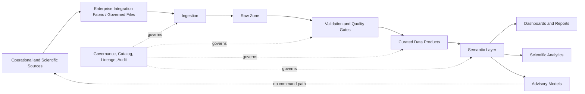

# AP-011 — Enterprise Analytics Platform Architecture

| Campo | Valore |
|---|---|
| Identificativo | AP-011 |
| Titolo | Enterprise Analytics Platform Architecture |
| Tipo | Architecture Package |
| Repository | `maininimassimo-bit/digital-stargate-manual` |
| Branch | `main` |
| Data | 30/07/2026 |
| Autorità | Digital StarGate Chief Architect |
| Sponsor | Project Owner / Architecture Sponsor — Massimo Mainini |
| Dipendenze | AP-002; AP-004; AP-006…AP-010; DSGP-VIS-001; ANA-REF-001; ANA-PIPE-001; ANA-KPI-001; ANA-GOV-001 |
| Stato | Proposed for independent ARB review |
| Target release | Da assegnare |

## 1. Scopo

AP-011 definisce la Digital StarGate Analytics Platform (DSAP) come piattaforma governata per ingestione, qualità, trasformazione, conservazione, semantica, KPI, reporting e analytics scientifici e operativi.

AP-011 non autorizza comandi verso dispositivi, non sostituisce DSOC, non attribuisce autorità safety ad analytics o AI e non certifica modelli predittivi non validati.

## 2. Decisione architetturale

DSAP adotta un'architettura a pipeline e data product, separata dai sistemi operativi. I dati entrano tramite contratti governati, sono validati e trasformati in prodotti versionati; dashboard, report e modelli consumano semantic views e non accedono direttamente a dispositivi o storage non governati.

## 3. Principi vincolanti

- **Read-only toward operations**: DSAP non invia comandi operativi o safety-relevant.
- **Data contract first**: schema, owner, qualità, classificazione e retention precedono il consumo.
- **Data product ownership**: ogni prodotto ha owner, SLA/SLI candidati, lineage ed evidence.
- **Quality before publication**: dati invalidi o incompleti non sono presentati come affidabili.
- **Freshness explicit**: ogni vista espone timestamp, ritardo, completezza e stato `current|stale|unknown`.
- **Reproducibility**: trasformazioni, versioni e input sono tracciabili.
- **Semantic consistency**: KPI e dimensioni condivise hanno definizioni canoniche.
- **AI advisory only**: inferenze e previsioni sono advisory, con confidence, provenance e limiti.
- **No direct device access**: ingestion solo attraverso adapter, file o API governati.
- **Infrastructure by contract**: compute, storage e recovery rispettano AP-009.
- **Safety guard rails**: AP-010 prevale su disponibilità e obiettivi analytics.

## 4. Scope

### In scope

- batch e near-real-time ingestion;
- telemetry, session, equipment, weather, quality e processing data;
- data quality e quarantine;
- raw, validated, curated e semantic zones;
- data products e lineage;
- KPI, reporting e semantic layer;
- time-series analytics;
- scientific analytics e processing provenance;
- predictive maintenance candidate models;
- access control, retention, audit e observability;
- model and analytics governance.

### Out of scope

- command and control;
- DSOC operator workflows;
- safety decisions;
- autonomous AI control;
- final storage technology selection for AP-013;
- knowledge graph and vector retrieval of AP-015.

## 5. Logical architecture

## 6. Data zones

| Zona | Scopo | Regole |
|---|---|---|
| Raw | conservare input ricevuto | immutabilità logica, checksum, source timestamp |
| Validated | dati conformi ai contratti | quality result, rejects e quarantine separati |
| Curated | data product orientati al dominio | schema versionato, owner, lineage |
| Semantic | metriche, dimensioni e KPI canonici | definizioni approvate e testate |
| Serving | dashboard, API e export | access control, freshness e usage telemetry |

## 7. Data product iniziali

- DP-001 `sessions.parquet`;
- DP-002 `targets.parquet`;
- DP-003 `equipment.parquet`;
- DP-004 `quality.parquet`;
- DP-005 `weather.parquet`.

Ogni data product deve dichiarare owner, schema, chiavi, classificazione, quality rules, freshness, lineage, retention, consumer, compatibility e validation evidence.

## 8. Quality model

Le dimensioni minime sono completeness, validity, uniqueness, consistency, timeliness e referential integrity. Gli esiti sono `passed`, `warning`, `failed`, `quarantined`, `unknown`.

La pubblicazione di KPI deve indicare copertura temporale, numero di record esclusi, quality status e ultimo aggiornamento.

## 9. Semantic and KPI layer

Il semantic layer separa formule e definizioni dai singoli dashboard. KPI omonimi con formule diverse sono vietati. Ogni KPI possiede ID, formula, grain, dimensioni, owner, sorgente, quality dependency, freshness, soglie candidate e stato del ciclo di vita.

## 10. Time-series e telemetry analytics

Le serie temporali preservano event time, ingestion time, source, unità, qualità e gaps. Downsampling e aggregazioni non sostituiscono i dati sorgente. Il riempimento dei gap deve essere esplicito e mai presentato come misura osservata.

## 11. Predictive e AI analytics

Modelli predittivi sono introdotti solo con:

- use case e owner;
- training data lineage;
- baseline comparativa;
- metriche di accuratezza e falsi positivi/negativi;
- drift monitoring;
- explainability adeguata;
- human review;
- divieto di comando automatico;
- rollback e retirement.

## 12. Security, privacy e safety

L'accesso segue AP-005. Dataset e report rispettano classificazione, least privilege e audit. Secret e credenziali non entrano nei data product. I dati safety-relevant possono supportare analisi e incident review ma non sostituiscono sensori, interlock o autorità locale.

## 13. Observability

Metriche minime:

- ingestion success/failure e lag;
- backlog e oldest item age;
- quality pass/fail/quarantine;
- pipeline duration e retry;
- data product freshness e row count drift;
- storage growth e saturation;
- dashboard query latency e error rate;
- model drift e prediction coverage.

## 14. Migration strategy

1. inventariare sorgenti, pipeline e dashboard esistenti;
2. baselined DP-001…DP-005;
3. introdurre quality gates e quarantine;
4. costruire semantic definitions per un set limitato di KPI;
5. migrare dashboard senza interrompere lo storico;
6. introdurre lineage e observability;
7. validare backup, restore e reproducibility;
8. valutare modelli predittivi solo dopo la qualità dei dati.

## 15. Validation matrix

| Area | Evidenza richiesta | Stato |
|---|---|---|
| Contracts | schema e compatibility test | Non eseguita |
| Quality | test su dati validi, invalidi e mancanti | Non eseguita |
| Lineage | source-to-KPI trace | Non eseguita |
| Freshness | stale e unknown handling | Non eseguita |
| Reproducibility | rebuild dello stesso output | Non eseguita |
| Security | access e data classification review | Non eseguita |
| Recovery | restore e reprocessing | Non eseguita |
| Performance | volume, latency e capacity baseline | Non eseguita |
| Models | baseline, drift e human review | Non applicabile finché non introdotti |

## 16. Traceability

| Driver | Decisione | Artefatto | Evidence attesa |
|---|---|---|---|
| qualità | quality before publication | AP-011 / ANA-PIPE-001 | quality suite |
| coerenza KPI | semantic layer | ANA-KPI-001 | metric tests |
| governance | data product ownership | ANA-GOV-001 | owner e catalog records |
| continuità | recoverable pipelines | AP-009 / AP-011 | restore/reprocess test |
| safety | no command path | AP-010 / AP-011 | architecture inspection e access test |

## 17. Acceptance criteria

- package e quattro artefatti di riferimento presenti;
- DSAP separata da operations e safety authority;
- data zone, product, quality e semantic model definiti;
- roadmap, traceability e MkDocs aggiornati;
- review ARB indipendente richiesta;
- nessuna certificazione runtime priva di evidence.

## 18. Open issues

- owner definitivi di DP-001…DP-005;
- technology selection per compute, orchestration e serving;
- retention, RPO e RTO;
- near-real-time latency target;
- canonical KPI set;
- dimensioni condivise e unità;
- baseline di volume e crescita;
- model governance owner.

## 19. Disposizione

AP-011 è **proposto per review ARB indipendente**. L'approvazione dello scope non certifica pipeline, data quality, KPI, dashboard o modelli runtime.