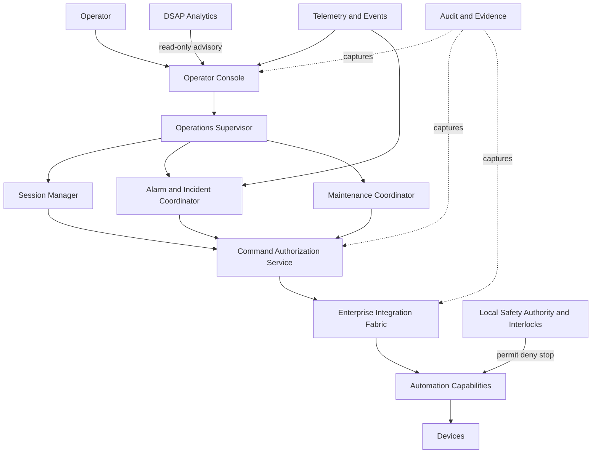

# AP-012 — Enterprise Operations Center Architecture

| Campo | Valore |
|---|---|
| Identificativo | AP-012 |
| Titolo | Enterprise Operations Center Architecture |
| Acronimo | DSOC — Digital StarGate Operations Center |
| Tipo | Architecture Package |
| Repository | `maininimassimo-bit/digital-stargate-manual` |
| Branch | `main` |
| Data | 30/07/2026 |
| Autorità | Digital StarGate Chief Architect |
| Sponsor | Project Owner / Architecture Sponsor — Massimo Mainini |
| Dipendenze | AP-003; AP-004; AP-005; AP-006; AP-007; AP-008; AP-009; AP-010; AP-011; OPSC-REF-001; OPSC-CMD-001 |
| Stato | In development — Sprint AP-012.1 |
| Target release | Da assegnare |

## 1. Scopo

AP-012 definisce il Digital StarGate Operations Center come piano di supervisione e coordinamento dell'osservatorio. Il DSOC fornisce una vista operativa unificata, governa sessioni, allarmi, incidenti, manutenzione e comandi autorizzati, senza sostituire la Safety Authority locale e senza introdurre controllo autonomo.

Il package specializza l'implementazione del centro operativo. AP-007 resta autorità per service management, incident, problem, change, readiness e runbook governance; AP-012 realizza il piano di controllo e le interazioni operatore-sistema nel rispetto di tali processi.

## 2. Decisione architetturale

Il DSOC adotta un'architettura a piani separati:

1. **Presentation Plane** — console e viste operative;
2. **Operations Coordination Plane** — sessioni, workflow, allarmi, incidenti e manutenzione;
3. **Command Authorization Plane** — validazione identità, ruolo, contesto, rischio e approvazioni;
4. **Integration Plane** — API ed eventi governati da AP-008;
5. **Safety Plane** — interlock e decisioni locali governati da AP-010;
6. **Evidence Plane** — audit, telemetry e analytics read-only.

Nessun componente DSOC può comandare direttamente un dispositivo bypassando Integration, Command Authorization e Safety Plane.

## 3. Principi vincolanti

- **Safety authority remains local**: AP-010 prevale su disponibilità, schedulazione e continuità.
- **Human in the loop**: i comandi operativi richiedono un attore identificato; le automazioni eseguono solo workflow pre-autorizzati.
- **Read-only first**: ogni integrazione nasce in modalità osservativa; il comando è abilitato solo dopo evidence e approvazione.
- **Explicit command authorization**: identità, ruolo, scopo, stato, freshness e rischio sono verificati prima dell'esecuzione.
- **Separation of duties**: richiesta, approvazione ed esecuzione sono separate per operazioni critiche.
- **Least privilege**: privilegi limitati per ruolo, sistema, operazione e finestra temporale.
- **Fail safe**: perdita di connettività, telemetry o autorizzazione non mantiene implicitamente l'operazione.
- **Manual override governed**: l'override è locale o esplicitamente autorizzato, auditato e soggetto a post-review.
- **Analytics advisory only**: AP-011 può suggerire, mai autorizzare o eseguire comandi.
- **Audit by design**: ogni decisione e transizione significativa produce evidence correlata.
- **Unknown is not safe**: stato mancante, stale o contraddittorio blocca le azioni dipendenti da tale stato.

## 4. Scope

### In scope

- operator console e situation awareness;
- session supervision e coordination;
- workflow operativi e checklist;
- command request, approval, dispatch e result handling;
- alarm presentation, acknowledgement ed escalation;
- incident coordination integrata con AP-007;
- maintenance coordination;
- notification e handover;
- audit trail e correlation;
- stato normal, degraded, recovery ed emergency;
- accesso read-only ad analytics e scientific context.

### Out of scope

- sostituzione degli interlock locali;
- autonomous AI control;
- service management governance già definita da AP-007;
- topologia infrastrutturale di AP-009;
- certificazione safety di AP-010;
- data platform e KPI governance di AP-011;
- scelta definitiva di prodotti HMI, ITSM o workflow engine;
- affermazioni di disponibilità runtime senza evidence.

## 5. Confini con gli Architecture Package esistenti

| Package | Autorità preservata | Relazione con AP-012 |
|---|---|---|
| AP-003 | automazione osservatorio | DSOC invoca capability governate, non controlla direttamente device |
| AP-004 | telemetry e observability | DSOC consuma segnali con freshness e quality state |
| AP-005 | identity e privileged access | ruoli, sessioni e break-glass seguono i controlli security |
| AP-006 | configuration e asset management | comandi e manutenzione riferiscono CI e baseline |
| AP-007 | service management e runbook governance | DSOC implementa workflow conformi, senza duplicare process ownership |
| AP-008 | integration fabric e contracts | ogni integrazione usa API/eventi governati |
| AP-009 | infrastructure e resilience | deployment, backup e recovery derivano da AP-009 |
| AP-010 | safety assurance | Safety Plane può negare o interrompere qualsiasi comando |
| AP-011 | analytics platform | accesso esclusivamente read-only e advisory |

## 6. Architettura logica



## 7. Componenti principali

| Componente | Responsabilità | Vincoli |
|---|---|---|
| Operator Console | stato, allarmi, workflow, decisioni e comandi | non contiene logica safety autorevole |
| Operations Supervisor | coordina stato operativo e workflow | non bypassa authorization o integration |
| Session Manager | lifecycle delle sessioni e handover | rispetta stato safety e readiness |
| Alarm and Incident Coordinator | triage, acknowledgement, escalation, timeline | tassonomia e lifecycle conformi ad AP-007 |
| Maintenance Coordinator | work item, finestre e ritorno in servizio | CI e baseline conformi ad AP-006 |
| Command Authorization Service | policy, approvazioni, token e scadenze | deny by default; evidence obbligatoria |
| Notification Service | canali e destinatari | nessuna decisione implicita da mancata consegna |
| Audit Service | evidence immutabile e correlata | clock, actor, source e outcome obbligatori |

## 8. Stati operativi canonici

- `OFFLINE`
- `STARTING`
- `READY`
- `OBSERVING`
- `DEGRADED`
- `MAINTENANCE`
- `RECOVERY`
- `EMERGENCY`
- `SAFE`
- `UNKNOWN`

Le transizioni devono dichiarare trigger, attore, precondizioni, safety evaluation, comandi emessi, risultato, timeout, rollback e evidence.

## 9. Modello di comando

Il lifecycle minimo è:

`requested → validated → approved → authorized → dispatched → acknowledged → completed|failed|cancelled|expired|blocked`

Un comando contiene almeno:

```text
command_id
correlation_id
command_type
target_id
requested_by
requested_at
purpose
parameters
expected_state
observed_state
state_freshness
risk_class
required_role
required_approvals
authorization_expires_at
safety_decision
execution_status
result
evidence_reference
```

I dettagli normativi sono definiti in OPSC-CMD-001.

## 10. Classi di rischio del comando

| Classe | Esempio | Controllo minimo |
|---|---|---|
| C0 | refresh, query, export | autenticazione e audit |
| C1 | azione operativa reversibile | ruolo autorizzato, stato valido, conferma |
| C2 | azione con impatto su sessione o asset | approvazione esplicita, pre-check, rollback |
| C3 | safety-relevant o potenzialmente irreversibile | dual control, local safety permit, finestra limitata |
| C4 | emergency / break-glass | autorità nominata, audit rafforzato, post-review obbligatoria |

## 11. Alarm e incident integration

Il DSOC distingue event, alert e incident secondo AP-007. Un alert deve mostrare source, severity candidate, affected service/CI, first seen, last seen, freshness, acknowledgement, suppression state e runbook reference.

L'acknowledgement non equivale a risoluzione. La chiusura richiede verifica del servizio e, quando applicabile, stato fisico sicuro.

## 12. Session supervision

Il Session Manager coordina:

1. readiness e pre-flight checks;
2. acquisizione di autorizzazioni;
3. apertura sessione;
4. monitoraggio di stato, qualità e allarmi;
5. pause, abort e recovery;
6. chiusura e safe-state verification;
7. handover e evidence package.

La schedulazione non prevale mai su weather, safety, maintenance lock o decisioni dell'operatore autorizzato.

## 13. Security e privileged operations

- autenticazione forte per ruoli operativi;
- sessioni privilegiate limitate e registrate;
- step-up authentication per C2–C4;
- token di autorizzazione scoped e time-bound;
- nessuna credential nei runbook o negli eventi;
- break-glass con motivazione e post-review;
- segregazione tra operator, approver, maintainer e auditor quando richiesto.

## 14. Degraded mode e failure handling

Il DSOC entra in degraded mode quando una dipendenza critica è indisponibile, stale o non verificabile. In tale stato:

- le capability disponibili sono dichiarate;
- i comandi non supportati sono bloccati;
- l'operatore vede dipendenza, impatto e recovery path;
- il sistema non interpreta l'assenza di allarmi come normalità;
- la chiusura sicura resta prioritaria.

## 15. Audit ed evidence

Ogni operazione significativa registra:

- actor e delegated authority;
- timestamp affidabile;
- source e target;
- stato precedente e successivo;
- input e policy version;
- decisione authorization/safety;
- approvazioni;
- outcome, timeout ed errori;
- correlation ID;
- link a incident, change, session, runbook e CI.

## 16. Observability

Metriche candidate:

- command request/deny/fail/success rate;
- authorization latency;
- stale-state blocks;
- alarm acknowledgement ed escalation time;
- session start/abort/complete rate;
- degraded-mode duration;
- failed workflow step e retry;
- manual override frequency;
- audit delivery failure;
- console data freshness.

Le soglie restano `DA VALIDARE` fino a baseline misurata.

## 17. Deployment e resilience

Il deployment segue AP-009. Il DSOC deve supportare almeno:

- separazione tra console, coordination, authorization e integration;
- backup e restore di configurazioni e audit references;
- perdita controllata della console senza perdita della Safety Authority locale;
- retry idempotenti e deduplica dei comandi;
- clock synchronization e correlation end-to-end;
- recovery testato prima di dichiarare readiness.

## 18. Migration strategy

1. inventario di console, script e controlli esistenti;
2. modalità read-only con telemetry e status unificati;
3. alarm presentation e acknowledgement;
4. workflow guidati senza dispatch automatico;
5. abilitazione C1 su capability pilota;
6. abilitazione C2–C3 solo dopo test e ARB decision;
7. incident, maintenance e handover integrati;
8. esercitazioni degraded, recovery ed emergency.

## 19. Validation matrix

| Area | Evidence richiesta | Stato |
|---|---|---|
| Architecture boundaries | review AP-003…AP-011 | Documentale |
| Read-only mode | integrazione senza command path | Non eseguita |
| Authorization | allow/deny, expiry, role e dual control tests | Non eseguita |
| Safety enforcement | deny/stop da Safety Plane | Non eseguita |
| Idempotency | duplicate command e retry tests | Non eseguita |
| Freshness | stale e unknown blocking | Non eseguita |
| Degraded mode | loss of telemetry/network/console drill | Non eseguita |
| Audit | end-to-end correlation e evidence integrity | Non eseguita |
| Recovery | restore e resumption exercise | Non eseguita |
| Security | privileged session e break-glass review | Non eseguita |

## 20. Traceability

| Driver | Decisione | Artefatto | Evidence attesa |
|---|---|---|---|
| safety | Safety Plane authoritative | AP-010 / AP-012 | deny/stop test |
| governance | AP-007 process ownership preserved | AP-007 / AP-012 | boundary review |
| command control | explicit authorization | OPSC-CMD-001 | policy tests |
| integration | no direct device access | AP-008 / OPSC-REF-001 | architecture and access tests |
| analytics | read-only advisory | AP-011 / AP-012 | no-command-path inspection |
| audit | evidence by design | AP-004 / AP-012 | correlation test |

## 21. Acceptance criteria Sprint AP-012.1

- AP-012 presente e pubblicato;
- OPSC-REF-001 presente;
- OPSC-CMD-001 presente;
- confini con AP-007, AP-010 e AP-011 espliciti;
- lifecycle e classi di comando definiti;
- roadmap, traceability e MkDocs aggiornati;
- nessuna dichiarazione di certificazione runtime;
- AP-012.2 pianificato per alarm, runbook e RACI specialistici.

## 22. Open issues

- piattaforma HMI e workflow engine;
- owner operativo e approver nominativi;
- soglie di freshness e timeout;
- matrice definitiva comando/ruolo;
- protocollo di dispatch e idempotency key;
- retention e immutabilità audit;
- strategia HA e RTO/RPO;
- comportamento offline della console;
- criteri di abilitazione C2–C4.

## 23. Disposizione

AP-012 è avviato come **In development — Sprint AP-012.1**. Il package definisce la baseline documentale del DSOC ma non autorizza ancora comandi runtime, non certifica safety, disponibilità o recovery e non sostituisce la review indipendente ARB-012. Il passaggio a operazioni attive richiede gli artefatti AP-012.2, evidence di validazione e decisione ARB.