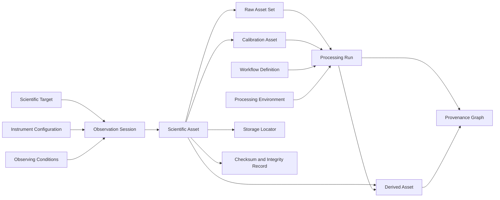

# AP-013 — Scientific Image Repository Architecture

| Campo | Valore |
|---|---|
| Identificativo | AP-013 |
| Titolo | Scientific Image Repository Architecture |
| Acronimo | SIR — Scientific Image Repository |
| Tipo | Architecture Package |
| Repository | `maininimassimo-bit/digital-stargate-manual` |
| Branch | `architecture/ap-013-package-initiation` |
| Data | 04/08/2026 |
| Autorità | Digital StarGate Chief Architect |
| Sponsor | Project Owner / Architecture Sponsor — Massimo Mainini |
| Vision di riferimento | `SIR-VIS-001 — Scientific Image Lifecycle and Processing Provenance Vision` |
| Dipendenze | AP-002; AP-004; AP-006; AP-008; AP-009; AP-011; AP-012; SIR-VIS-001 |
| Package correlato | AP-014 — Scientific Observation Catalog and Search |
| Capability correlate | CAP-37; CAP-38; CAP-39 |
| Stato | In development — package initiation and scope baseline |
| Target release | Da assegnare |

## 1. Scopo

AP-013 definisce l'architettura del repository scientifico di Digital StarGate per preservare, identificare, collegare e rendere verificabile il ciclo di vita degli asset di imaging astronomico.

Il package copre il percorso che parte dalla sessione osservativa e dai RAW originali, prosegue attraverso calibration, registrazione, integrazione e processing, e termina nei prodotti scientifici, tecnici e pubblicabili. L'obiettivo è rendere ogni asset rintracciabile rispetto a origine, strumentazione, sessione, workflow, input, output, operatore, ambiente software e controlli di integrità.

AP-013 non dichiara che esista già un repository scientifico implementato. Questa baseline definisce scope, principi, modello concettuale, responsabilità e work package necessari per la successiva architettura di dettaglio.

## 2. Decisione architetturale iniziale

Il repository scientifico adotta una separazione vincolante tra:

1. **Scientific Binary Storage** — conserva RAW, FITS, XISF, TIFF, master, intermedi, progetti e prodotti finali;
2. **Scientific Asset Registry** — assegna identificatori stabili e registra metadati, checksum, dimensione, classificazione e locator;
3. **Observation and Acquisition Context** — collega gli asset a target, sessione, strumentazione, configurazione e condizioni osservative;
4. **Processing Provenance** — registra workflow, processing run, step, parametri, input, output e ambiente PixInsight;
5. **Preservation and Integrity Services** — governa immutabilità, checksum verification, retention, backup e recovery;
6. **Catalog Publication Boundary** — espone metadati governati verso AP-014 senza trasformare GitHub nello storage primario dei file voluminosi.

GitHub conserva conoscenza architetturale, contratti, manifest, workflow, script, checksum e riferimenti allo storage. I pixel e gli artefatti binari voluminosi restano nello storage scientifico esterno, come stabilito da SIR-VIS-001.

## 3. Principi vincolanti

- **RAW immutability** — i RAW originali non vengono modificati, sovrascritti o sostituiti.
- **Stable identity** — ogni asset scientifico governato riceve un identificatore stabile indipendente dal path fisico.
- **Checksums anchor integrity** — gli asset critici sono identificati e verificati anche tramite checksum.
- **Derived assets require provenance** — ogni prodotto derivato deve indicare input, workflow e processing run.
- **Storage and catalog are separate** — storage binario e catalogo dei metadati hanno responsabilità distinte.
- **Unknown is explicit** — un valore non disponibile è dichiarato `unknown`; non viene inferito o inventato.
- **Workflow definition is not execution evidence** — una ricetta versionata non dimostra che sia stata eseguita.
- **Manual processing remains visible** — gli step manuali o non osservabili devono essere dichiarati.
- **No privileged secret in scientific tools** — PixInsight, script e workstation non conservano credenziali GitHub privilegiate.
- **Preservation precedes convenience** — funzionalità di ricerca o pubblicazione non possono compromettere integrità e conservazione.
- **No runtime control authority** — AP-013 non autorizza comandi verso cupola, montatura, camere o altri dispositivi fisici.

## 4. Driver architetturali

- preservare i RAW originali come patrimonio scientifico immutabile;
- ridurre la dipendenza da path locali, nomi manuali e memoria dell'operatore;
- collegare immagini, sessioni, target, setup e condizioni di acquisizione;
- rendere verificabile il lineage tra input, intermedi e prodotto finale;
- rendere riproducibile il trattamento PixInsight nei limiti tecnicamente osservabili;
- supportare versioni multiple dello stesso prodotto senza perdita di storia;
- distinguere asset scientifici, tecnici, intermedi e pubblicabili;
- abilitare audit, confronto e analytics senza duplicare i binari nel catalogo;
- supportare backup, restore, integrity scan e media migration;
- preparare il catalogo e la ricerca governati da AP-014.

## 5. Scope

### In scope

- modello degli asset scientifici e dei relativi identificatori;
- sessioni di osservazione e contesto di acquisizione;
- RAW, calibration frame, master, intermedi e prodotti derivati;
- locator logici verso storage esterno;
- checksum, dimensione, formato e stato di integrità;
- processing workflow e processing run;
- provenance input/output e parent-child;
- metadata FITS/XISF e metadata dichiarati dall'operatore;
- versioning e supersession senza cancellazione della storia;
- classificazione, retention e preservation policy;
- backup, recovery e integrity verification requirements;
- boundary verso PixInsight Integration Adapter;
- boundary verso AP-014 per catalogo, indicizzazione e ricerca;
- audit e traceability degli eventi significativi del lifecycle.

### Out of scope

- scelta definitiva di NAS, object storage, cloud provider o prodotto DAM;
- implementazione del motore di ricerca di AP-014;
- sincronizzazione automatica con PixInsight dichiarata come già operativa;
- migrazione reale dell'archivio corrente senza piano e inventario approvati;
- modifica automatica dei RAW o dei metadati originali;
- certificazione di conservazione a lungo termine senza test;
- pubblicazione automatica verso servizi esterni;
- controllo di dispositivi fisici o funzioni DSOC;
- gestione dei diritti scientifici o legali non ancora formalizzata;
- assegnazione DOI o identificatori pubblici senza modello approvato.

## 6. Stakeholder

| Stakeholder | Interesse e responsabilità |
|---|---|
| Project Owner / Architecture Sponsor | priorità, finanziamento, approvazione e rischio residuo |
| Astrophotographer / Scientific Operator | acquisizione, descrizione, processing e verifica della correttezza scientifica |
| Repository Curator | qualità del catalogo, identificatori, classificazione e lifecycle |
| Processing Operator | dichiarazione di workflow, parametri, step manuali e output |
| Platform Administrator | storage, accesso, backup, restore, capacity e monitoring |
| Data Governance Authority | classificazione, retention, ownership, lineage e contratti |
| Security Authority | access control, secret handling, audit e least privilege |
| Architecture Review Board | coerenza, rischi, condizioni e decisione sul package |
| AP-014 Catalog Consumer | indicizzazione, ricerca e pubblicazione dei metadati governati |
| AP-011 Analytics Consumer | analisi read-only di qualità, processo e patrimonio scientifico |

Una stessa persona può ricoprire più ruoli nella fase iniziale, ma ownership, operazione, amministrazione e review devono restare concettualmente distinguibili e auditabili.

## 7. Modello concettuale iniziale



Il modello sarà raffinato nei work package successivi. Il diagramma non costituisce ancora uno schema dati implementabile.

## 8. Entità canoniche candidate

| Entità | Scopo |
|---|---|
| `ScientificTarget` | oggetto astronomico, campo, survey region o soggetto osservato |
| `ObservationSession` | unità temporale e operativa di acquisizione |
| `InstrumentConfiguration` | combinazione governata di OTA, camera, montatura, filtri e accessori rilevanti |
| `ObservingConditions` | condizioni ambientali e di qualità disponibili per la sessione |
| `ScientificAsset` | entità radice per ogni file o asset set governato |
| `RawAssetSet` | insieme immutabile dei RAW originali di una sessione o sequenza |
| `CalibrationAsset` | bias, dark, flat, dark-flat e relativi master |
| `DerivedAsset` | prodotto calibrato, registrato, integrato, elaborato o pubblicabile |
| `StorageLocator` | riferimento logico e risolvibile allo storage fisico |
| `IntegrityRecord` | checksum, algoritmo, timestamp e risultato di verifica |
| `WorkflowDefinition` | ricetta versionata e dichiarativa di processing |
| `ProcessingRun` | esecuzione immutabile di un workflow su input identificati |
| `ProcessingStep` | processo ordinato, parametri, maschere, ROI ed eventuale azione manuale |
| `ProcessingEnvironment` | versione PixInsight, moduli, script, OS e configurazioni rilevanti |
| `ProvenanceRelation` | relazione input-output, parent-child o derivation |
| `PublicationRecord` | stato e riferimenti di una eventuale pubblicazione del prodotto |

Nomi, cardinalità e attributi definitivi saranno stabiliti nel logical data model di AP-013.

## 9. Classificazione iniziale degli asset

| Classe | Esempi | Regola iniziale |
|---|---|---|
| `RAW_ORIGINAL` | light FITS/XISF originali | immutabile, massima priorità di conservazione |
| `CALIBRATION_ORIGINAL` | bias, dark, flat, dark-flat | immutabile, collegato a setup e periodo di validità |
| `CALIBRATION_MASTER` | master dark, master flat | derivato con provenance obbligatoria |
| `CALIBRATED` | frame calibrati | derivato, ricostruibile se input e workflow sono disponibili |
| `REGISTERED` | frame registrati | derivato, lineage obbligatorio |
| `INTEGRATED` | master light / integrazione | prodotto scientifico intermedio critico |
| `PROCESSING_INTERMEDIATE` | file XISF, mask, preview, project | retention da definire per valore e riproducibilità |
| `FINAL_SCIENTIFIC` | prodotto finale scientificamente verificato | conservazione e versioning governati |
| `FINAL_PUBLICATION` | TIFF/JPEG e versioni social/editoriali | derivato dal prodotto finale, non sostituisce il master scientifico |
| `DOCUMENTATION` | manifest, report, note e workflow | catalogabile e versionabile in GitHub quando appropriato |

## 10. Lifecycle iniziale

Il lifecycle logico candidato è:

```text
identified → ingested → integrity-verified → classified → linked → preserved
           → processed → derived → quality-reviewed → published|retained
           → superseded|withdrawn
```

Le transizioni definitive dovranno specificare:

- attore o service identity;
- precondizioni;
- timestamp affidabile;
- asset e versione interessati;
- controllo di checksum;
- stato precedente e successivo;
- motivo;
- evidence reference;
- comportamento in caso di errore o parziale completamento.

`deleted` non è uno stato ordinario del lifecycle. Eventuali cancellazioni richiedono policy, autorizzazione, retention e audit specifici.

## 11. Boundary con SIR-VIS-001 e AP-014

SIR-VIS-001 resta la vision autorevole per il lifecycle e la processing provenance. AP-013 la traduce in architettura di repository, asset model, preservation e integrity requirements.

AP-014 governerà:

- catalogo di osservazioni;
- indicizzazione;
- query e ricerca;
- faceting e discovery;
- pubblicazione GitHub dei manifest governati;
- eventuali API di consultazione.

AP-013 governa la verità degli asset e della provenance; AP-014 governa la loro discoverability. AP-014 non può modificare retroattivamente asset, checksum o processing run di AP-013.

## 12. Integrazioni con gli Architecture Package esistenti

| Package | Autorità preservata | Relazione con AP-013 |
|---|---|---|
| AP-002 | data governance, ownership, retention e lineage | definisce policy e contratti applicabili agli asset scientifici |
| AP-004 | telemetry, monitoring e observability | fornisce metriche di storage, integrity, pipeline e sincronizzazione |
| AP-006 | configuration e asset management | governa versioni di software, script, strumenti e configurazioni |
| AP-008 | integration architecture | governa adapter, API, autenticazione, retry, idempotenza e reconciliation |
| AP-009 | infrastructure, capacity, backup e recovery | governa piattaforme di storage e requisiti di resilienza |
| AP-011 | analytics platform | consuma metadata e provenance in modalità read-only |
| AP-012 | operations coordination | può mostrare stato e incidenti del repository senza modificarne la verità scientifica |
| AP-014 | catalogo e ricerca | indicizza ed espone i metadati governati da AP-013 |

## 13. Requisiti non funzionali iniziali

### Integrità

- checksum obbligatorio per gli asset critici;
- algoritmo identificato e versionato;
- integrity scan periodici da definire;
- mismatch trattato come evento operativo e non corretto silenziosamente.

### Durabilità

- copie e domini di failure da definire con AP-009;
- restore testato prima di dichiarare readiness;
- media migration tracciata;
- nessuna dipendenza da un singolo workstation path.

### Sicurezza

- least privilege per ingestion, read, curation e administration;
- nessun secret privilegiato nei file scientifici o negli script PixInsight;
- accesso e operazioni amministrative auditabili;
- separazione tra catalog publication e storage administration.

### Scalabilità

- crescita per numero di sessioni, frame, versioni e intermedi;
- capacity planning basato su misure reali;
- nessuna soglia dichiarata finché non viene raccolta una baseline.

### Portabilità

- identificatori e locator non dipendenti da lettere di unità o path workstation;
- manifest machine-readable;
- supporto a formati scientifici e tecnici senza vincolo a un singolo prodotto di storage.

## 14. Assunzioni iniziali

- lo storage scientifico sarà separato dal repository GitHub;
- i RAW e gli asset binari voluminosi non saranno committati nel manuale;
- FITS e XISF costituiscono formati rilevanti, ma il supporto definitivo richiede inventario reale;
- PixInsight è uno strumento centrale del processing corrente, ma l'architettura di dominio non dipenderà direttamente dalle sue API;
- alcuni step di processing resteranno manuali o non osservabili automaticamente;
- il volume, la crescita e le esigenze di retention non sono ancora misurati;
- nessun servizio di catalogo, adapter o storage target è considerato operativo in questa fase.

## 15. Vincoli

- nessuna modifica distruttiva ai RAW;
- nessuna dichiarazione di backup o recovery efficace senza test;
- nessuna esposizione di credenziali negli script o nei manifest;
- nessun locator fisico trattato come identità permanente;
- nessuna provenance generata retroattivamente come se fosse evidence originale;
- nessun bypass delle policy AP-002, AP-006, AP-008 e AP-009;
- nessun collegamento a dispositivi di produzione o funzioni di controllo fisico;
- nessuna dichiarazione di conformità, preservation o readiness senza evidenze.

## 16. Rischi iniziali

| ID | Rischio | Trattamento iniziale |
|---|---|---|
| SIR-R01 | archivio distribuito su path e supporti eterogenei | inventory, stable IDs e locator abstraction |
| SIR-R02 | perdita o corruzione non rilevata | checksum, integrity scan e recovery test |
| SIR-R03 | RAW sovrascritti o alterati | immutability policy e access control |
| SIR-R04 | provenance incompleta | schema estensibile e dichiarazione esplicita degli unknown/manual step |
| SIR-R05 | process history PixInsight non esportabile integralmente | PoC, adapter e payload vendor-specific opzionale |
| SIR-R06 | crescita storage non governata | capacity baseline, tiering e retention policy |
| SIR-R07 | path migration rompe il catalogo | asset ID, logical locator e reconciliation |
| SIR-R08 | credenziali esposte negli script | service boundary e least privilege |
| SIR-R09 | catalogo e storage divergono | idempotenza, atomicità logica e reconciliation |
| SIR-R10 | eccesso di intermedi senza valore | classificazione e retention differenziata |
| SIR-R11 | metadati incompleti o incoerenti | validation rules, curator workflow e quality status |
| SIR-R12 | implementazione prematura su prodotto non selezionato | product-neutral architecture e decision record successivo |

## 17. Work package AP-013

| Work item | Titolo | Deliverable principale | Stato iniziale |
|---|---|---|---|
| AP13-W01 | Package initiation and scope baseline | documento AP-013 iniziale | IN PROGRESS |
| AP13-W02 | Current-state scientific asset inventory | inventory schema e assessment dell'archivio esistente | NOT STARTED |
| AP13-W03 | Scientific asset logical data model | entità, attributi, cardinalità e lifecycle | NOT STARTED |
| AP13-W04 | Metadata and identifier standard | naming, IDs, FITS/XISF mapping e quality rules | NOT STARTED |
| AP13-W05 | Storage and preservation reference architecture | tier, locator, immutability, backup e recovery | NOT STARTED |
| AP13-W06 | Processing provenance model | workflow, run, step, environment e lineage | NOT STARTED |
| AP13-W07 | PixInsight integration proof-of-concept plan | scope, test cases e evidence criteria | NOT STARTED |
| AP13-W08 | Security, access and audit model | ruoli, least privilege, secret boundary e audit | NOT STARTED |
| AP13-W09 | Migration and ingestion strategy | discovery, deduplication, checksum e phased migration | NOT STARTED |
| AP13-W10 | Validation and evidence plan | matrix, test, recovery, reconciliation e integrity evidence | NOT STARTED |
| AP13-W11 | Traceability, roadmap and publication baseline | MkDocs, roadmap, traceability e package index | NOT STARTED |
| AP13-W12 | Independent ARB-013 review | assessment, findings e disposition | NOT STARTED |

L'ordine potrà essere raffinato, ma non saranno dichiarate implementazioni o validazioni completate senza evidenze repository-based.

## 18. Deliverable baseline prevista

### Sprint AP-013.1 — Foundation

- AP-013 — Scientific Image Repository Architecture;
- current-state inventory specification;
- scientific asset logical model;
- identifier and metadata standard;
- initial traceability matrix.

### Sprint AP-013.2 — Preservation and provenance

- storage and preservation reference architecture;
- processing provenance model;
- PixInsight integration PoC plan;
- security and audit model.

### Sprint AP-013.3 — Migration and validation

- migration and ingestion strategy;
- validation and evidence plan;
- updated roadmap and documentation navigation;
- independent ARB-013 review package.

La presenza dei documenti costituisce completamento documentale, non prova di funzionamento, integrità, recovery o readiness operativa.

## 19. Acceptance criteria AP13-W01

AP13-W01 può essere completato quando:

- il documento AP-013 è presente nel repository;
- scopo, out-of-scope, principi e boundary sono espliciti;
- SIR-VIS-001 è riconosciuto come vision di riferimento;
- i confini con AP-002, AP-006, AP-008, AP-009, AP-011 e AP-014 sono registrati;
- il modello concettuale e le entità candidate sono definiti come baseline, non come schema definitivo;
- i work item AP13-W02…W12 sono registrati;
- roadmap, traceability e navigazione sono pianificate per l'aggiornamento;
- non viene dichiarata alcuna implementazione o validazione non eseguita.

## 20. Validation matrix iniziale

| Area | Evidence richiesta | Stato |
|---|---|---|
| Package boundaries | review delle dipendenze e di SIR-VIS-001 | Documentale |
| Current asset inventory | conteggio, formati, path, volume e duplicati | Non eseguita |
| Stable identifiers | uniqueness e persistence tests | Non eseguita |
| Checksum integrity | sample hashing e repeat verification | Non eseguita |
| RAW immutability | permission e overwrite-denial tests | Non eseguita |
| Metadata extraction | FITS/XISF mapping tests | Non eseguita |
| Processing provenance | manifest e lineage validation | Non eseguita |
| PixInsight integration | PoC export di ambiente, step, parametri e output | Non eseguita |
| Reconciliation | storage/catalog divergence test | Non eseguita |
| Backup and restore | restore e checksum verification | Non eseguita |
| Capacity | measured baseline and growth model | Non eseguita |
| Security | access, secret handling e audit tests | Non eseguita |
| Migration | dry-run, deduplication e rollback | Non eseguita |

## 21. Traceability iniziale

| Driver | Decisione AP-013 | Artefatto sorgente | Evidence attesa |
|---|---|---|---|
| scientific preservation | RAW immutabili e storage separato | SIR-VIS-001 | permission, checksum e restore test |
| stable identity | asset ID separato dal path | AP-013 | uniqueness e migration test |
| integrity | checksum per asset critici | SIR-VIS-001 / AP-013 | repeat hashing e mismatch handling |
| provenance | processing run immutabile | SIR-VIS-001 | manifest, input/output e lineage test |
| data governance | classificazione, retention e ownership | AP-002 | policy review e retention evidence |
| configuration | versioni di strumenti e script | AP-006 | baseline e environment capture |
| integration | adapter e service boundary | AP-008 | auth, idempotency e reconciliation test |
| resilience | storage, backup e recovery | AP-009 | restore and integrity evidence |
| analytics | consumo read-only | AP-011 | no-write-path inspection |
| catalog and search | discoverability separata dalla verità asset | AP-014 | contract and indexing tests |

## 22. Decisioni differite

Restano intenzionalmente non decisi in AP13-W01:

- prodotto o tecnologia di storage;
- struttura fisica di directory o bucket;
- algoritmo checksum definitivo e strategia di rinnovo;
- identificatore pubblico o DOI;
- retention per ogni classe di asset;
- policy di deduplication;
- modalità di estrazione FITS/XISF;
- API o protocollo dell'adapter PixInsight;
- frequenza degli integrity scan;
- RPO, RTO e capacity target;
- modello di pubblicazione verso AP-014.

Queste decisioni richiedono inventory, misure, proof of concept e review dedicate.

## 23. Stato e limitazioni

AP13-W01 è avviato in modalità esclusivamente documentale.

Non sono stati eseguiti:

- inventario del patrimonio scientifico corrente;
- hashing di file reali;
- test di immutabilità;
- test di backup o restore;
- estrazione di metadata FITS/XISF;
- export di process history PixInsight;
- sincronizzazione con storage o catalogo;
- migrazione di asset;
- test di sicurezza, performance o capacity.

Il package non autorizza la creazione o l'uso di credenziali di produzione, l'accesso a dispositivi fisici o l'abilitazione di runtime DSOC.

## 24. Prossimo passo autorizzato

Il passo successivo previsto è **AP13-W02 — Current-state scientific asset inventory**.

AP13-W02 dovrà prima definire il modello di inventario e le regole di raccolta. L'eventuale scansione di file reali dovrà essere esplicitamente autorizzata, non distruttiva e limitata a metadata, path, dimensioni e checksum quando approvati.
