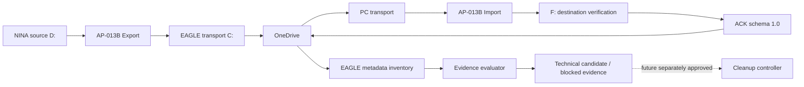

# AP-013C — Verified Transport Cleanup and Convergence Monitoring

| Campo | Valore |
|---|---|
| Identificativo | AP-013C |
| Titolo | Verified Transport Cleanup and Convergence Monitoring |
| Tipo | Architecture Package incrementale di AP-013 |
| Stato | In Progress — dry-run/OAT; productive cleanup not authorized |
| Versione | 0.2 |
| Data | 04/09/2026 |
| Repository | `maininimassimo-bit/digital-stargate-manual` |
| Branch | `architecture/ap-013c-verified-transport-cleanup` |
| Baseline di partenza | AP-013B `COPY_ONLY` — Passed / Limited Production |
| Backlog | BKL-047 |
| Review | ARB-013C — Approved with Conditions, DRY-RUN / NO-DELETE only |
| Safety impact | Nessuna modifica alla Safety Authority |
| Delete produttivo | **Non autorizzato** |

## 1. Purpose

AP-013C governa l'evoluzione del trasporto scientifico raw Digital StarGate affinché lo spazio occupato dal transport OneDrive sul disco `C:` di `EAGLE30154` possa, in una futura promotion separata, essere liberato soltanto dopo prova end-to-end della corretta conservazione del file scientifico nella destinazione autorevole.

Il package nasce dall'incidente OneDrive del 04/09/2026: EAGLE osservava `445 XISF / 445 READY`, mentre il PC principale osservava temporaneamente `426 / 426`. Dopo recovery il PC è riconvergente a 445/445 e i 19 frame mancanti sono stati verificati in `F:\Astrofotografia` senza perdita osservata.

Principio guida:

> Se Digital StarGate non può dimostrare che il dato scientifico è arrivato integro alla destinazione autorevole, il file transport non può essere autorizzato al cleanup.

## 2. Scope

### In scope

- lifecycle end-to-end del raw XISF dal transport EAGLE alla destinazione finale;
- convergence monitoring producer EAGLE / consumer PC;
- riuso READY, size e SHA-256 AP-013B;
- destination verification su `F:\Astrofotografia`;
- ACK persistente di destination verification;
- inventory metadata-only XISF/READY/ACK;
- classificazione orphan/missing evidence;
- dry-run fail-closed;
- separazione candidacy tecnica / policy eligibility / authorization;
- idempotenza, retry, restart e recovery;
- retention/grace period come decisione ancora da approvare;
- evidence, audit e observability;
- rollback ad AP-013B `COPY_ONLY`;
- OAT/failure injection derivata dall'incidente 445/426.

### Out of scope

- cancellazione automatica da `D:\Images NINA\Target`;
- modifica RAW;
- overwrite;
- Files On-Demand come lifecycle authority;
- modifica Safety Authority/interlock;
- soglie disk health non approvate;
- bulk hydration indiscriminata del transport EAGLE;
- qualsiasi delete produttivo nella baseline 0.2.

## 3. Architectural drivers

1. La capacità libera del disco C: EAGLE è un rischio operativo osservato.
2. AP-013B preserva source e transport, ma retention indefinita aumenta la pressione su C:.
3. OneDrive è asincrono: presenza locale EAGLE non prova convergenza PC.
4. AP-013B possiede già verifica size + SHA-256 verso la destinazione.
5. La soluzione deve preservare recoverability, provenance e rollback.
6. Evidence unknown/incompleta/stale/mismatch/errore deve produrre no authorization e no delete.

## 4. Current and target state

Baseline AP-013B:

```text
D:\Images NINA\Target
 -> Export Agent
 -> EAGLE OneDrive transport
 -> Microsoft OneDrive
 -> PC OneDrive transport
 -> Import Agent
 -> F:\Astrofotografia
```

Target AP-013C dry-run:



AP-013B continua a esistere come rollback. La source N.I.N.A. su D: resta fuori dal cleanup.

## 5. State and authorization model

Stati logici di business restano:

```text
PRODUCED -> TRANSPORT_READY -> CONVERGENCE_PENDING -> PC_OBSERVED
-> DESTINATION_VERIFIED -> ACK_CONVERGED -> RETENTION_PENDING
-> CLEANUP_ELIGIBLE -> CLEANED
```

Nella baseline 0.2 l'implementazione si arresta prima di `CLEANUP_ELIGIBLE` autorizzato. Il dry-run espone tre concetti distinti:

- `TechnicalCandidate=true`: proof chain tecnica completa e payload transport osservato metadata-only;
- `CleanupEligible=false`: retention/promotion non approvate;
- `CleanupAuthorized=false`: nessuna autorità di cancellazione;
- `Deleted=0`: invariant assoluto della baseline.

Una proof chain completa produce `TECHNICAL_CANDIDATE_DRY_RUN` e `TECHNICAL_CANDIDATE_POLICY_BLOCKED`, con `PolicyReasonCode=RETENTION_NOT_APPROVED`.

## 6. Evidence contracts

### READY

AP-013C riusa il READY AP-013B; non crea un manifest duplicato.

### Destination Verification ACK

Sidecar:

```text
<file>.xisf.imported.json
```

Schema **1.0**, congelato per dry-run/OAT:

```json
{
  "SchemaVersion": "1.0",
  "State": "DESTINATION_VERIFIED",
  "FileName": "example.xisf",
  "SizeBytes": 0,
  "Sha256": "...",
  "ReadyManifestSha256": "...",
  "DestinationPath": "F:\\Astrofotografia\\...",
  "DestinationSha256": "...",
  "VerifiedByHost": "...",
  "VerifiedAtUtc": "...",
  "CorrelationId": "..."
}
```

L'ACK viene creato sul PC soltanto dopo destination verification positiva. È pubblicato atomicamente, è idempotente se identico e blocca su conflict. `ReadyManifestSha256` lega l'ACK all'esatto READY. Una modifica incompatibile richiederà nuova SchemaVersion.

## 7. Metadata inventory without bulk hydration

Il dry-run costruisce l'unione degli asset osservati dai nomi/path di:

- `*.xisf`, esclusi partial;
- `*.xisf.ready.json`;
- `*.xisf.imported.json`.

La discovery non legge né hasha in massa gli XISF. Classificazioni minime:

| Evidence | Esito |
|---|---|
| XISF senza READY | `READY_MISSING` |
| ACK senza READY | `ORPHAN_ACK_READY_MISSING` |
| READY senza XISF | `TRANSPORT_PAYLOAD_MISSING` |
| READY senza ACK | `ACK_MISSING` |
| READY/XISF/ACK coerenti | technical candidate, policy blocked |
| READY/ACK mismatch | blocked |

La presenza XISF è informazione necessaria di inventory, non prova di destination verification e non sostituisce READY/ACK.

## 8. Fail-closed proof chain

La candidacy tecnica richiede congiuntamente:

```text
ready_valid
AND transport_payload_observed_metadata_only
AND destination_verified_by_import_path
AND ack_valid
AND ack_converged_to_eagle
AND ready_manifest_hash_matches
AND scientific_hash_contract_matches
AND no_mismatch
AND no_active_error
```

La futura eligibility/autorizzazione richiederà inoltre retention/policy e promotion esplicite. Non sono prove sufficienti: task success, EAGLE local presence, generic OneDrive sync, `LastTaskResult=0`, destination existence senza hash.

## 9. Dry-run invariants

La baseline 0.2 deve:

- enumerare XISF/READY/ACK correlabili;
- rendere visibili orphan/missing combinations;
- produrre technical candidacy e reason code;
- produrre summary JSON/CSV;
- mantenere `CleanupEligible=0`;
- mantenere `CleanupAuthorized=0`;
- mantenere `Deleted=0`;
- non cancellare source o transport scientifico.

## 10. Failure and recovery model

| Scenario | Comportamento richiesto |
|---|---|
| EAGLE 445/445, PC/ACK 426 | 426 technical candidates, 19 blocked, authorization 0, deleted 0 |
| riconvergenza 445/445 | 445 technical candidates, authorization 0, deleted 0 |
| OneDrive PC/EAGLE offline | no assumption; block/no authorization |
| XISF senza READY | `READY_MISSING` |
| READY senza XISF | `TRANSPORT_PAYLOAD_MISSING` |
| ACK senza READY | `ORPHAN_ACK_READY_MISSING` |
| ACK hash diverso | mismatch/block |
| destination F: assente/hash diverso | ACK non emesso / block |
| restart/retry | ricostruzione da evidence persistente, idempotente |
| malformed evidence | block |

## 11. Retention boundary

La grace period discussa di circa 24 ore resta **non approvata**. Prima di una futura promotion devono essere deliberati retention interval/reference, ACK freshness, retry cadence, offline behavior e retention READY/ACK post-cleanup. Nessun valore numerico viene fissato dalla baseline 0.2.

## 12. Security, safety and operations

- nessuna modifica alla Safety Authority;
- source `D:\Images NINA\Target` invariata;
- no overwrite;
- no secret/token nelle evidence;
- rollback: disabilitare/ignorare AP-013C e continuare AP-013B COPY_ONLY;
- un futuro principal con autorità di delete richiederà review separata.

## 13. Observability

Ogni evaluation run registra almeno run ID, UTC, computer, transport root, asset/XISF/READY/ACK osservati, technical candidates, blocked, cleanup authorized, reason code, policy reason code, evidence path e `Deleted=0`.

## 14. Migration and gate status

1. Architecture/state/evidence contract — completato.
2. ACK generation PC — implementato.
3. ACK convergence observation EAGLE — modellato tramite sidecar riconvergente.
4. Dry-run evaluator — implementato.
5. Synthetic/failure injection — eseguito in CI; remediation ARB da riconfermare in CI.
6. Independent ARB — ARB-013C: Approved with Conditions, dry-run only.
7. ARB remediation C01/C02/C06 — implementata in baseline 0.2; CI da riconfermare.
8. Governance/navigation remediation C04/C05 — richiesta prima del package release.
9. Real controlled OAT C03 — ancora da eseguire.
10. Retention/delete semantics e ARB re-review — future.
11. Productive cleanup controller — **non autorizzato**.

## 15. Traceability

| Oggetto | Relazione |
|---|---|
| AP-013 | package padre Scientific Image Repository |
| ARB-013 | governing AP-013 review; re-review required before automatic destructive cleanup |
| AP-013B | COPY_ONLY baseline e rollback |
| BKL-047 | delivery item AP-013C |
| DSDM-005 v0.2 | solution contract |
| ARB-013C | independent review and remediation conditions |
| AP-013C acceptance plan | dry-run/failure-injection/OAT gates |
| AP-013B incident recovery 04/09 | source evidence 445/426 |
| BKL-030 | G6 resumes after AP-013C governed checkpoint |

## 16. Acceptance before real OAT

- inventory XISF/READY/ACK e orphan states coperti;
- evaluator non forza bulk hydration;
- ACK schema 1.0 frozen;
- technical candidacy separata da eligibility/authorization;
- `CleanupAuthorized=0`, `CleanupEligible=0`, `Deleted=0`;
- failure injection 445/426 e regression suite verdi;
- backlog, roadmap, traceability e MkDocs coerenti.

## 17. Open issues before productive cleanup

1. retention/grace period;
2. retention READY/ACK post-cleanup;
3. crash-safe transaction semantics del futuro delete;
4. retry/cadence produttiva;
5. principal/ACL del futuro controller;
6. real OAT evidence;
7. ARB re-review e promotion C8.

## 18. Disposition

**GO per dry-run e OAT non distruttiva.**

**NO-GO per delete produttivo.**

AP-013B `COPY_ONLY` resta baseline operativa e rollback fino a nuova acceptance esplicita.
