# AP-013C — Verified Transport Cleanup and Convergence Monitoring

| Campo | Valore |
|---|---|
| Identificativo | AP-013C |
| Titolo | Verified Transport Cleanup and Convergence Monitoring |
| Tipo | Architecture Package incrementale di AP-013 |
| Stato | Proposed — architecture/design only |
| Versione | 0.1 |
| Data | 04/09/2026 |
| Repository | `maininimassimo-bit/digital-stargate-manual` |
| Branch | `architecture/ap-013c-verified-transport-cleanup` |
| Baseline di partenza | AP-013B `COPY_ONLY` — Passed / Limited Production |
| Backlog | BKL-047 |
| Safety impact | Nessuna modifica alla Safety Authority |
| Delete produttivo | **Non autorizzato** |

## 1. Purpose

AP-013C governa l'evoluzione del trasporto scientifico raw Digital StarGate affinché lo spazio occupato dal transport OneDrive sul disco `C:` di `EAGLE30154` possa essere liberato in modo controllato soltanto dopo prova end-to-end della corretta conservazione del file scientifico nella destinazione autorevole.

Il package nasce dall'incidente OneDrive del 04/09/2026, nel quale il transport EAGLE risultava completo `445 XISF / 445 READY` mentre il PC principale osservava temporaneamente `426 / 426`. L'incidente ha dimostrato che presenza nel transport locale EAGLE, convergenza OneDrive, osservazione lato PC e verifica su `F:\Astrofotografia` sono stati distinti nella pratica.

Principio guida:

> Se Digital StarGate non può dimostrare che il dato scientifico è arrivato integro alla destinazione autorevole, il file transport non viene cancellato.

## 2. Scope

### In scope

- lifecycle end-to-end del raw XISF dal transport EAGLE alla destinazione finale;
- convergence monitoring tra producer EAGLE e consumer PC;
- riuso dei contratti READY, size e SHA-256 di AP-013B;
- destination verification su `F:\Astrofotografia`;
- acknowledgement/evidence persistente di destination verification;
- state machine di cleanup;
- cleanup eligibility fail-closed;
- dry-run/no-delete iniziale;
- idempotenza, retry, restart e recovery;
- retention/grace period come decisione da approvare;
- evidence, audit e observability;
- rollback ad AP-013B `COPY_ONLY`;
- OAT con failure injection derivata dall'incidente 445/445 vs 426/426.

### Out of scope per la prima implementazione

- cancellazione automatica da `D:\Images NINA\Target`;
- modifica dei RAW scientifici;
- overwrite;
- uso di Files On-Demand come sostituto del lifecycle applicativo;
- modifica della Safety Authority o degli interlock locali;
- introduzione di soglie numeriche di disk health non approvate;
- bulk hydration indiscriminata del transport EAGLE;
- delete produttivo nello stesso incremento del dry-run.

## 3. Architectural Drivers

1. Il disco `C:` EAGLE ha mostrato capacità libera estremamente ridotta durante BKL-030 G5.
2. AP-013B preserva correttamente source e transport, ma la retention indefinita del transport aumenta la pressione su `C:`.
3. OneDrive è asincrono e la presenza locale EAGLE non prova la convergenza lato PC.
4. L'importer AP-013B possiede già verifica size + SHA-256 verso la destinazione.
5. La soluzione deve preservare recoverability, provenance e rollback.
6. Evidence `UNKNOWN`, incompleta, stale, mismatch o errore deve produrre `NO DELETE`.

## 4. Current State

Percorso AP-013B corrente:

```text
D:\Images NINA\Target
  -> DSG OneDrive Export Agent
  -> EAGLE OneDrive transport
  -> Microsoft OneDrive
  -> PC OneDrive transport
  -> DSG OneDrive Import Agent
  -> AP-013 COPY_ONLY Engine
  -> F:\Astrofotografia
```

Contratti già verificati:

- export con staging `.dsg-partial`;
- `*.ready.json` pubblicato solo dopo verifica transport;
- READY contiene `FileName`, `SizeBytes`, `Sha256`, source e timestamp;
- import solo da READY valido;
- size e SHA-256 transport verificati prima della copia;
- destinazione esistente confrontata per size e SHA-256;
- no overwrite;
- `SourceFilesDeleted = 0`;
- `TransportFilesDeleted = 0`.

Gap corrente: il risultato di destination verification non viene oggi trasformato in una evidence persistente, correlabile e consumabile lato EAGLE per autorizzare un cleanup successivo.

## 5. Target State

```mermaid
flowchart LR
    A[NINA source D:] --> B[Export Agent]
    B --> C[Transport EAGLE C:]
    C --> D[OneDrive convergence]
    D --> E[Transport PC]
    E --> F[Import Agent]
    F --> G[Destination verification F:]
    G --> H[Verification ACK / evidence]
    H --> I[OneDrive convergence to EAGLE]
    I --> J[Cleanup eligibility evaluator]
    J --> K[DRY-RUN evidence]
    K -. future promotion .-> L[Transport cleanup controller]
```



AP-013B continua a esistere come rollback comportamentale. La source N.I.N.A. su `D:` resta fuori dal cleanup iniziale.

## 6. State Machine

Gli stati logici del package sono:

```text
PRODUCED
  -> TRANSPORT_READY
  -> CONVERGENCE_PENDING
  -> PC_OBSERVED
  -> DESTINATION_VERIFIED
  -> ACK_CONVERGED
  -> RETENTION_PENDING
  -> CLEANUP_ELIGIBLE
  -> CLEANED
```

Stati di blocco/errore trasversali:

```text
UNKNOWN
MISMATCH
STALE_EVIDENCE
TRANSPORT_NOT_CONVERGED
DESTINATION_NOT_VERIFIED
ACK_INVALID
RETRY_PENDING
BLOCKED
```

### Regole

- `PRODUCED` non implica trasporto completato.
- `TRANSPORT_READY` richiede XISF stabile e READY valido secondo AP-013B.
- `PC_OBSERVED` richiede osservazione reale di XISF + READY lato PC.
- `DESTINATION_VERIFIED` richiede destinazione esistente con size e SHA-256 coerenti con READY.
- `ACK_CONVERGED` richiede evidence di destination verification disponibile e valida lato EAGLE.
- `RETENTION_PENDING` si applica se una grace period verrà formalmente approvata.
- `CLEANUP_ELIGIBLE` è uno stato derivato, non un comando.
- `CLEANED` può essere prodotto solo da una futura implementazione esplicitamente promossa.
- qualunque stato non dimostrabile produce `cleanup_eligible = false`.

## 7. Evidence Contract

### 7.1 READY contract riusato

AP-013C riusa il READY AP-013B come prova di transport readiness. Non viene creato un secondo manifest equivalente.

### 7.2 Destination Verification ACK

Il design propone un sidecar persistente, creato sul PC solo dopo destination verification positiva:

```text
<file>.xisf.imported.json
```

Schema logico minimo proposto:

```json
{
  "SchemaVersion": "1.0",
  "State": "DESTINATION_VERIFIED",
  "FileName": "example.xisf",
  "SizeBytes": 0,
  "Sha256": "...",
  "ReadyManifestSha256": "...",
  "DestinationPath": "F:\\Astrofotografia\\...",
  "DestinationSha256": "...",
  "VerifiedByHost": "...",
  "VerifiedAtUtc": "...",
  "CorrelationId": "..."
}
```

I nomi definitivi sono soggetti a solution review. L'ACK non sostituisce la verifica: ne registra l'esito. Deve essere generato riusando la stessa logica di hash già usata dall'importer, non tramite un secondo verification engine divergente.

### 7.3 Validità ACK

Un ACK è valido solo se:

- corrisponde allo stesso `FileName` del READY;
- size e SHA-256 corrispondono al READY;
- `DestinationSha256` corrisponde allo SHA-256 atteso;
- la destinazione prevista è stata verificata;
- il contratto/schema è supportato;
- l'evidence non è contraddittoria;
- eventuale freshness/retention policy approvata è soddisfatta.

ACK mancante, malformato, stale, mismatch o riferito a un altro asset = `NO DELETE`.

## 8. Cleanup Eligibility

La funzione logica deve comportarsi come una congiunzione fail-closed:

```text
cleanup_eligible =
    ready_valid
    AND pc_observed
    AND destination_verified
    AND ack_valid
    AND ack_converged_to_eagle
    AND retention_satisfied_if_enabled
    AND no_mismatch
    AND no_active_error
```

Non sono condizioni sufficienti:

- export task success;
- file presente nel transport EAGLE;
- READY presente solo sull'EAGLE;
- OneDrive genericamente "sincronizzato";
- Import task eseguito;
- `LastTaskResult = 0` da solo;
- destinazione esistente senza hash verification.

## 9. Dry-Run First

La prima implementazione autorizzata deve essere `DRY_RUN / NO_DELETE`.

Deve:

- enumerare XISF/READY/ACK correlabili;
- classificare lo stato di ogni asset;
- produrre `cleanup_eligible = true|false` con reason code;
- produrre summary/evidence;
- non eseguire `Remove-Item`, move distruttivi o source cleanup;
- riportare sempre `Deleted = 0`.

## 10. Failure and Recovery Model

| Scenario | Comportamento richiesto |
|---|---|
| EAGLE 445/445, PC 426/426 | `cleanup_eligible=false`, `deleted=0` per gli asset non convergenti |
| OneDrive PC offline | nessuna assunzione di convergenza; no-delete |
| OneDrive EAGLE offline | ACK non convergente; no-delete |
| XISF presente, READY assente | no-delete |
| READY presente, XISF assente | mismatch/block |
| ACK presente, payload PC non osservabile | no-delete |
| ACK hash diverso dal READY | mismatch/block |
| destinazione F: assente | no-delete |
| destinazione F: hash diverso | mismatch/block |
| restart PC/EAGLE | ricostruzione stato da evidence persistente; nessun default a eligible |
| evidence malformata | block/no-delete |
| retry | idempotente; nessuna duplicazione di ACK logicamente equivalente |

## 11. Retention / Grace Period

La grace period discussa di circa 24 ore resta **non approvata**.

AP-013C richiede una decisione formale prima della promotion del delete su:

- retention interval;
- riferimento temporale da cui calcolarlo;
- ACK freshness/expiry;
- retry cadence;
- comportamento OneDrive offline;
- retention di READY e ACK dopo cleanup XISF.

Nessun valore numerico viene fissato da questo package 0.1.

## 12. Security, Safety and Operations

- nessuna modifica alla Safety Authority fisica/locale;
- cleanup non deve operare su file in produzione;
- scope iniziale limitato al transport OneDrive su `C:` EAGLE;
- `D:\Images NINA\Target` resta invariato;
- no overwrite;
- ACL/principal restano soggetti ai vincoli AP-013B;
- evidence deve evitare secret o token;
- errori e reason code devono essere auditabili;
- rollback consiste nel disabilitare AP-013C e tornare ad AP-013B `COPY_ONLY`.

## 13. Observability

Ogni evaluation run deve produrre almeno:

- run/correlation ID;
- timestamp UTC;
- conteggi READY/ACK/XISF osservati;
- conteggio `CLEANUP_ELIGIBLE`;
- conteggio `BLOCKED`/mismatch/unknown;
- reason code per asset non eleggibile;
- `Deleted = 0` durante dry-run;
- path evidence;
- versione schema/engine.

## 14. Migration Strategy

1. formalizzare architecture/state/evidence contract;
2. implementare ACK generation sul PC riusando destination verification esistente;
3. implementare ACK convergence observation lato EAGLE;
4. implementare evaluator dry-run;
5. eseguire test sintetici e failure injection;
6. eseguire OAT reale controllata;
7. sottoporre package/evidence ad ARB indipendente;
8. definire retention/grace period;
9. solo con nuova promotion esplicita introdurre il cleanup controller reale;
10. mantenere AP-013B come rollback fino alla closure formale.

## 15. Risks and Trade-offs

- OneDrive non espone nel progetto un contratto applicativo di convergenza forte: l'ACK end-to-end riduce l'ambiguità ma dipende comunque dalla propagazione OneDrive.
- Conservare ACK/READY aumenta il numero di piccoli file ma preserva provenance e audit.
- Hash completi hanno costo I/O; la verifica deve riusare i punti in cui l'hash è già richiesto e non causare hydration massiva non necessaria sull'EAGLE.
- Un cleanup aggressivo ridurrebbe capacità occupata ma diminuirebbe la finestra di recovery; per questo retention resta una decisione separata.

## 16. Traceability

| Oggetto | Relazione |
|---|---|
| AP-013 | package padre Scientific Image Repository |
| AP-013B | baseline `COPY_ONLY` e rollback |
| BKL-047 | backlog item del change |
| `AP-013B-OneDrive-Transport-Operational-Acceptance.md` | baseline runtime e quality gates |
| `AP-013B-OneDrive-Transport-Incident-Recovery-2026-09-04.md` | evidence incidente 445/445 vs 426/426 |
| `DSG.OneDriveTransport.psm1` | READY/hash transport/import verification |
| `Start-DSGOneDriveImport.ps1` | destination verification esistente |
| BKL-030 | capacity evidence; G6 successivo ad AP-013C |

## 17. Acceptance Criteria — Architecture & Dry-Run

AP-013C può passare dalla sola progettazione alla dry-run implementation quando:

- state machine e reason model sono revisionati;
- ACK/evidence contract è definito senza duplicare READY;
- destination verification riusa SHA-256 AP-013B;
- scope iniziale è solo transport EAGLE `C:`;
- source `D:` resta fuori dal cleanup;
- rollback AP-013B è esplicito;
- nessun threshold/retention viene inventato;
- OAT 445/445 vs 426/426 è definita.

Il delete produttivo richiederà criteri ulteriori non soddisfatti da questo documento.

## 18. Open Issues

1. approvare o modificare il sidecar ACK proposto;
2. stabilire retention/grace period;
3. stabilire retention di READY/ACK dopo cleanup;
4. definire transaction/evidence semantics del futuro delete;
5. definire eventuale cadence del cleanup controller;
6. definire criteri di promotion e rollback runtime.

## 19. Disposition

**GO per architecture/design e dry-run implementation.**

**NO-GO per delete produttivo.**

AP-013B `COPY_ONLY` resta la baseline operativa e il rollback fino a nuova acceptance esplicita.
