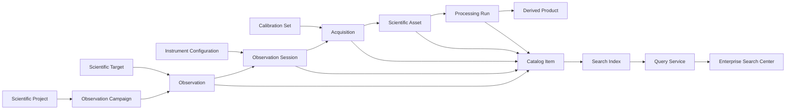

# AP-014 — Scientific Observation Catalog and Search

| Campo | Valore |
|---|---|
| Identificativo | AP-014 |
| Titolo | Scientific Observation Catalog and Search |
| Acronimo | SOCS — Scientific Observation Catalog and Search |
| Tipo | Architecture Package |
| Repository | `maininimassimo-bit/digital-stargate-manual` |
| Branch | `main` |
| Data | 05/08/2026 |
| Autorità | Digital StarGate Chief Architect |
| Sponsor | Project Owner / Architecture Sponsor — Massimo Mainini |
| Dipendenze | AP-002; AP-004; AP-006; AP-008; AP-011; AP-013 |
| Package correlato | AP-015 — Scientific Knowledge Platform Architecture |
| Stato | In development — conceptual baseline |
| Target release | RC3 |

## 1. Scopo

AP-014 definisce l'architettura del catalogo scientifico osservativo di Digital StarGate e dei servizi di indicizzazione, ricerca e discovery che consentono di interrogare il patrimonio scientifico senza dipendere dai nomi dei file o dai path fisici.

Il package trasforma i metadati governati da AP-013 in una vista osservativa interrogabile, collegando target, campagne, progetti, sessioni, acquisizioni, configurazioni strumentali, asset scientifici, calibration set e processing run.

AP-014 non modifica asset, checksum, provenance o storage locator. Tali informazioni restano sotto l'autorità di AP-013. AP-014 costruisce indici e proiezioni read-only, ricostruibili dalle fonti autorevoli.

## 2. Decisione architetturale iniziale

Il catalogo adotta una separazione vincolante tra:

1. **Authoritative Scientific Sources** — registri, manifest e provenance governati da AP-013;
2. **Observation Catalog Model** — modello normalizzato di osservazioni, campagne, sessioni e acquisizioni;
3. **Catalog Projection Pipeline** — trasforma le fonti autorevoli in record indicizzabili e ripetibili;
4. **Search Index** — struttura derivata ottimizzata per query, ranking, faceting e discovery;
5. **Search Service** — API pubblica read-only per ricerca testuale e strutturata;
6. **Enterprise Search Experience** — interfaccia federata che integra documentazione e catalogo scientifico;
7. **PixInsight Synchronization Boundary** — importazione governata di metadata e riferimenti di processing senza concedere a PixInsight autorità sul catalogo.

Il catalogo è derivato e ricostruibile. Nessuna modifica all'indice può alterare retroattivamente le fonti autorevoli.

## 3. Principi vincolanti

- **Catalog is a projection** — il catalogo non sostituisce i registri autorevoli.
- **Observation identity precedes file identity** — la ricerca parte dal contesto osservativo, non dal solo nome file.
- **Stable identifiers** — target, progetto, campagna, sessione, acquisizione e asset usano identificatori stabili.
- **Unknown is explicit** — valori mancanti restano `unknown`; non vengono inventati.
- **Read-only discovery** — query, ranking e faceting non modificano asset o provenance.
- **Deterministic indexing** — lo stesso input produce lo stesso indice, salvo versione dichiarata dell'algoritmo.
- **Explainable ranking** — i fattori di ranking sono documentati e verificabili.
- **Controlled vocabulary** — filtri, qualità, strumenti e classi di asset usano vocabolari governati.
- **PixInsight is an integration source, not an authority** — metadata importati richiedono validazione e reconciliation.
- **No runtime control authority** — AP-014 non invia comandi a cupola, montatura, camere o altri dispositivi.

## 4. Driver architetturali

- cercare osservazioni per target, periodo, progetto, campagna, strumento, filtro e qualità;
- collegare sessioni, acquisizioni, calibration set, asset e processing run;
- rendere interrogabile il patrimonio scientifico senza conoscere i path;
- integrare il catalogo con l'Enterprise Search Center;
- supportare query strutturate e ricerca testuale;
- consentire faceting, ordinamento e ranking trasparenti;
- abilitare future relazioni semantiche di AP-015;
- supportare reconciliation e reindex senza perdita di storia;
- mantenere separati catalogo pubblico, storage e registri autorevoli.

## 5. Scope

### In scope

- modello concettuale e logico del catalogo osservativo;
- identificatori e relazioni per target, progetto, campagna, sessione e acquisizione;
- collegamento read-only con Scientific Asset Registry e Processing Provenance;
- pipeline di proiezione e indicizzazione;
- schema del Search Index;
- query testuali e strutturate;
- filtri e facet per target, data, strumento, camera, filtro, qualità, classe asset e stato processing;
- ranking e spiegabilità dei risultati;
- Enterprise Search Center come esperienza di consultazione;
- boundary di sincronizzazione con PixInsight;
- versioning, rebuild e integrity check dell'indice;
- audit degli eventi di indicizzazione e reconciliation.

### Out of scope

- modifica dei RAW o degli asset scientifici;
- scrittura di checksum o provenance direttamente dal Search Service;
- storage primario dei file scientifici;
- controllo operativo dell'osservatorio;
- inferenza scientifica non validata;
- Knowledge Graph completo, reasoning semantico o ontologie avanzate di AP-015;
- pubblicazione esterna automatica;
- assegnazione DOI o identificatori pubblici;
- editing non governato dei metadata da interfaccia di ricerca.

## 6. Modello concettuale baseline



## 7. Entità canoniche candidate

| Entità | Scopo |
|---|---|
| `ScientificProject` | iniziativa scientifica o tecnica che raggruppa campagne e osservazioni |
| `ObservationCampaign` | insieme coordinato di osservazioni con obiettivo e finestra temporale comuni |
| `ScientificTarget` | oggetto, campo o regione astronomica osservata |
| `Observation` | intento scientifico e contesto osservativo indipendente dalla singola sessione |
| `ObservationSession` | unità temporale e operativa di acquisizione |
| `Acquisition` | sequenza omogenea di frame per setup, filtro, esposizione e binning |
| `CalibrationSet` | insieme governato di calibration frame applicabile a una o più acquisizioni |
| `InstrumentConfiguration` | configurazione versionata di OTA, camera, montatura, filtro e accessori |
| `ScientificAssetReference` | riferimento read-only a un asset governato da AP-013 |
| `ProcessingRunReference` | riferimento read-only a un processing run governato da AP-013 |
| `CatalogItem` | record normalizzato e indicizzabile derivato dalle entità autorevoli |
| `SearchDocument` | proiezione ottimizzata per ricerca testuale, facet e ranking |
| `IndexBuild` | esecuzione versionata della pipeline di indicizzazione |
| `ReconciliationRecord` | esito del confronto fra catalogo derivato e fonti autorevoli |

## 8. Identificatori candidati

| Entità | Formato candidato |
|---|---|
| Scientific Project | `PRJ-YYYY-NNN` |
| Observation Campaign | `CAM-YYYY-NNN` |
| Observation | `OBS-YYYYMMDD-NNN` |
| Observation Session | identificatore stabile già governato dal Scientific Data Engine |
| Acquisition | `ACQ-<session-id>-NNN` |
| Calibration Set | `CAL-YYYYMM-NNN` |
| Catalog Item | `CAT-<entity-type>-<stable-id>` |
| Index Build | `IDX-YYYYMMDDTHHMMSSZ` |

I formati saranno validati nel logical data model. Nessun identificatore deve dipendere dal path fisico.

## 9. Query capability baseline

Il Search Service dovrà supportare almeno:

- testo libero su titolo, target, note e metadata normalizzati;
- target esatto o alias governato;
- intervallo temporale di osservazione;
- progetto e campagna;
- telescopio, camera, filtro, binning ed esposizione;
- classe e stato degli asset;
- qualità della sessione;
- stato di processing;
- presenza o assenza di calibration e provenance;
- ordinamento per rilevanza, data, target e qualità;
- faceting con conteggi coerenti con i filtri applicati.

Esempi:

```text
target:LDN1320 date:2026-07 filter:LPRO
project:PRJ-2026-001 telescope:"Quattro 200P"
quality:accepted processing:integrated
missing:calibration session:2026-07-09
```

## 10. Ranking baseline

Il ranking iniziale combina:

1. corrispondenza esatta sul target;
2. corrispondenza sul titolo o identificatore stabile;
3. corrispondenza su progetto, campagna e sessione;
4. completezza dei metadata;
5. qualità e stato di acceptance;
6. recenza, solo quando richiesta o utile;
7. penalità per record incompleti, superseded o non riconciliati.

Ogni risultato dovrà poter esporre almeno tipo, score, fattori principali e fonte autorevole.

## 11. Boundary con PixInsight

PixInsight può fornire:

- riferimenti a processing project;
- metadata XISF/FITS disponibili;
- nomi e versioni di processi/script;
- parametri esportabili;
- riferimenti input/output;
- timestamp e ambiente dichiarati.

PixInsight non può:

- modificare direttamente il catalogo autorevole;
- promuovere automaticamente una sessione o un prodotto ad `accepted`;
- sovrascrivere checksum o provenance esistenti;
- inviare credenziali privilegiate;
- pubblicare verso GitHub senza un adapter governato.

Ogni sincronizzazione deve essere idempotente, auditabile e soggetta a reconciliation.

## 12. Boundary con AP-013 e AP-015

AP-013 governa asset, storage locator, checksum, integrity e processing provenance. AP-014 consuma tali dati in modalità read-only e costruisce proiezioni interrogabili.

AP-015 governerà relazioni semantiche, Knowledge Graph, concetti scientifici e navigazione della conoscenza. AP-014 fornirà identificatori stabili e record normalizzati come fondazione.

## 13. Work Package iniziali

| WP | Titolo | Outcome |
|---|---|---|
| AP14-W01 | Observation Catalog Conceptual Model | entità, relazioni, boundary e vocabolari baseline |
| AP14-W02 | Logical Data Model and Identifier Standard | schema logico, cardinalità, identificatori e versioning |
| AP14-W03 | Catalog Projection and Index Build | pipeline deterministica, rebuild, digest e reconciliation |
| AP14-W04 | Search Query and Ranking Contract | query grammar, filtri, facet, ranking ed explainability |
| AP14-W05 | Enterprise Search Integration | integrazione Search Center, URL, deep link e session detail |
| AP14-W06 | PixInsight Synchronization Adapter | boundary, manifest, idempotenza e audit |
| AP14-W07 | Validation and Operational Acceptance | test, performance baseline, OAT e acceptance |

## 14. Acceptance criteria del package

AP-014 potrà essere dichiarato completato solo quando:

- il modello concettuale e logico è approvato;
- identificatori e vocabolari sono versionati;
- la pipeline di indicizzazione è deterministica e ricostruibile;
- il Search Service supporta query, filtri, facet e ranking documentati;
- ogni risultato è riconducibile a una fonte autorevole;
- l'integrazione con Enterprise Search Center è validata;
- il boundary PixInsight è implementato senza autorità indebita;
- sono disponibili test automatici e risultati di performance baseline;
- ARB review, OAT e Operational Acceptance risultano accettati.

## 15. Rischi iniziali

| Rischio | Trattamento iniziale |
|---|---|
| duplicazione fra catalogo e registri AP-013 | catalogo dichiarato derivato e ricostruibile |
| metadata incompleti o incoerenti | `unknown` esplicito, quality state e reconciliation |
| ranking opaco | fattori documentati ed explainability |
| alias target non governati | controlled vocabulary e alias registry |
| indicizzazione non deterministica | versione algoritmo, digest e test di rebuild |
| coupling diretto a PixInsight | adapter governato e contratti indipendenti dal prodotto |
| crescita dell'indice | baseline prestazionale e partizionamento evolutivo |
| promozioni non autorizzate | acceptance solo da evidenze formali |

## 16. Deliverable iniziali

- Architecture Package AP-014;
- Observation Catalog Conceptual Model;
- Logical Data Model;
- Identifier and Vocabulary Standard;
- Catalog Projection Contract;
- Search Query and Ranking Contract;
- PixInsight Synchronization Contract;
- validation plan, ARB review, OAT e Operational Acceptance.

## 17. Decisione di avvio

AP-014 è avviato in stato **In development — conceptual baseline**.

La prima milestone è `AP14-W01 — Observation Catalog Conceptual Model`.