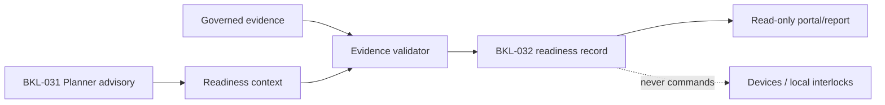

# BKL-032 — Session Readiness / Go-No-Go Decision Support

**Identifier:** `BKL-032-ARCH-001`  
**Status:** Accepted with Conditions
**Version:** 1.0  
**Release:** Release 2.x

## 1. Purpose

Define a bounded, explainable pre-session readiness decision-support capability. BKL-032 is separate from the BKL-031 Observation Planner, scheduling, device commands and local Safety Authority.

## 2. Scope

### In scope

- evaluate a declared target/setup/session context before a session;
- validate freshness, completeness, provenance and consistency of governed evidence;
- require read-only live telemetry for weather, dome, mount, camera, power, network and EAGLE health;
- produce a versioned readiness record with decision, reason codes and evidence references;
- fail closed when required evidence is missing, stale, conflicting or unavailable;
- expose the result as read-only decision support.

### Out of scope

- opening or closing the dome;
- mount, camera, power, network or sequencer commands;
- scheduling or automatic session start;
- automatic target selection or setup mutation;
- replacement of local physical interlocks;
- operating or commanding EAGLE/apparatus; telemetry consumption remains read-only;
- S10 production runtime, which remains `UNAVAILABLE`.

## 3. Architectural Drivers

- preserve the BKL-031 advisory/read-only contract;
- make readiness evidence explainable and auditable;
- prevent stale or synthetic evidence from becoming an operational assertion;
- keep protected coordinates and non-public data outside public projections;
- maintain EUR 0, MeteoHub, maximum-two-acquisitions/day and ephemeral-GRIB constraints inherited from ADR-012;
- preserve the DSG-AEM-001 exact-head, review, merge and post-merge gates.

## 4. Current State

BKL-031 is Closed / Accepted / Post-Merge Verified via PR #301, merge `4a509d574a004fe7fb72bc6c678c9e7f71fe821f`. The Planner provides current-night astronomy, forecast, setup suitability and explainable ranking, but does not provide readiness, go/no-go, scheduling, commands or Safety Authority.

The repository contains governed site, setup, ephemeris and forecast lineage contracts. Runtime S10 and live device authority remain unavailable or outside this package.

## 5. Target State

BKL-032 introduces a separate application-level readiness evaluator that consumes declared context and governed evidence and emits a record with:

- `sessionId` / target and setup references;
- evaluation timestamp and contract version;
- evidence locators, source/run lineage and freshness;
- checks performed and reason codes;
- a bounded decision state: `GO`, `NO_GO` or `INDETERMINATE`;
- explicit authority boundaries and fail-closed status.

The owner approved the exact state semantics and mandatory evidence on 2026-09-18: `GO` means forecast, current astronomy, setup compatibility and live read-only telemetry are present, fresh, consistent and passing; `NO_GO` means valid current evidence contains at least one blocking failure; `INDETERMINATE` means required evidence is missing, stale, conflicting or unavailable and therefore fails closed. Mandatory live telemetry domains are weather (rain, wind, gusts, cloudiness, humidity/dew point), dome, mount, camera, power, network and EAGLE health. No value is inferred from BKL-031 ranking alone.

## 6. Architecture Model

The Domain remains independent of presentation, infrastructure, persistence and external-system clients. Application services orchestrate ports; adapters provide evidence; projections expose sanitized records.

## 7. Rules and Constraints

1. `GO` is not a dome, equipment or safety command.
2. Local physical interlocks remain the Safety Authority.
3. Planner ranking is an input/context signal, never an implicit readiness decision.
4. Missing, stale, incomplete or conflicting evidence produces `INDETERMINATE` or `NO_GO` according to the approved decision contract; it never produces an optimistic result.
5. Provider/model/run lineage must be explicit; no silent fallback or stitching is allowed.
6. Protected coordinates, exact site data and GRIB payloads are not public outputs.
7. Telemetry consumption is read-only; no EAGLE, dome, mount, camera, power or network command or operation is authorized.

## 8. Migration Strategy

1. Reconcile BKL-031 closure references to PR #301 / merge `4a509d574…` without reopening BKL-031.
2. Accept this architecture package and the owner decision gate for decision states and mandatory domains.
3. Define machine-readable input/output contracts, live-telemetry field mappings and bounded synthetic fixtures.
4. Implement a deterministic fail-closed evaluator and read-only consumer.
5. Validate exact-head CI, ARB, Release Quality, merge and post-merge evidence.
6. Consider live telemetry transport/runtime evidence only through explicit read-only integration authorization; no command path is permitted.

Rollback is a documentation/code revert to the prior main SHA; no data migration or device change is introduced by this package.

## 9. Security, Safety, and Operations

The capability must log correlation ID, contract version, evidence locators, decision reason codes and validation outcome. It must expose diagnostic distinction between `NO_GO` and `INDETERMINATE`. It must not expose protected site data. Safety remains fail-safe and physically local.

## 10. Risks and Trade-offs

| Risk | Treatment |
|---|---|
| `GO` is interpreted as operational authorization | Explicit non-command contract and portal wording |
| stale forecast is accepted | Freshness and completeness gates, fail-closed |
| Planner ranking becomes hidden authority | Separate input contract and independent decision record |
| undocumented thresholds are introduced | Owner decision gate before implementation |
| runtime dependency is assumed | S10 remains `UNAVAILABLE`; synthetic fixtures first |

## 11. Traceability

| Requirement | Source |
|---|---|
| Planner boundary | BKL-031 closure, ADR-012 |
| Forecast lineage and budget | ADR-011, ADR-012 |
| Site/setup authority | ADR-009 and governed authority records |
| Execution gates | DSG-AEM-001 v1.2 |
| Safety boundary | Enterprise Architecture Context and local interlock baseline |

## 12. Acceptance Criteria

- boundary between Planner, Readiness, Scheduling, Commands and Safety is explicit;
- decision states and thresholds are owner-approved before implementation;
- contracts preserve provenance, freshness, completeness and correlation;
- negative, stale and conflicting fixtures fail closed;
- no runtime, provider, EAGLE or device action is required for the documentation package;
- ARB and Release Quality review the same exact head;
- roadmap, backlog, navigation and closure lineage are synchronized;
- validation evidence distinguishes executed from not executed.

## 13. Open Issues

- repository-level source inventory is recorded in `docs/project/BKL-032-TELEMETRY-SOURCE-MAPPING-2026-09-18.md`; source/transport acceptance and runtime reconciliation remain open for every mandatory domain;
- owner-approved BKL-032 weather thresholds are recorded in `BKL-032-TELEMETRY-SOURCE-MAPPING-2026-09-18.md`; the operational chapter retains its broader `DA VALIDARE` note because this decision does not change Safety Authority policy;
- selection of the first public/read-only consumer surface;
- whether any future runtime evidence is needed, subject to a separate authorization.

## 14. Deterministic evaluator slice

The first executable slice is now defined by the versioned readiness and live-telemetry contracts under `contracts/readiness/` and the pure evaluator `.github/scripts/bkl-032-readiness-evaluator.mjs`. It consumes normalized evidence only, applies the owner-approved thresholds, preserves the `GO` / `NO_GO` / `INDETERMINATE` distinction and emits no command or scheduling action. Bounded tests cover complete current evidence, every weather blocker, missing/stale evidence, non-weather blocking evidence and malformed input.

This slice does not claim live source transport, EAGLE execution, apparatus inspection or a public readiness consumer. Those remain separately gated.

## 15. Future Evolution

Future runtime or device-integrated readiness requires a new architecture and safety review. It cannot be inferred from this package and cannot transfer Safety Authority from local interlocks.
