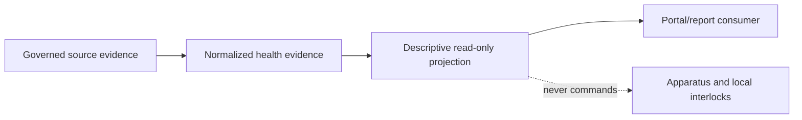

# BKL-036 — Observatory Health Score

**Identifier:** `BKL-036-ARCH-001`  
**Status:** Proposed  
**Version:** 0.1  
**Release:** Release 2.x  
**Runtime impact:** None in this increment — repository and semantic-contract definition only  
**Safety impact:** None — local physical interlocks remain the Safety Authority

## 1. Purpose

Define the bounded architecture for a future Observatory Health Score based on freshness, quality and availability evidence from telemetry, EAGLE, network, power, services and scientific pipeline signals.

This first increment establishes source discovery and semantic rules. It does not calculate or publish an aggregate score.

## 2. Scope

### In scope

- inventory candidate health evidence sources and their authority;
- define stable dimensions, evidence envelopes, freshness and missingness semantics;
- distinguish observation, derived descriptive status, health score and recommendation;
- define a future read-only projection boundary and validation gates;
- preserve provenance, correlation and diagnostic evidence.

### Out of scope

- health-score thresholds, weights, grades, RAG bands or pass/fail policy;
- Safety Score, weather safety policy or local interlock replacement;
- BKL-032 `GO`/`NO_GO`/`INDETERMINATE` evaluation;
- BKL-031 target ranking, suitability or planner behavior;
- scheduling, automatic remediation, device commands or configuration changes;
- predictive maintenance or anomaly diagnosis;
- runtime transport activation, EAGLE changes or external provider traffic;
- S10 production runtime, which remains `UNAVAILABLE`.

## 3. Architectural drivers

- health evidence must be explainable and source-backed;
- stale, partial or conflicting evidence must remain visible as such;
- a health description must not become Safety Authority by wording or UI placement;
- existing BKL-030, BKL-031 and BKL-032 boundaries remain unchanged;
- budget remains EUR 0 and repository work must not create runtime/provider traffic;
- GitHub remains the source of truth with exact-head review and post-merge evidence.

## 4. Current state

BKL-030 provides accepted EAGLE health and reliability foundations. BKL-031 provides a bounded advisory planner. BKL-032 provides a separate deterministic readiness evaluator, but its live source/transport gate and public runtime `GO` remain outside closure.

The repository contains historical and current telemetry-related contracts, but this package does not assume that a complete, current, cross-domain runtime chain exists. Candidate sources require explicit source mapping and evidence-quality classification before any score is considered.

## 5. Target state

The target is a read-only, explainable health evidence projection with:

- explicit dimensions such as telemetry freshness, EAGLE host health, network, power, services and scientific pipeline;
- source, observed time, freshness, quality, coverage and correlation metadata;
- descriptive dimension state without implicit operational authority;
- a future aggregate score only after a separate policy decision defines comparability, weights, thresholds and acceptance evidence.

## 6. Semantic model

| Type | Meaning | Authorized in this increment |
|---|---|---|
| `HEALTH_EVIDENCE` | Source-backed observation or status fact | Yes |
| `HEALTH_DIMENSION` | Governed grouping of related evidence | Yes, contract only |
| `DESCRIPTIVE_HEALTH_STATUS` | Read-only quality/availability description with reasons | Yes, bounded |
| `OBSERVATORY_HEALTH_SCORE` | Aggregate numeric or banded result | No |
| `RECOMMENDATION` | Suggested remediation or maintenance action | No |
| `SAFETY_STATE` | Authoritative physical safety state | No; local interlocks only |

Unknown, unavailable, stale, partial and conflicting evidence are explicit states. They must not be replaced by zero, default, healthy or current values.

## 7. Architecture boundaries

- Presentation consumes projections and must label them advisory/read-only.
- Application owns normalization and descriptive aggregation contracts.
- Domain owns semantic types and invariants, independent of adapters.
- Infrastructure adapters remain read-only and separately authorized.
- Persistence/history is allowed only when an explicit retention contract exists; this package does not introduce retention.
- Safety Authority is external to the application boundary and remains local.

## 8. Source-discovery rules

Every candidate source must declare owner, source system, field semantics, observed timestamp, freshness rule, quality state, retention behavior, privacy classification and evidence reference. A source is not runtime-accepted merely because a repository adapter or historical document exists.

The first source-discovery set is:

- EAGLE host-health and reliability evidence;
- network and power evidence;
- dome, mount, camera and service availability evidence;
- telemetry freshness and producer health;
- scientific session/pipeline evidence only where session lineage is resolvable.

Weather and Safety Authority are dependencies or separate authorities, not health-score authority. BKL-032 remains the owner of readiness decision support.

## 9. Migration strategy

1. Approve this source-discovery and semantic-contract boundary.
2. Reconcile candidate source inventory with accepted BKL-030, BKL-031, BKL-032 and telemetry documents.
3. Define a versioned machine-readable evidence envelope and bounded fixtures without live traffic.
4. Validate missingness, stale, conflict, privacy and authority behavior.
5. Submit any future score policy as a separate decision increment with independent ARB and Release Quality gates.

No data migration, runtime deployment or device change is introduced here. Rollback is a documentation revert.

## 10. Risks and trade-offs

| Risk | Treatment |
|---|---|
| A descriptive health status is read as Safety status | Explicit naming, UI wording and authority boundary |
| Missing telemetry produces optimistic health | Fail-closed evidence semantics; no defaults |
| Mixed source domains are incomparable | Require source/method/quality/coverage compatibility |
| EAGLE host health is confused with equipment or safety health | Separate dimensions and authority metadata |
| Historical adapters are mistaken for live acceptance | Source mapping distinguishes repository evidence from runtime acceptance |

## 11. Traceability

| Requirement | Repository authority |
|---|---|
| EAGLE health foundation | BKL-030 closure and telemetry architecture |
| Planner separation | BKL-031 closure and ADR-012 |
| Readiness separation | BKL-032 closure and ADR-013 |
| Evidence/provenance | BKL-015/BKL-044 contracts |
| Safety boundary | AP-010 and local physical interlock baseline |
| Governance | DSG-AEM-001 v1.2 |

## 12. Acceptance criteria for this increment

- source inventory identifies authority, gaps and runtime status per domain;
- semantic types distinguish evidence, descriptive status, score, recommendation and Safety Authority;
- missing/stale/partial/conflicting semantics are explicit and fail-closed;
- no thresholds, weights, score, remediation or command path is introduced;
- BKL-031 and BKL-032 boundaries remain unchanged;
- validation plan, ADR, roadmap/backlog and MkDocs references are synchronized;
- ARB and Release Quality review the package before any implementation increment.

## 13. Open issues

- owner approval of the mandatory source domains and retention policy;
- authoritative freshness rules per source domain;
- whether any aggregate score is needed after descriptive evidence is validated;
- semantic comparability across EAGLE, infrastructure, services and scientific pipeline evidence;
- live source/transport acceptance, which is not part of this increment.

## 14. Future evolution

Future increments may define a score policy, projection and read-only portal consumer only after the open issues are resolved and separately reviewed. Predictive maintenance, anomaly diagnosis, remediation and device interaction remain separate capabilities.
