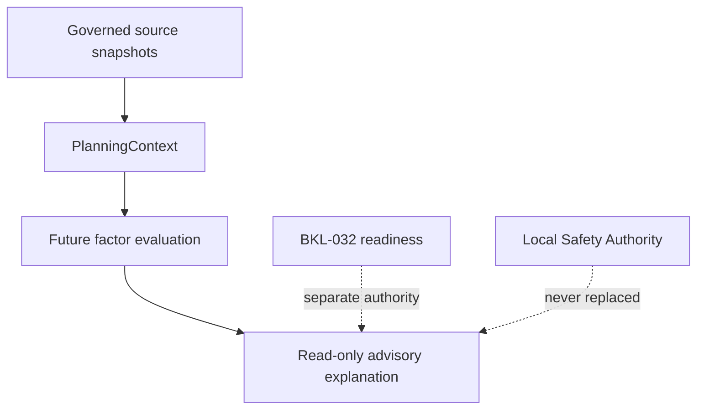

# BKL-031 F1 — Observation Planner Source Discovery and Semantic Boundary

| Field | Value |
|---|---|
| Identifier | BKL-031-F1 |
| Status | **ACCEPTED / POST-MERGE VERIFIED** — implementation not authorized |
| Version | 1.0 |
| Date | 2026-09-13 |
| Parent backlog item | BKL-031 — Observation Planner intelligente |
| Baseline | `c1440172a0565a99647ed5d6df0cb1a8adb1c8b1` |
| Program handoff | `docs/architecture/assessments/BKL-031-Architecture-Program-Assessment-and-F1-Handoff-2026-09-13.md` |
| Dependencies | BKL-015; BKL-035; BKL-029; AP-013; AP-014 |
| Runtime impact | None |
| Safety impact | None |

## 1. Purpose and decision

F1 defines the source inventory and semantic boundary for a future explainable, read-only observation planner. It does not implement a planner, calculate a score, order targets or decide whether an observing session may start.

The repository inspection found usable governed historical evidence for target identity, session-linked coordinates, acquisition setup, weather and SQM. It did not find a governed current site record, a current setup assignment with validity interval, an ephemeris/lunar provider or a forecast provider. Those dimensions remain explicitly unavailable until a later governed increment introduces and validates their contracts.

## 2. Verified baseline

- `docs/data/target-knowledge-read-model.json` exposes two bounded reconciled target identities and preserves BKL-035 Citation/Provenance and conflict semantics.
- `docs/data/scientific-session-catalog.json` exposes 16 historical sessions and links each session to normalized source metrics when present.
- `data/analytics/metadata/session-scientific-metadata.csv` contains registered or partial session attestations for target identity, coordinates and acquisition configuration.
- `data/analytics/history/sessions.csv` and `configuration-summary.csv` are historical analytics projections, not current configuration authorities.
- BKL-029 governs historical/realtime SQM meaning and keeps SQM independent from Safety Authority.
- `docs/data/realtime/observatory-status.json` is an `UNKNOWN` repository placeholder on the inspected baseline and is not eligible as current planning evidence.
- no governed repository source was located for future ephemeris/lunar geometry or weather forecast.

Counts describe only the inspected commit and are not persistent limits for later increments.

## 3. Deterministic source inventory

| ID | Exact locator / record | Owner and authority | Update / retention | Sensitivity | F1 disposition |
|---|---|---|---|---|---|
| BKL031-S01 | `docs/data/target-knowledge-read-model.json` → `targets[].target_key`; traced to `docs/data/target-knowledge-base.json` and `docs/data/target-identity-reconciliation.json` | BKL-035 projection chain; projection authority only | governed regeneration; Git history | public scientific metadata | **AVAILABLE / BOUNDED** for target identity and lineage; conflicts and bounds must be preserved |
| BKL031-S02 | `data/analytics/metadata/session-scientific-metadata.csv` → row keyed by `session_id` | AP-014 governed metadata projection | governed session reconciliation; Git history | includes equipment and raw-evidence locators | **AVAILABLE / HISTORICAL** for attested target ID, coordinates and setup; `PARTIAL` rows remain partial |
| BKL031-S03 | `docs/data/scientific-session-catalog.json` → `sessions[].sessionId` and `sourceMetricsPath` | AP-014 governed scientific projection | session publication; Git history | public scientific/session metadata | **AVAILABLE / HISTORICAL** for session identity and history; never current readiness evidence |
| BKL031-S04 | `data/sessions/<YYYY>/<MM>/<session_id>/normalized/session-metrics.json` resolved only through BKL031-S03 | governed per-session scientific projection | immutable session publication plus governed correction; Git history | operational/scientific detail; raw paths must not be leaked to public explanations | **AVAILABLE / HISTORICAL** for exact session/setup/SQM facts when fields and provenance exist |
| BKL031-S05 | `data/analytics/history/sessions.csv` and `data/analytics/history/configuration-summary.csv` | analytics projections | rebuilt after governed session import; Git history | aggregate scientific metadata | **AVAILABLE / DERIVED** for descriptive history only; cannot override BKL031-S02/S04 or assert current setup |
| BKL031-S06 | `docs/architecture/telemetry/BKL-029-SQM-Source-Discovery-and-Architecture-Contract.md` plus session-linked `raw/sqm/sqm-summary.json` / normalized `sqm.*` | BKL-029 semantic authority plus governed session evidence | source cadence is governed by BKL-029; session copies retained in Git | environmental evidence | **AVAILABLE** for SQM semantics and historical evidence; SQM is never Safety evidence |
| BKL031-S07 | `docs/data/realtime/observatory-status.json` → `observed_at_utc`, `fresh_until_utc`, `quality`, `systems.weather.*` | Observatory Status projection | producer-defined; repository copy inspected as stale/unknown | operational telemetry | **UNAVAILABLE_CURRENT_BASELINE**; never substitute last-known-good for current evidence |
| BKL031-S08 | governed observatory/site record containing stable `observatory_id`, latitude, longitude, elevation and timezone validity | no materialized authoritative record located; conceptual shape exists in DSDM-002 | not established | site location may be operationally sensitive | **UNAVAILABLE**; required before topocentric geometry can be evaluated |
| BKL031-S09 | governed active setup assignment with `configuration_id`, effective interval and conflict state | no current assignment authority located; historical configuration evidence exists in S02–S05 | not established | equipment/configuration metadata | **UNAVAILABLE_CURRENT**; historical usage must not be presented as active configuration |
| BKL031-S10 | governed celestial ephemeris/lunar adapter with source/version, coordinate epoch, site/time inputs, precision and validity | no provider, adapter or persisted projection located | not established | low, subject to provider terms | **UNAVAILABLE**; no altitude, transit, darkness, lunar phase/altitude/separation may be derived in F1 |
| BKL031-S11 | governed forecast adapter with provider/model/run, issue time, valid interval, spatial locator, cadence and missingness | no provider, adapter or persisted forecast located | not established | provider/license and site-location considerations | **UNAVAILABLE**; historical CloudWatcher weather is not forecast evidence |

### 3.1 Source precedence by fact class

Precedence is scoped by fact class, not global:

1. target identity and lineage follow the accepted BKL-035 projection chain;
2. session-linked coordinates and acquisition setup follow registered S02 evidence and the linked normalized S04 record;
3. session identity/history follows S03; analytics S05 is read optimization only;
4. SQM meaning follows the BKL-029 contract and session evidence in S04/S06;
5. current site/setup, future celestial/lunar context and forecast remain unavailable because S08–S11 are unresolved.

Raw N.I.N.A., PHD2 or weather logs may support a separately governed reconciliation but are not open-ended planner inputs and must not be reparsed ad hoc by a future consumer.

## 4. Semantic contract

### 4.1 `TargetCandidate`

A target identity eligible for evaluation, not a recommendation and not an ordered result.

Required meaning:

- stable `target_key` and, when present, exact governed `target_id`;
- canonical name, aliases, identity state and conflict references preserved from BKL-035;
- source, Citation and Provenance references;
- evidence availability per dimension;
- no implicit suitability, rank, priority or readiness state.

An identity in `conflicted` or `unknown` state remains visible but cannot be treated as a validated candidate.

### 4.2 `PlanningContext`

The immutable input envelope for one future advisory evaluation. It binds:

- context identifier and generation instant;
- requested UTC interval, with any display timezone kept separate;
- governed observatory/site reference;
- governed active setup reference and validity interval;
- target candidate set;
- evidence snapshot references and their individual observation/issue/validity times;
- explicit unavailable, stale and conflicted dimensions.

A context is not valid for celestial evaluation without a governed site reference and is not valid for setup-specific evaluation without a governed active setup assignment.

### 4.3 `EvidenceDimension`

A fact-class container with one of these meanings: target identity, setup compatibility, celestial geometry, lunar context, forecast, observed weather/SQM or scientific history.

Each dimension carries:

- `availability_state`: `AVAILABLE`, `PARTIAL`, `UNAVAILABLE`, `UNKNOWN`, `STALE` or `CONFLICTED`;
- semantic type and unit where applicable;
- source authority and exact locator;
- observation, issue and validity times when applicable;
- Citation/Provenance references;
- provenance kind: `OBSERVED`, `DECLARED` or `SUGGESTED`;
- reason codes for any non-available state.

The availability state describes evidence usability, never observatory safety.

### 4.4 `RankingFactor`

A named, explainable consideration that a later approved method may evaluate. In F1 it is a definition only.

It may identify the EvidenceDimension it consumes, expected unit/semantic type, direction of interpretation and missing/conflict behavior. It may not contain a numeric weight, score contribution, threshold, normalization curve, priority or target ordering. The term `RankingFactor` does not itself authorize ranking.

### 4.5 `RankingExplanation`

A read-only explanation envelope for a future advisory result. It must enumerate the exact factor definitions, source facts, Citation/Provenance, exclusions, missing/stale/conflicted evidence and method/version used.

It must not state `safe`, `ready`, `go`, `no-go`, `approved`, `authorized` or equivalent operational conclusions. An explanation without resolvable evidence is invalid.

## 5. Time, freshness, missingness and conflict policy

- Instants are carried in UTC with explicit offset. Local presentation must resolve through a governed site timezone reference; a guessed local timezone is forbidden.
- Historical session evidence is valid only as an immutable historical observation and must never be presented as current or forecast.
- Realtime evidence is usable as current only when its source quality is current and the evaluation instant falls within its explicit validity interval. Otherwise it is `STALE` or `UNKNOWN`; no last-known-good promotion is allowed.
- A future forecast must preserve provider/model run, issue time, valid interval and spatial applicability. No universal TTL or implicit horizon is defined by F1.
- A future ephemeris result must preserve provider/calculation method and version, target coordinates plus epoch, governed site coordinates and the evaluated UTC interval. Missing any input makes the dimension `UNAVAILABLE` or `CONFLICTED`.
- A setup assignment is current only inside an explicit validity interval. Historical occurrence of a configuration does not establish current assignment.
- Source conflict is preserved; file order, UI text, recency alone or downstream projection cannot silently choose a winner.
- Missing evidence remains missing. Null, zero, empty strings, inferred values and unrelated historical evidence cannot be used as substitutes.

## 6. Facts, declarations and suggestions

| Kind | Meaning | Permitted planner use |
|---|---|---|
| `OBSERVED` | directly recorded by an eligible governed source | may support the matching evidence dimension within its time/scope |
| `DECLARED` | explicitly attested configuration, metadata or operator input with source and validity | may support only the declared fact; it cannot be promoted to observation |
| `SUGGESTED` | output of a future advisory method | explanation/display only; never a source fact or authority |

A suggested output cannot be fed back as observed evidence without a new independently governed observation.

## 7. Boundary with BKL-032 and Safety Authority

BKL-031 may eventually advise which target merits consideration. BKL-032 separately owns pre-session readiness decision support. Neither capability is the local Safety Authority, and neither may command N.I.N.A., the mount, dome, camera, power, network or any interlock.

F1 introduces no scheduler, reservation, sequence editing, automatic target selection, go/no-go decision or command path.

## 8. Security, privacy and resource placement

- Future consumers receive bounded normalized projections, not unrestricted raw-log access.
- Raw source paths, host names, network details and credentials must not appear in public explanation payloads.
- Provider credentials, if a later source is approved, must remain outside Git and browser-delivered assets.
- External providers receive only the minimum required site/target/time data under a separately reviewed contract.
- Ephemeris calculation, forecast normalization, historical analytics and any future ranking workload run outside EAGLE. EAGLE may expose only already-governed lightweight read-only source projections.

## 9. Failure model

| Failure | Required outcome |
|---|---|
| target identity conflict | candidate retained as `CONFLICTED`; no validated evaluation |
| missing/current setup not proven | setup dimension `UNAVAILABLE_CURRENT`; no setup-specific claim |
| site identity/coordinates missing | celestial and lunar dimensions `UNAVAILABLE` |
| ephemeris/lunar provider absent or calculation inputs incomplete | celestial/lunar dimensions `UNAVAILABLE`; no derived altitude/transit/separation |
| forecast absent, expired or spatially incompatible | forecast dimension `UNAVAILABLE` or `STALE`; historical weather cannot replace it |
| realtime observation expired | `STALE`; value cannot be presented as current |
| Citation/Provenance unresolved | affected dimension invalid and excluded |
| source disagreement | `CONFLICTED`; preserve all source facts and do not choose silently |

## 10. Future solution boundary and slices

F1 authorizes only this architecture contract and its validation plan. Subject to later acceptance:

1. **F2 — Machine-readable context/source contract and bounded fixtures:** encode the five semantic objects without weights, ranking or providers.
2. **F3 — Governed site/setup plus ephemeris/lunar source integration:** only after source authority, precision, time and resource contracts are approved.
3. **F4 — Forecast source integration:** preserve provider run/validity/spatial lineage and fail closed.
4. **F5 — Explainable ranking method and read-only consumer:** requires separately approved factor definitions, method, validation evidence and explicit authorization; no readiness or commands.
5. **F6 — Capability closure:** independent review, release quality, merge and post-merge evidence.

Slice labels are planning recommendations, not implementation authorization.

## 11. Acceptance criteria for F1

F1 is ready for Architecture Review only when:

1. every candidate source is classified with exact locator, authority, cadence/validity, retention, sensitivity and disposition;
2. unavailable providers and current-state gaps remain explicit;
3. the five semantic objects have non-overlapping meanings;
4. time, freshness, missingness, conflict and identity rules fail closed;
5. no numeric weight, score, threshold, ordering or hidden suitability result is present;
6. BKL-032/readiness and local Safety Authority remain separate;
7. security/privacy and off-EAGLE resource placement are explicit;
8. the validation plan includes negative cases for staleness, missingness, conflict, timezone, identity mismatch, authority promotion and prohibited output;
9. documentation and repository checks pass on the exact publication head.

After publication, stop before ARB and Release Quality review. Review execution, AI-assisted review mode, implementation, provider selection and any governance waiver require separate authorization.

## 12. Open decisions

- materialize and govern a stable observatory/site record;
- define the authority and validity model for the active setup assignment;
- select or implement an ephemeris/lunar source only after provider/licensing/precision discovery;
- select a forecast source only after model, cadence, horizon, spatial applicability, licensing and failure behavior are verified;
- decide bounded fixture size and target coverage for F2;
- define ranking factors, weights and validation only in a later expressly authorized slice.

## 13. Validation and acceptance status

F1 is ACCEPTED / POST-MERGE VERIFIED:

- technical head reviewed: `55b502fb4e47ef92975767ceb444078cae36caf8`;
- review-publication head: `7a4d020b59186c4b05b9741bb12689050e2b7e8d`;
- PR #183 merge: `b14d9cdd991b5eef74dd9b972958e74c5903a32d`;
- ARB: APPROVED WITH CONDITIONS — 99/100, AI-assisted;
- Release Quality: CONDITIONALLY READY FOR MERGE, AI-assisted;
- publication-head workflows: 5/5 applicable SUCCESS;
- post-merge workflows: 6/6 SUCCESS, including Pages;
- acceptance: `docs/project/BKL-031-F1-ACCEPTANCE-2026-09-14.md`.

No schema, provider/API, ephemeris/lunar/forecast calculation, ranking implementation, runtime, PC Principale or EAGLE change was accepted. F2 is current only as a governed handoff and its implementation remains unauthorized.
