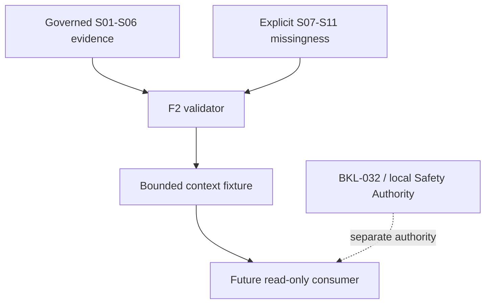

# BKL-031 F2 — Observation Planner Machine-Readable Context and Bounded Fixture

| Field | Value |
|---|---|
| Identifier | BKL-031-F2 |
| Status | **IMPLEMENTED — CANDIDATE FOR REVIEW** |
| Version | 1.0 |
| Date | 2026-09-14 |
| Parent backlog item | BKL-031 — Observation Planner intelligente |
| Baseline | `f6c4b253a56406c930f009af0658b46a12bc088a` |
| Predecessor | BKL-031 F1 — ACCEPTED / POST-MERGE VERIFIED |
| Authority | Projection contract |
| Runtime impact | None |
| Safety impact | None |

## 1. Decision

F2 materializes the accepted F1 semantics as a versioned, bounded and fail-closed repository contract. It encodes `TargetCandidate`, `PlanningContext`, `EvidenceDimension`, `RankingFactor` and `RankingExplanation` without calculating a score, ordering targets or deciding readiness.

The fixture is source-backed where accepted evidence exists and explicit about missing current evidence. BKL031-S07–S11 remain unavailable on this baseline. F2 does not select providers, call external services, expose a portal consumer or introduce runtime behavior.

## 2. Artifacts

| Artifact | Responsibility |
|---|---|
| `schemas/observation-planner-context-f2.schema.json` | published JSON Schema 2020-12 structural contract |
| `docs/data/observation-planner-context-f2-fixture.json` | bounded source-backed fixture with one candidate and one context |
| `.github/scripts/verify-observation-planner-context-f2.mjs` | normative structural, semantic and source-reconciliation validator |
| `.github/scripts/test-observation-planner-context-f2.mjs` | deterministic positive test, the 20 mandatory F1 negative cases and 16 ARB-remediation regressions |
| `.github/workflows/developer-foundation.yml` | exact-head CI quality gate |
| `docs/architecture/validation/BKL-031-F2-Context-Contract-Validation-Evidence-2026-09-14.md` | traceability and validation evidence |

The executable validator is normative for CI because the repository has no governed JSON Schema runtime dependency. It enforces the published schema's closed property sets, required fields, constants, enums, types, bounds and references, plus semantic/source rules that JSON Schema alone cannot express. A future divergence between schema and validator is a contract defect.

## 3. Bounded fixture

The fixture contains:

- exactly the eleven accepted source inventory entries BKL031-S01–S11;
- one exact BKL-035 candidate, `dsg-target:m-27`;
- one immutable UTC planning context;
- exactly seven evidence dimensions for that candidate;
- seven factor definitions, one per evidence dimension;
- one `NOT_EVALUATED` explanation using `BKL031-F2-NO-RANKING-1`;
- four public-safe Citations and five bounded Provenance records.

The declared maxima are two candidates, one context, seven dimensions per candidate, seven factor definitions and two explanations. Expanding those bounds requires a later governed change.

No incomplete or conflicted source record is manufactured for coverage. Negative tests mutate in-memory copies and never publish invented facts.

## 4. Source state preserved

| Sources | F2 state | Permitted meaning |
|---|---|---|
| S01 | `AVAILABLE_BOUNDED` | exact target identity and lineage only |
| S02 | `AVAILABLE_HISTORICAL` | session-scoped historical metadata; sole F2 authority for RA/Dec/epoch facts |
| S03 | `AVAILABLE_HISTORICAL` | public-safe scientific-session catalog and S04 resolution boundary |
| S04 | `AVAILABLE_HISTORICAL` | normalized session metrics resolved only through S03; no F2 coordinate-fact authority |
| S05 | `AVAILABLE_DERIVED` | descriptive history; never authority override |
| S06 | `AVAILABLE` | SQM semantics and historical session evidence; never Safety evidence |
| S07 | `UNAVAILABLE_CURRENT_BASELINE` | placeholder cannot become current evidence |
| S08 | `UNAVAILABLE` | no governed materialized site record |
| S09 | `UNAVAILABLE_CURRENT` | no active setup assignment or validity interval |
| S10 | `UNAVAILABLE` | no governed ephemeris/lunar source |
| S11 | `UNAVAILABLE` | no governed forecast source |

The M 27 fixture preserves target identity from S01, two historical session references from S03 and one historical SQM median from S05 under S06 semantics. Setup, celestial, lunar and forecast dimensions contain no values and remain `UNAVAILABLE`.

## 5. Semantic object contract

### 5.1 TargetCandidate

A candidate binds one exact BKL-035 identity to its source, Citation, Provenance, conflict state and seven evidence dimension references. It contains no suitability, priority, rank or readiness field. The validator rejects fuzzy target matching and rejects any promotion of a conflicted or unknown BKL-035 identity to validated.

### 5.2 PlanningContext

The context is an immutable envelope with explicit UTC generation/evaluation instants and requested interval. Site, display timezone and active setup are nullable only because their governing sources are absent. When the site or active setup is absent, the corresponding evidence dimensions must remain unavailable.

### 5.3 EvidenceDimension

Every candidate has exactly one dimension of each accepted type. A usable `AVAILABLE` or `PARTIAL` dimension requires facts, evidence kind, Citation and Provenance. An `UNAVAILABLE`, `UNKNOWN`, `STALE` or `CONFLICTED` dimension exposes no value and requires reason codes.

Facts carry source, semantic type, unit, temporal scope, observation/issue time, validity, spatial scope and method where applicable. Their vocabulary is closed per dimension. Every value and unit must equal the exact field selected by its bounded Citation, while Provenance must bind the exact input set, output and Citation set. On the F2 baseline, coordinate facts are restricted to S02; S04 has no RA/Dec/epoch fields and cannot substantiate them. Current, forecast, celestial and lunar facts have additional fail-closed source and completeness rules.

### 5.4 RankingFactor

F2 represents definitions only. Every factor declares its consumed dimension, expected semantics/unit, interpretation direction and mandatory `EXCLUDE_AND_EXPLAIN` missing/conflict behavior. The validator rejects numeric weights, scores, contributions, thresholds, normalization, priority and ordering.

### 5.5 RankingExplanation

F2 publishes only a `NOT_EVALUATED` explanation. It enumerates all factor and evidence references and every partial, unavailable, stale or conflicted reason. Operational conclusion vocabulary and any readiness, command or authorization semantics are rejected.

## 6. Component and authority boundary

F2 has `authority=projection`, `action_authority=NONE`, `safety_authority=NONE` and `execution_zone=PORTAL_CI`. It cannot edit N.I.N.A. sequences or command mount, dome, camera, power, network or interlocks. It does not run computation or external calls on EAGLE.

## 7. Ports and future adapters

F2 defines a file-contract validation port only:

- input: the F2 JSON envelope plus the exact BKL-035 target read model, AP-014 scientific metadata, scientific session catalog and analytics session projection;
- output: an ordered collection of validation errors, or success with no mutation;
- failure: any unresolved or semantically misbound source, Citation or Provenance fails closed.

Site/setup, ephemeris/lunar and forecast adapters are intentionally absent. Each requires a separate governed source contract before integration. No browser API, provider credential, network endpoint or runtime dependency is introduced.

## 8. Security, privacy and observability

- Public Citations use a strict allowlist and reject raw operational paths, URLs and credential-like locators.
- Source S02/S04 raw-evidence detail remains non-public and is never copied into the fixture.
- No provider secrets or host/network identifiers are stored.
- Validator output is bounded diagnostic text with no source payload leakage.
- CI exit code is the F2 operational signal; runtime telemetry and EAGLE OAT are not applicable.

## 9. Failure behavior

The validator is total for arbitrary JSON input: malformed roots, containers and nested values return deterministic validation errors instead of throwing. It rejects structural drift, authority escalation, bounds expansion, source-state or locator drift, identity mismatch, fuzzy matching, timezone ambiguity, stale/current promotion, historical/current or historical/forecast substitution, incomplete provider facts, Citation/value or Provenance binding mismatch, semantics outside the per-dimension vocabulary, prohibited scoring/output fields, command surfaces, EAGLE execution and silent conflict resolution.

Missing evidence remains visible and excluded. It is never replaced with zero, null, last-known-good values, historical evidence from another fact class or a suggested output.

## 10. Migration and rollback

F2 is additive and repository-only. It does not migrate persistence, modify current portal pages, change observatory runtime or write PC Principale/EAGLE state.

Migration is limited to adding the schema, fixture, validator, tests, CI steps and documentation. Rollback is a repository revert of those F2 paths and the two CI entries. No data restoration, credential rotation, scheduled-task rollback or hardware action is required.

## 11. Validation and acceptance boundary

Local validation on the implementation candidate reports:

- normative fixture verification: PASS;
- Node test suite: 37/37 PASS;
- mandatory F1 negative cases N01–N20: 20/20 PASS;
- ARB remediation regressions: 16/16 PASS, including rejection of coordinate claims against the current S04 artifact;
- malformed-JSON exploratory matrix: 250/250 returned deterministic non-empty error arrays, with zero throws.

GitHub Actions on the exact PR head remains the authoritative publication evidence. F2 is not accepted or closed by this document. The AI-assisted remediation re-review on `d21d57905b2669ccd572563449a523c1795bdcc2` remained `REWORK REQUIRED` because S04 could attest absent coordinate fields. This correction removes that path, but the review decision remains in force until another separately authorized exact-head re-review. Further ARB review, Release Quality repeat, merge, any branch-protection waiver and F3 implementation each require separate owner authorization.

## 12. Deferred decisions

- materialized governed site identity and timezone;
- current setup assignment and validity contract;
- ephemeris/lunar source, licensing, precision and resource budget;
- forecast provider/model/run, licensing, spatial applicability and freshness;
- factor weights, scoring, normalization, ranking validation and target ordering;
- read-only portal consumer;
- BKL-032 readiness integration.

These are not hidden extension points in F2; they are explicit later governance increments.

