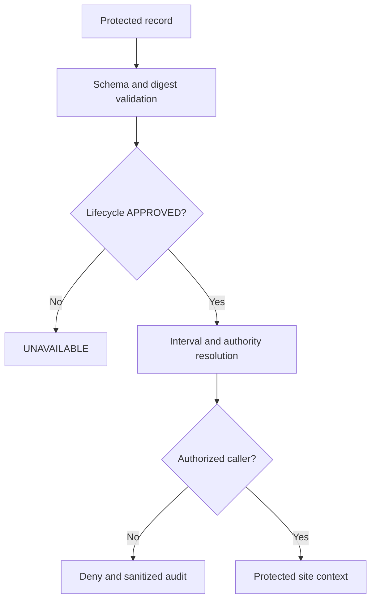

# BKL-031 F3-A1-M2 — Protected Site Authority Materialization

| Campo | Valore |
|---|---|
| Identificativo | BKL-031-F3-A1-M2-SOLUTION-001 |
| Stato | **IMPLEMENTED AS PROTECTED DRAFT / EXACT-DIGEST APPROVAL REQUIRED** |
| Data | 15/09/2026 |
| Capability | BKL-031 — Observation Planner intelligente |
| Contratto | BKL-031-F3-A1-CONTRACT-001 |
| Repository baseline | `main@bb11f25192200655427411a46a2e18560a5d9bec` |
| Runtime / EAGLE | None |

## 1. Outcome

The Repository Owner supplied and authorized the protected Site Authority source facts and governance decisions required by F3-A1-M1. F3-A1-M2 materializes a protected, versioned `DRAFT` candidate outside the Pages tree and adds deterministic schema, validation, resolver semantics and executable privacy controls.

No protected value, internal identifier, source locator or internal digest is reproduced in this document. The candidate remains ineligible until the owner separately approves the exact canonical payload digest.

## 2. Components and responsibilities

| Layer / component | Responsibility | Explicit exclusions |
|---|---|---|
| Protected registry | retain site payload, source-decision evidence and future approval receipt | public publication, runtime discovery |
| Versioned schemas | constrain lifecycle, authority, geodesy, validity, classification and receipts | runtime persistence choice |
| Canonicalizer / validator | recompute payload identity and fail closed on invalid or ambiguous records | logging protected data |
| Resolver core | select one approved, interval-valid record in one authority scope | latest-wins, fallback or inference |
| Public-boundary guard | enforce allowlist, independent public identity and protected-literal leak scan | public projection delivery |
| Dedicated workflow | execute registry validation and 51 contract/privacy/boundary cases | EAGLE or observatory workload |

## 3. Authority and identity

- GitHub's versioned protected registry is the system of record.
- The Repository Owner is Site Owner and human Approval Authority.
- The Architecture Office is technical custodian and cannot self-approve.
- One owner-selected protected observatory identity is canonical for lookup.
- `observatoryRef` may map to that identity only through an explicit authorized mapping; ambiguous or cross-authority lookup fails closed.
- The candidate authority scope is one observatory. File order, modification time and revision preference never resolve conflicts.

This closes the design ambiguity of `ARB-193-MI02` for the repository materialization scope. Any future runtime adapter must preserve the same identity mapping and negative cases.

## 4. Geodetic and temporal semantics

- horizontal datum: WGS84 decimal degrees;
- elevation: orthometric metres relative to mean sea level;
- admitted elevation range: `-500 <= elevationM <= 9000`;
- values outside the range or non-finite values are invalid; no clamping or default is allowed;
- timezone: governed IANA identifier; UTC validity is never altered by local display conversion;
- validity: half-open with explicit `UNBOUNDED` end for the first candidate;
- validity begins at the recorded owner source-decision receipt timestamp and has no end until governed replacement or retirement.

This closes `ARB-193-MI01` at schema/validator level. Scientific accuracy of the owner-attested source is not independently measured or reclassified.

## 5. Data flow and failure path

Failure is explicit:

- malformed validity or site semantics -> `INVALID`;
- digest mismatch -> `INTEGRITY_FAILURE`;
- no approved interval or current DRAFT only -> `UNAVAILABLE`;
- overlap -> `CONFLICTED`;
- unauthorized exact request -> deny plus sanitized audit;
- unsanitizable public projection -> `PUBLIC_PROJECTION_POLICY`.

## 6. Privacy enforcement

The public boundary admits only:

- an independently assigned opaque public reference;
- a digest calculated solely from the public payload;
- the generalized municipality label and governed timezone display;
- availability, reason, time and public-safe provenance metadata.

The implementation rejects protected fields and checks that exact protected literals, protected internal identifiers, source locator and internal digest do not appear anywhere under `docs/`. Workflow output is generic and intentionally omits those values.

`ARB-191-MI01` is satisfied for repository schema, public-boundary code and leak-test enforcement. It remains a carried gate for any future adapter or public consumer implementation.

## 7. Validation

The executable suite implements the accepted matrix:

- A1-P01–A1-P10: 10 positive cases;
- A1-N01–A1-N12: temporal failure cases;
- A1-N13–A1-N27: lifecycle, integrity and semantic failures;
- A1-N28–A1-N37: privacy and authorization failures;
- A1-N38–A1-N41: architecture, provider, safety and EAGLE scope failures.

The dedicated workflow validates the real protected candidate without printing protected content. Synthetic fixtures alone exercise boundary values and failure injection.

## 8. Delivery slices

| Slice | State | Acceptance condition |
|---|---|---|
| M2-A schema/canonicalization | implemented candidate | schema and digest parity pass |
| M2-B protected DRAFT | implemented candidate | source decision present; lifecycle remains ineligible |
| M2-C validator/test gate | implemented candidate | 51/51 cases and leak scan pass |
| M3 exact-digest approval | blocked on owner | exact digest explicitly approved through owner-controlled channel |
| M4 lifecycle promotion | not started | receipt added without payload mutation; re-review and CI |
| M5 repository adapter | not started | separate architecture package and authorization |
| CurrentSetupAssignment | not started | separate record, digest and human approval |

## 9. Security, operations and safety

- repository read permissions remain the access boundary for this increment;
- no new credential, external service, database or dependency is added;
- no coordinates, locator or internal digest may enter logs;
- no runtime deployment, device command, readiness decision or go/no-go is introduced;
- no EAGLE activity is required;
- local physical and software interlocks remain independent and authoritative for safety.

## 10. Rollback

Before approval, revert the protected DRAFT, schemas, scripts and documentation commit set. After a future approval, retire the envelope and return S08 to `UNAVAILABLE`; never delete evidence or fall back to N.I.N.A., telemetry or public generalized data. No observatory rollback is required.
