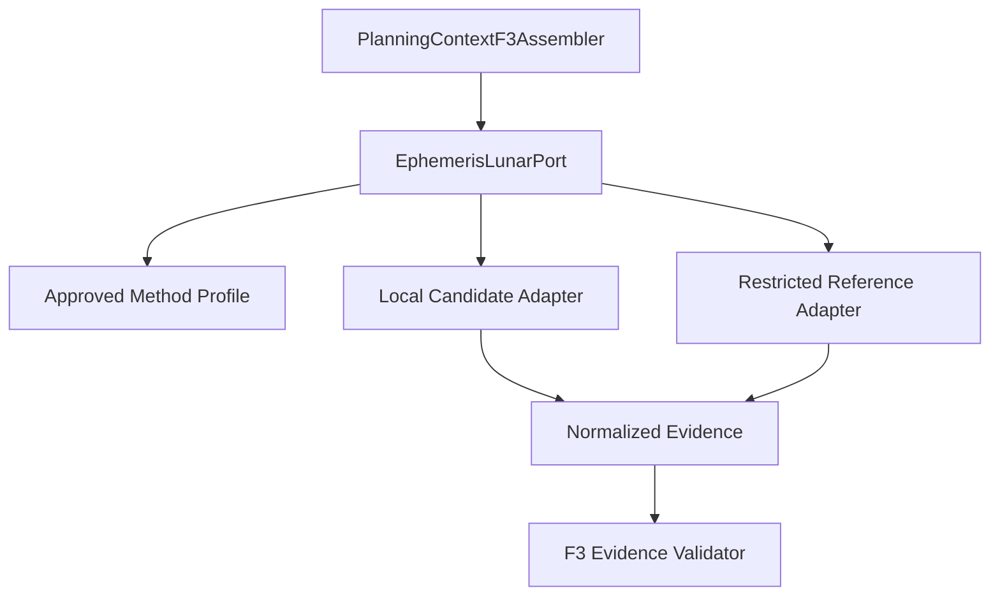
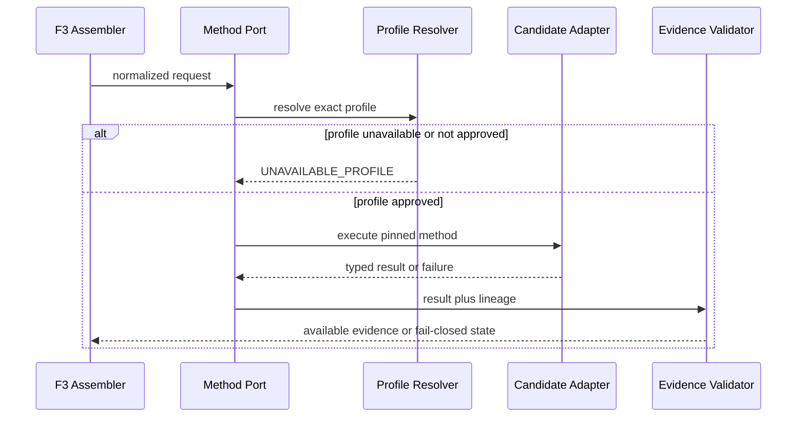

# BKL-031 F3-A3 — Ephemeris/Lunar Method Decision Preparation

| Field | Value |
|---|---|
| Identifier | BKL-031-F3-A3-SOLUTION-001 |
| Status | **PROPOSED / REVIEW CANDIDATE — DECISION PENDING / NOT IMPLEMENTED** |
| Version | 1.0 |
| Date | 2026-09-15 |
| Capability | BKL-031 — Observation Planner intelligente |
| Governing handoff | BKL-031-F3-A3-PROGRAM-001 |
| Proposed ADR | ADR-010 |
| Baseline | `main@4f76f6646769df378859fbb15147851b4d0543fe` |
| Target release | Release 2.x planning increment |
| Runtime / data / infrastructure delta | None |
| PC Principale / EAGLE | No action authorized |

## 1. Purpose

Prepare the complete owner decision packet for the F3-A3 ephemeris/lunar method and its later validation spike without selecting, installing or executing a provider.

This package converts the accepted source-neutral F3 architecture into an implementable decision design. It defines candidate roles, component boundaries, comparison evidence, failure semantics, privacy controls, validation stages and rollback. S10 remains `UNAVAILABLE`.

## 2. Scope and non-goals

In scope:

- compare Astropy + pinned JPL SPK, Skyfield + pinned JPL SPK and JPL Horizons;
- define the source-neutral `EphemerisLunarPort` boundary;
- prepare owner decisions F3-OD04–F3-OD10;
- define a bounded, synthetic validation-spike protocol;
- define supply-chain, license, privacy, observability and rollback evidence;
- create ADR-010 as a proposed decision record.

Out of scope:

- provider/library/kernel approval;
- dependency installation or artifact download;
- external API calls;
- use or transmission of protected site coordinates;
- numeric error-budget approval;
- execution-host selection;
- schema, fixture, validator, adapter, cache or runtime implementation;
- forecast, ranking, readiness/go-no-go, command or Safety Authority.

## 3. Governing current state

| Element | Verified current state |
|---|---|
| F3 architecture | accepted with conditions / post-merge verified |
| F3-A1 Site Authority | repository authority APPROVED; runtime S08 remains `UNAVAILABLE` |
| F3-A2 CurrentSetupAssignment | repository authority APPROVED/AVAILABLE for authorized validated input; runtime S09 remains `UNAVAILABLE_CURRENT` |
| F3-OD01–F3-OD03 | resolved by ADR-009 and F3-A1/A2 lifecycle evidence |
| F3-OD04–F3-OD10 | OPEN |
| S10 ephemeris/lunar | `UNAVAILABLE` |
| Provider/library/kernel | none approved |
| Runtime adapter/cache | absent |
| F3-B/F3-C | blocked |

Repository availability of site/setup authority does not imply runtime availability or permission to disclose protected values.

## 4. Architectural drivers

1. Deterministic and reproducible evidence.
2. Provider-neutral Domain and Application contracts.
3. Pinned software and scientific-data identity.
4. Explicit time scale, frame, epoch, datum and refraction semantics.
5. Fail-closed missingness and no silent fallback.
6. Independent scientific reference, not library agreement alone.
7. Protected site data kept outside public/browser artifacts.
8. Off-EAGLE bounded execution.
9. Explicit license, provenance, cache and retention controls.
10. Audit-ready owner decisions before implementation.

## 5. Official-source refresh — 2026-09-15

The following primary sources were inspected for decision preparation. Observation is not approval.

| Source | Verified observation | Decision relevance |
|---|---|---|
| [Astropy Solar System Ephemerides](https://docs.astropy.org/en/stable/coordinates/solarsystem.html) | stable docs identify Astropy 8.0.1; JPL use requires `jplephem`; kernel files may be downloaded and cached; results depend on ephemeris/frame consistency | dependency, kernel, cache and frame controls |
| [Astropy AltAz](https://docs.astropy.org/en/stable/api/astropy.coordinates.AltAz.html) | WGS84 location and obstime are required; pressure 0 disables refraction; documented refraction becomes unreliable near the horizon | airless/refracted semantic and boundary cases |
| [Astropy PyPI](https://pypi.org/project/astropy/) | observed release 8.0.1, Python >=3.11, BSD-3-Clause, verified publishing metadata and artifact hashes | candidate version evidence only |
| [Skyfield planets](https://rhodesmill.org/skyfield/planets.html) | SPK coverage is inspectable from kernel segments; official reports, not the file alone, carry accuracy context | coverage and independent evidence |
| [Skyfield almanac](https://rhodesmill.org/skyfield/api-almanac.html) | APIs cover transits, rise/set and lunar phase with explicit conventions | function coverage and convention checks |
| [Skyfield PyPI](https://pypi.org/project/skyfield/) | observed release 1.55, MIT license and published artifact hashes | candidate version evidence only |
| [jplephem PyPI](https://pypi.org/project/jplephem/) | observed release 2.24, MIT license; SPK segment coverage is inspectable | Astropy/Skyfield SPK dependency evidence |
| [Horizons API v1.3](https://ssd-api.jpl.nasa.gov/doc/horizons.html) | geodetic `SITE_COORD`, time scale, frame, airless/refracted output and bounded time lists are explicit; application errors can occur inside HTTP 200 payloads; 503 is possible | privacy, parser, availability and error controls |
| [astropy-iers-data PyPI](https://pypi.org/project/astropy-iers-data/) | observed dated data package and artifact hashes; freshness changes independently from code | F3-OD07 version/freshness evidence |

Exact package and artifact hashes above are observations. They are not repository pins and must be refreshed at decision/execution time.

## 6. Candidate comparison

| Candidate | Potential role | Strengths | Risks / blockers | Current disposition |
|---|---|---|---|---|
| Astropy 8.0.1 + jplephem 2.24 + governed JPL SPK | local primary candidate or local reference | explicit units, frames, `Time`, `EarthLocation`, AltAz and broad Python astronomy ecosystem | Python >=3.11; kernel/IERS acquisition; refraction convention; cache identity | EVALUATE — NOT SELECTED |
| Skyfield 1.55 + governed JPL SPK | local primary candidate or independent local reference | explicit timescale/topos model, SPK inspection and almanac functions | independent convention mapping required; kernel/timescale updates; separate dependency | EVALUATE — NOT SELECTED |
| JPL Horizons API v1.3 | remote validation-only candidate unless separately approved | official observer/vector service and explicit output controls | external availability, parser errors within HTTP 200, service drift, exact-site disclosure and retention/terms | RESTRICTED EVALUATION — NOT SELECTED |

The same SPK family used through two libraries is not, by itself, an independent scientific reference. The spike must distinguish implementation cross-check from data-model independence.

## 7. Conditional architecture recommendation

Recommendation for owner consideration, not an approval:

1. prefer a local/offline method as the future primary to preserve determinism and avoid site-coordinate transmission;
2. evaluate the other local library as an implementation cross-check;
3. keep Horizons disabled by default and use it only as a validation reference with geocentric or unmistakably synthetic/generalized site inputs unless the owner separately accepts exact-site transmission and retention risk;
4. select the exact JPL SPK only after coverage, provenance, checksum and redistribution review;
5. keep S10 `UNAVAILABLE` until ADR-010 is accepted and the authorized spike passes.

No ranking between Astropy and Skyfield is issued before measured evidence.

## 8. Target component boundary

| Layer | Component | Responsibility | Prohibited behavior |
|---|---|---|---|
| Domain | ephemeris/lunar value objects | units, ranges and invariant semantics | import provider types or clients |
| Application | `EphemerisLunarPort` | normalized request/result contract | select method implicitly |
| Application | `MethodProfileResolver` | resolve one accepted profile by ID/version | default to latest or fallback |
| Infrastructure | local candidate adapter | execute exactly one pinned local method | download dependencies/data at request time |
| Infrastructure | restricted reference adapter | execute explicitly authorized validation reference | production fallback or unapproved site transmission |
| Infrastructure | content-addressed artifact store | expose exact dependency/data identity | mutable latest aliases |
| Application | evidence validator | enforce completeness, coverage and digests | repair or average conflicting results |
| Presentation | sanitized projection | publish approved facts and lineage references | publish protected coordinates, raw provider payloads or readiness |

## 9. Architecture-level contracts

### 9.1 Method profile

| Field | Rule |
|---|---|
| `methodProfileId` / `revision` | stable and immutable |
| `lifecycle` | `DRAFT`, `APPROVED`, `RETIRED` |
| `primaryAdapterId` | required only after F3-OD04 acceptance |
| `referenceAdapterIds` | explicit; never used for runtime fallback |
| `libraryName/version/artifactDigest` | exact, no range/latest |
| `kernelId/version/artifactDigest/coverage` | exact and coverage-checked |
| `iersDataId/version/artifactDigest/freshThrough` | exact with freshness policy |
| `timeScale/frame/epoch/datum/refractionMode` | explicit |
| `supportedTargetKinds/dateRange` | bounded |
| `errorBudgetProfileId` | required after F3-OD06 acceptance |
| `maxTargets/maxInstants/maxSpan` | required after F3-OD10 acceptance |
| `approvalRef` | exact owner/ADR evidence |

### 9.2 Normalized request

Required: target identity and governed coordinates, UTC instant(s), protected site-authority reference, method-profile reference and requested fact set. Exact coordinates remain inside the protected execution boundary.

### 9.3 Normalized result

Available results carry:

- target/site/request/method/profile/data digests;
- explicit time scale, frame, epoch, datum and refraction mode;
- altitude/azimuth, transit, solar altitude, lunar position/phase/illumination and target–Moon separation only when requested and valid;
- unit and semantic type per fact;
- coverage and freshness evidence;
- reason code and no value for unavailable/conflicted states.

## 10. Request sequence and failure path

No adapter switch occurs after any failure. A reference result cannot be promoted to primary.

## 11. Failure semantics

| Condition | Required outcome |
|---|---|
| method profile absent/not approved | S10 `UNAVAILABLE_PROFILE` |
| dependency or artifact digest mismatch | `INVALID_METHOD_ARTIFACT`; no calculation |
| kernel outside coverage | `OUT_OF_COVERAGE` |
| IERS/EOP missing or stale beyond accepted policy | `TIME_DATA_UNAVAILABLE` |
| frame/refraction profile missing | `INVALID_METHOD_PROFILE` |
| remote timeout/503 | `REFERENCE_UNAVAILABLE`; no local/remote switch |
| Horizons HTTP 200 with error payload | parse as failure, never success |
| candidate disagreement outside accepted budget | `CONFLICTED_METHOD_EVIDENCE` |
| resource bound exceeded | `REQUEST_BOUND_EXCEEDED` |
| attempted protected-data publication | publication rejected |
| unavailable/conflicted fact with a value | validation failure |

## 12. Owner decision packet

| ID | Options prepared | Recommendation for consideration | Required evidence |
|---|---|---|---|
| F3-OD04 | Astropy primary / Skyfield primary / no selection; secondary local/reference roles | local primary plus independent explicit reference; no implicit fallback | spike matrix and owner choice |
| F3-OD05 | bounded current JPL SPK / broader JPL SPK / reject | smallest artifact covering approved range, exact checksum and provenance | official coverage, terms and digest |
| F3-OD06 | planner error-budget profile / reject pending instrument context | define separate angular, timing, separation and illumination limits; no aggregate tolerance | owner values, rationale and independent vectors |
| F3-OD07 | pinned packaged IERS snapshot / controlled refresh / reject | pinned snapshot per campaign plus explicit freshness and update review | version, digest, freshness and leap-second policy |
| F3-OD08 | local-only / restricted remote reference / remote rejected | default local-only; prohibit exact-site transmission absent explicit approval | privacy, terms, retention and cache review |
| F3-OD09 | CI worker / dedicated server / reject | off-EAGLE isolated worker measured before selection | host authorization and resource evidence |
| F3-OD10 | owner-defined bounded grid / reject | bounds derived from spike measurements; reject unbounded requests | max target/time/span values and load evidence |

## 13. Error-budget decision template

ADR-010 must record separate accepted values and units for:

| Metric | Symbol | Decision state |
|---|---|---|
| altitude absolute angular difference | `E_alt` | OWNER VALUE REQUIRED |
| azimuth circular angular difference | `E_az` | OWNER VALUE REQUIRED |
| meridian-transit time difference | `E_transit` | OWNER VALUE REQUIRED |
| target–Moon separation difference | `E_sep` | OWNER VALUE REQUIRED |
| lunar illumination fraction difference | `E_illum` | OWNER VALUE REQUIRED |
| deterministic repeatability | `E_repeat` | OWNER VALUE REQUIRED |

No average score may hide failure of an individual metric.

## 14. Security, privacy and licensing

- exact site coordinates remain protected and are never committed to public fixtures;
- candidate/reference requests use synthetic/generalized locations until separately authorized;
- remote requests are server-side only, minimized and logged without coordinates;
- licenses, notices, artifact hashes and data/kernel provenance are recorded before acquisition;
- credentials are not expected by the documented candidates; any future credential introduces a new security review;
- logs contain approved identifiers, digests, result state, duration and reason codes only;
- public evidence references must remain non-correlatable with protected record digests per `ARB-204-MI01`;
- any runtime adapter must satisfy `ARB-204-MI02`.

## 15. Observability and bounded operation

Future spike evidence must include:

- correlation ID, method/profile ID and sanitized request digest;
- dependency/data/IERS identities and coverage state;
- duration and bounded resource measurements;
- success/failure/reason code counts;
- cache hit only when the exact content digest matches;
- zero automatic retries across different adapters;
- no live observatory or EAGLE dependency.

No alert, metric or trace may be interpreted as readiness or Safety state.

## 16. Migration and rollback

1. integrate this decision-preparation package;
2. obtain explicit owner dispositions for F3-OD04–F3-OD10 and update ADR-010;
3. authorize an isolated validation-spike increment;
4. materialize pinned manifests and synthetic vectors only;
5. execute and review the campaign;
6. accept/reject ADR-010 based on evidence;
7. only then consider F3-B.

Rollback of steps 1–2 is a reviewed Git revert. Rejection or failed spike leaves S10 `UNAVAILABLE` and removes no historical evidence.

## 17. Validation, release and documentation impact

- normative spike plan: `docs/architecture/validation/BKL-031-F3-A3-Ephemeris-Lunar-Method-Validation-Spike-Plan.md`;
- proposed decision record: `docs/architecture/ADR-010-Ephemeris-Lunar-Method-and-Validation-Profile.md`;
- tests/spike: `NOT EXECUTED`;
- runtime/OAT: `NOT AUTHORIZED`;
- release behavior: unchanged;
- release notes: not applicable because no shipped capability or runtime behavior changes;
- MkDocs/index/roadmap continuity: updated in this package.

## 18. Risks and trade-offs

| Risk | Control |
|---|---|
| recommendation mistaken for approval | Proposed/Decision Pending status and explicit owner gate |
| two libraries share one kernel and appear independent | distinguish implementation cross-check from independent reference |
| mutable latest package/data | exact versions and artifact digests |
| remote exact-site disclosure | local-only default recommendation and explicit privacy approval |
| scientific threshold invented | owner values required; no numeric claim |
| near-horizon refraction instability | airless baseline and separate approved refraction profile |
| service/parser drift | versioned response fixtures and semantic error parsing |
| resource growth | owner-approved bounded grid and fail-closed limit |
| false production readiness | S10 unavailable and NOT IMPLEMENTED labels |

## 19. Traceability

| Requirement | Source | Package element |
|---|---|---|
| dependency order | BKL-031-F3-A3-PROGRAM-001 | sections 3 and 16 |
| source-neutral core | accepted F3 architecture | sections 8–10 |
| S10 method/version | F2/F3 | method profile and normalized evidence |
| OD04–OD10 | accepted F3 architecture | section 12 and ADR-010 |
| scientific evidence | F3 validation plan | F3-A3 spike plan |
| privacy/public boundary | ADR-009, ARB-204-MI01 | sections 14–15 |
| runtime adapter gate | ARB-204-MI02 | section 14 |
| no readiness/command/Safety | enterprise context | scope and failure semantics |

## 20. Acceptance criteria

This package is review-ready when:

1. all three candidates remain unselected;
2. official-source observations are dated and distinguish observation from approval;
3. ADR-010 exposes owner choices F3-OD04–F3-OD10;
4. the validation plan is reproducible without real protected site data;
5. no numeric threshold, host or request bound is invented;
6. component/layer boundaries are source-neutral;
7. failure behavior is deterministic and fail-closed;
8. privacy, licensing, observability, migration and rollback are explicit;
9. governance documents and navigation are aligned;
10. exact-head CI and process-separated review complete.

## 21. Open issues and governance stop

Open: F3-OD04–F3-OD10.

Stop after integration and post-merge verification of this documentation package. The next action is an explicit owner decision packet. No dependency installation, data/kernel download, external call, protected-site use, spike execution or runtime work is authorized.
