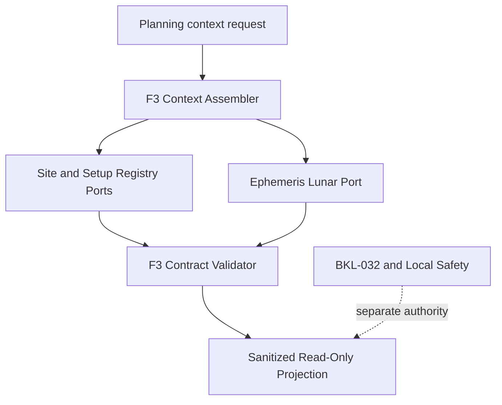
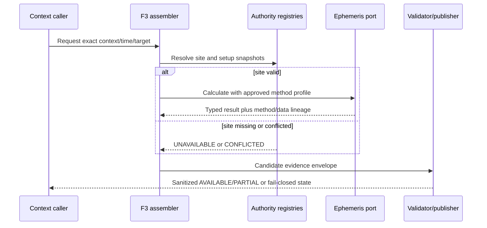

# BKL-031 F3 — Governed Site/Setup and Ephemeris/Lunar Solution Architecture

| Field | Value |
|---|---|
| Identifier | BKL-031-F3-SA-001 |
| Status | **ACCEPTED WITH CONDITIONS / POST-MERGE VERIFIED — NOT IMPLEMENTED** |
| Version | 1.1 |
| Date | 2026-09-14 |
| Baseline | `main` @ `2ffc77917bcd3fc25a3c5657e8f12e62c9284303` |
| Parent handoff | `docs/architecture/assessments/BKL-031-F3-Governed-Site-Setup-Ephemeris-Lunar-Handoff-2026-09-14.md` |
| Predecessors | BKL-031 F1/F2 — ACCEPTED / POST-MERGE VERIFIED |
| Authority | Projection only; `action_authority=NONE`; `safety_authority=NONE` |
| Acceptance | PR #191 merge `3a79bb93c9a0925280eba5214d517107804cb13c`; 9/9 post-merge workflows |
| Open conditions | `ARB-191-MI01`, `ARB-191-MI02` |
| Runtime impact | None — architecture package only |
| PC Principale / EAGLE | No change or activity authorized |

## 1. Purpose and decision boundary

This package converts the approved F3 handoff into an implementable, source-neutral solution design for:

- S08 — governed observatory/site identity, geodetic position and IANA timezone;
- S09 — governed current setup assignment with validity and conflict state;
- S10 — governed ephemeris/lunar method and evidence projection.

It defines components, ports, contracts, failure behavior, privacy boundaries, migration slices and validation criteria. It does **not** select a provider/library, approve an ADR, materialize a real site/setup record, create a schema or fixture, implement an adapter, perform a calculation or publish a runtime consumer.

F4 remains owner of forecast evidence. F5 remains owner of weights, scoring, ranking and the read-only planner consumer. BKL-032 remains owner of readiness/go-no-go semantics. Local physical interlocks remain the only Safety Authority.

## 2. Verified state at PR #191 acceptance

This section preserves the accepted PR #191 baseline. For the current repository-authority state after F3-A1/F3-A2, see section 23.

### 2.1 S08 — site

`DSDM-002` defines a conceptual `Observatory` with `observatoryId`, name, optional coordinates/elevation, required `timezoneId` and status. The repository does not contain a materialized, approved record that can act as current site authority.

Display text such as “Manciano (GR)” is descriptive only. It cannot supply coordinates, elevation, timezone validity or approval evidence.

### 2.2 S09 — current setup

`data/analytics/metadata/session-scientific-metadata.csv` records session-scoped historical `configuration_id` values. `data/analytics/history/configuration-summary.csv` is a derived historical aggregate. Neither establishes the active configuration at a future evaluation instant.

AP-006 distinguishes desired, observed and approved baseline state. No approved active-setup assignment with an effective interval is currently materialized.

### 2.3 S10 — ephemeris/lunar

No approved ephemeris/lunar provider, pinned library, kernel, adapter, precision profile or persisted projection exists in the repository. Therefore altitude, transit, solar altitude, Moon position/phase/illumination and target–Moon separation remain unavailable on the accepted F2 baseline.

### 2.4 Preserved F2 baseline

The accepted F2 contract remains unchanged:

- S08 = `UNAVAILABLE`;
- S09 = `UNAVAILABLE_CURRENT`;
- S10 = `UNAVAILABLE`;
- unavailable/conflicted facts expose no value and carry reason codes;
- `PlanningContext`, `EvidenceDimension`, Citation and Provenance remain lossless;
- no numeric weight, score, threshold, ordering, readiness or command field is allowed.

## 3. Architecture principles

1. **Authority before calculation.** No celestial/lunar fact is available without an approved site record and complete target/time input.
2. **Current means interval-valid.** Historical occurrence or latest-file order never establishes current setup.
3. **Source-neutral core.** Domain and Application contracts do not depend on Astropy, Skyfield, Horizons or another provider.
4. **Deterministic evidence.** Every result binds exact input, method, adapter, data/kernel and configuration digests.
5. **Fail closed.** Missing, stale, conflicted, out-of-coverage or invalid inputs produce explicit non-available states.
6. **Privacy by projection.** Exact site coordinates stay outside public/browser artifacts.
7. **Off-EAGLE execution.** External calls and non-trivial calculations run only in a future approved server/CI worker.
8. **Advisory only.** F3 produces evidence, not suitability, readiness, safety or commands.
9. **Versioned decisions.** Provider/library and numeric precision choices require a later ADR backed by validation evidence.
10. **No implicit fallback.** A secondary adapter or cache cannot silently replace the configured method.

## 4. Source inventory and authority contract

| Source ID | Verified locator/candidate | Current state | Permitted role | Prohibited promotion |
|---|---|---|---|---|
| S08-A | `DSDM-002` `Observatory` entity | Conceptual only | shape and terminology input | current site authority |
| S08-B | descriptive portal/manual location text | Non-authoritative | human display only | coordinates, elevation or timezone |
| S08-C | proposed `GovernedSiteRecord` | Not materialized | future private canonical authority after approval | public raw coordinate source |
| S09-A | `session-scientific-metadata.csv` | Historical | historical configuration evidence | active setup |
| S09-B | `configuration-summary.csv` | Derived historical | analytics/read optimization | active setup or precedence |
| S09-C | AP-006 desired configuration/baseline concepts | Architecture authority | governance rules | proof of a real assignment |
| S09-D | proposed `CurrentSetupAssignment` | Not materialized | future active-assignment authority after approval | auto-selection from history |
| S10-A | accepted F2 missingness record | Authoritative missingness | `UNAVAILABLE` until replacement is approved | calculated values |
| S10-B | proposed `EphemerisLunarPort` | Architecture proposal | provider-neutral Application contract | provider selection |
| S10-C | candidate adapters in section 5 | Alternatives only | spike/cross-validation candidates | accepted method without ADR |

### 4.1 Proposed ownership

| Record/decision | Accountable authority | Custodian | Approval evidence | Public exposure |
|---|---|---|---|---|
| `GovernedSiteRecord` | Project owner / Configuration authority | Repository or runtime configuration administrator | immutable approval reference and digest | sanitized reference only |
| `CurrentSetupAssignment` | Project owner / AP-006 baseline authority | Technical administrator | approved baseline/change reference | configuration ID and validity only if classified public |
| provider/library ADR | Repository owner after ARB evidence | Solution/Application maintainer | accepted ADR and exact commit | decision metadata |
| method profile | Accepted F3 ADR authority | Ephemeris adapter maintainer | versioned method/precision record | method ID/version |
| sanitized evidence projection | BKL-031 projection authority | build/runtime publisher | validator result and provenance | bounded read-only facts |

No proposed record is authoritative merely because this document names it.

## 5. Ephemeris/lunar alternatives

Official sources inspected on 2026-09-14:

- [Astropy Solar System Ephemerides](https://docs.astropy.org/en/stable/coordinates/solarsystem.html);
- [Astropy AltAz frame](https://docs.astropy.org/en/stable/api/astropy.coordinates.AltAz.html);
- [Skyfield JPL ephemerides](https://rhodesmill.org/skyfield/planets.html);
- [Skyfield Almanac API](https://rhodesmill.org/skyfield/api-almanac.html);
- [JPL Horizons API v1.3](https://ssd-api.jpl.nasa.gov/doc/horizons.html);
- [IANA Time Zone Database](https://www.iana.org/time-zones);
- [Astropy license](https://github.com/astropy/astropy/blob/main/LICENSE.rst);
- [Skyfield license](https://github.com/skyfielders/python-skyfield/blob/master/LICENSE).

| Candidate | Execution mode | Architectural strengths | Risks and required evidence | Terms gate |
|---|---|---|---|---|
| Astropy Coordinates + pinned JPL ephemeris | local/offline after governed data acquisition | explicit `Time`, `EarthLocation`, frames and AltAz transformations; Python ecosystem alignment | pin library/data versions; govern IERS/EOP and cache; validate refraction/frame behavior; JPL data coverage | BSD-style library license observed; JPL data terms/provenance still require review |
| Skyfield + pinned JPL BSP | local/offline after governed kernel acquisition | explicit timescale/topos model; JPL kernel identity; almanac functions for rise/transit/twilight/lunar phase | additional dependency; kernel selection/coverage; cross-check frame/phase conventions and data updates | MIT library license observed; kernel terms/provenance require review |
| JPL Horizons observer API | remote/best-effort service | official observer ephemerides; explicit center/site, time scale, frame and requested quantities | network dependency; request/output parsing; service/version drift; exact-site disclosure; best-effort availability; deterministic caching | NASA/JPL service and reuse terms require explicit review |

No candidate is selected. The future ADR must decide:

- primary method and allowed validation-only secondary method;
- pinned library/provider and data/kernel versions;
- supported target/date range;
- numeric accuracy/error budget;
- treatment of IERS/EOP/leap-second data;
- licensing and redistribution obligations;
- operational host and cache/refresh policy;
- whether remote submission of exact site coordinates is permitted.

## 6. Target components and layers

| Layer | Component | Responsibility | Must not do |
|---|---|---|---|
| Domain | site/setup/time/coordinate value objects | validate semantic invariants independent of frameworks | access files, HTTP, databases or libraries |
| Application | `PlanningContextF3Assembler` | orchestrate exact source snapshots and compose evidence states | choose providers, infer missing values or rank targets |
| Application | `SiteAuthorityPort` | resolve one interval-valid approved site record | expose storage details |
| Application | `SetupAssignmentPort` | resolve one interval-valid approved setup assignment | infer current setup from history |
| Application | `EphemerisLunarPort` | calculate normalized facts through an approved method profile | leak provider-specific payloads into Domain |
| Infrastructure | site/setup registry adapters | read protected, versioned authority records | become authority by adapter order |
| Infrastructure | candidate ephemeris adapter | execute selected method and return raw typed result | silently fall back to another method |
| Infrastructure | content-addressed cache | retain immutable kernels/responses by digest and coverage | serve mismatched/out-of-coverage data as current |
| Application | `F3ContractValidator` | enforce completeness, ranges, digests and prohibited fields | repair malformed evidence |
| Presentation | sanitized projection publisher | publish bounded facts and provenance references | publish exact site coordinates, secrets, readiness or commands |

## 7. Proposed machine-readable contracts

These are architecture-level contracts. They are not schemas or fixtures and are not implemented.

### 7.1 `GovernedSiteRecord`

| Field | Requirement |
|---|---|
| `schemaVersion` | required, supported version |
| `siteRecordId` / `observatoryId` | stable, non-empty identifiers |
| `revision` / `recordDigest` | immutable revision and content digest |
| `validFromUtc` / `validToUtc` | explicit interval; end optional but never ambiguous |
| `geodeticDatum` | explicit; proposed normative datum `WGS84` |
| `latitudeDeg` / `longitudeDeg` / `elevationM` | finite geodetic values, protected from public projection |
| `timezoneIana` | valid IANA zone ID; fixed offset is rejected |
| `classification` | must distinguish restricted authority data from public fields |
| `authority` / `owner` / `custodian` | accountable source roles |
| `sourceLocator` | protected resolvable locator, never a credential |
| `approvedByRef` / `approvedAtUtc` | immutable approval evidence |

A site is current only if exactly one approved record covers the requested instant and its digest resolves. Zero matches produce `UNAVAILABLE`; multiple matches produce `CONFLICTED`.

### 7.2 `CurrentSetupAssignment`

| Field | Requirement |
|---|---|
| `assignmentId` / `observatoryId` | stable identifiers |
| `configurationId` | exact AP-006-compatible configuration reference |
| `baselineId` | approved desired baseline reference |
| `validFromUtc` / `validToUtc` | explicit effective interval |
| `assignmentState` | proposed vocabulary: `PROPOSED`, `ACTIVE`, `RETIRED`, `CONFLICTED` |
| `authority` / `sourceLocator` | accountable source and protected locator |
| `approvedByRef` / `approvedAtUtc` | immutable approval evidence |
| `recordDigest` | content identity for reproducibility |

An assignment is current only when `ACTIVE`, approved, interval-valid, configuration-resolvable and non-overlapping. Observed or historical evidence may detect drift but cannot override the desired assignment.

### 7.3 `EphemerisLunarRequest`

| Field | Requirement |
|---|---|
| `requestId` / `contextId` | stable request and F2 context references |
| `evaluationTimesUtc` | bounded ordered instants with explicit UTC offset |
| `targetIdentityRef` | exact BKL-035 identity |
| `targetRaDeg` / `targetDecDeg` | finite governed S02 coordinate facts |
| `targetFrame` / `targetEpoch` | explicit frame and epoch/equinox semantics |
| `siteRecordRef` / `siteRecordDigest` | exact approved S08 snapshot |
| `setupAssignmentRef` / `setupAssignmentDigest` | context binding; absence affects setup evidence, not site geometry |
| `methodProfileRef` | accepted method/precision profile |
| `inputDigest` | deterministic digest of normalized inputs |

Target names are labels only and cannot replace exact identity/coordinates.

### 7.4 `EphemerisLunarEvidence`

| Field | Requirement |
|---|---|
| `availabilityState` | accepted F2 state vocabulary |
| `methodId` / `methodVersion` | selected algorithm profile |
| `adapterId` / `adapterVersion` | implementation identity |
| `providerOrKernelId` / `dataDigest` | exact external service/data identity |
| `inputTimeScale` / `calculationTimeScale` | explicit time semantics |
| `earthOrientationSource` | version/digest or explicit non-applicability |
| `outputFrame` / `refractionModel` | explicit normalized output semantics |
| `generatedAtUtc` / `validFromUtc` / `validToUtc` | issue and validity |
| `inputDigest` / `outputDigest` | deterministic lineage |
| `facts` | closed set of typed facts |
| `citations` / `provenance` | resolvable evidence lineage |
| `reasonCodes` | mandatory for every non-available state |
| `precisionProfileId` / `errorBudgetRef` | required before facts can be `AVAILABLE` |

### 7.5 Normalized fact vocabulary

| Fact | Unit/range | Semantic rule |
|---|---|---|
| `targetAltitudeDeg` | degrees, [-90, 90] | topocentric altitude at exact instant |
| `targetAzimuthDeg` | degrees, [0, 360) | east of north |
| `meridianTransitUtc` | UTC instant | method-defined upper transit inside requested interval |
| `solarAltitudeDeg` | degrees, [-90, 90] | evidence only; not readiness |
| `moonAltitudeDeg` / `moonAzimuthDeg` | degrees | same instant/site/method as target facts |
| `moonPhaseAngleDeg` | degrees, [0, 360) | 0 new Moon, 180 full Moon |
| `moonIlluminatedFraction` | dimensionless, [0, 1] | method/version declared |
| `targetMoonSeparationDeg` | degrees, [0, 180] | apparent great-circle separation at the same instant |

The normative comparable projection is airless/topocentric. Any future refracted result must use a distinct semantic type and explicit atmospheric inputs; it cannot silently replace airless facts.

## 8. Time, coordinates and precision

- API boundaries accept ISO-8601 UTC instants with explicit `Z`/offset and normalize to UTC.
- Local civil display uses only the approved `timezoneIana` and the IANA database version available to the selected runtime.
- DST ambiguity affects display/input parsing only; calculations use resolved UTC instants.
- Method evidence records UTC input and every internal scale used, such as TT, TDB or UT1.
- Target coordinate frame and epoch are mandatory; transformations must be explicit and versioned.
- Site coordinates are geodetic in the declared datum; output is topocentric.
- Leap-second and Earth-orientation data identity/freshness must be recorded when the selected method depends on them.
- No astronomical fact becomes `AVAILABLE` until an ADR defines a numeric error budget and a validation campaign demonstrates it over the supported range.
- Values outside supported time/kernel coverage fail closed; extrapolation is prohibited unless separately designed and approved.

## 9. Data flow and failure paths

| Failure | Required result |
|---|---|
| no approved site record | celestial and lunar dimensions `UNAVAILABLE`; no calculation |
| multiple current site records | affected dimensions `CONFLICTED` |
| no current setup | setup dimension `UNAVAILABLE_CURRENT`; geometry may remain independently available |
| overlapping/conflicted setup | setup dimension `CONFLICTED`; no setup-specific claim |
| missing target frame/epoch | celestial and lunar dimensions `UNAVAILABLE` or `CONFLICTED` |
| method/profile/data version missing | S10 `UNAVAILABLE` |
| kernel/service outside coverage | S10 `UNAVAILABLE` with coverage reason |
| remote timeout or malformed payload | S10 `UNAVAILABLE`; no silent adapter switch |
| cache digest/inputs mismatch | cached result rejected |
| output range/precision validation failure | affected facts omitted; state non-available |
| attempted public coordinate/secret leakage | publication rejected and audit event emitted |
| forecast/ranking/readiness/command field present | contract validation failure |

## 10. Cache, freshness and reproducibility

- Site and setup records use validity intervals and approval state, not a universal TTL.
- Local kernels/data packages are immutable by digest, named version and supported time range.
- Remote responses are content-addressed by normalized request, provider/service version where observable, response digest and retrieval instant.
- A cached response is reusable only for the identical input/method/data identity and declared validity.
- Cache age alone cannot establish scientific validity; out-of-coverage or mismatched data is rejected.
- Last-known-good data may be retained for audit but is never promoted as current evidence.
- Recalculation with identical normalized inputs and pinned dependencies must produce the same normalized output within the accepted deterministic tolerance.

## 11. Security, privacy and licensing

- Exact latitude, longitude, elevation and protected source locators are classified operational data and excluded from public/browser projections.
- Public output carries only stable site reference, revision/digest, timezone if approved for publication, normalized facts and sanitized provenance.
- External API calls are server-side only and disclose the minimum required inputs.
- A Horizons-style adapter cannot be approved until the owner accepts transmission of exact site coordinates and the retention/privacy assessment.
- No credential, token, local host, UNC path, serial or raw operational path is logged or published.
- Dependency and data licenses, notices, redistribution and cache rights are recorded before selection.
- Supply-chain evidence includes pinned package/data versions, checksums and provenance.
- Sanitized audit events use correlation IDs and digests rather than protected coordinates.

## 12. Deployment and resource placement

| Zone | Proposed role | F3 rule |
|---|---|---|
| static portal/browser | consume sanitized read-only projection | no exact coordinates, external provider calls or calculation |
| future portal backend / CI worker | authority resolution, calculation, validation and publication | only after implementation authorization and host selection |
| protected configuration store | canonical site/setup authority records | locator and technology remain an open decision |
| immutable artifact/cache store | kernels, method metadata and response cache | digest, coverage and licensing required |
| PC Principale | optional future operator-controlled source administration | no activity authorized by this package |
| EAGLE | none | non-trivial calculation and external calls prohibited |

No production topology, schedule, cadence, SLI/SLO or resource threshold is claimed. Those values require measurement and approval.

## 13. Proposed observability

Future implementation should emit sanitized, versioned events:

- `F3.ContextRequested`;
- `F3.AuthorityResolved`;
- `F3.CalculationCompleted`;
- `F3.CalculationRejected`;
- `F3.ProjectionPublished`;
- `F3.SourceConflictDetected`.

Minimum attributes: correlation ID, context/request ID, source record digests, method/data versions, availability state, reason codes, duration class and output digest. Exact coordinates, credentials and raw provider payloads are excluded.

Metrics remain proposals until implementation: request counts by outcome, unavailable/conflict reasons, cache hit/miss by method version, calculation failures, validation rejections and publication failures. Numeric SLI/SLO thresholds are not defined here.

## 14. Non-functional requirements

| Area | Requirement |
|---|---|
| determinism | same normalized inputs and pinned dependencies yield reproducible normalized evidence |
| integrity | every available fact resolves to source/method/data and input/output digests |
| failure safety | no missing/conflicted/stale value is substituted or promoted |
| portability | Application/Domain contracts remain independent of provider and storage |
| privacy | protected site data never enters public/browser artifacts |
| availability | external outage degrades S10 to unavailable; it never changes Safety state |
| performance | bounded target/time inputs; numeric budgets set only after measurement |
| auditability | approval, source, method, version, validity and reason codes retained |
| maintainability | provider adapters are replaceable behind one normalized port |
| compatibility | F2 states, Citation/Provenance and prohibited-field rules remain valid |

## 15. Migration and rollback

### F3-A1 — Site authority

Future authorized work materializes one protected `GovernedSiteRecord` and a sanitized reference. Rollback removes the activation pointer and returns S08 to `UNAVAILABLE`; audit evidence remains.

### F3-A2 — Setup authority

Future authorized work materializes `CurrentSetupAssignment` linked to an AP-006 baseline. Rollback retires the assignment and returns S09 to `UNAVAILABLE_CURRENT` without selecting a historical fallback.

### F3-A3 — Method ADR and validation spike

Compare candidate methods with pinned dependencies and independent reference vectors. Approve provider/library, privacy/licensing and error budget through an ADR. Rollback rejects the candidate and leaves S10 `UNAVAILABLE`.

### F3-B — Contracts and validator

Create schema, bounded synthetic test fixtures and fail-closed validation only after authorization. Rollback restores the accepted F2 schema/fixture/validator; no F2 record is rewritten.

### F3-C — Bounded integration and projection

Implement the selected adapter, sanitized projection and CI/OAT. Rollback disables F3 publication and returns S08-S10 to their accepted F2 missingness states. F4/F5/BKL-032 and Safety remain untouched.

Each slice requires its own exact-head evidence and authorization. This package does not authorize any slice.

## 16. Validation strategy

The normative plan is:

`docs/architecture/validation/BKL-031-F3-Governed-Site-Setup-and-Ephemeris-Lunar-Validation-Plan.md`.

It covers:

- positive contract cases;
- missing/invalid/conflicted site and setup cases;
- time scale, frame, epoch, coverage, cache and provider failures;
- scientific cross-validation against an independent method/reference;
- privacy/sanitization and supply-chain checks;
- F2 regression and prohibited forecast/ranking/readiness/command fields;
- exact-head documentation and future implementation gates.

## 17. Traceability

| Requirement | Source | Solution element |
|---|---|---|
| S08 authority | F1/F2; DSDM-002 | `GovernedSiteRecord`, `SiteAuthorityPort` |
| S09 current validity | F1/F2; AP-006 | `CurrentSetupAssignment`, `SetupAssignmentPort` |
| S10 method/version | F1/F2 | `EphemerisLunarPort` and evidence contract |
| Citation/Provenance | BKL-015/BKL-035/F2 | digested request/evidence lineage |
| off-EAGLE | F3 handoff | deployment boundary |
| privacy | F3 handoff/AP-002/AP-005 | protected authority and sanitized projection |
| no forecast | F1 sequence | F4 exclusion |
| no ranking/consumer | F1 sequence | F5 exclusion |
| no readiness | enterprise roadmap | BKL-032 exclusion |
| Safety independence | enterprise safety boundary | `safety_authority=NONE` |

## 18. Open decisions and implementation blockers

| ID | Decision/evidence required |
|---|---|
| F3-OD01 | protected canonical locator and storage technology for site/setup |
| F3-OD02 | approval of real site values, classification and public fields |
| F3-OD03 | approval of the active setup and its effective interval/baseline |
| F3-OD04 | provider/library, version and primary/secondary adapter roles |
| F3-OD05 | kernel/data package, coverage and checksum policy |
| F3-OD06 | numeric scientific error budget and validation reference |
| F3-OD07 | IERS/EOP/leap-second acquisition and freshness policy |
| F3-OD08 | cache/retention and external-service privacy/licensing |
| F3-OD09 | execution host and measured resource/performance budget |
| F3-OD10 | bounded evaluation grid and maximum request size |

At PR #191 all ten decisions were open. Section 23 records the later resolution of F3-OD01–F3-OD03; F3-OD04–F3-OD10 remain implementation blockers.

## 19. Acceptance criteria for this architecture package

This package is review-ready when:

1. current and target states are explicit;
2. source authority and non-authority are distinguishable;
3. alternatives and their risks are documented without implicit selection;
4. contracts are provider-neutral and compatible with F2;
5. time, coordinate, precision and privacy semantics are explicit;
6. failure behavior is deterministic and fail-closed;
7. layers, components and resource placement preserve enterprise boundaries;
8. migration, rollback, observability and NFRs are defined;
9. the validation plan covers positive, negative, scientific and security cases;
10. continuity, roadmap and MkDocs are reconciled;
11. exact-head CI is successful.

## 20. Current explicit exclusions after architecture acceptance

Not authorized or delivered by the accepted architecture baseline:

- accepted provider/library/kernel or ADR;
- real site/setup authority record;
- schema, fixture, validator, adapter, cache or projection implementation;
- external API call, dependency installation or data download;
- forecast/F4;
- weights, scores, thresholds, ranking, target ordering or portal consumer/F5;
- readiness, scheduling or go/no-go/BKL-032;
- device command, remediation or Safety Authority;
- PC Principale/EAGLE/runtime activity.

## 21. Current governance stop after architecture acceptance

The architecture review, merge-control decision and PR #191 merge are complete and post-merge verified. Stop before F3-A1/A2/A3/B/C, provider/ADR selection, authority records, schema/fixture/validator/adapter work, external calls or runtime activity. Each requires a new repository-owner authorization; ARB-191-MI01 and ARB-191-MI02 remain binding.

## 22. Acceptance record

This source-neutral Solution Architecture is **ACCEPTED WITH CONDITIONS / POST-MERGE VERIFIED** through PR #191 and merge `3a79bb93c9a0925280eba5214d517107804cb13c`.

Acceptance is limited to architecture direction, contracts, boundaries, migration order and validation requirements. It does not assert that site/setup authority, a provider/library/kernel, schema, fixture, validator, adapter, projection or runtime exists.

Binding conditions:

- `ARB-191-MI01` — separate protected internal record digests from non-correlatable public evidence references before F3-B/F3-C;
- `ARB-191-MI02` — define half-open UTC validity intervals before F3-A1/F3-A2/F3-B.

No F3 implementation slice is promoted by this acceptance. The validation plan remains not executed for implementation evidence.

## 23. Current-state reconciliation — 2026-09-15

Sections 2.1, 2.2 and the F3-OD01–F3-OD03 entries in section 18 describe the historical baseline at PR #191. Subsequent governed increments resolved the repository-authority decisions and lifecycle for F3-A1/F3-A2 through ADR-009 and PRs #204–#210.

Current state:

- protected Site Authority is APPROVED in repository authority; runtime S08 remains `UNAVAILABLE`;
- protected CurrentSetupAssignment is APPROVED and repository-resolver eligible for authorized validated callers; runtime S09 remains `UNAVAILABLE_CURRENT`;
- F3-OD01–F3-OD03 are resolved by the later authority packages;
- F3-OD04–F3-OD10 remain open;
- S10 remains `UNAVAILABLE`;
- BKL-031-F3-A3-SOLUTION-001, proposed ADR-010 and BKL-031-F3-A3-VAL-001 are the current decision-preparation package;
- no provider, library, kernel, threshold, host, external call or runtime is selected.

This reconciliation does not rewrite the historical acceptance record and exposes no protected values.
