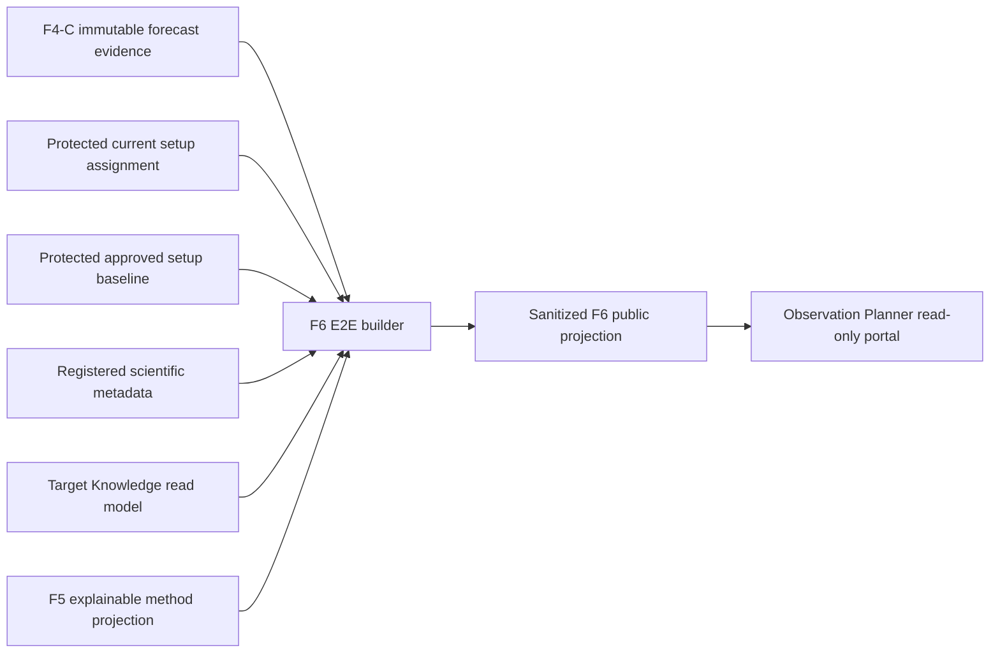
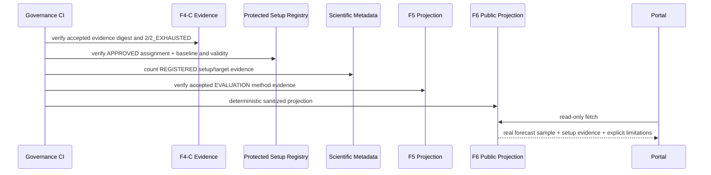

# BKL-031 F6 — Real-Evidence Setup-Aware E2E Planner

| Field | Value |
|---|---|
| Identifier | BKL-031-F6-SOLUTION-001 |
| Status | **ACCEPTED — POST-MERGE VERIFIED** |
| Version | 1.1 |
| Date | 2026-09-17 |
| Capability | BKL-031 — Observation Planner intelligente |
| Predecessor | F5 Accepted / Post-Merge Verified |
| Environment / authority | `EVALUATION` / `NONE` |
| Consumer mode | `READ_ONLY` |
| Runtime state | `S10 UNAVAILABLE` |
| Provider request budget | `2/2_EXHAUSTED` |
| Reviewed head | `ad7cad8267eaee1e27e7b1373d34f422efd8f088` |
| Pull request | #275 |
| Merge commit | `f75303c9575c77f23de777d55c6067bf08bc99f1` |
| Exact-head workflows | 13/13 successful |
| Post-merge workflows | 14/14 successful |

## 1. Purpose and scope

F6 closes the integration gap identified after F5 without closing BKL-031 itself. It proves a bounded end-to-end path in which:

1. real provider forecast values already captured and reconciled by F4-C are consumed;
2. the approved current setup assignment and approved configuration baseline are resolved only inside the governance boundary;
3. registered scientific-session metadata provides setup-to-target compatibility evidence;
4. governed target identities and the accepted F5 explainable method evidence are joined;
5. a sanitized public projection is rendered by the Observation Planner portal;
6. no new provider request, runtime adapter, readiness decision, scheduler, automatic target selection, device command or Safety Authority is introduced.

F6 is now **Accepted / Post-Merge Verified** as an integration proof. It is not the final real-night recommendation capability and does not authorize BKL-031 closure.

## 2. Current state

F5 is Accepted / Post-Merge Verified but its factor values remain synthetic method-validation evidence. F4-C contains 71 complete hourly instants from ItaliaMeteo/ARPAE ICON-2I delivered through Open-Meteo Single Runs, with one incomplete instant excluded and zero imputation. The evidence classification is `REAL_PROVIDER_BOUNDED_GENERALIZED`; it was acquired at a synthetic/generalized location and did not use the protected observatory site.

The provider request budget is exhausted at `2/2_EXHAUSTED`. F4-D intentionally publishes metadata only, not forecast value arrays. The setup registry contains a separately approved current assignment and approved baseline, but those records are protected inputs and are not public portal contracts. S10 remains `UNAVAILABLE`.

## 3. Accepted F6 target state

F6 adds a public, fail-closed, sanitized E2E projection with four evidence layers:

- **forecast layer** — one exact real F4-C value sample plus run/validity/completeness lineage;
- **setup layer** — generic public setup keys derived from protected governed inputs without publishing protected identifiers or digests;
- **compatibility layer** — `REGISTERED_SCIENTIFIC_SESSION_EVIDENCE`, fail-closed when no historical acquisition evidence exists for the selected setup;
- **method layer** — accepted F5 rank/score retained and explicitly marked `SYNTHETIC_METHOD_VALIDATION_ONLY`.

The output contract is `BKL031_F6_REAL_EVIDENCE_SETUP_AWARE_E2E_PROJECTION` and the method identity is `BKL031-F6-REAL-EVIDENCE-SETUP-AWARE-E2E@1.0`.

## 4. Solution context

Protected setup records are inputs to repository validation only. The public projection contains generic setup keys (`WIDEFIELD_OSC`, `LONG_FOCAL_MONO`) and no protected assignment/baseline identifiers, protected digests or authority locators.

## 5. Data-flow sequence

## 6. Forecast evidence binding

The committed projection binds to F4-C evidence digest `350a7b9ae8b2de308ba55a7105e56bb4de5040572370ab2715c0fa70088af2f5`.

The first accepted hourly instant is used as the bounded E2E sample:

- `2026-09-17T01:00:00Z`;
- temperature `21.4 °C`;
- relative humidity `90%`;
- dew point `19.6 °C`;
- precipitation `0 mm`;
- cloud cover `64%`;
- low/mid/high cloud `64/0/0%`;
- wind speed `5.8 km/h`;
- wind gust `10.1 km/h`.

These values are copied only through deterministic reconciliation from the immutable F4-C evidence. They are evidence that the E2E value path works; they are not a current forecast feed for Manciano, not readiness, and not a safety signal.

F6 performs exactly zero provider requests. No third request is authorized.

## 7. Setup-aware compatibility semantics

The protected setup registry is authoritative for assignment/baseline validity, but its protected identifiers are never emitted in the public projection. The F6 builder uses two generic public setup views:

| Public setup key | Public description | Historical evidence used |
|---|---|---|
| `WIDEFIELD_OSC` | Wide-field OSC | 3 REGISTERED LDN 1320 scientific sessions |
| `LONG_FOCAL_MONO` | Long-focal mono | 2 REGISTERED M 27 scientific sessions |

The compatibility basis is exactly `REGISTERED_SCIENTIFIC_SESSION_EVIDENCE`.

A target without such evidence for the selected setup is `UNVERIFIED_FOR_SELECTED_SETUP` and receives no inferred compatibility. F6 does not infer optical suitability from focal length, sensor size, object angular size, filter response or image scale. That richer scientific suitability model remains a later requirement before BKL-031 closure.

## 8. Ranking semantics

F6 carries the accepted F5 method rank/score only as method evidence. Those values remain synthetic because F5 geometry is synthetic. F6 therefore does **not** re-label them as real-night target recommendations.

This separation is deliberate:

- real F4-C weather values prove forecast-value consumption;
- real governed session/setup evidence proves setup awareness;
- F5 proves explainable deterministic ranking mechanics;
- later gates must replace the remaining synthetic/runtime gaps before the planner can present current best-target recommendations for an observing night.

## 9. Security, privacy and safety

- protected site coordinates are not used;
- protected setup assignment/baseline IDs, digests and authority locators are not published;
- public output is allowlisted and fail-closed;
- no secret, serial, credential or runtime locator is emitted;
- no device command path is created;
- no readiness/go-no-go state is created;
- BKL-032 remains the owner of Session Readiness / Go-No-Go Decision Support;
- local physical interlocks remain the Safety Authority.

## 10. Failure semantics

F6 fails closed if any of the following occurs:

- F4-C digest, request accounting or generalized-location boundary changes;
- a third provider request becomes authorized;
- protected-site evidence is substituted;
- setup assignment or baseline is not APPROVED/current;
- setup baseline reference/digest no longer matches the assignment;
- target identity ceases to be validated;
- historical setup/target REGISTERED evidence count changes without review;
- F5 method evidence no longer carries its synthetic limitation;
- a protected setup identifier appears in the public projection.

No last-known-good or inferred fallback is permitted.

## 11. Observability and operability

F6 is repository-only and static-portal read-only. CI logs only validation status and public identifiers; it must not log protected setup payloads/digests. The portal reports `FAIL-CLOSED` on projection validation errors and never substitutes cached authority state.

Rollback removes the F6 projection, builder, verifier/tests, schema, browser consumer and portal panel. F1-F5 accepted evidence and the protected setup registry remain unchanged. Rollback causes no provider request and has no EAGLE/device impact.

## 12. Validation and acceptance evidence

The accepted exact head is `ad7cad8267eaee1e27e7b1373d34f422efd8f088`.

- 13/13 applicable exact-head PR workflows: successful;
- Architecture Review Board: **APPROVED WITH CONDITIONS**, no Blocker/Major;
- Release Quality: **CONDITIONALLY READY FOR MERGE**, no waiver;
- expected-head merge PR #275: `f75303c9575c77f23de777d55c6067bf08bc99f1`;
- 14/14 applicable post-merge push workflows: successful;
- provider requests performed by F6: `0`;
- request budget after acceptance: `2/2_EXHAUSTED`.

The formal acceptance record is `docs/project/BKL-031-F6-REAL-EVIDENCE-SETUP-AWARE-E2E-ACCEPTANCE-2026-09-17.md`.

## 13. Acceptance criteria

F6 is accepted because:

- the exact F4-C real forecast sample is proven to flow into the public planner projection;
- the selected public setup scenario changes eligible/excluded target evidence using governed historical acquisition evidence;
- F5 synthetic method scores remain clearly classified and never masquerade as real recommendations;
- zero additional provider requests were executed;
- no protected setup/site detail leaked;
- no readiness, scheduling, automatic selection, command or Safety Authority was introduced;
- exact-head CI, ARB, Release Quality, expected-head merge and all 14 post-merge workflows were completed successfully.

## 14. Residual gap and successor boundary

F6 does **not** complete BKL-031. F6 acceptance promotes only **F7 fresh forecast supply and runtime boundary**.

F7 must define and validate a refresh/runtime supply contract for current forecast series at an approved generalized/public location while preserving ADR-011 exact provider/model/run lineage, freshness/missingness semantics, privacy and request accounting. F6 acceptance authorizes no new provider traffic: the validation request budget remains `2/2_EXHAUSTED`, and any additional request requires a separate explicit authority/budget decision before execution.

After F7, a later scientific integration gate must still replace synthetic target geometry and historical-only compatibility with current astronomical windows and an explicit OTA/camera/filter suitability model before the portal can state which targets are genuinely best for the selected setup and night.

Until those gates are accepted, S10 stays `UNAVAILABLE`, BKL-031 remains `In Progress`, BKL-032 owns readiness/go-no-go, and local physical interlocks remain authoritative.
