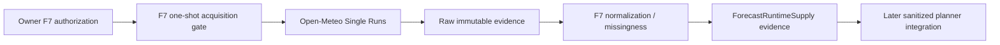

# BKL-031 F7 — Fresh Forecast Supply and Runtime Boundary

| Field | Value |
|---|---|
| Identifier | `BKL-031-F7-SOLUTION-001` |
| Status | **REVIEW CANDIDATE — VALIDATION EVIDENCE ACQUIRED / F7 BUDGET 1/1 EXHAUSTED** |
| Date | 2026-09-17 |
| Parent | BKL-031 — Observation Planner intelligente |
| Predecessor | F6 Accepted / Post-Merge Verified |
| Governing decision | ADR-011 |
| Environment / authority | `EVALUATION` / `NONE` |
| Runtime production state | `UNAVAILABLE` |
| Safety impact | None; local physical interlocks remain authoritative |

## 1. Purpose

F7 closes only the fresh-forecast supply gap left by F6. It defines a server-side, fail-closed supply boundary for a current ICON-2I single-run forecast and proves that boundary with exactly one separately owner-authorized provider request. It does not close BKL-031 and does not activate production runtime S10.

The explicit owner authorization received on 2026-09-17 was scoped to **one F7 validation request**. It created a new F7 budget and did not reopen or extend the exhausted F4-C `2/2_EXHAUSTED` budget. The F7 request has now executed successfully at transport/provider level and the F7 budget is permanently `1/1_EXHAUSTED`.

## 2. Current state

F6 proves the end-to-end planner data path using immutable F4-C real provider evidence, but that evidence is not a fresh runtime feed. F4-C consumed its complete two-request validation budget and removed its acquisition path. ADR-011 remains the source authority for provider/model/run lineage and the 18-hour maximum run age.

F7 validation run `35243920092` consumed the one authorized request against explicit ICON-2I run `2026-09-17T12:00Z`. Retrieval completed at `2026-09-17T16:01:16.208Z`, giving a run age of `4.021169` hours and therefore `FRESH` evidence under ADR-011.

## 3. Target state

F7 introduces an evaluation-only `ForecastRuntimeSupply` contract with:

- provider `OPEN_METEO`, upstream authority `ITALIAMETEO_ARPAE`, model `italia_meteo_arpae_icon_2i`;
- delivery through Open-Meteo Single Runs with one explicit 00/12 UTC initialization;
- maximum run age 18 hours at retrieval;
- the same bounded ten-variable vocabulary accepted in F4-B v1.1;
- explicit missingness per hourly instant and **no imputation**;
- `FRESH`/`STALE` and `AVAILABLE`/`DEGRADED`/`UNAVAILABLE` states that describe evidence quality only and never safety/readiness;
- immutable request accounting tied to an owner authorization id;
- one generalized evaluation location `SITE-PUBLIC-SYNTHETIC-FORECAST-IT-01` at `42.0,12.0`;
- sanitized consumer eligibility only after evidence reconciliation.

Protected observatory coordinates were not used and were not authorized for provider egress by this decision.

## 4. Components and flow

The acquisition adapter was Infrastructure. The supply contract and validation semantics are application/public-contract concerns. No Domain aggregate, device command path or observatory control component depends on the provider client.

## 5. Request execution and replay protection

The request budget transitioned from `F7 0/1 AUTHORIZED` to `F7 1/1 EXHAUSTED` after workflow run `35243920092`. The one-shot workflow required the authorization evidence to be added in that exact push and required `github.run_attempt == 1`; preflight, provider acquisition and artifact upload all completed successfully.

Artifact `10506402579` (`bkl-031-f7-evidence-35243920092`) has digest `sha256:02cae087b85f6427a66891c85f8e823b200afb1e0590bf0f88be4d05eb909370`. The raw provider response SHA-256 is `7c6805d77c66389aa3e280784f0219912d40089b3a55c5a8bc651ae073f86dbc`; the normalized supply SHA-256 is `7d8205a4d1379927e8648534a3463b19a1a0c99cab48bae01b612348f7d35680`.

After capture, the executable acquisition script and workflow are removed from the branch. The repository therefore has no remaining F7 dispatch path capable of consuming a second request.

## 6. Evidence result, missingness and freshness

The provider returned 72 hourly positions. F7 accepted 71 complete positions, excluded one initialization instant and performed zero imputations. The excluded instant is `2026-09-17T12:00Z` because `precipitation` was null/non-finite. At retrieval time 67 accepted positions were still future forecast instants.

The supply is classified `DEGRADED` because one instant is incomplete, while freshness is `FRESH` because the run age is below 18 hours. `DEGRADED` is intentionally not coerced to `AVAILABLE` and the missing precipitation value is not synthesized.

`FRESH` means only that the explicit model run was no older than 18 hours at retrieval. It is not a statement that the night is safe, suitable or ready. Coverage counts are exposed so later planner logic can decide whether its own planning horizon is sufficiently covered.

## 7. Durable validation evidence

The repository retains a compact manifest, exact request plan and summary plus gzip/base64 representations of the raw response and normalized supply under `governance/forecast-evidence/BKL031-F7-RUN-35243920092/`. The verifier decodes these representations, recomputes the decompressed SHA-256 digests and validates the supply semantics without any network call.

## 8. Security and privacy

- The executed HTTPS host was exactly `single-runs-api.open-meteo.com`.
- Redirects were denied; timeout was 10 seconds; response ceiling was 2 MB.
- No API credential was required or stored.
- Only the synthetic/generalized point `42.0,12.0` was sent.
- Protected site registry records, protected setup identifiers and exact observatory coordinates were not read by the acquisition script.
- Production subscription/self-hosting remains a separate decision.

## 9. Authority boundaries

F7 provides forecast evidence only. It cannot emit or imply `safe`, `unsafe`, `ready`, `go`, `no-go`, target acquisition authority, schedule authority or device commands. BKL-032 remains the Session Readiness / Go-No-Go Decision Support owner. Local physical interlocks remain Safety Authority.

## 10. Failure behavior

Transport error, redirect, HTTP error, oversized response, invalid JSON, timezone drift, malformed hourly arrays, stale run or authorization mismatch would have failed closed while still consuming the attempt. No second F7 request is permitted without another explicit owner decision and a new separately governed package.

## 11. Validation criteria

F7 review must verify:

1. exact owner authorization and `maxProviderRequests=1`;
2. workflow run `35243920092` was attempt 1 and completed successfully;
3. explicit ADR-011 provider/model/run lineage;
4. generalized location and `protectedSiteUsed=false`;
5. 18-hour freshness ceiling and observed `FRESH` state;
6. `72 raw / 71 accepted / 1 excluded / 67 future` with zero imputation;
7. raw and normalized evidence digests;
8. exhausted `1/1` F7 budget and removal of the acquisition path;
9. no readiness, scheduling, command or Safety Authority;
10. zero production-runtime claim.

## 12. Successor boundary

Even after F7 acceptance, BKL-031 remains `In Progress`. A later scientific integration gate must replace synthetic ranking geometry and historical-only setup compatibility with current astronomical windows plus explicit OTA/camera/filter target suitability, then prove the final read-only current-night ranking end to end.
