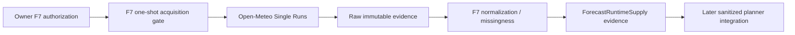

# BKL-031 F7 — Fresh Forecast Supply and Runtime Boundary

| Field | Value |
|---|---|
| Identifier | `BKL-031-F7-SOLUTION-001` |
| Status | **REVIEW CANDIDATE — OWNER AUTHORIZATION RECEIVED; ONE VALIDATION REQUEST ONLY** |
| Date | 2026-09-17 |
| Parent | BKL-031 — Observation Planner intelligente |
| Predecessor | F6 Accepted / Post-Merge Verified |
| Governing decision | ADR-011 |
| Environment / authority | `EVALUATION` / `NONE` |
| Runtime production state | `UNAVAILABLE` |
| Safety impact | None; local physical interlocks remain authoritative |

## 1. Purpose

F7 closes only the fresh-forecast supply gap left by F6. It defines a server-side, fail-closed supply boundary for a current ICON-2I single-run forecast and proves that boundary with at most one newly owner-authorized provider request. It does not close BKL-031 and does not activate production runtime S10.

The explicit owner authorization received on 2026-09-17 is scoped to **one F7 validation request**. It is a new F7 budget and does not reopen or extend the exhausted F4-C `2/2_EXHAUSTED` budget.

## 2. Current state

F6 proves the end-to-end planner data path using immutable F4-C real provider evidence, but that evidence is not a fresh runtime feed. F4-C consumed its complete two-request validation budget and removed its acquisition path. ADR-011 remains the source authority for provider/model/run lineage and the 18-hour maximum run age.

## 3. Target state

F7 introduces an evaluation-only `ForecastRuntimeSupply` contract with:

- provider `OPEN_METEO`, upstream authority `ITALIAMETEO_ARPAE`, model `italia_meteo_arpae_icon_2i`;
- delivery through Open-Meteo Single Runs with one explicit 00/12 UTC initialization;
- maximum run age 18 hours at retrieval;
- the same bounded ten-variable vocabulary accepted in F4-B v1.1;
- explicit missingness per hourly instant and **no imputation**;
- `FRESH`, `STALE` and unavailable/degraded states that describe data quality only and never safety/readiness;
- immutable request accounting tied to an owner authorization id;
- one generalized evaluation location `SITE-PUBLIC-SYNTHETIC-FORECAST-IT-01` at `42.0,12.0`;
- sanitized consumer eligibility only after evidence reconciliation.

The F7 validation request is fixed to run `2026-09-17T12:00Z`. Protected observatory coordinates are not used and are not authorized for provider egress by this decision.

## 4. Components and flow

The acquisition adapter is Infrastructure. The supply contract and validation semantics are application/public-contract concerns. No Domain aggregate, device command path or observatory control component depends on the provider client.

## 5. One-request authority and replay protection

The request budget is `F7 0/1 AUTHORIZED` before execution and becomes `F7 1/1 EXHAUSTED` after the single network attempt, regardless of provider success or failure.

The acquisition workflow is triggered only by the first addition of `governance/forecast-evidence/BKL031-F7-PROVIDER-REQUEST-AUTH-001.json` on the F7 branch. It fails before network access when the authorization file is not an added path or when `github.run_attempt != 1`. Workflow reruns therefore cannot consume another request. There is no schedule and no retry loop.

## 6. Missingness and freshness

Each returned hourly instant is inspected against the ten governed variables. An instant with a null, missing or non-finite governed value is excluded with an explicit reason. Values are never copied from observations, another run or another model and are never imputed.

`FRESH` means only that the explicit model run was no older than 18 hours at retrieval. It is not a statement that the night is safe, suitable or ready. Coverage counts and first/last accepted instants are exposed so later planner logic can decide whether its own planning horizon is sufficiently covered.

## 7. Security and privacy

- HTTPS host allow-list is exactly `single-runs-api.open-meteo.com`.
- Redirects are denied; timeout is 10 seconds; response ceiling is 2 MB.
- No API credential is required or stored.
- Only the synthetic/generalized point `42.0,12.0` is sent.
- Protected site registry records, protected setup identifiers and exact observatory coordinates are not read by the acquisition script.
- Production subscription/self-hosting remains a separate decision.

## 8. Authority boundaries

F7 provides forecast evidence only. It cannot emit or imply `safe`, `unsafe`, `ready`, `go`, `no-go`, target acquisition authority, schedule authority or device commands. BKL-032 remains the Session Readiness / Go-No-Go Decision Support owner. Local physical interlocks remain Safety Authority.

## 9. Failure behavior

Transport error, redirect, HTTP error, oversized response, invalid JSON, timezone drift, malformed hourly arrays, stale run or authorization mismatch fails closed. The attempt is still consumed. Failure evidence is uploaded when available and no second F7 request is permitted without another explicit owner decision and a new separately governed package.

## 10. Validation

F7 must prove:

1. exact owner authorization and `maxProviderRequests=1`;
2. exactly one `fetch()` site and no retry loop;
3. replay/rerun protection before network access;
4. explicit ADR-011 provider/model/run lineage;
5. generalized location and `protectedSiteUsed=false`;
6. 18-hour freshness ceiling;
7. explicit missingness with zero imputation;
8. immutable raw digest and bounded normalized supply evidence;
9. no readiness, scheduling, command or Safety Authority;
10. zero production-runtime claim.

## 11. Successor boundary

Even after F7 acceptance, BKL-031 remains `In Progress`. A later scientific integration gate must replace synthetic ranking geometry and historical-only setup compatibility with current astronomical windows plus explicit OTA/camera/filter target suitability, then prove the final read-only current-night ranking end to end.
