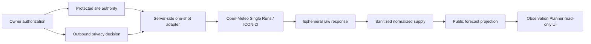

# BKL-031 F7 — Fresh Forecast Supply and Runtime Boundary

| Field | Value |
|---|---|
| Identifier | `BKL-031-F7-SOLUTION-001` |
| Status | **REVIEW CANDIDATE — PROTECTED-SITE FORECAST EVIDENCE ACQUIRED / SITE BUDGET 1/1 EXHAUSTED** |
| Date | 2026-09-17 |
| Parent | BKL-031 — Observation Planner intelligente |
| Predecessor | F6 Accepted / Post-Merge Verified |
| Governing decision | ADR-011 |
| Site authority | `DSG-SITE-RECORD-MANCIANO-001` — approved protected registry |
| Environment / authority | `EVALUATION` / `NONE` |
| Runtime production state | `UNAVAILABLE` |
| Safety impact | None; local physical interlocks remain authoritative |

## 1. Purpose

F7 closes the planner's bounded **fresh site-specific forecast supply** gap left by F6. The binding functional requirement is that the Observation Planner display real forecast values referenced to the governed observatory coordinates while keeping those coordinates protected from the public portal.

F7 therefore separates three concerns:

1. the approved protected site record is the only source of provider coordinates;
2. a server-side one-shot adapter may resolve and transmit those coordinates only under an explicit outbound privacy decision and request authorization;
3. the portal receives only a sanitized read-only projection containing a generalized site label and real hourly weather values.

F7 does not close BKL-031 and does not activate production runtime S10.

## 2. Current state and superseded generalized validation

The first F7 validation run `35243920092` proved the ICON-2I fresh-supply mechanics at a synthetic/generalized evaluation point. That evidence remains immutable historical validation material but is **not consumer-eligible as the site's forecast** after the owner clarified the binding requirement for real site-referenced data.

The owner subsequently authorized protected-site forecast egress and one separately governed provider request. This did not reopen the exhausted F4-C budget or the earlier generalized F7 budget. The protected-site request has its own authorization, privacy decision, accounting and evidence chain.

## 3. Protected site authority and privacy boundary

The provider adapter resolves location only from the approved repository authority record `DSG-SITE-RECORD-MANCIANO-001`. The record is `APPROVED`, resolver-eligible, WGS84 and classified `PROTECTED_EXACT_SITE` for Observation Planner read-only site context.

Outbound privacy decision `BKL031-F7-PROTECTED-SITE-OUTBOUND-PRIVACY-AUTH-001` authorizes:

- recipient host `single-runs-api.open-meteo.com` only;
- provider `OPEN_METEO`, upstream authority `ITALIAMETEO_ARPAE`, model `italia_meteo_arpae_icon_2i`;
- exact governed coordinates only inside the server-side request construction path;
- no coordinate logging;
- no coordinate/elevation/returned-grid persistence in forecast evidence;
- no public coordinate/elevation/returned-grid projection;
- public location label only: `Manciano (GR), Italia`.

The raw provider body is not committed to the repository. Durable evidence retains its SHA-256 digest plus the normalized sanitized supply.

## 4. Protected-site request execution

Authorization `BKL031-F7-PROTECTED-SITE-PROVIDER-REQUEST-AUTH-001` permitted exactly one request for explicit ICON-2I run `2026-09-17T12:00Z`.

Workflow run `35255829165`, attempt 1, executed against commit `2c46ca8be59c9ea8245fa03de71e936249c52a1b` and completed successfully. Preflight validated the owner authorization, outbound privacy decision, approved site authority and sanitized request plan before the provider call.

Artifact `10512359912` (`bkl-031-f7-protected-site-evidence-35255829165`) has digest `sha256:9c2c58f4f4d63bced1110b94de4463f17eb0a2bc14362c22bb3435cbce9455ef`.

The protected-site request budget is now permanently `1/1_EXHAUSTED`.

## 5. Forecast contract and result

The provider/model/run lineage is explicit:

- provider: `OPEN_METEO`;
- upstream authority: `ITALIAMETEO_ARPAE`;
- model: `italia_meteo_arpae_icon_2i`;
- run initialization: `2026-09-17T12:00Z`;
- retrieval: `2026-09-17T17:57:24.089Z`;
- run age at retrieval: `5.956691 h`;
- ADR-011 freshness ceiling: `18 h`;
- freshness result: `FRESH`.

The ten governed variables remain temperature, relative humidity, dew point, precipitation, total/low/mid/high cloud cover, 10 m wind speed and wind gusts.

The response contained 72 hourly positions. F7 accepted 71 complete positions, excluded one initialization instant because precipitation was null/non-finite, performed zero imputations and retained 66 future accepted instants at retrieval. Availability is therefore `DEGRADED`, not `AVAILABLE`, while freshness is `FRESH`.

## 6. Observation Planner public projection

`docs/data/observation-planner-forecast-f7-site-projection.json` publishes the real normalized forecast as a strict read-only projection. It contains:

- generalized public site label and timezone;
- provider/model/run/retrieval/freshness metadata;
- evidence lineage and completeness counts;
- 71 accepted real hourly forecast rows;
- the excluded instant and missingness reason;
- an explicit current-night display window;
- attribution and authority boundaries.

It does **not** contain latitude, longitude, elevation, returned grid coordinates, raw request URL or raw provider payload.

The browser consumer `docs/javascripts/observation-planner-forecast-f7-site.js` validates identity, lineage, completeness, prohibited privacy keys and authority boundaries before rendering. It also recomputes current run age in the browser: once the run is older than 18 hours, the consumer fails closed instead of showing historical data as a current forecast.

## 7. Components and flow

The external provider adapter is Infrastructure. Supply/projection validation is Application/Public Contract. The public browser never calls the provider and never receives protected coordinates.

## 8. Durable evidence and replay protection

Durable protected-site evidence is stored under `governance/forecast-evidence/BKL031-F7-PROTECTED-SITE-RUN-35255829165/`:

- `evidence-manifest.json`;
- `request-plan.json` without coordinates;
- `summary.json`;
- `raw-response.sha256` only;
- gzip/base64 normalized supply containing forecast values but no coordinates.

The normalized supply digest is `1df1894917962b29f83c4f24cbeb6572f71371e3b0877cdd4cf04833395577c8`; the raw response digest is `1d66a83464c946b203ef60730a993acb913a9ee12bbf5ec0ab0839bff54b3046`.

After reconciliation, the one-shot acquisition script and workflow must be removed from the branch so the exhausted authorization cannot be replayed.

## 9. Authority boundaries

F7 provides forecast evidence only. It cannot emit or imply `safe`, `unsafe`, `ready`, `go`, `no-go`, target acquisition authority, scheduling authority or device commands. BKL-032 remains the Session Readiness / Go-No-Go Decision Support owner. Local physical interlocks remain Safety Authority.

The page may display real weather forecast values and later ranking logic may consume those values as advisory inputs, but forecast evidence alone is not an operational authorization.

## 10. Runtime limitation

The protected-site request proves the site-specific data path, but it is still a one-shot evaluation gate. Recurring refresh is **not** activated and production runtime S10 remains `UNAVAILABLE`. Production refresh requires its own governed operating model, including provider/license mode, request cadence, failure handling, freshness monitoring and deployment boundary.

This limitation is explicit in the public projection as `ONE_SHOT_EVIDENCE_NOT_RECURRING_RUNTIME`.

## 11. Validation criteria

F7 review must verify:

1. approved protected site authority is the only coordinate source;
2. outbound privacy authorization explicitly permits the recipient and forbids coordinate persistence/publication;
3. protected-site provider budget is exactly one request and is `1/1_EXHAUSTED`;
4. workflow run `35255829165` attempt 1 completed successfully on the recorded head;
5. provider/model/run lineage and 18-hour freshness ceiling match ADR-011;
6. `72 raw / 71 accepted / 1 excluded / 66 future`, zero imputation;
7. durable evidence digests recompute correctly;
8. public projection contains real forecast values and no protected coordinate/elevation/grid/raw-request fields;
9. browser consumer fails closed when stale or invalid;
10. exhausted acquisition path is removed before exact-head review;
11. no readiness, scheduling, command or Safety Authority is introduced;
12. S10 production runtime remains unavailable.

## 12. Successor boundary

Even after F7 acceptance, BKL-031 remains `In Progress`. The next scientific integration gate must replace synthetic ranking geometry and historical-only setup compatibility with current astronomical windows plus explicit OTA/camera/filter target suitability, and then combine those inputs with the current weather forecast in the final explainable read-only planner ranking.
